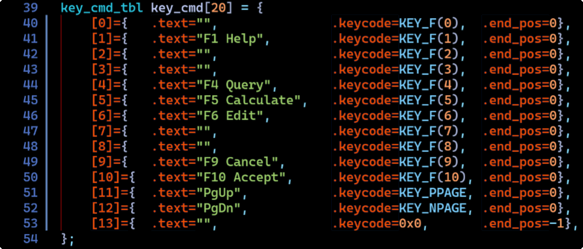

# 

# API - Table of Contents

<!-- mtoc-start -->

- [OVERVIEW](#overview)
- [HOUSEKEEPING](#housekeeping)
  - [\_\_atexit, end_pgm](#__atexit-end_pgm)
- [MAIN DATA STRUCTURES](#main-data-structures)
  - [new_menu](#new_menu)
  - [new_pick](#new_pick)
  - [destroy_pick](#destroy_pick)
  - [new_form](#new_form)
  - [destroy_form](#destroy_form)
  - [new_view](#new_view)
  - [destroy_view](#destroy_view)
- [FILE HANDLING](#file-handling)
  - [verify_spec_arg](#verify_spec_arg)
  - [init_menu_files](#init_menu_files)
  - [init_form_files](#init_form_files)
- [STRING FUNCTIONS](#string-functions)
  - [rtrim](#rtrim)
  - [ssprintf](#ssprintf)
  - [str_to_args](#str_to_args)
  - [str_to_lower](#str_to_lower)
  - [str_to_upper](#str_to_upper)
  - [strnz\_\_cpy](#strnz__cpy)
  - [strnz\_\_cat](#strnz__cat)
  - [strnz](#strnz)
  - [strnz_dup](#strnz_dup)
  - [str_tok](#str_tok)
  - [str_subc](#str_subc)
  - [strnfill](#strnfill)
  - [stripz_quotes](#stripz_quotes)
  - [chrep](#chrep)
  - [rep_substring](#rep_substring)
  - [struct String](#struct-string)
  - [struct WC_String](#struct-wc_string)
  - [struct CC_String](#struct-cc_string)
  - [to_string](#to_string)
  - [mk_string](#mk_string)
  - [free_string](#free_string)
  - [string_cpy](#string_cpy)
  - [string_cat](#string_cat)
  - [string_ncat](#string_ncat)
  - [string_ncpy](#string_ncpy)
- [FILE HANDLING](#file-handling-1)
  - [normalize_file_spec](#normalize_file_spec)
  - [file_spec_path](#file_spec_path)
  - [file_spec_name](#file_spec_name)
  - [str_to_bool](#str_to_bool)
  - [expand_tilde](#expand_tilde)
  - [trim_path](#trim_path)
  - [trim_ext](#trim_ext)
  - [base_name](#base_name)
  - [dir_name](#dir_name)
  - [verify_dir](#verify_dir)
  - [verify_file](#verify_file)
  - [locate_file_in_path](#locate_file_in_path)
  - [list_files](#list_files)
  - [lf_find_dirs](#lf_find_dirs)
  - [lf_find_files](#lf_find_files)
  - [canonicalize_file_spec](#canonicalize_file_spec)
- [CHYRON FUNCTIONS](#chyron-functions)
  - [Chyron Overview](#chyron-overview)
  - [table key_cmd_tbl](#table-key_cmd_tbl)
  - [set_fkey](#set_fkey)
  - [unset_fkey](#unset_fkey)
  - [chyron_mk](#chyron_mk)
  - [get_chyron_key](#get_chyron_key)
  - [is_set_fkey](#is_set_fkey)
- [COLOR FUNCTIONS](#color-functions)
  - [struct RGB](#struct-rgb)
  - [get_clr_pair](#get_clr_pair)
  - [get_clr](#get_clr)
  - [rgb_to_xterm256_idx](#rgb_to_xterm256_idx)
  - [xterm256_idx_to_rgb](#xterm256_idx_to_rgb)
  - [apply_gamma](#apply_gamma)
  - [init_clr_palette](#init_clr_palette)
  - [init_hex_color](#init_hex_color)
  - [hex_clr_str_to_rgb](#hex_clr_str_to_rgb)
- [INITIALIZATION](#initialization)
  - [mapp_initialization](#mapp_initialization)
  - [parse_opt_args](#parse_opt_args)
  - [parse_config](#parse_config)
  - [zero_opt_args](#zero_opt_args)

<!-- mtoc-end -->

## OVERVIEW

C-Menu is a User Interface Builder. It allows developers to create and
manage UI components quickly and easily. In developing C-Menu, we focused
on modularity, ease of use, and flexibility. This documentation provides an
overview of the API, including its main features and how to use them.

Note 1: This documentation assumes familiarity with C programming and
basic concepts of user interface design.

Note 2: The C-Menu API is designed to work with the NCursesw library for
terminal-based user interfaces. Ensure that you have NCursesw installed and
properly configured in your development environment. Generally, the best
way to install NCursesw is through your system's package manager. Building
NCursesw from source can be complex and is not recommended for most users.
If you build NCurses from source, refer to the official NCursesw documentation
for detailed instructions and be mindful that some shells and editors
rely on specific features of NCursesw, tinfo, and readline libraries that
also rely on each other. A version mismatch can easily break your shell or
editor.

Note 3: This document is a work-in-progress and will be updated regularly.
Only a fraction of the API functions are documented here at present with many
more to be added.

## HOUSEKEEPING

### \_\_atexit, end_pgm

The following macros are provided to facilitate proper cleanup
when a C-Menu application exits.

```c
#define __end_pgm
    static void end_pgm(void) {
        destroy_init(init);
        win_del();
        destroy_curses();
        restore_shell_tioctl();
        exit(EXIT_FAILURE);
    }
#define __atexit
    {
        int rc;
        rc = atexit(end_pgm);
        if (rc != 0) {
            fprintf(stderr, "\nCannot set atexit(end_pgm)\n");
            exit(EXIT_FAILURE);
        }
    }
```

## MAIN DATA STRUCTURES

```c
Init *new_init(int argc, char **argv)
```

Creates and initializes a new Init structure. The Init structure holds
configuration and state information for the C-Menu application, including
structures for Menu, Form, Pick, and View components.

- Parameters:
  - `int argc`: The number of command-line arguments.
  - `char **argv`: The array of command-line argument strings.
- Returns:
  - `Init *`: A pointer to the newly created Init structure or NULL on failure.

```c
Init *destroy_init(Init *init)
```

Frees any Menu, Form, Pick, or View structures attached to the Init structure
before destroying the Init structure.

- Parameters:
  - `Init *init`: A pointer to the Init structure to be destroyed.
- Returns:
  - `Init *`: NULL

---

### new_menu

```c
Menu *new_menu(Init *init, int argc, char **argv, int begy, int begx)
```

Creates and initializes a new Menu Structure, init->menu. The init->menu
structure holds configuration and state information for the Menu component.

- Parameters:
  - `Init *init`: A pointer to the Init structure.
  - `int argc`: The number of command-line arguments.
  - `char **argv`: The array of command-line argument strings.
  - `int begy`: The y-coordinate for the top-left corner of the Menu window.
  - `int begx`: The x-coordinate for the top-left corner of the Menu window.
- Returns:
  - `Menu *`: A pointer to the newly created Menu structure or NULL on failure.

The init->menu structure is commonly aliased as menu throughout the C-Menu
suite.

```c
Menu *destroy_menu(init *init)
```

Frees any resources associated with the Menu structure before destroying it.

- Parameters:
  - `Init *init`: A pointer to the Init structure containing the Menu.
- Returns:
  - `Menu *`: NULL

---

### new_pick

```c
Pick *new_pick(Init *init, int argc, char **argv, int begy, int begx)
```

Creates and initializes a new Pick Structure, init->pick. The init->pick
structure holds configuration and state information for the Pick component.

- Parameters:
  - `Init *init`: A pointer to the Init structure.
  - `int argc`: The number of command-line arguments.
  - `char **argv`: The array of command-line argument strings.
  - `int begy`: The y-coordinate for the top-left corner of the Pick window.
  - `int begx`: The x-coordinate for the top-left corner of the Pick window.
- Returns:
  - `Pick *`: A pointer to the newly created Pick structure or NULL on failure.

The init->pick structure is commonly aliased as pick throughout the C-Menu
suite.

---

### destroy_pick

```c
Pick *destroy_pick(Init *init)()
```

Frees any resources associated with the Pick structure before destroying it.

- Parameters:
  - `Init *init`: A pointer to the Init structure containing the Pick.
- Returns:
  - `Pick *`: NULL

---

### new_form

```c
Form *new_form(Init *init, int argc, char **argv, int begy, int begx)()
```

- Parameters:
  - `Init *init`: A pointer to the Init structure.
  - `int argc`: The number of command-line arguments.
  - `char **argv`: The array of command-line argument strings.
  - `int begy`: The y-coordinate for the top-left corner of the Form window.
  - `int begx`: The x-coordinate for the top-left corner of the Form window.
- Returns:
  - `Form *`: A pointer to the newly created Form structure or NULL on failure.

The init->form structure is commonly aliased as form throughout the C-Menu
suite.

### destroy_form

```c
Form *destroy_form(Init *init)
```

Frees any resources associated with the Form structure before destroying it.

- Parameters:
  - `Init *init`: A pointer to the Init structure containing the Form.
- Returns:
  - `Form *`: NULL

---

### new_view

```c
View *new_view(Init *init, int argc, char **argv, int begy, int begx)
```

Creates and initializes a new View Structure, init->view. The init->view
structure holds configuration and state information for the View component.

- Parameters:
  - `Init *init`: Pointer to the Init structure.
  - `int argc`: The number of command-line arguments.
  - `char **argv`: The array of command-line argument strings.
  - `int begy`: The y-coordinate for the top-left corner of the View window.
  - `int begx`: The x-coordinate for the top-left corner of the View window.
- Returns:
  - `View *`: A pointer to the newly created View structure or NULL on failure.
    The init->view structure is commonly aliased as view throughout the C-Menu
    suite.

---

### destroy_view

```c
View *destroy_view(Init *init)
```

Frees any resources associated with the View structure before destroying it.

- Parameters:
  - `Init *init`: A pointer to the Init structure containing the View.
- Returns:
  - `View *`: NULL

---

## FILE HANDLING

### verify_spec_arg

```c
bool verify_spec_arg(char *spec, char *org_spec, char *dir, char *alt_dir, int mode)
```

Verifies a file specification argument.

- Parameters:
  - `char *spec`: The file specification to be verified.
  - `char *org_spec`: The original file specification.
  - `char *dir`: The directory to check for the file.
  - `char *alt_dir`: An alternative directory to check for the file.
  - `int mode`: The mode of verification (e.g., existence, readability,
    writability).
- Returns:
  - `bool`: True if the file specification is valid, false otherwise.

```c
// modes:
    // R_OK - Read
    // W_OK - Write
    // X_OK - Execute
    // F_OK - Existence
// extended modes:
    // S_WCOK - write or create
    // S_QUIET - Don't handle error, but return false
```

See access(2) for details.

A file spec argument may contain additional data, including a quoted
parameter string, but only the characters up to the initial whitespace
are included as the search term for this function. The "spec"
returned will include a fully qualified file specification in place
of the original term if possible and the original string of characters
to the right of the initial whitespace.

File specifications beginning with a "/", "~", or "." are considered to be
absolute, so, no further searching is done.

```c
org_spec = mycommand "file1 file2 file3"
spec = /usr/local/bin/mycommand "file1 file2 file3"
```

S_WCOK: is specified, the function determines if the process has
sufficient permissions to create or write to the specified file.
If the file does not exist, the function checks if the process has
write permissions in the directory where the file is to be created
and then opens the file in write mode to verify that it can be created.

- X_OK: If only a file-name is specified, the function searches for it using
  the PATH environment variable.
- if X_OK not specified: First searches for the file in the specified directory,
  then the specified alternate directory, then the idiomatic menuapp
  directories , (~/menuapp/msrc, ~/menuapp/bin, ~/menuapp/help, ~/menuappa/data,
  etc.), and then the current directory.

---

### init_menu_files

```c
bool init_menu_files(Init *init, int argc, char **argv)
```

Initializes Menu-related files based on command-line arguments.

- Parameters:
  - `Init *init`: A pointer to the Init structure.
  - `int argc`: The number of command-line arguments.
  - `char **argv`: The array of command-line argument strings.
- Returns:
  - `bool`: True if the menu files were successfully initialized, false otherwise.

The function processes command-line arguments to locate and verify
menu-related files such as configuration files, help files, and data files.

See: C-Menu Files later in this chapter.

---

### init_form_files

```c
bool init_form_files(Init *init, int argc, char **argv)
```

Initializes Form-related files based on command-line arguments.

- Parameters:
  - `Init *init`: A pointer to the Init structure.
  - `int argc`: The number of command-line arguments.
  - `char **argv`: The array of command-line argument strings.
- Returns:
  - `bool`: True if the menu files were successfully initialized, false otherwise.

The function processes command-line arguments to locate and verify
menu-related files such as configuration files, help files, and data files.

See: C-Menu Files later in this chapter.

---

## STRING FUNCTIONS

### rtrim

```c
size_t rtrim(char *str)
```

Removes trailing whitespace characters from the given string.

- Parameters:
  - `char *str`: The string to be trimmed.
- Returns:
  - `int`: The new length of the trimmed string or zero if string is empty

---

```c
size_t trim(char *str)
```

Removes leading and trailing whitespace characters from the given string.

- Parameters:
  - `char *str`: The string to be trimmed.
- Returns:
  - `int`: The new length of the trimmed string or zero if string is empty

---

### ssprintf

```c
int ssnprintf(char *str, size_t size, const char *format, ...)
```

A safe version of snprintf that ensures the output string is null-terminated.

- Parameters:
  - `char *str`: The buffer to write the formatted string to.
  - `size_t size`: The size of the buffer.
  - `const char *format`: The format string.
  - `...`: Additional arguments to be formatted.
- Returns:
  - `int`: The number of characters written, excluding the null terminator.

---

### str_to_args

```c
int str_to_args(char *argv[], char *arg_str, int max_args)
```

Splits a string into an array of arguments basedon whitespace.

- Parameters:
  - `char *argv[]`: The array to store the arguments.
  - `char *arg_str`: The input string to be split.
  - `int max_args`: The maximum number of arguments to extract.
- Returns:
  - `int`: The number of arguments extracted.

Text surrounded by double quotes \'"\' will be treated as a single argument.

---

### str_to_lower

```c
bool str_to_lower(char *str)
```

Converts all characters in the string to lowercase.

- Parameters:
  - `char *str`: The string to be converted.
- Returns:
  - `bool`: false on failure, true on success.

---

### str_to_upper

```c
bool str_to_upper(char *str)
```

Converts all characters in the string to uppercase.

- Parameters:
  - `char *str`: The string to be converted.
- Returns:
  - `bool`: false on failure, true on success.

---

### strnz\_\_cpy

```c
size_t strnz__cpy(char *dest, char *src, size_t max_len)
```

Copies a string from source to destination with a specified maximum length.

- Parameters:
  - `char *dest`: The destination buffer.
  - `const char *src`: The source string.
  - `size_t n`: The maximum number of characters in the resulting string.
- Returns:
  - int: The length of the resulting string

strnzcpy differs from strncpy in that it is limited, not by the
number of characters copied, but by the size of the destination buffer,
ensuring null-termination. With strnzcpy, you can prevent a buffer
overrun by setting the third parameter to the size of the destination
buffer - 1, leaving space for the null terminator.

---

### strnz\_\_cat

```c
size_t strnz__cat(char *dest, char *src, size_t max_len)
```

Concatenates a source string to a destination string with a specified maximum length.

- Parameters:
  - `char *dest`: The destination buffer.
  - `const char *src`: The source string.
  - `size_t n`: The maximum size of the destination buffer.
- Returns:
  - int: The length of the resulting string

strnzcat differs from strncat in that it is limited, not by the number
of characters concatenated, but by the size of the destination buffer,
ensuring null-termination. With strnzcat, you can prevent a buffer
overrun by setting the third parameter to the size of the destination
buffer - 1, leaving space for the null terminator.

---

### strnz

```c
size_t strnz(char *str, int max_len)
```

Ensures that a string is null-terminated within a specified maximum length.
Terminates the string on encountering a line-feed (\'\n\') or
carriage-return (\'\r\').

- Parameters:
  - `char *str`: The string to be checked.
  - `int max_len`: The maximum length of the string.
- Returns:
  - int: Length of the null-terminated string.

---

### strnz_dup

```c
char *strnz_dup(char *str, int max_len)
```

Duplicates a string up to a specified maximum length, a line-feed
(\'\n\'), or a carriage-return (\'\r\'), ensuring null-termination.
Because strnz_dup allocates memory, it is up to the caller to free
the memory when it is no longer needed.

- Parameters:
  - `char *str`: The string to be duplicated.
  - `int max_len`: The maximum length of the string.
- Returns:
  - char \*: A pointer to the newly allocated duplicated string or NULL
    on failure.

---

### str_tok

```c
char *str_tok(char *s, const char *delim, char **sp, char delim_found)
```

Copyright (c) 2005-2024 by Michael J. Fromberger. All rights reserved.
Released under the MIT License. See LICENSE file for details.
Modified by ChatGPT to add delim_found parameter.

Parse string S into tokens separated by characters in DELIM.

- Parameters:
  - str - string to tokenize
  - delim - delimiter characters
  - delim_found - character to receive the delimiter found
- Returns:
  - returns pointer to next token

Use case: When the delimiter character found is significant.
It will be returned in delim_found.

If string S is NULL, the saved pointer in SAVE_PTR is used as
the next starting point. For example:

```c
char s[] = "-abc-=-def";
char *sp;
char delim_found;

x = str_tok_r(s,    "-",  &sp, delim_found); // x = "abc", sp = "=-def"
x = str_tok_r(NULL, "-=", &sp, delim_found); // x = "def", sp = NULL
x = str_tok_r(NULL, "=",  &sp, delim_found); // x = NULL
```

Notes: If no delimiter is found, delim_found is set to '\0'.
Maintains thread-safety just as strtok_r.

---

### str_subc

```c
bool str_subc(char *d, char *s, char replace_chr, char *with_str, int l)
```

Replaces all occurrences of a specified character in a string with another
string.

- Parameters:
  - `char *d`: The destination buffer.
  - `char *s`: The source string.
  - `char ReplaceChr`: The character to be replaced.
  - `char *Withstr`: The string to replace the character with.
  - `int l`: The maximum length of the destination string.
- Returne:
  - `bool`: True on success, false on failure.

---

### strnfill

```c
bool strnfill(char *s, char c, n)
```

Fills a string with a specified character up to a given length.

- Parameters:
  - `char *s`: The string to be filled.
  - `char c`: The character to fill the string with.
  - `int n`: The number of characters to fill.
- Returns:
  - `bool`: True on success, false on failure.

---

### stripz_quotes

```c
bool stripz_quotes(char *s)
```

Removes surrounding double quotes from a string if they exist.

- Parameters:
  - `char *s`: The string to be processed.
- Returns:
  - `bool`: True if quotes were removed, false otherwise.

---

### chrep

```c
bool chrep(char *s, char old_chr, char new_chr)
```

Replaces all occurrences of a specified character in a string with another character.

- Parameters:
  - `char *s`: The string to be processed.
  - `char old_chr`: The character to be replaced.
  - `char new_chr`: The character to replace with.
- Returns:
  - bool: True on success, false on failure

---

### rep_substring

```c
char *rep_substring(const char *org_s, const char *tgt_s, const char *rep_s)
```

Replaces all occurrences of a target substring.

- Parameters:
  - `const char *org_s`: The original string.
  - `const char *tgt_s`: The target substring to be replaced.
  - `const char *rep_s`: The replacement substring.
- Returns:
  - `char *`: A pointer to the newly allocated string with
    replacements made or NULL on failure.

The function allocates memory for the new string, which must be
freed by the caller when no longer needed.

---

### struct String

```c
typedef struct String
```

Represents a dynamic stringi.
capacity - number of array elements allocated for String.str

```c
typedef struct {
    char *str; // Pointer to the string data
    size_t capacity; // Number of array elements
} String;
```

---

### struct WC_String

```c
typedef struct WC_String
```

Represents a dynamic array of wide characters (wchar_t)
capacity - number of array elements allocated for WC_String.str

```c
typedef struct {
    wchar_t *str; // Pointer to the string data
    size_t capacity; // Number of array elements
} WC_String;
```

---

### struct CC_String

```c
typedef struct CC_String
```

Represents a dynamic array of complex characters (cchar_t)
capacity - number of array elements allocated for CC_String.str

```c
typedef struct {
    wchar_t *str; // Pointer to the string data
    size_t capacity; // Number of array elements
} CC_String;
```

---

### to_string

```c
String to_string(const char *s)
```

Creates a new String object from a C-style string.

- Parameters:
  - `const char *s`: The C-style string to be converted.
- Returns:
  - `String`: The newly created String object.

---

### mk_string

```c
String mk_string(size_t l)
```

Creates a new String object with a specified length.

- Parameters:
  - `size_t l`: The length of the string to be created.
  - char \*s: The string data to be assigned to the String object.
- Returns:
  - `String`: The newly created String object.

if l is 0, str is set to NULL.

---

### free_string

```c
void free_string(String s)
```

Frees the memory allocated for a String object.

- Parameters:
  - `String s`: The String object to be freed.
- Returns:
  - `void`: no return

---

### string_cpy

```c
size_t string_cpy(String *d, const char *s)
```

Copies a C-style string to a String object.

- Parameters:
  - `String *d`: Pointer to the destination String object.
  - `const char *s`: The source C-style string to be copied.
- Returns:
  - `size_t`: length of resulting string

If the source string is longer than the destination String\'s
current length, the destination String\'s str pointer is reallocated
to accommodate the new string.

---

### string_cat

```c
size_t string_cat(String *d, const char *s)
```

Concatenates a C-style string to a String object.

- Parameters:
  - `String *d`: Pointer to the destination String object.
  - `const char *s`: The source C-style string to be concatenated.
- Returns:
  - `size_t`: length of resulting string

If the concatenation would result in a string longer than the
destination String\'s length, the destination String\'s str pointer
is reallocated.

---

### string_ncat

```c
size_t string_ncat(String *d, const char *s, size_t n)
```

Concatenates up to n characters of a C-style string to a String object.
Concatenates characters from a source String object to a destination
String.

- Parameters:
  - `String *d`: Pointer to the destination String object.
  - `const char *s`: The source C-style string to be concatenated.
  - `size_t n`: The maximum number of characters to concatenate.
- Returns:
  - `size_t`: length of resulting string

If the resulting string would be longer than the destination String\'s
length, the destination String\'s str pointer is reallocated.

---

### string_ncpy

```c
size_t string_ncpy(String *dest, const String *src, size_t n)
```

Copies up to "n" characters from a C-style string to a destination
String object.

- Parameters:
  - `String *dest`: Pointer to the destination String object.
  - `const String *src`: Pointer to the source String object.
  - `size_t n`: The maximum number of characters to copy.
- Returns:
  - `size_t`: length of resulting string

If the resulting string would be longer than the destination String\'s
length, the destination String\'s str pointer is reallocated.

---

## FILE HANDLING

### normalize_file_spec

```c
bool normalize_file_spec(char *spec)
```

Normalizes a file specification by converting backslashes to forward slashes.

- Parameters:
  - `char *spec`: The file specification to be normalized.
- Returns:
  - `bool`: True on success, false on failure.

---

### file_spec_path

```c
bool file_spec_path(char *fp, char *fs)
```

Extracts the path component from a file specification and places it in fp.
It is the caller\'s responsibility to ensure that fp has enough space to
hold the path.

- Parameters:
  - `char *fp`: The buffer to store the extracted path.
  - `char *fs`: The file specification string.
- Returns:
  - `bool`: True on success, false on failure.

Unlike the POSIX implementation of basename(), this function does not
modify the input string. Also, a character array may be used as the first
argument, obviating the need for dynamic memory allocation.

---

### file_spec_name

```c
bool file_spec_name(char *fn, char *fs)
```

Extracts the file name component from a file specification and places it in
fn. It is the caller\'s responsibility to ensure that fn has enough space to
hold the file name.

- Parameters:
  - `char *fn`: The buffer to store the extracted file name.
  - `char *fs`: The file specification string.
- Returns:
  - `bool`: True on success, false on failure.

Unlike the POSIX implementation of dirname(), this function does not modify
the input string. Also, a character array may be used as the first
argument, obviating the need for dynamic memory allocation. There is no GNU
version of dirname().

---

### str_to_bool

```c
bool str_to_bool(const char *)
```

Converts a string representation of a boolean value to its corresponding
boolean type based on the first character of the string.

- Parameters:
  - `const char *`: The string to be converted.
- Returns:
  - `bool`: The boolean value represented by the string. Returns true for
    \'Y\', \'1\' and false for \'f\', \'F\', \'n\', \'N\', \'0\'. For any
    other character, the function returns false.

---

### expand_tilde

```c
bool expand_tilde(char *out_buf, const char *in_buf, size_t buf_size)
```

Expands a tilde (\'~\') at the beginning of a file path to the user\'s home directory.

- Parameters:
  - `char *out_buf`: The buffer to store the expanded file path.
  - `const char *in_buf`: The input file path that may contain a tilde.
  - `size_t buf_size`: The size of the output buffer.
- Returns:
  - `bool`: True if the expansion was successful, false otherwise. If the
    input path does not start with a tilde, the function copies the input
    path to the output buffer without modification.

---

### trim_path

```c
bool trim_path(char *char) {
```

Trims redundant slashes and resolves relative path components (\'.\' and
\'..\') in a file path.

- Parameters:
  - `char *path`: The file path to be trimmed and resolved.
- Returns:
  - `bool`: True if the path was successfully trimmed and resolved, false otherwise.
    The function modifies the input path in place.
    It is up to the caller to ensure that the input path is valid and
    writable, and that the receiving string pointer has enough space to hold
    the modified path.

---

### trim_ext

```c
bool trim_ext(char *buf, char *filename)
```

Removes the file extension from a given filename.

- Parameters:
  - `char *buf`: The buffer to store the filename without the extension.
  - `char *filename`: The original filename with the extension.
- Returns:
  - `bool`: True if the extension was successfully removed, false
    otherwise. The function modifies the input filename in place.
    It is up to the caller to ensure that the input filename is valid and
    writable, and that the receiving string pointer has enough space to hold
    the modified filename.

---

### base_name

```c
bool base_name(char *buf, const char *filename)
```

Extracts the base name (file name without path) from a given file path.

- Parameters:
  - `char *buf`: The buffer to store the base name.
  - `const char *filename`: The original file path.
- Returns:
  - `bool`: True if the base name was successfully extracted, false otherwise.

The function leaves the input filename intact and copies the
basename to buf.

It is up to the caller to ensure that the input filename is valid,
and that the receiving string pointer has enough space to hold the
base name.

---

### dir_name

```c
bool dir_name(char *buf, char *path)
```

Extracts the directory name (path without file name) from a given file path.

- Parameters:
  - `char *buf`: The buffer to store the directory name.
  - `char *path`: The original file path.
- Returns:
  - `bool`: True if the directory name was successfully extracted,
    false otherwise. The function leaves the input path intact and
    copies the dirname to buf. It is up to the caller to ensure that
    the input path is valid, and that the receiving string pointer has
    enough space to hold the directory name.

---

### verify_dir

```c
bool verify_dir(char *spec, int imode)
```

Verifies the existence of a directory specified by the given path.

- Parameters:
  - `char *spec`: The directory path to be verified.
  - `int imode`: The mode of verification (e.g., existence, readability, writability).
- Returns:
  - `bool`: True if the directory exists and meets the specified mode,
    false otherwise. The function checks if the directory specified by
    spec exists and meets the criteria defined by imode. It is up to
    the caller to ensure that the input path is valid.

```c
        modes: R_OK, W_OK, X_OK, F_OK, see access(2) for details.
        extended modes: S_WCOK - write or create OK
        S_QUIET - Don't complain about errors
```

---

### verify_file

```c
bool verify_file(char *in_spec, int imode)
```

Verifies the existence of or ability to create a file specified by the given path.

- Parameters:
  - `char *in_spec`: The file path to be verified.
  - `int imode`: The mode: see below
- Returns:
  - `bool`: True if the file exists and meets the specified mode, or
    can be created if S_WCOK is specified, false otherwise.

The function checks if the file specified exists and meets
the criteria defined by imode, or if it can be created when S_WCOK
is specified.

It is up to the caller to ensure that the input path is valid.

---

### locate_file_in_path

```c
bool locate_file_in_path(char *file_spec, char *file_name)
```

Searches for a file in the system\'s PATH environment variable and
returns its full path if found.

- Parameters:
  - `char *file_spec`: The buffer to store the full path of the found file.
  - `char *file_name`: The name of the file to be located.
- Returns:
  - `bool`: True if the file was found in the PATH, false otherwise.

The function searches through the directories listed in the PATH
environment variable for the specified file name. It is up to the
caller to ensure that the receiving string pointer has enough
space to hold the full path of the found file.

---

### list_files

```c
bool list_files(char *dir, char *regexp, bool f_recurse)
```

Lists files in a specified directory that match a given regular
expression, with an option to recurse into subdirectories.

- Parameters:
  - `char *dir`: The directory to search for files.
  - `char *regexp`: The regular expression to match file names against.
  - `bool f_recurse`: A flag indicating whether to recurse into subdirectories.
- Returns:
  - `list_t *`: A pointer to a list of matching file names.
    The function searches the specified directory for files that match
    the provided regular expression. If f_recurse is true, the function
    will also search in subdirectories. It is up to the caller to free
    the returned list when it is no longer needed.

---

### lf_find_dirs

```c
bool lf_find_dirs(char *dir, char *re)
```

Finds directories within a specified directory matching a regular expression.

- Parameters:
  - `char *dir`: The directory ato search for subdirectories.
  - `char *re`: The regular expression to match directory names against.

- Returns: true if a matching file is found or false otherwise

The function searches the specified directory for subdirectories for
files that match the provided regular expression.

---

### lf_find_files

```c
bool lf_find_files(char *dir, char *re)
```

Finds files within a specified directory matching a regular expression.

- Parameters:
  - `char *dir`: The directory to search for files.
  - `char *re`: The regular expression to match file names against.
- Returns: true if a matching file is found or false otherwise.

The function searches the specified directory for files that match
the provided regular expression.

---

### canonicalize_file_spec

```c
size_t canonicalize_file_spec(char *spec)
```

Removes quotes and trims at first space.

- Parameters:
  - `char *spec`: The file specification to be canonicalized.
- Returns:
  - `size_t` length of resulting file specification string

The function modifies the input file specification in place.

---

## CHYRON FUNCTIONS

### Chyron Overview

Chyrons are text overlays used in video production to display information
such as names, titles, or other relevant data. The C-Menu API provides
functions to create, manage, and render chyrons in a user interface. Though
not exactly like the chyrons you see on TV news broadcasts, they serve a similar
purpose in providing on-screen information in a banner across the bottom of
the screen. They also present options, in the form of command keys to the user.
The Function Key or command key can be selected by pressing the indicated
F Key or clicking on the chyron within the vertical bars separating the
F Keys.


---

### table key_cmd_tbl

```c
struct key_cmd_tbl
```

```c
typedef struct {
    char text[32];    // displayed in the chyron
    int keycode;      // any unique integer value
    int end_pos;      // end position in the chyron
} key_cmd_tbl;

```



As you can see in the table above, the key_cmd_tbl structure keeps track of
the function key commands and their positions within the chyron. This allows
the program to determine which function key was selected based on the
x-coordinate of a mouse click. Usually, not all function keys are used in
the chyron. The chyron is designed to be flexible and can accommodate different
numbers of function keys depending on the application\'s needs. The unused
function keys, those in which the text is set to \'\0\', are not displayed
in the chyron.

You also notice, Function Keys are just one way to use the chyron system. The keycode
can be any integer value you choose, allowing for custom commands or actions.
You don\'t have to use a key at all. You could populate the chyron with
Unicode glyphs or other symbols.

---

### set_fkey

```c
void set_fkey(int k, char *s)
```

Assigns a command string to a function key where k is the function key number,
currently 1 through 14. "\*s" is the command description associated with the
function key. For example, to insert "F5 Calculate" into the chyron, you would
call

```c
setkey(5, "Calculate");
```

---

### unset_fkey

```c
void unset_fkey(int k)
```

Removes a function key command from the chyron. For example, to remove the
command associated with function key 5, you would call

```c
unset_fkey(5);
```

---

### chyron_mk

```c
int chyron_mk(key_cmd_tbl *fc, char *s)
```

Creates a chyron with function key commands, keeping track of the function key
coordinates within the chyron so that a mouse click can be mapped to the appropriate
function key command. The function key table pointer fc is passed to the chyron
so that when a function key is selected, the corresponding command string can be
retrieved from the table. The string s is the chyron text, which contains the
function key commands to be displayed on the bottom of the screen.

chyron_mk returns the length of the chyron string to be displayed, and position
information is stored in the structure, key_cmd_tbl.

---

### get_chyron_key

```c
int get_chyron_key(key_cmd_tbl *fc, int x)
```

Determines which function key was selected based on the x-coordinate of a mouse
click. get_chyron_key returns the number of the function key clicked.

```c
cmdkey = get_chyron_key(&fkey_table, mouse_x);
```

---

### is_set_fkey

```c
bool is_set_fkey(int k)
```

Checks if a function key command is set in the chyron. The use case is to
determine if a key_cmd_tbl element is already in use so that you don\'t
accidentally overwrite it with a new assignment.

- Parameters:
  - `int k`: The function key number to check.
- Returns:
  - `bool`: True if the function key command is set, false otherwise.

---

## COLOR FUNCTIONS

The following concepts are fundamental to using NCurses successfully.

NCurses must be initialized with color support. Using C-Menu\'s
open_curses() function takes care of the details.

NCurses uses init_extended_colors(i, r, g, b) to register individual
colors specified by the caller, where "i"" is the index number of the color,
and r, g, b are color component values scaled 0 - 1000. (one billion
colors). Each element in the color table may represent a foreground or
background color.

NCurses uses init_extended_pair(pair_index, foreground_color,
background_color) to register color pairs, which are composed of a
foreground and background color from the color table created with
init_extended_colors(). The foreground/background pairs will be
integrated into the complex character structures (cchar_t) that will
be displayed on the screen.

RGB is a structure representing a color in terms of its red, green, and blue
components. The RGB structure is defined as follows:

---

### struct RGB

```c
typedef struct {
    int r; // Red component (0-255)
    int g; // Green component (0-255)
    int b; // Blue component (0-255)
} RGB;
```

NCurses uses a 0-1000 scale for RGB values, so the RGB values
must be converted from the standard 0-255 scale to the 0-1000 scale
before being used with NCurses functions.

```c
ncurses_r = (rgb_r * 1000) / 255;
ncurses_g = (rgb_g * 1000) / 255;
ncurses_b = (rgb_b * 1000) / 255;
```

---

### get_clr_pair

```c
int get_clr_pair(int fg, int bg)
```

Retrieves a color pair index for the specified foreground and background
colors, or if the color pair doesn\'t exist, creates it. If the maximum number
of colors, MAX_COLOR_PAIRS, is reached, ERR is returned. This function allows
NCurses to manage color pairs efficiently by reusing existing pairs when possible.

- Parameters:
  - `int fg`: The foreground color index.
  - `int bg`: The background color index.
- Returns:
  - `int`: The color pair index, or ERR if the maximum number of color pairs
    has been reached.

---

### get_clr

```c
int get_clr(RGB rgb)
```

Retrieves the color index for the specified RGB color, or if the color does
not exist, creates it. If the maximum number of colors, MAX_COLORS, is
reached, ERR is returned. This function allows NCurses to manage colors
efficiently by reusing existing colors when possible. Choose from 16,777,216
if your terminal supports it.

- Parameters:
  - `RGB rgb`: The RGB color to be retrieved or created.
- Returns:
  - `int`: The color index, or ERR if the maximum number of colors has been
    reached.

---

### rgb_to_xterm256_idx

```c
int rgb_to_xterm256_idx(RGB rgb)
```

This function maps the RGB color to the nearest color in the xterm-256
palette, which consists of 256 colors.

- Parameters:
  - `RGB rgb`: The RGB color to be converted.
- Returns:
  - `int`: The xterm-256 color index corresponding to the given RGB color.

---

### xterm256_idx_to_rgb

```c
RGB xterm256_idx_to_rgb(int idx)
```

Converts an xterm-256 color index to its corresponding RGB color.

- Parameters:
  - `int idx`: The xterm-256 color index to be converted.
- Returns:
  - `RGB`: The RGB color corresponding to the given xterm-256 color index.

---

### apply_gamma

```c
void apply_gama(RGB *rgb)
```

Applies gamma correction to the given RGB color. Gamma correction adjusts the
brightness of colors to account for the non-linear way humans perceive light and
color. C-Menu View uses a default gamma value of 2.2 for correction, but the
user can modify this value in the .minitrc configuration.

- Parameters:
  - `RGB *rgb`: Pointer to the RGB color to be corrected.
- Returns:
  - `void`: no return

---

### init_clr_palette

```c
void init_clr_palette(Init *init)
```

Initializes an xterm 256 color palette as a starting point. This works well
in practice because most terminal emulators support at least 256 colors, and
many programs use these colors. When the get_clr() function above is called, it
checks this table first, and if a match is found, it returns the corresponding
color index. If the color requested is not found in the palette, get_clr()
creates a new color entry.

NCurses assigns names to the first 16 colors (the EGA/ANSI palette), but these
colors can be redefined in C-Menu\'s configuration, .minitrc, using RGB values.
init_clr_palette() any of these named colors with the RGB values specified
in the configuration file.

- Parameters:
  - `Init *init`: Pointer to the initialization structure containing configuration
    data.
- Returns:
  - `void`: no return

---

### init_hex_color

```c
void init_hex_color(int idx, char *s)
```

The function converts the hexadecimal color string to an RGB color and
initializes the color at the specified index using the RGB values.

- Parameters:
  - `int idx`: The index at which to initialize the color.
  - `char *s`: The hexadecimal color string (e.g., "#RRGGBB").
- Returns:
  - `void`: no return

---

### hex_clr_str_to_rgb

```c
RGB hex_clr_str_to_rgb()
```

Converts a hexadecimal color string to an RGB color.

---

## INITIALIZATION

The initializaiton module populates the C-Menu data structures from
the configuration file, .minitrc, and as well as the command line with
which the program was started. The Init structure serves multiple
roles, storing system-wide runtime parameters for all components, but
also component-specific parameters for Menu, Form, Pick, and View as they
are parsed from the command line. The initialization module may be invoked
at startup by any of the C-Menu components, Menu, Form, Pick, or View, or
it may be invoked by a call from another component.

Init also provides options to dump to stdout or write to ~/menuapp/minitrc.dmp
the configuration, which may be copied to ~/.minitrc to serve as a new
configuration file.

---

### mapp_initialization

```c
void mapp_initialization(Init *init, int argc, char **argv)
```

- Parameters:
  - `Init *init`: Pointer to the initialization structure containing configuration
    data.
  - `int argc`: The number of command-line arguments.
  - `char **argv`: The array of command-line argument strings.
- Returns:
  - `void`: no return

---

### parse_opt_args

```c
int parse_opt_args(Init *init, int argc, char **argv)
```

Each component of the C-Menu suite, Menu, Form, Pick, and View, has its own
data structure which is initialized, either at startup, or when the
component is called by another program. The component can get much of the
information it needs from the Init structure, but other information may
need to be derived from internal commands passed to it by the caller. That
is the purpose of this function.

- Parameters:
  - `Init *init`: Pointer to the initialization structure to be populated.
  - `int argc`: The number of command-line arguments.
  - `char **argv`: The array of command-line argument strings.
- Returns:
  - int optind, a pointer to non-options arguments that could not be processed
    by getopt. These are positional arguments which will be processed in mem.c,
    after allocating memory for component data structures, including as Menu,
    Form, Pick, and View.

---

### parse_config

```c
int parse_config(Init *init)
```

Parses the C-Menu configuration file, .minitrc, to populate the Init structure.

- Parameters:
  - `Init *init`: Pointer to the initialization structure to be populated.
- Returns:
  - `int`: 0 on success, or a negative error code on failure.
    The function reads the .minitrc file, processes its contents, and fills
    the Init structure with the configuration settings. It is up to the caller to
    ensure that the Init structure is properly allocated before calling this
    function.

---

### zero_opt_args

```c
void zero_opt_args(Init *init)
```

Data that is specific to individual components is stored in the Init
structure's temporary space until the component data structure is
initialzied. After the component data structure is initialized, the
component-specific data is copied from the Init structure to the component
data structure. This temporary space in the Init structure could confuse
the next component that calls parse_opt_args, so it needs to be cleared
before processing another command line for another component. That is
the purpose of zero_opt_args. It's like the restaurant cleaning the table
before seating the next customer. 😎

---
