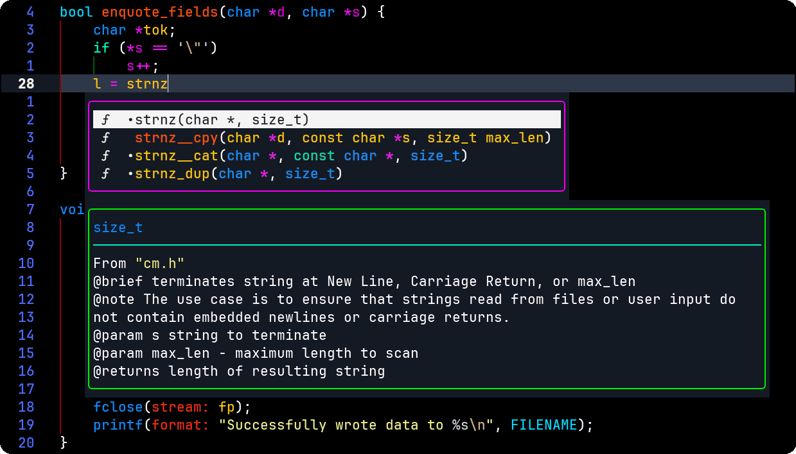
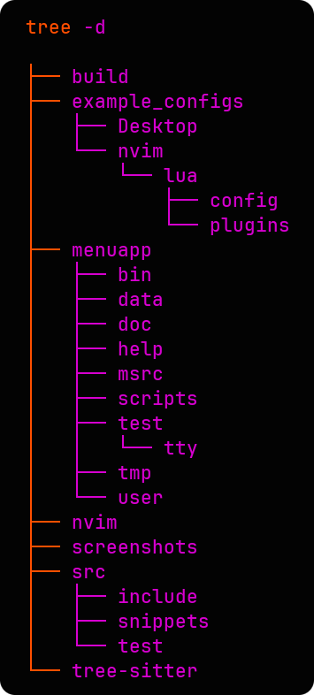
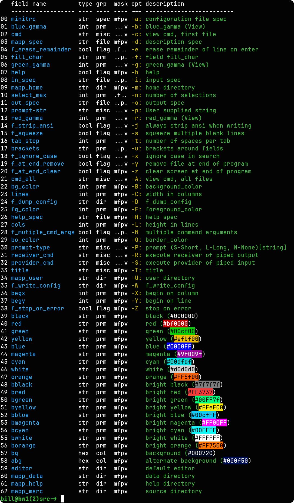

# API

## Get C-Menu on Github

Click the link below to access the C-Menu Documentation:

[C-Menu on Github](https://decision-inc.com)

[Download C-Menu from Github](https://github.com/BillWaller/C-Menu.git)

or

```bash
gh repo clone BillWaller/C-Menu
```

---

## Introduction

The C-Menu API is a set of functions and tools that allow developers to extend
the capabilities of C-Menu and develop custom applications that integrate
with C-Menu.



The C-Menu API documentation is available in Neovim. As you are typing the
function name, a list of matching signatures appears along with a brief
description of each function and its parameters. This makes it easier to
to use the API without having to leave your coding environment. You can select
the one you want with the arrow keys and press Enter to insert it into your code.
You can also hover over a function and press Shift-K to view the full documentation
in a pop-up window.

**_NOTE:_** Requires Neovim properly configured with support for LSP and a
plugin that provides LSP functionality, such as nvim-lspconfig.

## API Organization

The C-Menu API is organized into modules, each containing functions related to a specific aspect of C-Menu's functionality. The most important directories in the C-Menu source are src and menuapp. The src directory contains the source code for C-Menu, including the implementation of the API functions. The menuapp directory contains the application code that uses the API to create the C-Menu user interface and handle user interactions. To familiarize yourself with the API, you can explore the src and
src/include directories while you explore the C-Menu documentation at:

[C-Menu Documentation](https://decision-inc.com)

Start by opening the C-Menu top-level directory explore the various
subdirectories.



### C-Menu Header Files

The src/include directory contains header files that define the API functions and data structures. These header files are located in src/include. They are:

#### include/cm.h

cm.h: This header file includes generic functions and data that are used
throughout C-Menu, but aren't specific to the application layer. It contains general-purpose functions and data structures that can be used in various contexts, not just within C-Menu. cm.h contains:

- struct SIO for managing screen input/output operations
- Chyron manager for handling on-screen text and messages
- File management capabilities for handling files and directories
- String manipulation functions for working with strings in C
- Color and color pair management functions, color initialization, and conversion to and from CGA, XTerm256 (EGA), True-Color (16.7M), and NCurses (1B) color types in decimal, hexadecimal, and ANSI formats.
- 3 Channel color and grayscale gamma correction
- Error reporting
- Signal handling including SIGSEGV graceful termination
- Logging functions for debugging and error reporting
- Ncurses support including WACS characters, mouse support, and terminal
  capabilities

#### include/common.h

common.h: This header file contains the common data structure, "Init", which is used
in Menu, Form, Pick, and View. The "Init" structure is a fundamental part of the C-Menu API and is used to initialize and configure various components of the C-Menu application. It contains fields that specify the properties and behavior of menu items, forms, picks, and views. The functions that utilize the "Init" structure are essential for setting up and managing the user interface elements in C-Menu.

The data in the Init structure is substantially stored in ~/.minitrc. This file
is read on startup, and along with certain environment variables, and
command-line arguments, is used to initialize the C-Menu application and configure its behavior. A default ~/.minitrc file is provided with C-Menu. Any of the C-Menu
main programs will create a new configuration file when invoked with the -D
option. (dump-config).

Each user can have any number of configuration files by specifying the -a option
with the name of the configuration file. For example, if you have a configuration file named "myconfig.minitrc", you can start C-Menu with that configuration by running:

```bash
menu -a myconfig.minitrc
```

```bash
export MINITRC=myconfig.minitrc
```

You can also view the contents of the default configuration by running:

```bash
options
```



This is very useful because field name is also the name of the C variable used by the C-Menu API. For example, the "title" field in the Init structure corresponds to the "title" variable in the C-Menu API. In instances where a long option is needed, the field name is also the long option name. For example, the "mapp_help" field corresponds to the "--mapp_help" long option in the command-line interface. This allows developers to easily understand how to use the API functions and how to configure their applications using the configuration file.

#### include/menu.h, form.h, pick.h, and view.h

These are the application layer header files that define the API functions and data structures specific to Menu, Form, Pick, and View components of C-Menu. Each of these header files contains functions and data structures specific to their respective components, allowing developers to create and manage menus, forms, picks, and views in their C-Menu applications.

#### include/version.h and version.h

version.h: This header file contains version information for C-Menu, including the major, minor, and patch version numbers. version.h is generated from version.h.in during the build process and contains the actual version numbers for the C-Menu application. This information is useful for developers to ensure compatibility with specific versions of C-Menu when developing their applications. The version information
can be accessed through the API functions, allowing developers to check the
version of C-Menu they are working with and ensure that their applications are
compatible with that version.

#### Version Compatibility

- Why it matters: All libcm.so.0.x.x versions of libcm are compatible with all
  C-Menu 0.x.x version, but libcm.so.1.x.x is only compatible with libcm.so.1.x.x.
  However, it is perfectly reasonable to have multiple versions of libcm installed on the same system, as long as they are properly managed and linked to the correct C-Menu application. This allows developers to work with different versions of C-Menu and ensure that their applications are compatible with the specific version they are targeting. The dynamic linker handles the loading of the correct version of libcm based on the version information specified in the C-Menu application and the available versions of libcm on the system. This allows for flexibility and compatibility when developing applications that use the C-Menu API.

To be continued in the next version of the documentation. The C-Menu API is extensive and covers a wide range of functionality, so this documentation will be expanded to include more detailed information about each module, function, and data structure in the API. Future updates will also include examples and best practices for using the C-Menu API effectively in your applications. Stay tuned for more updates!

In the meantime, you can explore the extensive C-Menu documentation available at:

[C-Menu Documentation](https://decision-inc.com)

#### Roadmap for API Documentation and User Guide

**_Note:_** The C-Menu Documentation is developing along two tracks. The API
documentation is geared for developers who want to use the C-Menu API to create
custom applications, or perhaps contribute to the C-Menu codebase. The User
Guide is geared for administrators, developers, and end-users who want to use
C-Menu as an adjunct to their workflow, or perhaps customize C-Menu for their
specific needs. Both tracks are important and will be developed in parallel, but
the API documentation is currently the focus of development. The User Guide will
be expanded in future updates to include more detailed information about using
C-Menu effectively, including tips and best practices for customizing C-Menu to
fit your specific needs. I will also try to add more to the Exercises section,
which is intended to demonstrate how to use C-Menu to solve real-world problems
and to provide hands-on experience with the C-Menu API. The exercises will cover a range of topics, from basic usage of C-Menu to more advanced features and customization options. Stay tuned for more updates on the User Guide and Exercises sections of the documentation!

---

## 🐸 Enjoy using C-Menu! If you encounter any issues or have questions, feel free to open an issue on the C-Menu GitHub repository.

---

=== **_ INCOMPLETE CONTENT _** ===
