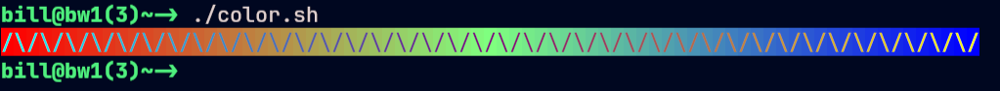
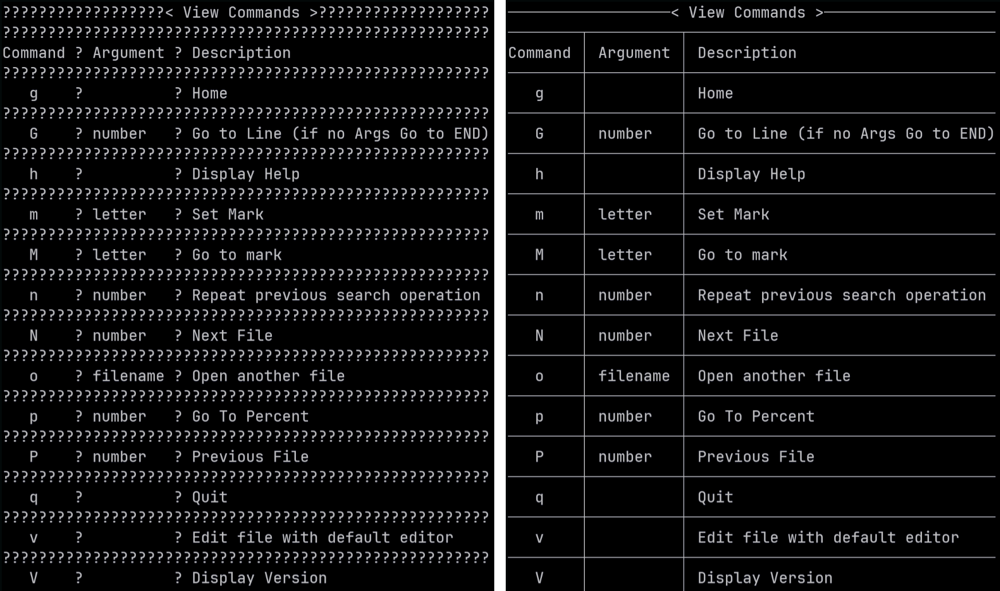
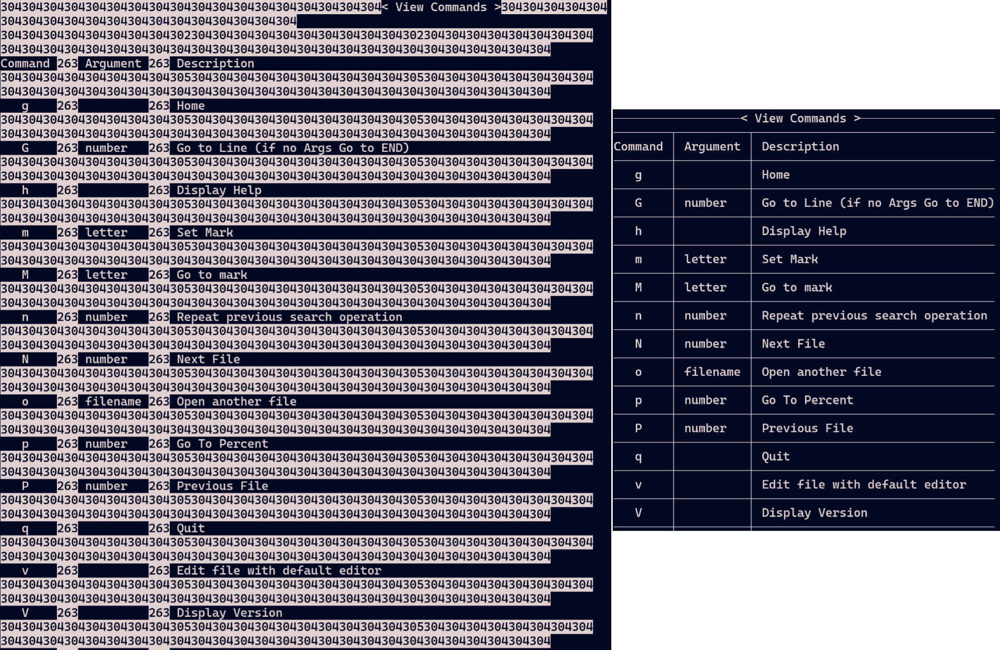
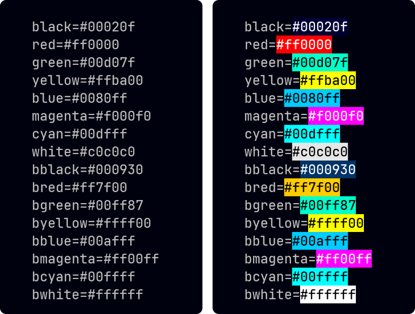
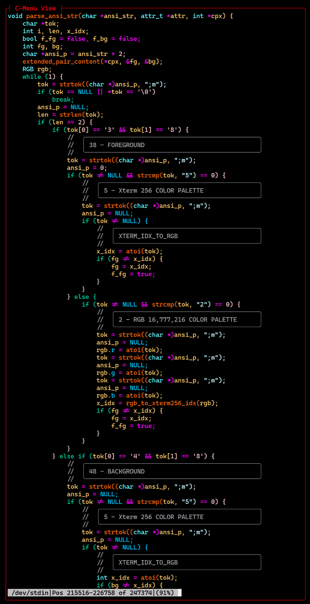
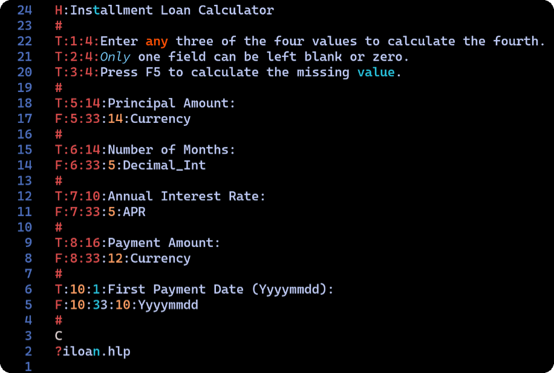

# 

## Table of Contents

<!-- mtoc-start -->

- [TrueColor Support](#truecolor-support)
- [View is Displaying ANSI Codes](#view-is-displaying-ansi-codes)
- [Why View Displays Question Marks](#why-view-displays-question-marks)
- [View - How to Colorize Manual Pages](#view---how-to-colorize-manual-pages)
- [View - How to Colorize HTML Color Codes](#view---how-to-colorize-html-color-codes)
- [View - How to Customize Colors](#view---how-to-customize-colors)
- [Menu, Form, Pick, and View API](#menu-form-pick-and-view-api)
- [View - How to Use Tree-Sitter with View](#view---how-to-use-tree-sitter-with-view)
- [Install Tree-Sitter-CLI](#install-tree-sitter-cli)
  - [Download From GitHub](#download-from-github)
- [Menu Form - Integrating External Executables](#menu-form---integrating-external-executables)
- [Menu - Using the Installment Loan Calculator](#menu---using-the-installment-loan-calculator)
- [Menu Form - Line Type Specifiers](#menu-form---line-type-specifiers)
- [Menu Form - Field Delimiters](#menu-form---field-delimiters)
- [Menu Form - Data Types](#menu-form---data-types)
- [Menu - Interprocess Communications](#menu---interprocess-communications)
- [What Happened to Delete by Inode](#what-happened-to-delete-by-inode)
- [Pick - Selecting Multiple Files](#pick---selecting-multiple-files)
- [Menu lf - Where Are My Header Files?](#menu-lf---where-are-my-header-files)
- [View In a Box Window](#view-in-a-box-window)

<!-- mtoc-end -->

## TrueColor Support

Q: How can I tell if my terminal supports TrueColor (24-bit color)?

A: You can run the following command to test if your terminal supports
TrueColor:

```bash
awk 'BEGIN{
    s="/\\/\\/\\/\\/";
    for (colnum = 0; colnum<77; colnum++) {
        r = 255-(colnum*255/76);
        g = (colnum*510/76);
        b = (colnum*255/76);
        if (g>255) g = 510-g;
        printf "\033[48;2;%d;%d;%dm", r,g,b;
        printf "\033[38;2;%d;%d;%dm", 255-r,255-g,255-b;
        printf "%s\033[0m", substr(s,(colnum%4)+1,1);
    }
    printf "\n";
}'
```

The above script is from:

[GitHub Terminal Colors](https://github.com/termstandard/colors)

If your terminal hardware supports TrueColor, you should see a smooth
gradient of colors from red to green to blue. If you see a limited
number of colors or a blocky gradient, your terminal may not support
true color.



You can also check the COLORTERM environment variable by typing:

```bash
    echo $COLORTERM
    truecolor
```

If the output is "truecolor" or "24bit", your terminal hardware
supports TrueColor. For most situations, this is sufficient to confirm
TrueColor support, and further checks are not generally not
beneficial or necessary.

Even if your terminal hardware supports TrueColor, your terminfo
may not. Keep in mind that the number of colors set in terminfo
only affects applications that choose to use it. A terminfo setting
of 256 colors does not limit which of the 16M colors an NCurses
application can display, but only the number of color pairs that
can be displayed simultaneously.

Note: The remainder of this section takes a deep dive into a rabbit
hole that most users will not benefit from exploring. If your terminal
hardware supports TrueColor, and the COLORTERM variable indicates
TrueColor support, you needn't continue reading.

You can check your terminfo color capabilities by typing:

```bash
    tput colors
```

If the output is 16777216, your terminfo supports TrueColor.

Even if your hardware supports TrueColor, but the above indicators
report only 256 colors or less, you can set the TERM variable to a value
that supports Truecolor. For example, you can set the TERM variable to
"xterm-direct" by adding the following line to your
~/.bashrc or ~/.zshrc file:

```bash
export TERM=xterm-direct
```

The caveat is that xterm-direct and other terminfo files may come with
limitations. For example, I have found that xterm-direct, lacks the "ccc"
(Can-Change-Color) flag. This flag is advisory only for applications
that choose to use it.

I use one of::

```bash
export TERM=xterm-ghostty
export TERM=xterm-kitty
export TERM=xterm-bw
```

You can create your own custom terminfo entry using infocmp and tic,
but beware. Terminfo is a complex and sometimes arcane system, and not all
applications will work properly with custom entries.

Both the Ghostty and Kitty terminfo files set Number of Colors to 256,
and that is perfectly understandable considering that:

1. While 16M colors are beneficial for applications like image viewers and
   video players, most terminal applications do not require that level
   of color depth.
1. A terminfo setting of 256 colors does not limit the number of colors
   that can be displayed by an image viewing application.
1. A terminfo setting of 256 colors does not limit which of the 16M colors
   C-Menu can display, but only the number of colors that can be displayed
   simultaneously.
1. Because terminal emulators, and therefore C-Menu, operate on character
   cells, 256 colors is far more than adequate.
1. Neither Ghostty nor Kitty rely on NCurses for color management, so it is
   unlikely they are limited by the content of terminfo.
1. Setting Number of Colors to 256 ensures compatibility with applications
   that expect a standard 256-color terminal.

If you are determined to have more than 256 colors at one time, you can
get around this issue by using infocmp to create a custom terminfo entry
that specifies higher color capabilities. Here is an example of how to
do this, but it is not recommended.

```bash
infocmp xterm-256color > xterm-myterm.ti
```

Add or modify the following lines in xterm-myterm.ti

```bash
ccc, colors#0x1000000, pairs#0x10000
```

Once you have finished editing xterm-myterm.ti, compile it using tic:

```bash
tic xterm-myterm.ti
```

And, set your TERM environment variable to your new terminfo entry:

```bash
export TERM=xterm-myterm
```

You can also refer to this helpful list of terminals and their color
support:

[GitHub Terminal Colors](https://github.com/termstandard/colors)

---

## View is Displaying ANSI Codes

Q: I am trying to view a program file in view, but it is displaying
ANSI escape codes.


A: No worries. I ran into the same problem. View is not
recognizing the ANSI escape codes. Taking a closer look at the
file, I can see the "intro" characters repeated, "0x1b[0x1b[".
This happens when the output file of a colorizer or highlighter
is processed a second time by a colorizer or highlighter. It
tries to put ANSI escape codes around the existing ANSI escape
codes, resulting in the "0x1b[0x1b[" sequence, which View can't
interpret.

Out of curiosity, I ran the same file through less, which produced
the same results as C-Menu View. In the world of pagers, less is
the gold-standard, and apparently they chose not to address this
issue. Therefore, it seems the best solution is to avoid double
exposure. If you have a file that has been colorized or highlighted,
don't run it through another colorizer or highlighter. Use C-Menu's
stripansi to remove the ANSI escape codes before re-colorizing or
re-highlighting. This works for C-Menu View as well as less.

Below, I have included a screenshot using less.


---

## Why View Displays Question Marks

Q: When I try to view a document that contains line-drawing characters,
View displays question marks instead of the line-drawing
characters. How can I fix this?

A: The file may contain characters above 0x80, which can't be
translated by View's character translators. If the offending
characters CP-437 line drawing characters, you can convert the file
to UTF-8 encoding using a tool like 'iconv' or 'recode'. For example,
you can use the following command:

```bash
iconv -f CP437 -t UTF-8 inputfile.txt -o outputfile.txt
```

The images below show, before, on the left, and after, on the right, using
iconv.



As an interesting note, this also works for "less", which displays the
ordinal values of the CP437 characters. "less" could have automaticaly
recognized and converted the CP437 characters, but the developer chose
not to, and it was probably a wise decision. If you are modernizing
your document archives, you shouldn't propagate CP437 encoded files
into the future. It's far too easy to convert them to UTF-8. The
"less" rendition was useful for me, because I have been programming
long enough to recognize the ordinal numbers as CP437 line-drawing
characters. That may not be true for someone born after 1980.

I am certainly not being critical of "less", nor am I suggesting that
C-Menu's View is superior. We both ran into the same issue, and chose
to reveal the problem with the underlying character encoding, rather
than masking it.

Below are the "less" screenshots before conversion to UTF-8 and after.

Once converted to UTF-8, less displays the line-drawing characters
just as View does. The converted files for C-Menu View and less were
the same size when displayed, but I had to shrink the converted less
screenshot on the right to fit both before and after screenshots
side by side.



---

## View - How to Colorize Manual Pages

Q: How can I add color to manual pages?

A: Manual pages use ANSI SGR escape sequences to add color.

0x1b[1m bold

0x1b[2m dim

0x1b[3m italic

0x1b[4m underline

0x1b[22m normal intensity (bold/dim off)

0x1b[23m italic off

0x1b[24m underline off

You can use the following sed script to substitute your own colors:

```sed
s/\[2m/\[35;1m/g
s/\[3m/\[33;3;1m/g
s/\[4m/\[31;1m/g
s/\[22m/\[22;0m/g
s/\[23m/\[23;0m/g
s/\[24m/\[24;0m/g
```

You can save this script to a file, or use the one that comes with
Menu, (~/menuapp/msrc/man.sed) and then use it like this:

```bash
man -Tutf8 bash | sed -f ~/menuapp/msrc/man.sed | view
```

This will display the bash manual page with the specified colors in
View.


---

## View - How to Colorize HTML Color Codes

Q: I want to colorize six digit HTML style hexadecimal colors, such as
\#RRGGBB, in View. How can I do this?

A: You can use the following awk script to colorize six digit HTML
style hexadecimal colors in View:

```bash
awk -f ~/menuapp/msrc/colorize.awk yourfile.txt | view
```

This script matches six digit hexadecimal colors in the format #RRGGBB
and adds the ANSI escape sequences to set the background color to the
specified RGB values.

This will display the contents of yourfile.txt in View with the
specified hexadecimal colors colorized. The image below shows before
and after colorizing.



---

## View - How to Customize Colors

Q: How can I customize the color scheme in View?

A: If you have a modern color display, View can display up to
16,777,216 different colors using ANSI escape sequences applicable to
foreground and background. You can also redefine the standard ANSI
color palette in ~/.minitrc. When you exit Menu, your system colors
revert to their previous state.


## Menu, Form, Pick, and View API

Q: I want to use the Menu API to develop my own code. How can I do that.

A: At the moment, you will have to rely on Menu's source code for
documentation. If build Menu using CMake in the build directory, a C
library will be installed in the lib64 directory, which you can link to
your own executables. If there is sufficient interest, that capability
will be expanded, improved, and a reference guide will be created for
the API.

---

## View - How to Use Tree-Sitter with View

Q: How do I use the tree-sitter highlighter with View?

A: Documentation on this feature is sparse at the moment.

Here are the basic steps to get started with tree-sitter and View.

## Install Tree-Sitter-CLI

```bash
cargo install tree-sitter-cli
```

Verify installation:

```bash
tree-sitter --version
```

[tree-sitter-rust](https://github.com/tree-sitter/tree-sitter-rust)

```bash
cd tree-sitter-rust
tree-sitter build
tree-sitter generate
```

### Download From GitHub

[tree-sitter-c](https://github.com/tree-sitter/tree-sitter-c)

```bash
cd tree-sitter-c
tree-sitter build
tree-sitter generate
```

You should edit ~/.config/tree-sitter/config.json to include the
languages you want to use with View.

You will find an example config.json in Menu's tree-sitter directory.

Type the following command:

```bash
tree-sitter highlight source-file | view
```


These instructions are admittedly sketchy and hard to follow. We will
revise and clarify in the future.

---

## Menu Form - Integrating External Executables

Q: How can I integrate external programs into Menu Form, such as an
SQL Query or calculation?

A: We can use the executable "iloan" included with Menu as an example.

The Form will have four fields. The user must enter any three of the
four values. Only one field may be zero. Iloan will calculate the
value of the missing field and Menu Form will display it.

First, create a form file named "~/menuapp/msrc/iloan.f" with the
following contents:



Next, create a help file named "~/menuapp/help/iloan.hlp" with the following
contents:

Installment Loan Calculator Help

This form calculates the missing value of an installment loan.

Enter any three of the four values. Leave the value to be calculated as
zero. Only one field may be zero.

Fields:
Principal Amount - The total amount of the loan.
Number of Months - The total number of monthly payments.
Annual Interest Rate - The annual interest rate as a percentage.
Payment Amount - The amount of each monthly payment.
First Payment Date - The date of the first payment in YYYYMMDD format.

Add the following two lines to "~/menuapp/msrc/main.m":

\: Installment Loan Calculations

!form iloan.f -i iloan.dat -S iloan -o iloan.dat

This will add a menu item to the Main Menu that will launch the Iloan
Form. When you select the "Installment Loan Calculations" menu item,
Menu Form will display the Iloan Form. After you enter any three of
the four values and press Enter, Menu Form will call the "iloan"
executable to calculate the missing value and display it in the form.

Menu Form will complain that "iloan.dat" does not exist the first
time you run the form. This is normal. Menu Form will create the
file when you exit the form.

## Menu - Using the Installment Loan Calculator


After you enter the three values, you will see an option "F(5)
Calculate". Press F(5) to calculate the missing value. When the
calculation is complete, the missing value will be displayed in the
form. You will then see an option, "F(8) Edit", which will allow you to
make changes and try again. If you don't wish to make changes, press
"F(10) Accept" to write all four values to "iloan.dat" and exit the form.

The next time you run the form, Menu Form will read the values from
"iloan.dat" and display them in the form.

Here's a summary of the important parts of the form file format:

## Menu Form - Line Type Specifiers

- \# Comment line (ignored)
- H - The header to be displayed at the top of the form
- T - Text field (line:column:length:text)
- F - Input field (line:column:length:type)
- ? - A user supplied help file for the form. If no path is given, Form
  will look for a file with the same name as the form but with a
  .hlp extension. It will search in the current directory and then in
  the menu help directory, ~/menuapp/help.

## Menu Form - Field Delimiters

The ":" character is used as a delimiter in the fields above, but any
character that is placed immediately after the line designator (H, T, F, ?)
can be used as a delimiter. For example, the following two lines are
equivalent:

T:2:4:Enter any three of the four values to calculate the fourth.
T|2|4|Enter any three of the four values to calculate the fourth.

## Menu Form - Data Types

The following data types are currently supported for input fields:

- String: Any text
- Decimal_Int: Integer number
- Hex_Int: Hexadecimal integer
- Float: Floating point number
- Double: Double precision floating point number
- Currency: Currency amount
- APR: Annual Percentage Rate
- Yyyymmdd: Date in YYYYMMDD format
- HHMMSS: Time in HHMMSS format

Note that the data types determine field formatting, and on entry,
numeric data is converted to its corresponding internal binary format,
so that calculations can be performed. Both text and internal numeric
binary data are available to the developer.

For applications that demand extreme accuracy, our plan is to integrate
the "decNumber C Library", Copyright © IBM Corporation 2010, to provide
128 bit BCD (Binary Coded Decimal) in a future release.

The Field Format Specifiers can be any combination of upper and lower
case, and new types can be easily added by modifying the source code.

---

## Menu - Interprocess Communications

Q: How does Menu send and receive data to external programs?

A: Currently, Menu is limited to communicating through files or pipes.

When you start Menu Form, Pick, or View, you can specify

-S executable
or
-R executable

-S runs executables that provide input data to Menu via pipe, and
-R runs executables that receive output data from Menu via pipe.

The way it works is, Menu creates dual ended pipes, each with a read
and write end before forking and spawning the executables. In the
example (Installment Loan Calculations) above, Menu Form substitutes
a write pipe for the standard output of the child process, and opens
the read end of the pipe for its input. The called executable writes
data to the pipe and Menu form reads the other end.

We can just as easily use named pipes or network sockets, although it
requires a bit more configuration. If there is sufficient interest, C
-Menu will have an event-driven server to handle network communications
and asynchronous tasks. It is likely that server will be implemented in
Rust to take advantage of tools like the Tokio and Serde crates.

---

## What Happened to Delete by Inode

Q: I noticed you have a menu option named, "Delete by Inode", but it doesn't work.

A: Thanks for reminding me. I will remove that choice from the menu
until I can figure out a way to make it safe.

The original command was:

```bash
find . -inum [inode-number] -delete
```

That is too dangerous if the user makes a mistake, so I replaced the
find with "rm -i".

```bash
  !pick -S "ls -i" -n 1 -R "rm -i"
```

It doesn't delete files by inode, but at least it prompts the user
before deleting files. Still, it's not what I intended, so it will be
removed until I find a better solution.

I may eventually write a C or Rust program that will safely delete
files by inode after confirming the correct file with the user as well
as saving deleted files in a trash bin, on an opt-out basis.

---

## Pick - Selecting Multiple Files

Q: In Pick, how can I select multiple files to edit with vi?

A: You can use the -M option to enable multi-select in Pick.
Here is an example command that allows you to select multiple files and
open them in Menu Vi:

```bash
!pick -S "lf -r ./ .*\.[ch]$" -M -R vi -T "Project Tree - Select Files to Edit"

```

Select as many files as you want to edit and press F10. Pick
will open the first file. If you are using Nvim, Vim, Less, or Menu
View, you can type: \":n\<enter\>\" to open the next file.

---

## Menu lf - Where Are My Header Files?

Q: You have an option to edit C source files in the Project Tree menu,
but it doesn't list my header files. Can you fix that?

A: Sure. My bad. Of course you want your header files to be listed with
your C files. Here is the new Menu line with the regular expression
corrected to include both .c and .h files:

```bash
!pick -S "lf -r ./ .\*\.[ch]$" -n 1 -R vi -T "Project Tree - Select File to
Edit"
```

---

## View In a Box Window

Q: How do I highlight a C source file using tree-sitter and view it in
a View box window.

```bash
view -L 40 -C 80 -S "tree-sitter highlight view_engine.c"
```

Leave out the -L 40 and -C 80 to display the file in full screen.

Alternatively, you can use the following command.

```bash
tree-sitter highlight view_engine.c | view -L 40 -C 80 -T "Highlighted view_engine.c"
```

The "-S" option will tell view to execute the command and display the
output. As an added bonus, if you don't provide a title with "-T", view
will use the "-S" command as the title:
