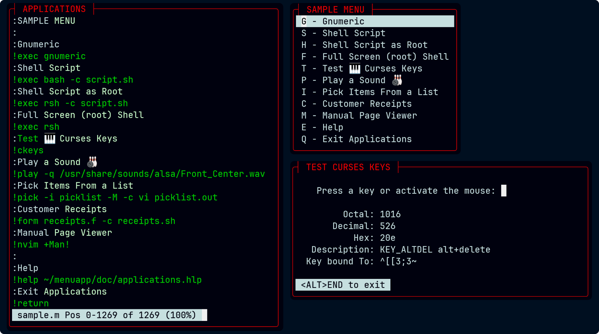
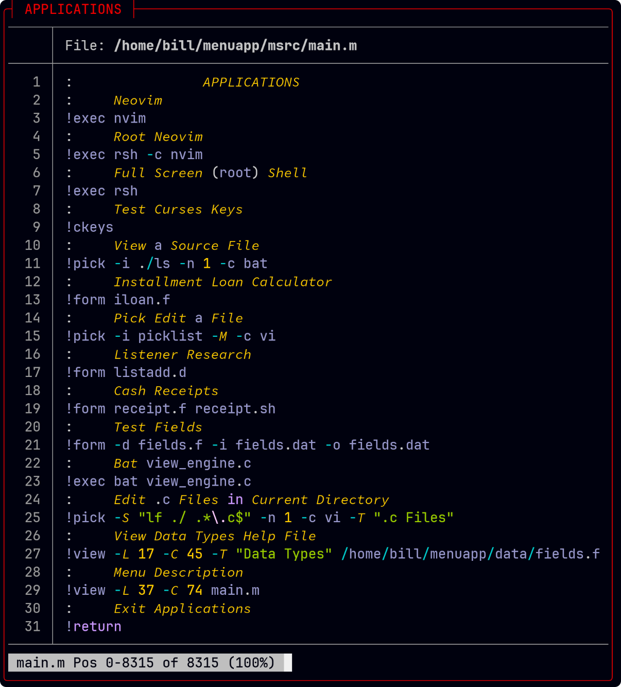
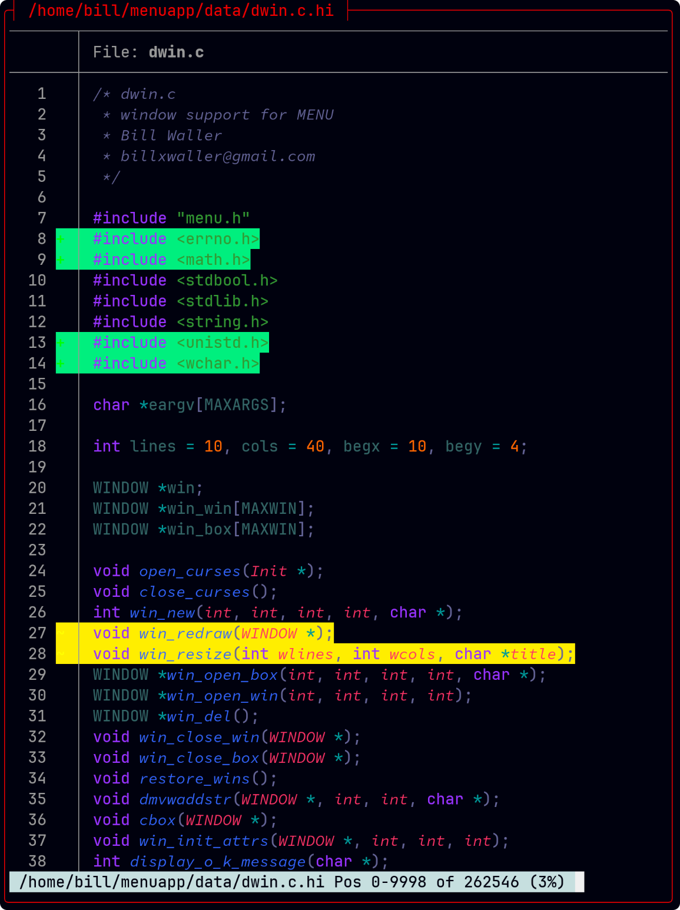
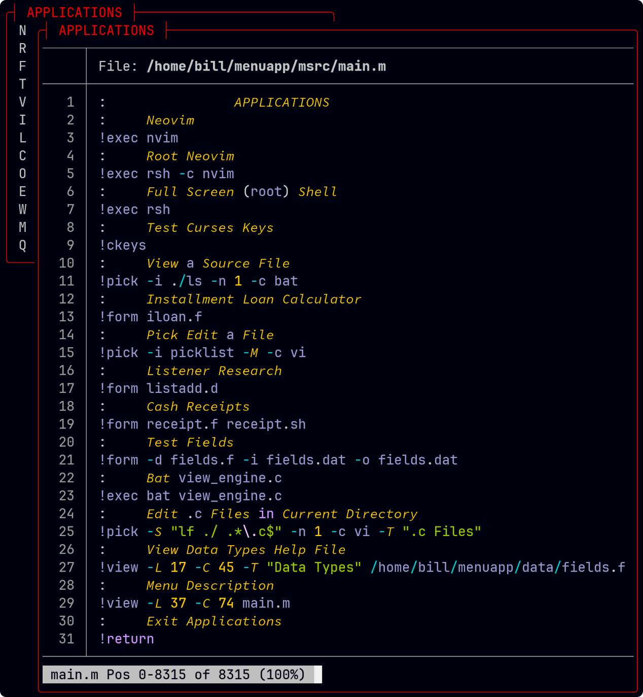

# **C-Menu** - A TUI Menu System

## Programs: C-Menu Menu, Form, Pick, View, and RSH

**C-Menu** is a lightweight, customizable, and easy-to-learn suite of programs
for creating menus, entry forms, and pickers with a text-based user
interface(TUI) for applications running on Linux and Unix-like operating
systems. **C-Menu** is designed to be simple to use while providing powerful
features to implement menu driven frameworks for applications in
terminal and terminal emulator environments.

### **C-Menu**

C-Menu reads a simple description file like the one above and displays a menu to the user. When the user selects an item, C-Menu executes the corresponding command. It's like writing a shell script, but with a nice TUI menu interface.

### **C-Menu** C-Keys to diagnose screen input issues

Is a particular key not working for your project? C-Menu C-Keys provides an easy way to determine if the key is defined in NCurses or there is a missing entry in your terminfo database. Or, if you just don't remember the name of a particular key, it may be more convenient than rummaging through NCurses header files. Just start C-Keys and press the key. It will display the curses key name, if defined, along with Octal, Decimal, and Hex codes. It's also a good way to identify which keys are defined in NCurses, and gives you the specific key code so if it's not, you can easily add your own Extended NCurses keys.

C-Menu C-Keys also provides a diagnostic function for mouse actions and geometry.

### **C-Menu** PICK

This program provides a list of objects from arguments or a text file
and lets the user select any number to be written to a file or provided
as arguments to an executable specified in the description file.

### **C-Menu** FORM

FORM is a lightweight and flexible form handling library designed to simplify the process of creating, validating, and managing forms in text-based applications.

It provides a straightforward API for defining form fields, handling user input, and performing validation checks.

### **C-Menu** FORM Key Features

- Easy Form Creation: Define forms with various field types such as text, number, email, and more.
- Validation: Built-in validation rules to ensure data integrity, including required fields, format checks, and custom validators.
- User Input Handling: Seamlessly capture and process user input from the command line or text-based interfaces.
- Customizable: Extendable architecture allowing developers to create custom field types and validation rules.
- Integration: Designed to work well with other components of the **C-Menu** Project, enabling a cohesive development experience.

### **C-Menu** FORM Data Types

FORM displays data entry forms based on a description file. It allows users
to input data in a structured manner. The entered data can then be processed
by a specified command or script.

If you make a mistake, in the form description syntax, as I did below, you will
get a notification pinpointing the problem. In this message, we can see that the
format field on line 3 of "receipt.f" is invalid. I have a "3", and it should have been "String". The corrected line would be: "F!2!18!10!String".

Decision, Inc. used **C-Menu**'s FORM program to augment it's Radio Broadcast
accounting, scheduling and management system. It was particularly useful
as a front-end for our SQL database applications.

Need quick and easy Cash Receipts, General Journal, or wedding invitation
list? FORM has you covered. The application shown above took about 10
minutes from design to test. It doesn't post transactions, or keep running
balances yet, but that's why we have people like you.

FORM also makes a great front-end for SQL database queries.

### **C-Menu** Sample Menu Description File

As you can see, the description file is straightforward and easy to read. Each menu item consists of a label and a command to execute. The label is displayed in the menu, and the command is executed when the user selects that item.

Here's just one example of how easy it is to create useful programs with the **C-Menu** Form facility.

We hope you find **C-Menu** useful for your projects. It's a powerful tool that can
greatly simplify the process of creating text-based user interfaces for
your applications.

### **C-Menu** VIEW

VIEW is an easy-to-use text file viewer that allows users to view text files in a
terminal environment. It supports basic navigation, regular expression
search functionality, horizontal scrolling, ANSI escape highlighting, Unicode, and
NCurses wide characters. VIEW can be invoked from within MENU, FORM, or PICK to provide contextual help or stand-alone, full-screen as a system pager.

You may have noticed that Nvim doesn't render ANSI escape sequences. Why should it? How often do you need to edit a file with ANSI escape sequences? Generally, the user just needs to view that type of file, and that's what pagers like "less" and **C-Menu** view were designed to do.

#### Nvim Screenshot

#### CMenu Screenshot of the Same File

One especially useful feature of **C-Menu** View is its incredible speed with large
text files, like system logs. **C-Menu** View can open and display multi-gigabyte text files almost instantaneously. While NVIM and other modern editors are outstanding for code editing, but don't even try to open multi-gigabyte file with them. C-Menu View handles large files without breaking a sweat, and zips through them with lightning speed.

### C-Menu 3-Channel Gamma Correction

When using utilities such as "pygmentize" to highlight files, the text is sometimes almost unreadable. On the left-hand side of the following screenshot, "less" does a great job of rendering the output of pygmentize, but **C-Menu** with gamma correction can do better. It's all about perceptual luminance. Either from the command line or the minitrc file, the user can specify a gamma correction value for each of the three color channels, red, green, and blue. It's a minor thing, really, but we programmers aren't "automitons." A pleasing visual appearance makes work more fun.

Here's another sample using "bat".

### C-Menu 6-Channel Gamma Correction

It's not available yet, but it could be. "bat", is a totally awesome highlighting application, and the included themes are great, but sometimes the reverse backgrounds don't have enough contrast. The text blends in with the backgroudn, making it difficult to read. That's where 6-Channel Gamma correction might be very useful. By using luminance and hue as indicators, it could darken, lighten, and shift hue to improve readability and aesthetic appeal. Let me know what you think.

[Bezold-Brücke hue shift](https://pubmed.ncbi.nlm.nih.gov/6534013/)

#### VIEW ~/menuapp/help/view.help

#### And you're Bobby Dazzler!

With Unicode glyphs, ANSI escape highlighting, and 3-Channel gamma correction, your application is bound to outshine the competition.

### **C-Menu** Is Easy to Use

As you can see, the view command on line 24 specifies the number of columns and lines (-C and -L respectively). The following screenshot shows the C-Menu description file being edited with NVim.

But if you like a little more panache, display it with C-Menu view.

### RSH

Despite its name, RSH is not a shell. It is a shell runner, which allows
you to specify your shell of choice, and provides a consistent environment
for running shell scripts and commands. RSH was designed to be invoked from
within MENU, FORM, or PICK to execute commands that require elevated
privileges, but its functionality extends beyond that.

You can execute commands in either user or root mode, making it a versatile
tool for developing aplication front-ends. RSH ensures that your scripts
and executables run in a controlled environment, reducing the chances of
unexpected behavior due to differing shell environments. RSH forks and waits
for its spawn to complete before returning control to the calling program.
When executed under **C-Menu**'s signal handler, it catches and displays the
exit status of the command, allowing for better error handling. Instead of
using su -c or sudo to run commands as root, you can use rsh -c to achieve
the same result in a more streamlined manner. You can literally have root
access within a fraction of a second, making it ideal for work that
requires frequent switching between user and root modes for various
administrative tasks.

Many system administrators and developers find RSH invaluable for tasks
that require elevated privileges. RSH eliminates the need to repeatedly enter
passwords or switch users, streamlining workflows and improving efficiency. We all
know it's not a good idea to run everything as root, but sometimes a user want's to
avoid precious seconds it takes to enter passwords for su. With RSH, it takes three
keystrokes to enter root mode and two keystrokes to get out.

Please be very careful when using RSH in setuid root mode. Keep the
executable protected in your home directory with appropriate permissions
to prevent promiscuous access by unauthorized users. RSH should be provided
only to trusted users who understand the implications of executing commands
with elevated privileges. Used inappropriately, it can lead to system
instability or security vulnerabilities.

## Features

- Create and manage multiple menus, forms, and pickers

- Define interfaces using simple configuration files

- Perfect for shell scripting, command-line, and terminal based applications

- Made for Linux and Unix-like operating systems

- Blazingly fast, even on older hardware

- Text-based user interface (TUI) using ncurses

- Easily customize menu options and actions

- Any level of sub-menus

- Navigation using keyboard inputs the way God intended

- Configurable appearance and behavior

- Cross-platform compatibility

- Open-source and free to use

#### MINITRC Runtime Configuration and Options

User's can have multiple runtime configurations. In the snippet above, the
standard ISO 6429 / ECMA-48 colors have been redefined and orange has been
added.

## Installation

To install **C-Menu**, simply download the source code from the repository and follow the installation instructions provided in the INSTALL.md file.
