# A User Interface Builder

[***NEW Comprehensive HTML Documentation***](https://billwaller.github.io/C-Menu/)

## Table of Contents

<!-- mtoc-start -->

* [Menu, Form, Pick, View, RSH, and C-Keys](#menu-form-pick-view-rsh-and-c-keys)
  * [Elements of C-Menu](#elements-of-c-menu)
  * [Key Features](#key-features)
  * [Highlights (Pun Intended)](#highlights-pun-intended)
  * [Just Do It!](#just-do-it)
  * [Menu](#menu)
  * [C-Keys - Diagnose Keyboard/Mouse Input](#c-keys---diagnose-keyboardmouse-input)
  * [Pick - A Picker](#pick---a-picker)
  * [Form for Data Entry and Editing](#form-for-data-entry-and-editing)
  * [Form Key Features](#form-key-features)
  * [Form Data Types](#form-data-types)
  * [Sample Menu Description File](#sample-menu-description-file)
  * [View](#view)
    * [Log File With Editor](#log-file-with-editor)
    * [Screenshot of the Same File With View](#screenshot-of-the-same-file-with-view)
  * [View and Color Manual Pages](#view-and-color-manual-pages)
  * [Example Manual Page Using Editor](#example-manual-page-using-editor)
  * [Example Manual Page](#example-manual-page)
  * [Demand Paged Virtual Address Space](#demand-paged-virtual-address-space)
  * [View - Other Features](#view---other-features)
  * [3-Channel Gamma Correction](#3-channel-gamma-correction)
  * [Gray Gamma](#gray-gamma)
* [C-Menu Documentation](#c-menu-documentation)
* [RSH](#rsh)
  * [Maintaining Security with RSH](#maintaining-security-with-rsh)
* [Features](#features)
* [Configuration](#configuration)
* [MIT License](#mit-license)

<!-- mtoc-end -->

## Menu, Form, Pick, View, RSH, and C-Keys

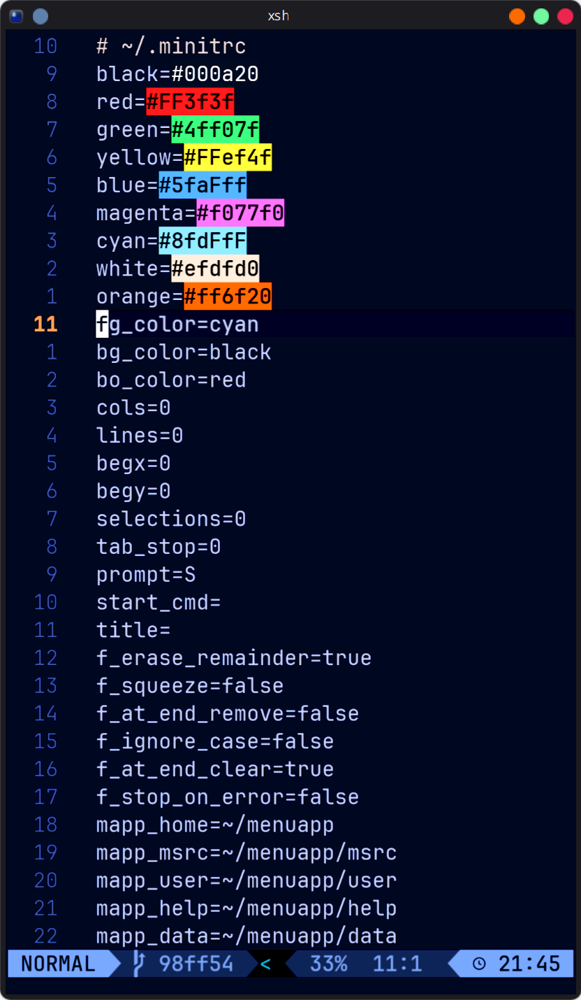

C-Menu is a lightweight, flexible, and easy-to-use suite of programs
for creating a sophisticated user interface for your applications.
Menus, Form, Pick, and View, using a classical text-based terminal
interface(TUI) for applications running on Linux and Unix-like
operating systems. C-Menu is designed to be simple to use while
providing powerful features to implement menu driven frameworks for
applications.

This is a real TUI, and though we may add a GUI front-end in the future,
we won't abandon the super-responsive, low-overhead, and universally compatible
text-based interface. It's here to stay, and it's perfect for a wide range of applications, from simple command-line tools to complex system administration utilities. C-Menu is ideal for developers who want to create intuitive and user-friendly interfaces without the need for complex GUI frameworks. With C-Menu, you can easily design and implement menus, forms, and pickers that enhance the user experience and streamline interactions with your applications.

While we do support mouse input, we realize that hardened coders like you
prefer the blinding speed you can achieve with the keyboard. That's why
we never give the keyboard a back seat, and why we provide navigation
with familiar h, j, k, and l, the way God intended. We also support more
conventional navigation via arrow keys, page-up, page-down, home, and end keys.
The idea is to provide you and your users with comfortable, intuitive, and
convenient navigation.

And, don't let the name fool you. C-Menu is not just a menu system, it's
a comprehensive user interface framework designed to enhance your
interaction with applications. It provides a structured way to navigate
through application hierarchies, manage forms, select objects, and
view data efficiently. And, it does so with style, offering a visually
appealing interface that boosts comprehension through color.

---

### Elements of C-Menu

***Menu*** - Navigate Application Hierarchy

***Form*** - Field Entry, Formatting, Validation, and Editing

***Pick*** - Select Objects From Lists and Tables

***View*** - Search, Format, and Display Data

***RSH*** - Expeditious Root Privilege On/Off

***CKeys*** - Diagnose Mouse and Keyboard Issues

---

### Key Features

- Easy to Design Menus and Forms With Simple Text Files
- Supports Tree-Sitter Syntax Highlighting
- Colorize Manual Pages
- Customizable Color Schemes
- 24-Bit (16777216-Color) True Color ANSI
- HTML Style Six-Digit Hex Color Codes
- User Selectable 3-Channel + Grayscale Gamma Correction

### Highlights (Pun Intended)

Cast some light on dull information with C-Menu's vibrant colorization features. With support for 24-bit true color ANSI and HTML-style six-digit hex color codes, you can customize your interface to suit your preferences. Whether you want to highlight important information or simply make your terminal more visually appealing, C-Menu has the tools you need.

### Just Do It!

C-Menu is more than just a tool; it's a gateway to a more efficient
and enjoyable computing experience. Whether you're a developer looking
to create intuitive interfaces or a user seeking a more engaging way
to interact with applications, C-Menu has you covered. Dive in and
explore the possibilities!

---

### Menu

At the top of the stack is C-Menu Menu, which reads a simple
description file like the one below and displays a colorful and easy-to
-follow menu to the user. When the user selects an item, with either
keyboard or mouse, C-Menu executes the corresponding command. It's like
writing shell scripts, but with a snazzy menu interface.

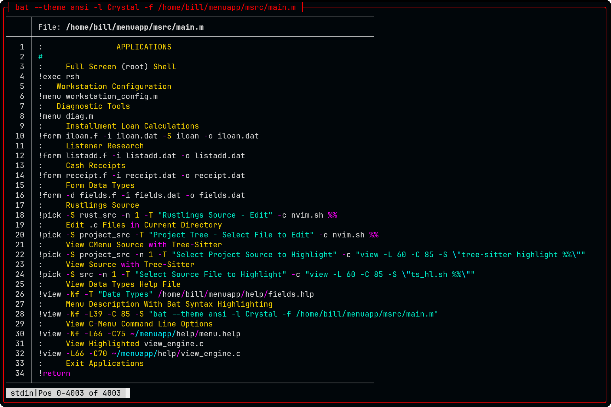
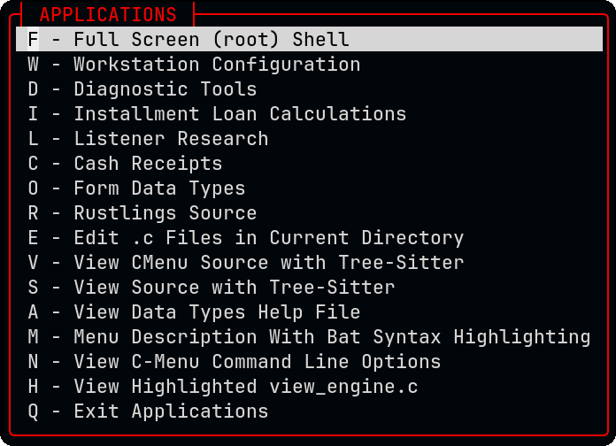

From the above examples, you can get an idea of how C-Menu works.
Examine line-21 in "main.m" above. C-Menu Menu starts C-Menu View,
which in turn executes "tree-sitter highlight view_engine.c". Tree
-Sitter doesn't need to know anything about C-Menu View. It just sends
output to it's standard output device, which happens to be a pipe into
C-Menu View's receiver. C-Menu View maps Tree-Sitter's output to the
Kernel's demand paged virtual memory and you get:

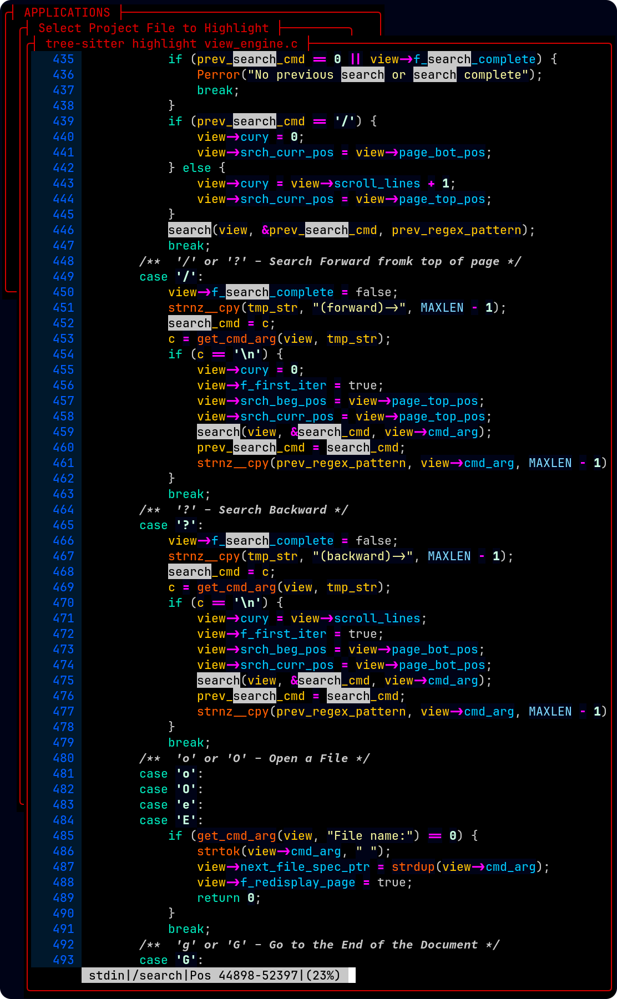

---

### C-Keys - Diagnose Keyboard/Mouse Input

With C-Keys, you can diagnose and resolve keyboard and mouse
issues quickly and easily. Just press a key and get the Octal, Decimal,
Hexadecimal, the Escape Sequence Binding, and the NCurses Identifier.
It's definitely easier than rummaging through hardware documentation
and NCurses header files. It's also a good way to identify which keys
are reserved by your terminal emulator, and gives you the specific key
codes so you can easily add your own Extended NCurses keys.

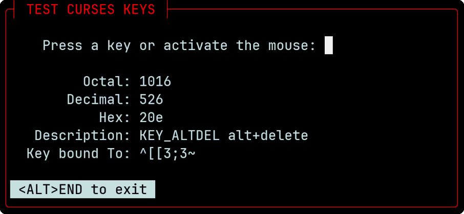
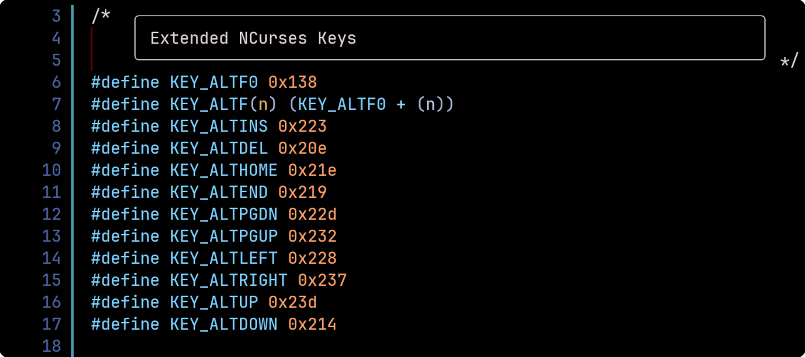
C-Keys also provides diagnostics for mouse actions and geometry.

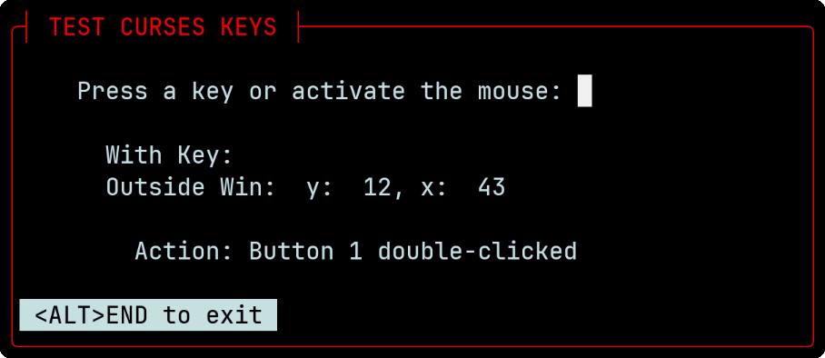

Just add hot water, stir, and Bob's your uncle, you have soup! 😀

---

### Pick - A Picker

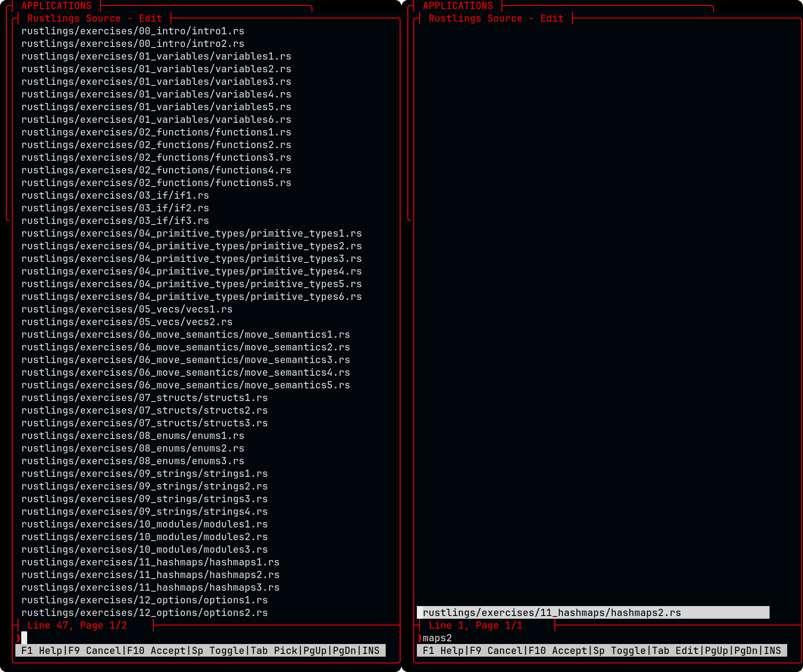

Pick provides a list of objects from arguments, piped input,
or a text file. The user selects an object by using cursor movement keys,
up, down, left, right, page-up, or page-down and pressing the space bar.
Alternatively, the user can use the mouse and click on the object.
When finished selecting objects, the user presses the Enter or F(10) key.
If the "number_of_selections" variable is set to 1 (one), Pick will
assume the user is finished and perform the specified action.
Output can be piped to standard output, or provided as arguments to an
executable file specified in the description file.

Here's a simple way to use Pick:

Pick a file to view using "lf", a utility to search for files using
regular expressions, and which is included with C-Menu:

```bash
view -S "lf . .*\.c$"
```

Execute a program or script on a picked file:

```bash
pick -S "lf . .*\.c$" -n 1 -c my_executable
```

Note that the syntax for "lf" (list files) is not similar to Unix "ls".

The usage of "lf" is:

```bash
lf directory regular_expression
```

If you type "lf \*.c", it will fail for lack of a valid regular
expression. That's because "ls" uses shell expansion, while "lf" uses
regular expressions. Find supports regular expressions, but such a
comprehensive program carries a penalty in size and overhead. "lf" is
streamlined to provide input for a picker.

```bash
find -regex '.*\.c$' | sed 's/^..//'
```

```bash
lf . '.*\.c$'
```

---

### Form for Data Entry and Editing

FORM is a lightweight and flexible form handling library designed to
simplify the process of creating, validating, and managing forms.

It provides a straightforward API for defining form fields, handling
user input, and performing validation checks.

---

### Form Key Features

- Easy Form Creation: Define forms with various field types such as
  text, number, email, and more.
- Validation: Built-in validation rules to ensure data integrity,
  including required fields, format checks, and custom validators.
- User Input Handling: Seamlessly capture and process user input from
  the command line or text-based interfaces.
- Customizable: Extendable architecture allowing developers to create
  custom field types and validation rules.
- Integration: Designed to work well with other components of the C
  -Menu Project, enabling a cohesive development experience.

---

### Form Data Types

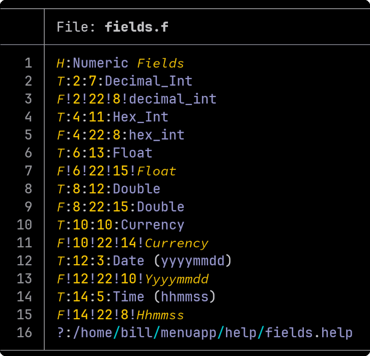
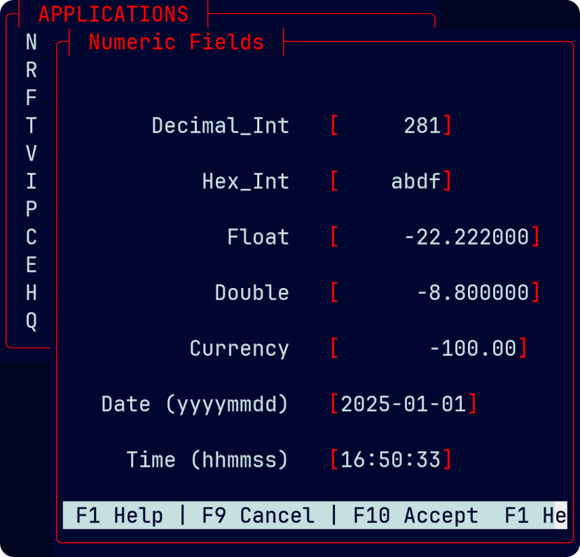

FORM displays data entry forms based on a description file. It allows
users to input data in a structured manner. The entered data can then be
processed by a specified command or script. Internally, the numeric
entries are converted to binary integer, long, float, or double.

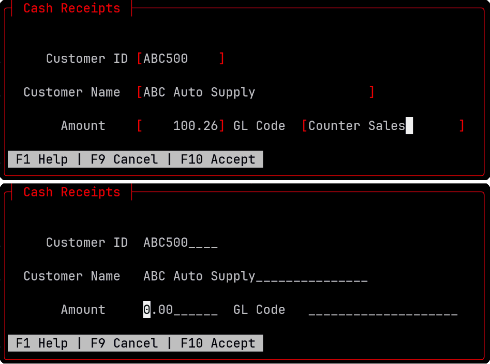

The two Cash Receipts entry forms above are identical except the top
form has field brackets turned on and the bottom form has fill
characters set to underscore. This is a simple configuration option
from the command line or the configuration file.

If you make a mistake, in the form description syntax, as I did below,
you will get a notification pinpointing the problem. In this message,
we can see that the format field on line 3 of "receipt.f" is invalid.

I have a "3", and it should have been "String". The corrected line
would be: "F!2!18!10!String".

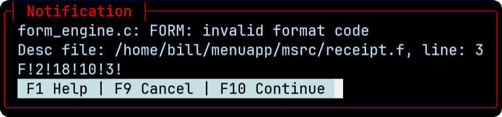

Need quick and easy Cash Receipts, General Journal, or wedding
invitation list? FORM has you covered. The application shown above took
about 10 minutes from design to test. It doesn't post transactions, or
keep running balances yet, but that's why we have people like you.

FORM also makes a great front-end for SQL database queries.

---

### Sample Menu Description File


As you can see, the description file is straightforward and easy to
read. Each menu item consists of a label and a command to execute. The
label is displayed in the menu, and the command is executed when the
user selects that item.

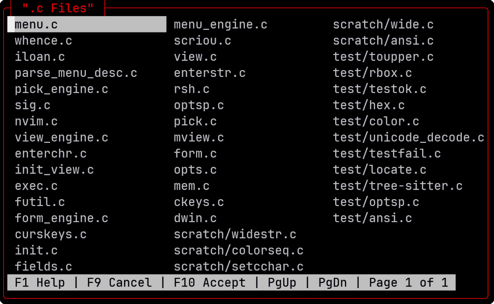

Here's just one example of how easy it is to create useful programs
with the C-Menu Form facility.

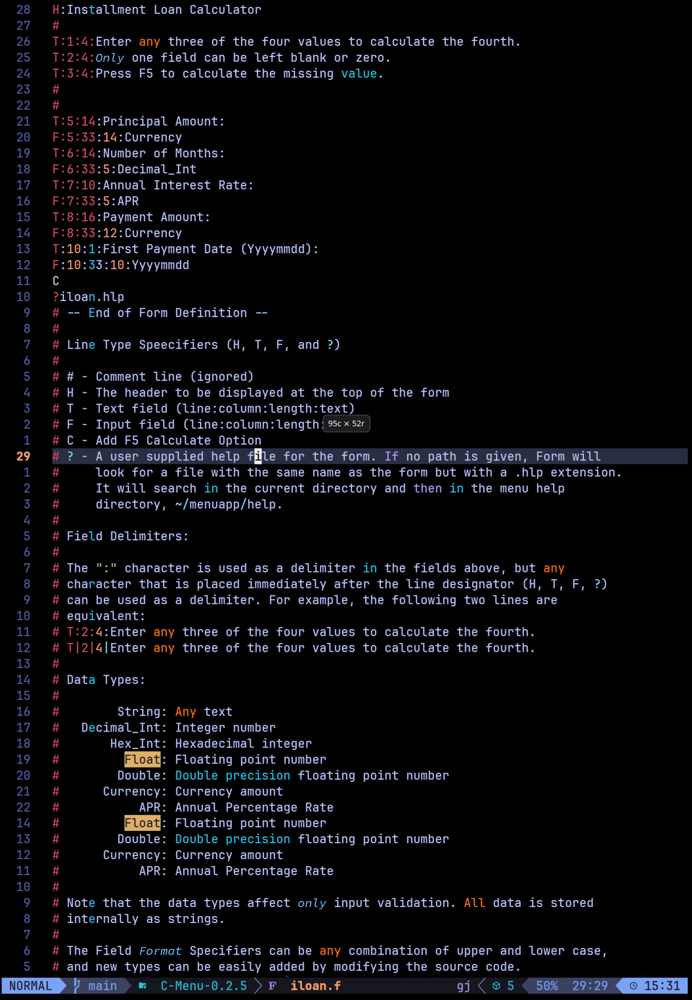

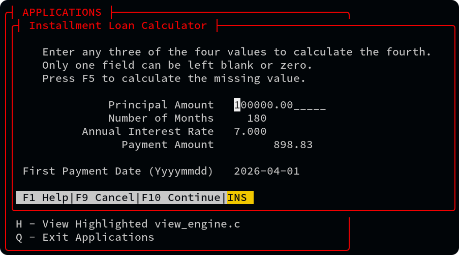
We hope you find C-Menu useful for your projects. It's a powerful tool
that can greatly simplify the process of creating text-based user
interfaces for your applications.

---

### View

VIEW is an easy-to-use text file viewer that allows users to view text
files in a terminal environment. It supports basic navigation, regular
expression search functionality, horizontal scrolling, ANSI escape
highlighting, Unicode, and NCurses wide characters. VIEW can be invoked
from within MENU, FORM, or PICK to provide contextual help or stand
-alone, full-screen as a system pager.

#### Log File With Editor

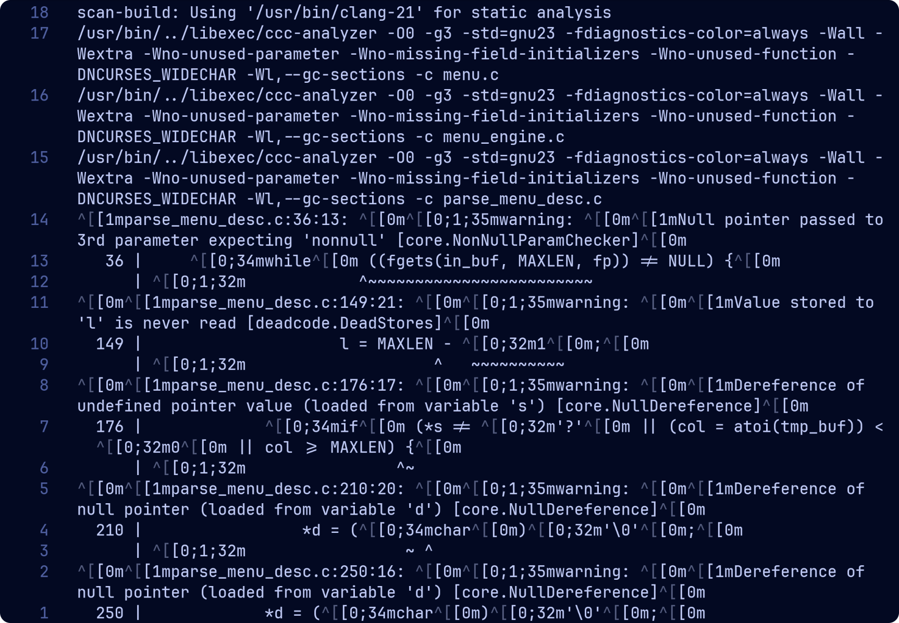

#### Screenshot of the Same File With View

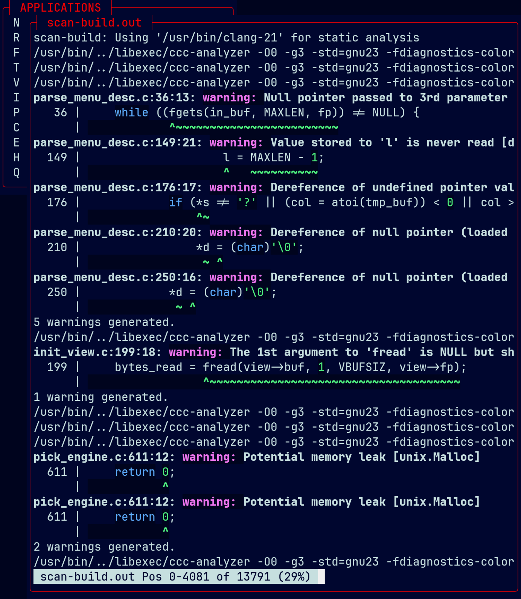
One especially useful feature of View is its incredible speed
with large text files, like system logs. View can open and
display multi-gigabyte text files almost instantaneously. Seek from
beginning to end of a 1 gigabyte file takes a few milliseconds.

---

### View and Color Manual Pages

To use View as your system pager, add the following line to your
shell configuration file (e.g., .bashrc or .zshrc):

```bash
export PAGER="view"
```

You can also filter manual pages through ~/menuapp/msrc/man.sed to
colorize underlined emboldened, and italicized text. This sed script is
included with C-Menu. To use it, you can run the following command in
your terminal:

```bash
man -Tutf8 bash.ls | sed -f ~/menuapp/msrc/man.sed | view
```

---

### Example Manual Page Using Editor

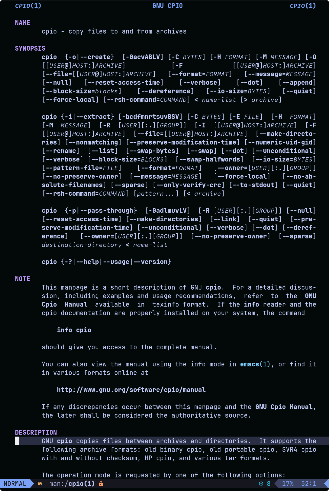

---

### Example Manual Page

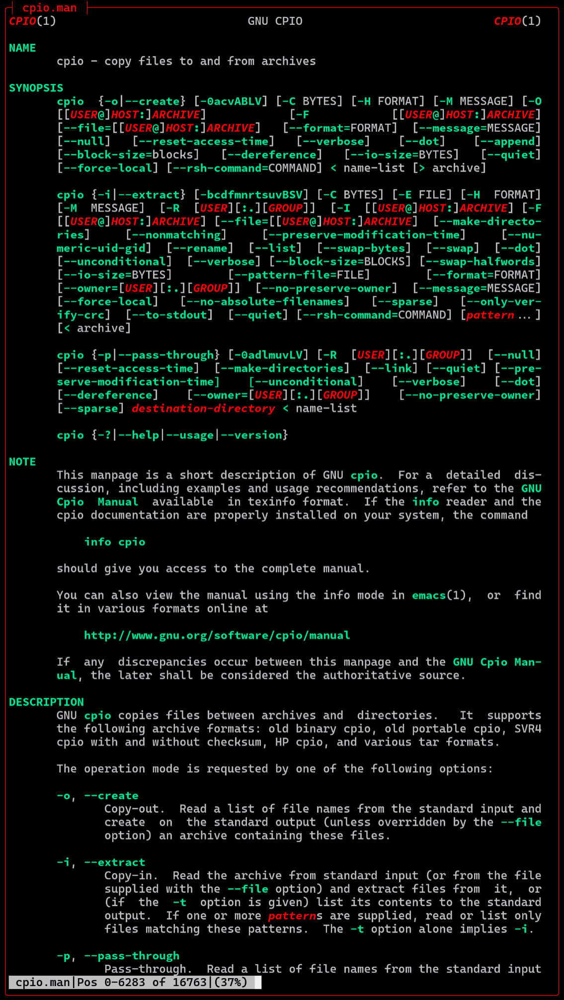

For the screenshot above, I used the "Man" command, which is a function
in my .bashrc.

```bash
Man() {
    man -Tutf8 "$@" | sed -f ~/menuapp/msrc/man.sed | view
}
```

This function formats the manual page for UTF-8 output, pipes
it through the colorizing sed script, and then opens it in View.

```sed
s/\[1m/\[36;1m/g
s/\[2m/\[35;2m/g
s/\[3m/\[33;3m/g
s/\[4m/\[31;3;1m/g
s/\[22m/\[22;0m/g
s/\[23m/\[23;0m/g
s/\[24m/\[24;0m/g
```

I don't know about you, but I find colorized manual pages much easier to
read. The different text styles help to distinguish between various
elements, making it easier to find the information I need. I also modified
the underline ([4m]) to red-italics-bold ([31;3;1m) because I find that
easier to read.

---

### Demand Paged Virtual Address Space

- View doesn't employ seek and read operations in a complicated
  buffering scheme. There is a better way.
- View accesses files as arrays, using the Kernel's
  sophisticated demand paged virtual memory.
- Lazy loading means that View doesn't waste time seeking,
  reading, and populating buffers that will never be used.
- Zero-Copy I-O - Conventional programs copy file buffers into heap
  address space. View bypasses that step and reads directly from
  the Kernel's virtual memory.
- Simplicity - View has no reads, no seeks, no complicated
  buffer management schemes, not for view. The following snippet includes

"all" of View's file I-O on lines 22 and 12.

---

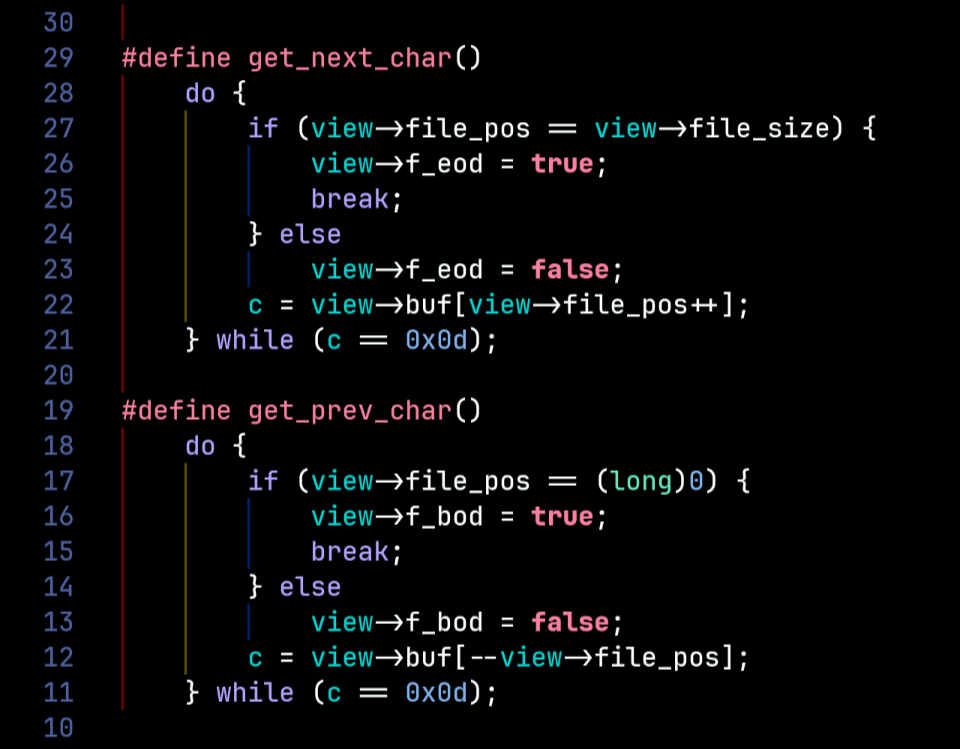
In technical parlance, I'll explain precisely how it works. See if
you can follow me. 😁

View's File I-O subsystem does three things:

- Get the next byte,
- Get the previous byte, or
- Get a byte from a specified position

View is blazingly fast because it leverages the Kernel's demand
paged virtual memory system. When a file is opened, View maps the
file into the process's virtual address space using the mmap system
call. Zero-copy I-O is achieved by mapping the file directly from
kernel address space.

When View needs to access a byte at a specific position, it
simply calculates the corresponding memory address based on the file
offset and reads the byte directly from that address. If the required
page is not already in memory, the Kernel automatically handles the
page fault by loading the necessary data from the file into memory.
This approach eliminates the need for explicit read and seek
operations, and copying data to the processes memory, resulting in
faster access times and reduced overhead.

---

### View - Other Features

Horizontal scrolling for long lines. View writes output to a
virtual screen, a Ncurses pad, to accommodate lines longer than the
physical screen.

View has full support for Unicode, translating ASCII text and
multi-byte-sequences to wide characters (wchar_t), and wide characters
and ANSI SGR sequences to complex characters (cchar_t). The complex
characters combine displayable characters plus attributes, such as
bold, italic, underline, reverse, and foreground and background colors.
NCurses can display more than 16 million colors.

View supports mouse wheel vertical scrolling.

---

### 3-Channel Gamma Correction

When using utilities such as "tree-sitter highlighter", "pygmentize",
or "bat" to highlight files, the text is sometimes almost unreadable.
On the left-hand side of the following screenshot, "less" does a great
job of rendering the output of pygmentize, but with gamma
correction can do better. It's all about perceptual luminosity. Either
from the command line or the minitrc file, the user can specify a gamma
correction value for each of the three color channels, red, green, and
blue. It's a minor thing, really, but we programmers aren't
"automatons" A pleasing visual appearance makes work funner.

In the right-hand image below, gamma has been increased for red, green,
and blue.

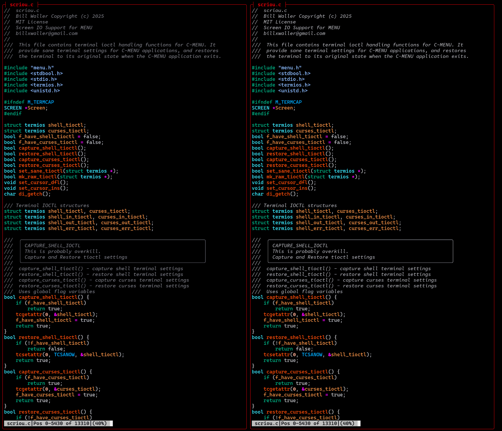

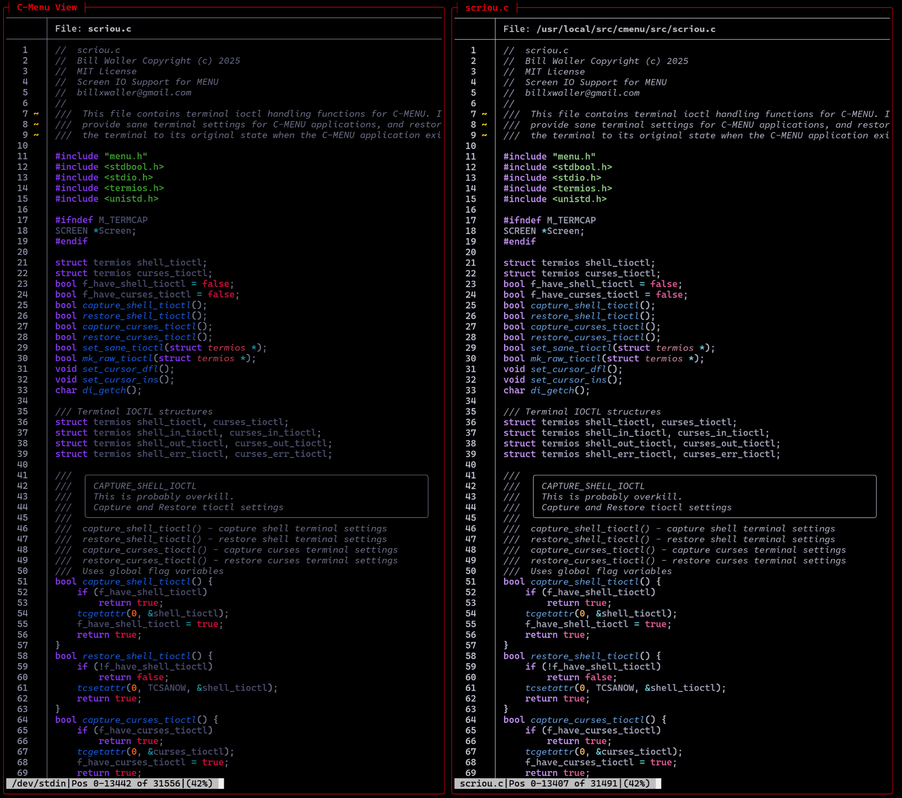
The image on the left, above is a source file highlighted with bat. It
seems a little dark and difficult to read. No problem. Crank up the gamma
in View and Winner Winner Chicken Dinner!

---

### Gray Gamma

Gray gamma, as you might guess, applies to shades of gray, colors in which
red, green, and blue components are of equal value.

[Bezold-Brücke hue shift](https://pubmed.ncbi.nlm.nih.gov/6534013/)
[Web Content Accessibility Guidelines (WCAG) 2.2](https://www.w3.org/TR/WCAG22/)

---

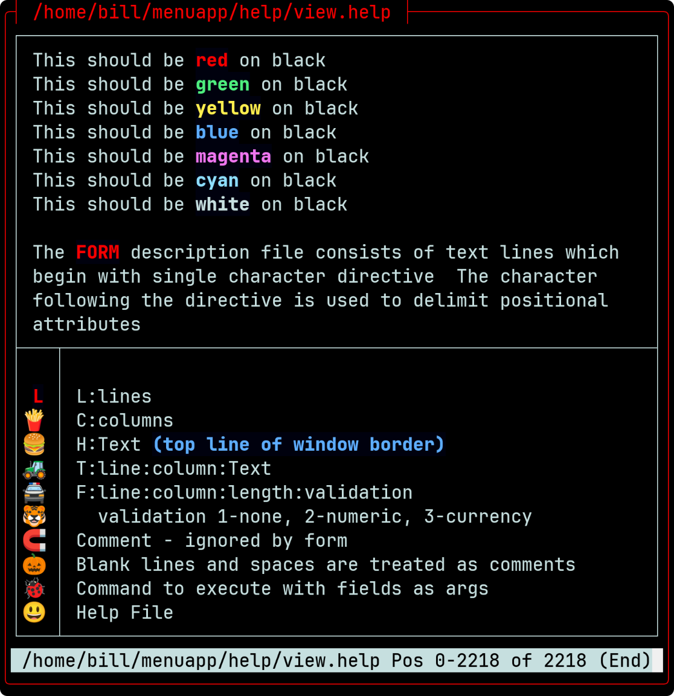

- That's a Bobby Dazzler

(Australian TV show)

With Unicode glyphs, ANSI escape highlighting, and 3-Channel gamma
correction, your application is bound to **Wow** your clients. Nobody
wants an ugly program. Of course, beauty is in the eye of the beholder.
That's why we give you control.

---

## C-Menu Documentation

An idiom is a saying that means more than the sum of its words, such as, "A picture is worth a thousand words." Nevertheless, words are sometimes necessary to fully interpret a complex image. The same is true for software documentation. A picture can show you how to use a program, but it can't always explain the underlying concepts and features. That's why we have comprehensive API documentation to accompany C-Menu, providing detailed explanations of its internal components, features, and usage.

Granted, our documentation is developer-centric, but it is our hope that developers will
bridge the gap between C-Menu developers and end-users by creating user-friendly interfaces,
providing us with the criticism and feedback we need to make C-Menu more accessible and
functional for a wider audience.

Here's just one thing we have done that probably won't matter to end-users, but
is important to developers. We have documented the internal components of C-Menu, including
the Menu, Form, Pick, View, RSH, and C-Keys programs. This documentation includes detailed explanations of the design and implementation of each component, as well as examples of how to use them effectively in your applications.

When writing code using the C-Menu API, you can access this documentation directly from your
editor. For example, if you're using Neovim, you can hover over a function or variable and
press Shift-K to view the relevant documentation in a pop-up window. This allows you to
quickly reference the documentation without having to leave your coding environment, making
it easier to understand and utilize the features of C-Menu as you develop your applications.

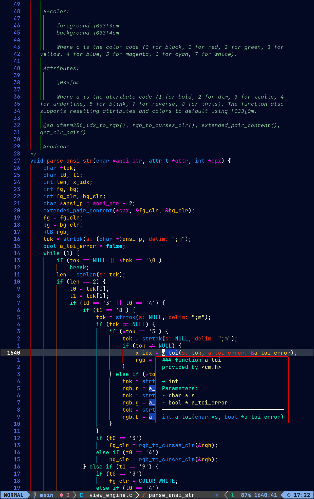


---

## RSH

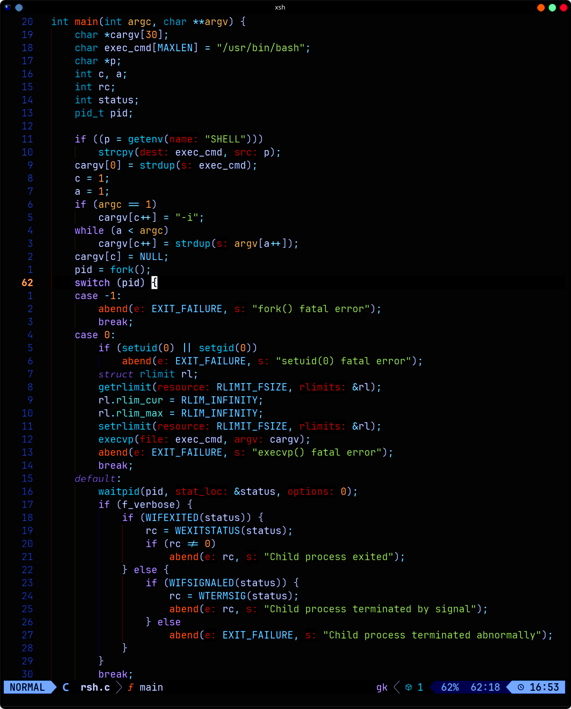

Despite its name, RSH is not a shell. It is a shell runner, which
allows you to specify your shell of choice, and provides a consistent
environment for running shell scripts and commands. RSH was designed
to be invoked from within MENU, FORM, or PICK to execute commands
that require elevated privileges, but its functionality extends
beyond that.

You can execute commands in either user or root mode, making it
a versatile tool for developing application front-ends. RSH ensures
that your scripts and executables run in a controlled environment,
reducing the chances of unexpected behavior due to differing shell
environments. RSH forks and waits for its spawn to complete before
returning control to the calling program. When executed under
C-Menu's signal handler, it catches and displays the exit status of
the command, allowing for better error handling. Instead of using
su -c or sudo to run commands as root, you can use rsh -c to achieve
the same result in a more streamlined manner. You can literally have
root access within a fraction of a second, making it ideal for work
that requires frequent switching between user and root modes for
various administrative tasks.

Many system administrators and developers find RSH invaluable for tasks
that require elevated privileges. RSH eliminates the need to repeatedly
enter passwords or switch users, streamlining workflows and improving
efficiency. We all know it's not a good idea to run everything as
root, but sometimes a user want's to avoid precious seconds it takes to
enter passwords for su. With RSH, it takes three keystrokes to enter
root mode and two keystrokes to get out.

### Maintaining Security with RSH

Here's an example of the proper way to use RSH.

1. Type "xx" to assume root privileges.
2. Type "make install"
3. Type "x" to relinquish root privileges.

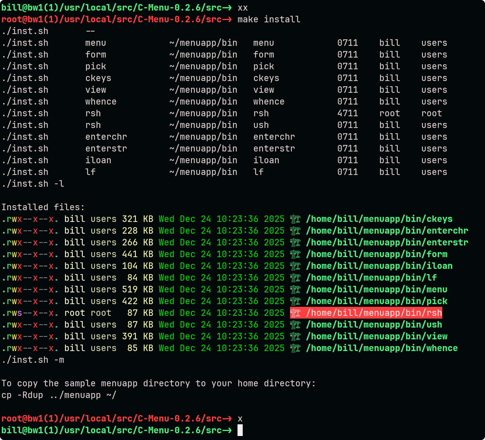
Notice that the bash prompt changes from green to red as a reminder
that you are wielding a loaded gun with the safety off. In this state,
it only takes a minor typo. You mean to type "rm -r tmp/\*", but
inadvertently put an extra space after tmp. I can't even type the resulting expression.

```bash
rm -r tmp/*
```

Be very careful when using RSH in setuid root mode. Keep the executable
protected in your home directory with appropriate permissions to
prevent promiscuous access by unauthorized users. RSH should be
provided only to trusted users who understand the implications of
executing commands with elevated privileges. Used inappropriately, it
can lead to system instability or security vulnerabilities.

RSH is as safe or unsafe as we choose to make it. It requires root
access to install, and the installer should make sure it cannot be used
by other users. If you are reading this, you know how to do that.
Please use it responsibly.

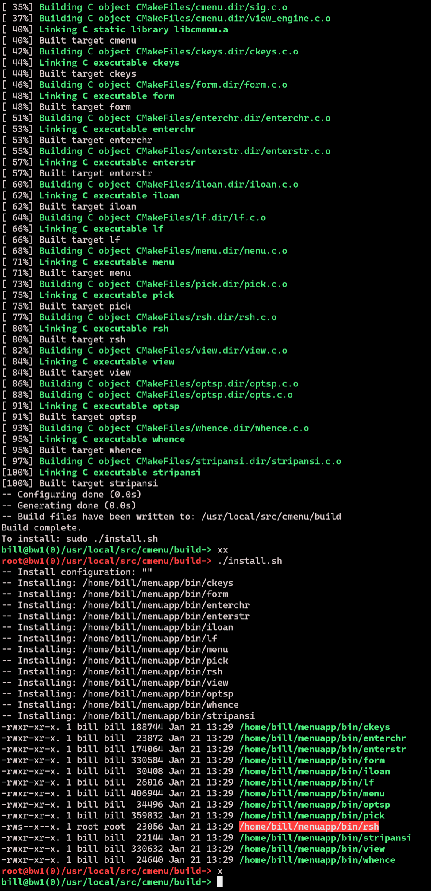

You will notice that the build was completed under normal user privileges. Only
the install portion required root access. We typed "xx" to assume root
privileges, installed the package, and then immediately reverted to normal
user access by typing "x".

---

## Features

Create and manage multiple menus, forms, and pickers

Define interfaces using simple configuration files

Perfect for shell scripting, command-line, and terminal based applications

Made for Linux and Unix-like operating systems

Blazingly fast, even on older hardware

Text-based user interface (TUI) using ncurses

Easily customize menu options and actions

Any level of sub-menus

Navigation using keyboard inputs the way God intended

Configurable appearance and behavior

Cross-platform compatibility

MIT License - Open-source and free to use

---

## Configuration

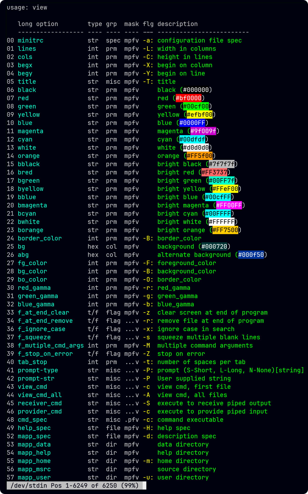

User's can have multiple runtime configurations. In the snippet above,
the standard ISO 6429 / ECMA-48 colors have been redefined and orange
has been added.

---

## MIT License

```md
MIT License

Copyright (c) 2025 William Dudley (Bill) Waller

Permission is hereby granted, free of charge, to any person obtaining a copy
of this software and associated documentation files (the "Software"), to deal
in the Software without restriction, including without limitation the rights
to use, copy, modify, merge, publish, distribute, sublicense, and/or sell
copies of the Software, and to permit persons to whom the Software is
furnished to do so, subject to the following conditions:

The above copyright notice and this permission notice shall be included in all
copies or substantial portions of the Software.

THE SOFTWARE IS PROVIDED "AS IS", WITHOUT WARRANTY OF ANY KIND,
EXPRESS OR IMPLIED, INCLUDING BUT NOT LIMITED TO THE WARRANTIES
OF MERCHANTABILITY, FITNESS FOR A PARTICULAR PURPOSE AND
NONINFRINGEMENT. IN NO EVENT SHALL THE AUTHORS OR COPYRIGHT
HOLDERS BE LIABLE FOR ANY CLAIM, DAMAGES OR OTHER LIABILITY,
WHETHER IN AN ACTION OF CONTRACT, TORT OR OTHERWISE, ARISING
FROM, OUT OF OR IN CONNECTION WITH THE SOFTWARE OR THE USE OR
OTHER DEALINGS IN THE SOFTWARE.
```
