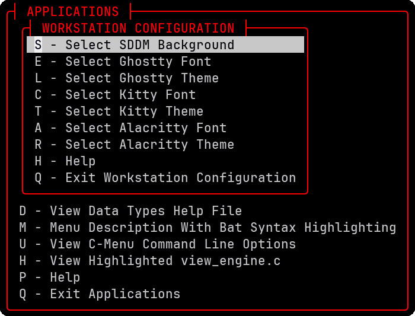
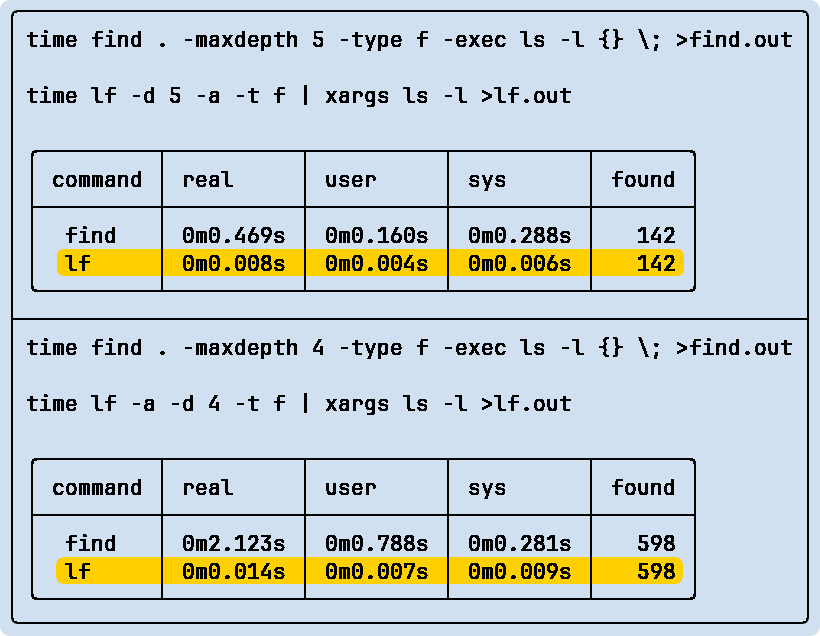

# Introduction

The following is a very brief introduction to the C-Menu Toolkit and only covers
a very tiny fraction of its features and capabilities. For more detailed information, please refer to the html documentation at:

[decision-inc.com](https://decision-inc.com)

With the C-Menu Toolkit, you can quickly and easily develop menu-driven user
interfaces to give your applications a professional look and feel. The main
components are:

**_Menu_** - Hierarchical menus



**_Form_** - On-screen forms for entering, editing, validating, processing, and submitting data. Notice the chyron at the bottom of the screen, which provides helpful instructions and feedback to the user. Of course, all C-Menu components provide navigation by mouse and keyboard, and in many cases by the standard h, j, k, and l keys that programmers are accustomed to.


**_Pick_** - Lists objects for user selection

**_View_** - A pager for viewing large files with highlighting, Unicode support, line numbering, regular expression searching and a large virtual pad for horizontal scrolling. View works great with tree-sitter, source-highlight, pygments, bat, manual pages, and other syntax highlighters. It can strip the ansi codes from files for convenient editing.


**_RSH_** - RSH provides an alternative to su and sudo for executing commands with elevated privileges. It allows developers and system administrators to get in and out of root shells and execute commands with root privileges without the need for a password, for example, by authenticating with an ssh key as you do on gethub.

In the following example, make install requires root privilege, so the user types xx, is authenticated with an ssh key, and then types make install. When the make install is finished, the user types x to exit the root shell and relinquish root privilege.


- The Green prompt indicates user privilege, and Red indicates root privilege.

**_lf_** - A "regular expression" file finder that's a smaller, easier-to-use, and much faster alternative to the Unix find command. The following is an actual benchmark of lf vs find for searching directories. Admittedly, the benchmarks appear hyperbolic, but they are real and reproducible. You may have to run the benchmarks a few times to believe the performance of lf.



**_API_** - A C library that provides a simple and consistent interface for creating menu-driven user interfaces in C. The API includes tools specific to C-Menu, but also many general purpose tools that can be used in a wide range of applications. The API documentation is available in html and integrated into Neovim's completion engine, making it easy for developers to learn and use the API effectively.


All of the C-Menu binaries, including executables and libcm.so are less than 350k, a tiny footprint for such powerful tools, and no GUI is required. The only dependencies are the GNU C Library, GNU Math Library, NCursesw, and a terminal emulator. That makes C-Menu especially well suited for rescue, embedded, server, development, and other resource-constrained environments, where the overhead of a graphical user interface would be counter-productive.

Oh, and C-Menu is free, distributed under the MIT License.

Are you ready to get started? Below, you will find several options for installing C-Menu on your Linux system. I haven't yet provided a packaged binary distribution, but that will be coming soon in version 0.3.0.

Choose the option that best suits your needs and follow the instructions to get C-Menu up and running on your system.

---

## C-Menu Binaries for Linux x86_64

1. Download the binary distribution, C-Menu-0.2.9-Linux-x86_64.xz.

2. cd to the directory where you downloaded the file and extract it using the following command:

```bash
tar -xf C-Menu-0.2.9-Linux-x86_64.xz
```

This will create a directory named menuapp containing the extracted files.

3. Configure your environment to use the C-Menu binaries and libraries:

Prepend the C-Menu bin directory to your PATH environment variable by adding the following line to your shell profile (e.g., ~/.bashrc or ~/.zshrc). Assuming you extracted the menuapp directory to your home directory, the line would look like this:

```bash
export PATH="$HOME"/menuapp/bin:"$PATH"
```

4. Start C-Menu by running the following command in your terminal:

```bash
menu
```

## Build C-Menu from Source

```bash
gh repo clone BillWaller/C-Menu
```

2️⃣ Copy the menuapp directory to your desired location:

```bash
cp -r C-Menu/src/menuapp /home/yourusername/
```

---

#### RSH Static Linking

C-Menu uses dynamic linking by default, but if you plan to use rsh in a rescue environment where dynamic linking may not be available, you can statically
link rsh during the build. To do this, set the `RSH_LD` environment variable to `-static` before building C-Menu:

```bash
export RSH_LD="-static"
```

CMake or Makefile will strip symbols from the executable once it has been copied
to its destination directory. This is done to reduce the size of the executable and improve performance.

**_NOTE_** If you choose to statically link rsh, make sure that your C compiler and linker support static linking and that you have the necessary static libraries,
specifically, libc.a, installed on your system. Static linking can increase the size of the executable and may have implications for compatibility and security, so be sure to test the statically linked version of C-Menu in your target environment.

Most distributions provide static libraries for the GNU C Library (glibc) as part of their development packages. You may need to install additional packages to obtain these static libraries, such as `glibc-static` or `libc6-dev` for glibc.

---

#### Prerequisites

- One of:
  - CMake 3.20 or higher, or
  - GNU Make 4.3 or higher
- A C compiler that supports C23 or later (e.g., GCC 13 or later, Clang 15 or later)
- NCursesw development libraries 6.5 or later
- GNU GLIBC development files
- GNU Math Library (libm) development files

---

#### Option 1 - Build C-Menu Using CMake Directly

1️⃣ Navigate to the C-Menu/src directory, create a build directory, and
cd into it:

```bash
cd C-Menu/src
mkdir build
cd build
```

2️⃣ Configure the project using CMake, specifying the installation prefix and build type:

```bash
cmake -DCMAKE_INSTALL_PREFIX="$HOME"/menuapp -DCMAKE_BUILD_TYPE=Release ..
```

3️⃣ Build the project using:

```bash
make
```

4️⃣ . If you want to use rsh in setuid mode, you must install C-Menu with root
privileges.

```bash
sudo make install
```

go to [Finish the installation](#finish-the-installation) below to complete the installation process.

---

#### Option 2 - Build C-Menu with Provided Scripts

1️⃣ Navigate to the C-Menu/build directory and run the provided build script:

```bash
cd C-Menu/build
./build.sh
```

2️⃣ Assume root privileges to install C-Menu:

```bash
sudo ./install.sh
```

go to [Finish the installation](#finish-the-installation) below to complete the installation process.

---

#### Option 3 - Build C-Menu Using Makefile

1️⃣ . Navigate to the C-Menu/src directory and edit the provided Makefile
to set the installation PREFIX to your desired location (e.g., /home/yourusername/menuapp):

```bash
cd C-Menu/src
```

```Makefile
USER=yourusername
GROUP=yourgroup
HOME=/home/$(USER)
PREFIX=/home/$(USER)/menuapp
```

2️⃣ Build the project using:

```bash
make
```

3️⃣ Assume root privileges to install C-Menu:

```bash
sudo make install
```

Continue with [Finish the installation](#finish-the-installation) below to complete the installation process.

---

### Finish the installation

1️⃣ Vrify that the C-Menu libraries and binaries have been installed to the correct directories (e.g., /home/yourusername/menuapp/lib64 and /home/yourusername/menuapp/bin) and that the permissions are set correctly.

```bash
ls -l "$HOME"/menuapp/lib64 "$HOME"/menuapp/bin
```


2️⃣ Register the C-Menu libraries with the dynamic linker by running the following command:

```bash
sudo ldconfig -v "$HOME"/menuapp/lib64
```

3️⃣ Add the C-Menu bin directory to your PATH environment variable by adding the following line to your shell profile (e.g., ~/.bashrc or ~/.zshrc):

```bash
export PATH="/home/yourusername/menuapp/bin:"$PATH"
```

(replace /home/yourusername with the actual path to your menuapp directory) and save the file. 😆

4️⃣ Copy the sample minitrc from the C-Menu/menuapp directory to your home directory:

```bash
cp "$HOME"/menuapp/minitrc "$HOME"/.minitrc
```

5️⃣ Edit the ~/.minitrc file to customize your C-Menu configuration as needed.

```bash
vi ~/.minitrc
```

6️⃣ Source your shell profile to apply the changes to your PATH:

```bash
source ~/.bashrc
```

7️⃣ Start C-Menu by running the following command in your terminal:

```baah
menu
```


## 🐸 Enjoy using C-Menu! If you encounter any issues or have questions, feel free to open an issue on the C-Menu GitHub repository.
