# C-Menu - A User Interface Toolkit


## Table of Contents

<!-- mtoc-start -->

- [Introduction](#introduction)
- [Menu - Hierarchical Menus](#menu---hierarchical-menus)
- [Form - On Screen Forms](#form---on-screen-forms)
- [Pick - Object Selection](#pick---object-selection)
- [View - A pager for viewing files](#view---a-pager-for-viewing-files)
- [RSH - A Root Shell Alternative](#rsh---a-root-shell-alternative)
- [lf - A Regular Expression File Finder](#lf---a-regular-expression-file-finder)
- [C-Menu API](#c-menu-api)
- [C-Menu API Completions in Neovim](#c-menu-api-completions-in-neovim)
- [Summary - Performance and Footprint](#summary---performance-and-footprint)
- [Other documentation](#other-documentation)
- [C-Menu Binaries for Linux x86_64](#c-menu-binaries-for-linux-x86_64)
- [Build C-Menu from Source](#build-c-menu-from-source)
  - [RSH Static Linking](#rsh-static-linking)
    - [Prerequisites](#prerequisites)
    - [Option 1 - Build C-Menu Using CMake Directly](#option-1---build-c-menu-using-cmake-directly)
    - [Option 2 - Build C-Menu with Provided Scripts](#option-2---build-c-menu-with-provided-scripts)
    - [Option 3 - Build C-Menu Using Makefile](#option-3---build-c-menu-using-makefile)
  - [Finish the installation](#finish-the-installation)
- [🐸 Enjoy using C-Menu! If you encounter any issues or have questions, feel free to open an issue on the C-Menu GitHub repository](#-enjoy-using-c-menu-if-you-encounter-any-issues-or-have-questions-feel-free-to-open-an-issue-on-the-c-menu-github-repository)

<!-- mtoc-end -->

**_NEW_** You may be interested in a new, but incomplete series of C-Menu
documents that are being developed in parallel with the documentation on the website. The documents in this series are intended to provide a more concise and focused overview of C-Menu's features and capabilities, and to serve as a quick reference guide for users who want to get up and running with C-Menu quickly. The documents in this series include:

[C-Menu Menu Performance](C-Menu-Performance.md)

## Introduction

C-Menu is a tool-set that gives you the ability to quickly and easily build functional, intuitive, and attractive applications with a minimal footprint. Because C-Menu is terminal-based, it is perfect for resource constrained environments such as embedded, server, SOC, IOT, DEVOPS, CI/CD pipelines, and terminal enthusiasts, or any other situations in which a GUI might be impractical or undesirable.

For comprehensive html documentation, please refer to the website:

[decision-inc.com](https://decision-inc.com)

---

## Menu - Hierarchical Menus

In typical use, C-Menu requires only a few lines of code to create hierarchical menus with multiple levels of sub-menus. The Applications Menu contains an eclectic set of selections designed to demonstrate the diversity of the C-Menu toolkit.

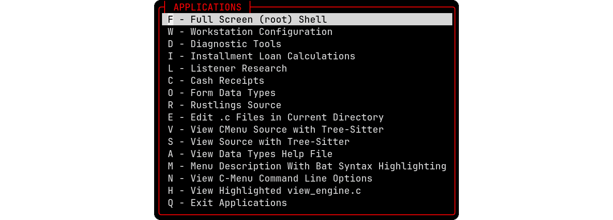

C-Menu is highly customizable, and provides a wide range of options for creating unique and engaging interfaces. The help screens below show some of the options available for customizing the appearance and behavior of C-Menu's components.

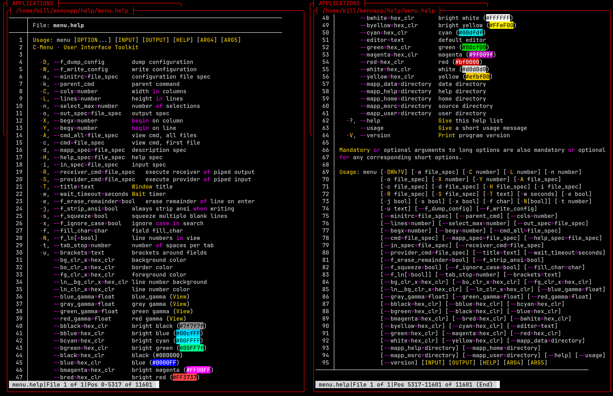

---

## Form - On Screen Forms

Enter, edit, validate, process, and submit data. Notice the chyron at the bottom of the screen, which provides helpful instructions and feedback to the user. Of course, all C-Menu components provide navigation by mouse and keyboard, and in many cases by the standard h, j, k, and l keys that programmers are accustomed to.

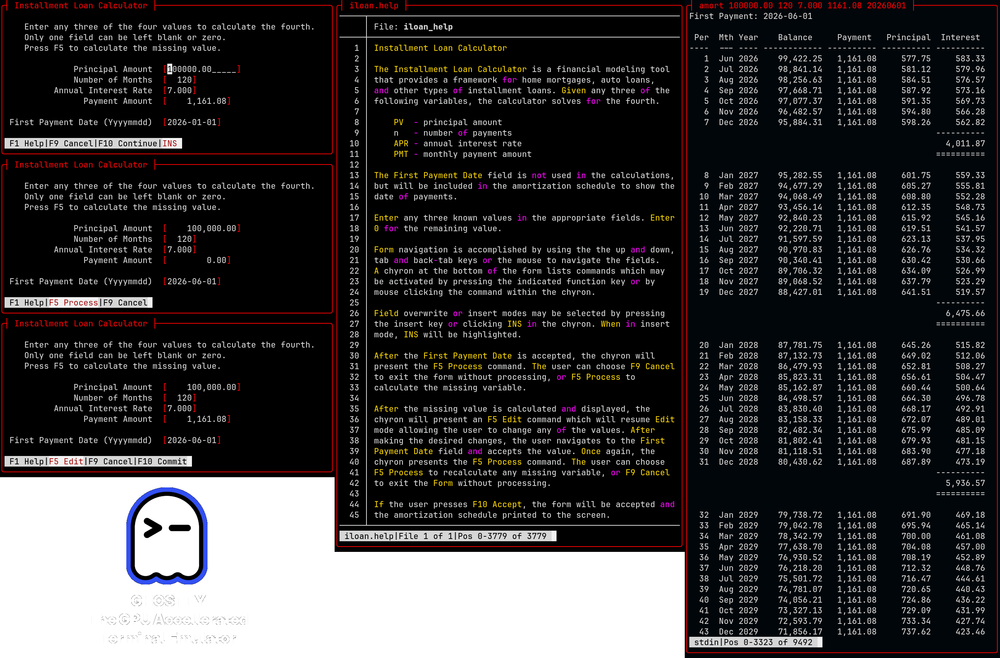

---

## Pick - Object Selection

The image below shows how pick works with C-Menu's lf (lightweight find) to select files in a directory. The screen on the left is the first to appear, and it shows the
output of lf. In the bottom window, the user can refine the list of files by
entering a search expression, and as the user types each character, Pick updates
the list of files in real time. When you find the file you want, you can select
it with the mouse, or use the arrow keys to move the highlighted bar to the file
and press space bar to select it. Pick is fun to use and it's lightning fast,
even with huge lists of objects. Pick is a great way to navigate and select
files, users, network connections, and other objects in your applications.

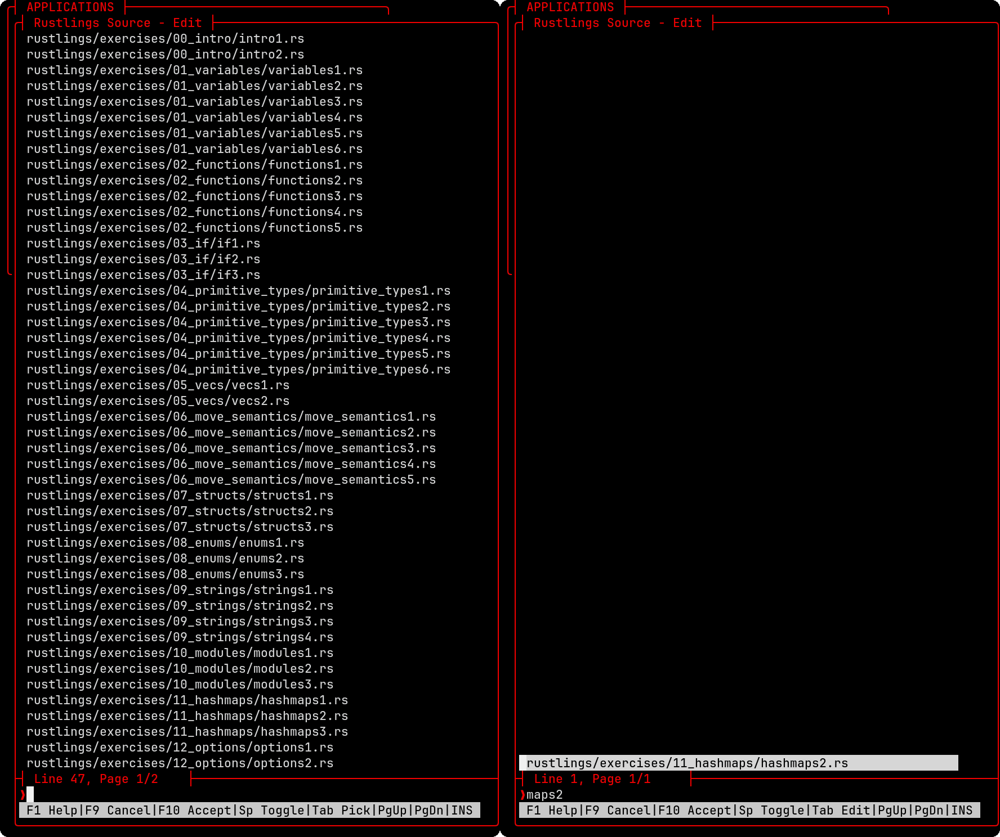
To duplicate the above screenshots:

```bash
pick -S project_src -n 1 -T "Select Project Source to Highlight" -c "view -L 60
-C 85 -S \"tree-sitter highlight %%\""
```

- Press the tab key to activate the line editor.

- Type "test" and watch the list of files update in real time.

- Press the tab key again to deactivate the line editor and return to the file list.

- Use the arrow keys to move the highlighted bar to the file you want to view.

- Press the space bar to select it.

- The command specified with the -c option will be executed with the selected
  file as an argument, and the output will be displayed in view with the
  specified options.

Now, want to see something really cool? In the line editor window, try to type "text" or some other string that doesn't match any files. In the dataset shown above, there are no files that match "tex", so Pick responds as you type "te", but refuses to accept the letter "x" because it would result in an empty list. When you use the backspace key, the Pick engine reverses and repopulates the object selector's with the previous list of files. This is just one example of the intuitive and responsive features built into C-Menu.

---

## View - A pager for viewing files

View has Unicode support, line numbering, regular expression searching, and a
large virtual pad for horizontal scrolling. View works great with tree-sitter,
source-highlight, pygments, bat, manual pages, and other syntax highlighters.
View doesn't alter the file you are viewing. It uses the highlighter in a
pipe, and reads the output, so the original file is never changed. And, if
you happen to have a file that has been highlighted by another application,
view can strip the ANSI codes for convenient editing. View is lightning fast,
especially with huge log files.

Why is View so fast? Even if an application has a super-fast buffering scheme,
it still has to wait on the kernel to provide data, and then copy data into it's
own buffers, duplicating work the Kernel has already done. Why waste the time
and memory? To be fair, we must appreciate that many applications were written
before direct accesses to the Kernel's demand paged virtual address space was
available. Whatever the reason, View takes advantage of direct-to-Kernel memory
mapped files to achieve maximum performance, reliability, and resource economy.
If you work with large datasets, you will love view. No fluff, no bloat, no
nonsense, just blazing fast performance.

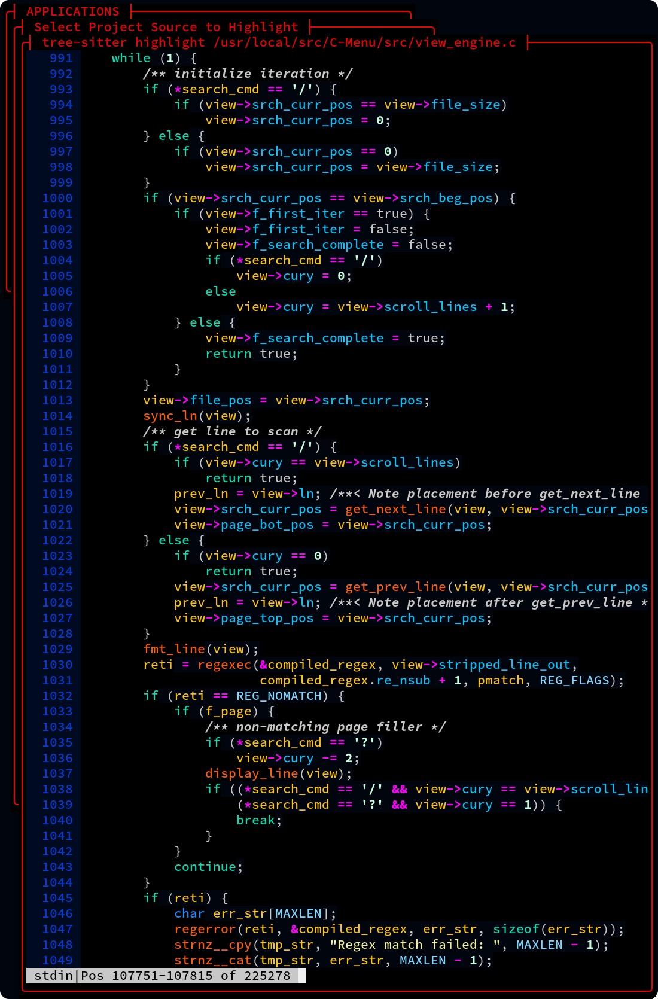

---

## RSH - A Root Shell Alternative

**_RSH_** - RSH provides an alternative to su and sudo for executing commands
with elevated privileges. It allows developers and system administrators to
get in and out of root shells and execute commands with root privileges
without the need for a password, for example, by authenticating with an ssh
key as you would on gethub.

In the following example, make install requires root privilege, so the user
types xx, is authenticated with an ssh key, and then types make install.
When the make install is finished, the user types x to exit the root shell
and relinquish root privilege.

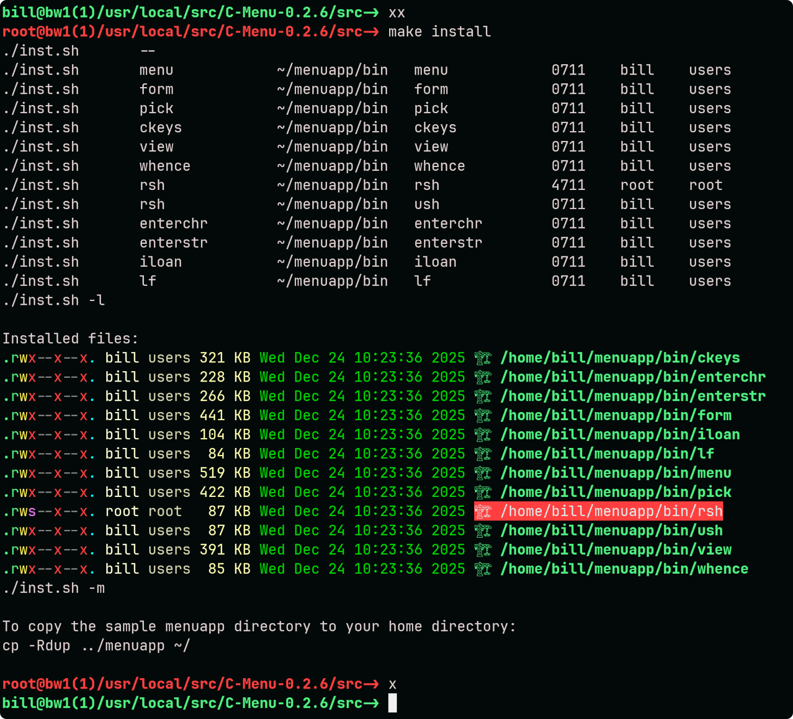

- The Green prompt indicates user privilege, and Red indicates root privilege.

---

## lf - A Regular Expression File Finder

**_lf_** - is a sleek, easy-to-use, and fast alternative to the Unix find command. The name, lf, can be thought of in the imperative sense as "list files", or in the noun sense, "lightweight find."

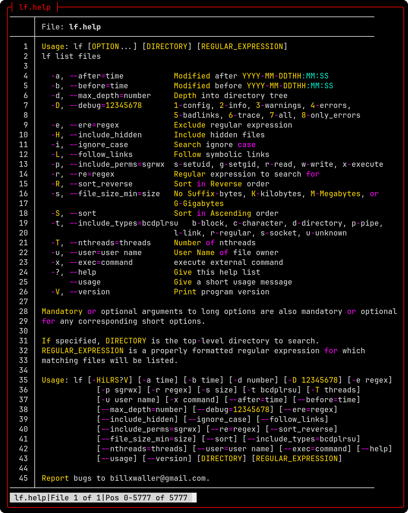

The screenshot above is the help output of lf piped through bat and displayed in
View.

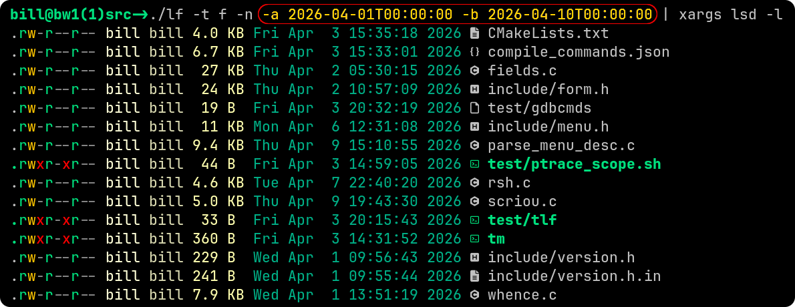

The screenshot above is an example of how you might use the date-time options
of lf to list files between two date-times (after and before) and the sample
output. We believe you will find this format intuitive and easy to use.

The following is an actual benchmark of execution times for lf and find. The
find and lf commands, approximate common usage, and produce identical results.

```bash
time find . -maxdepth 9 -type f -regex '.*\.[ch]$' > find.out

real    0m0.975s
user    0m0.728s
sys     0m0.243s

time lf -a -d 9 -t f '.*\.[ch]$' > lf.out

real    0m0.632s
user    0m0.425s
sys     0m0.207s
```

Verify that the output files are identical:

```bash
wc -l find.out lf.out

  2489 find.out
  2489 lf.out
  4978 total
```

The results show that lf is about 35% faster than find in this benchmark, and
the output files are identical.

Next, we will add "-exec ls -l {} \;", a common use of find, and see how that
affects performance. The resulting benchmarks are so extreme, they may strain
credulity at first, but they are real and easily reproducible. Just run lf and
find commands on your system in a variety of directories.

Note: There have been some changes to lf's options since these benchmarks were
run, specifically.

- The -a (List hidden files) has been replaced with -n (Don't list hidden
  files), so that the default behavior is more like find, thus mitigating the
  probability of confusion.

- The default maximum depth for lf was 3 as that was convenient for
  development, but otherwise it didn't make sense. The default maximum depth
  for lf is now 0, which means no limit, and thus more consistent with find.

```bash
time find . -maxdepth 5 -type f -exec -l {} \; >find.out
time lf -a -d 5 -t f | xargs ls -l >lf.out
```

```bash
wc -l find.out lf.out
```

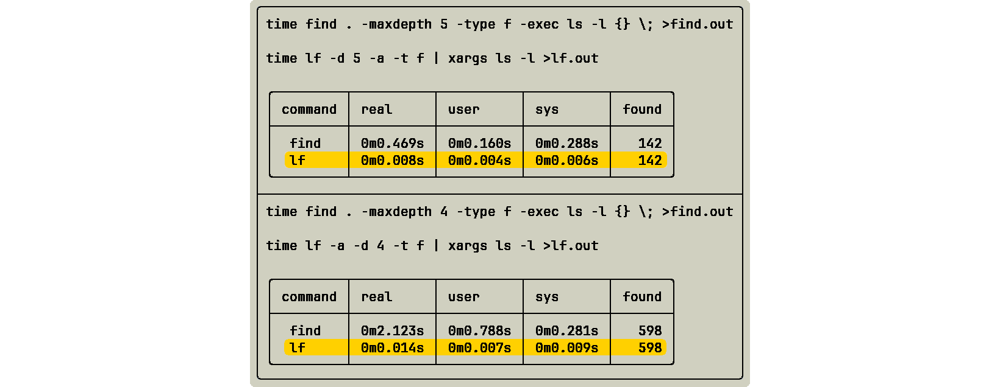

---

## C-Menu API

**_API_** - C-Menu provides a simple and consistent API for creating menu-driven
user interfaces in C. The API includes tools specific to C-Menu, but also many
general purpose tools that can be used in a wide range of applications. The API
documentation is available in html and integrated into Neovim's completion
engine, making it easy for developers to learn and use the API effectively.

---

## C-Menu API Completions in Neovim


C-Menu's API documentation is integrated into Neovim's completion engine, providing developers with easy access to API information and examples while they code. This integration allows developers to quickly look up function signatures, parameter descriptions, and usage examples without leaving their coding environment, enhancing productivity and making it easier to learn and use the C-Menu API effectively.

Hopefully, you will not find this plug for Neovim, LazyVim, and Lazy.Nvim too gratuitous as they are not prerequisites for C-Menu. Nevertheless, they do add considerably to the development experience. The screen below is the LazyVim dashboard in Neovim.

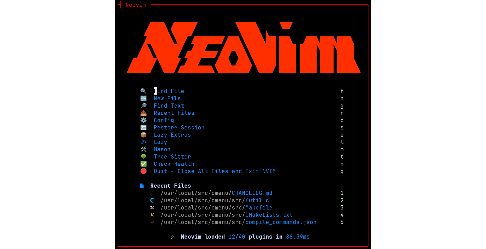

---

## Summary - Performance and Footprint

All of the C-Menu binaries, including executables and libcm.so are less than
350k, a tiny footprint for such powerful tools, and no GUI is required. The
only dependencies are the GNU C Library, GNU Math Library, NCursesw, and a
terminal emulator.

Oh, and C-Menu is free, distributed under the MIT License.

Are you ready to get started? Below, you will find several options for
installing C-Menu on your Linux system. I haven't yet provided a packaged
binary distribution, but that will be coming soon in version 0.3.0.

Choose the option that best suits your needs and follow the instructions to get
C-Menu up and running on your system.

---

## Other documentation

- [Comprehensive HTML Documentation](https://decision-inc.com)
- [API Reference](docs/API.md)
- [Augmentation](docs/extras.md)
- [CHANGELOG](docs/CHANGELOG.md)
- [Exercises](docs/exercises.md)
- [Frequently Asked Questions](docs/FAQ.md)
- [Overview](docs/OVERVIEW.md)
- [ROADMAP](docs/ROADMAP.md)
- [User Guide](docs/C-Menu-UG.md)
- [Valgrind / Memory Checking](docs/valgrind.md)

---

## C-Menu Binaries for Linux x86_64

- Download the binary distribution, C-Menu-0.2.9-Linux-x86_64.xz.

- cd to the directory where you downloaded the file and extract it using the following command:

```bash
tar -xf C-Menu-0.2.9-Linux-x86_64.xz
```

This will create a directory named menuapp containing the extracted files.

- Configure your environment to use the C-Menu binaries and libraries:

Prepend the C-Menu bin directory to your PATH environment variable by adding the following line to your shell profile (e.g., ~/.bashrc or ~/.zshrc). Assuming you extracted the menuapp directory to your home directory, the line would look like this:

```bash
export PATH="$HOME"/menuapp/bin:"$PATH"
```

- Start C-Menu by running the following command in your terminal:

```bash
menu
```

---

## Build C-Menu from Source

```bash
gh repo clone BillWaller/C-Menu
```

- Copy the menuapp directory to your desired location:

```bash
cp -r C-Menu/src/menuapp /home/yourusername/
```

---

### RSH Static Linking

C-Menu uses dynamic linking by default, but if you plan to use rsh in a rescue
environment where dynamic linking may not be available, you can statically
link rsh during the build. To do this, set the `RSH_LD` environment variable
to `-static` before building C-Menu:

```bash
export RSH_LD="-static"
```

CMake or Makefile will strip symbols from the executable once it has been copied
to its destination directory. This is done to reduce the size of the executable
and improve performance.

**_NOTE_** If you choose to statically link rsh, make sure that your C compiler
and linker support static linking and that you have the necessary static
libraries, specifically, libc.a, installed on your system. Static linking
can increase the size of the executable and may have implications for
compatibility and security, so be sure to test the statically linked version
of C-Menu in your target environment.

Most distributions provide static libraries for the GNU C Library (glibc) as
part of their development packages. You may need to install additional
packages to obtain these static libraries, such as `glibc-static` or
`libc6-dev` for glibc.

---

#### Prerequisites

- One of:
  - CMake 3.20 or higher, or
  - GNU Make 4.3 or higher
- A C compiler that supports C23 or later (e.g., GCC 13 or later, Clang 15 or later)
- NCursesw development libraries 6.5 or later
- GNU GLIBC development files
- GNU Math Library (libm) development files

---

#### Option 1 - Build C-Menu Using CMake Directly

- Navigate to the C-Menu/src directory, create a build directory, and
  cd into it:

```bash
cd C-Menu/src
mkdir build
cd build
```

- Configure the project using CMake, specifying the installation prefix and build type:

```bash
cmake -DCMAKE_INSTALL_PREFIX="$HOME"/menuapp -DCMAKE_BUILD_TYPE=Release ..
```

- Build the project using:

```bash
make
```

- If you want to use rsh in setuid mode, you must install C-Menu with root
  privileges.

```bash
sudo make install
```

- go to [Finish the installation](#finish-the-installation) below to complete
  the installation process.

---

#### Option 2 - Build C-Menu with Provided Scripts

- Navigate to the C-Menu/build directory and run the provided build script:

```bash
cd C-Menu/build
./build.sh
```

- Assume root privileges to install C-Menu:

```bash
sudo ./install.sh
```

- go to [Finish the installation](#finish-the-installation) below to complete
  the installation process.

---

#### Option 3 - Build C-Menu Using Makefile

- Navigate to the C-Menu/src directory and edit the provided Makefile
  to set the installation PREFIX to your desired location
  (e.g., /home/yourusername/menuapp):

```bash
cd C-Menu/src
```

```Makefile
USER=yourusername
GROUP=yourgroup
HOME=/home/$(USER)
PREFIX=/home/$(USER)/menuapp
```

- Build the project using:

```bash
make
```

- Assume root privileges to install C-Menu:

```bash
sudo make install
```

- Continue with [Finish the installation](#finish-the-installation) below
  to complete the installation process.

---

### Finish the installation

- Vrify that the C-Menu libraries and binaries have been installed to the
  correct directories (e.g., /home/yourusername/menuapp/lib64 and
  /home/yourusername/menuapp/bin) and that the permissions are set correctly.

```bash
ls -l "$HOME"/menuapp/lib64 "$HOME"/menuapp/bin
```

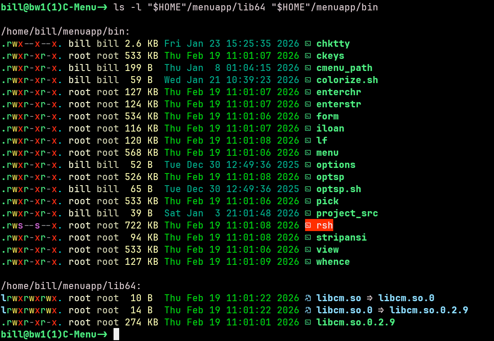

- Register the C-Menu libraries with the dynamic linker by running the
  following command:

```bash
sudo ldconfig -v "$HOME"/menuapp/lib64
```

- Add the C-Menu bin directory to your PATH environment variable by adding the
  following line to your shell profile (e.g., ~/.bashrc or ~/.zshrc):

```bash
export PATH="/home/yourusername/menuapp/bin:"$PATH"
```

(replace /home/yourusername with the actual path to your menuapp directory) and
save the file. 😆

- Copy the sample minitrc from the C-Menu/menuapp directory to your home directory:

```bash
cp "$HOME"/menuapp/minitrc "$HOME"/.minitrc
```

- Edit the ~/.minitrc file to customize your C-Menu configuration as needed.

```bash
vi ~/.minitrc
```

- Source your shell profile to apply the changes to your PATH:

```bash
source ~/.bashrc
```

- Start C-Menu by running the following command in your terminal:

```bash
menu
```

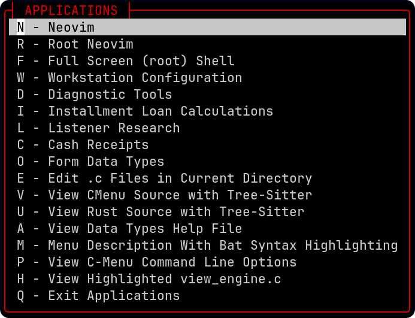

## 🐸 Enjoy using C-Menu! If you encounter any issues or have questions, feel free to open an issue on the C-Menu GitHub repository
