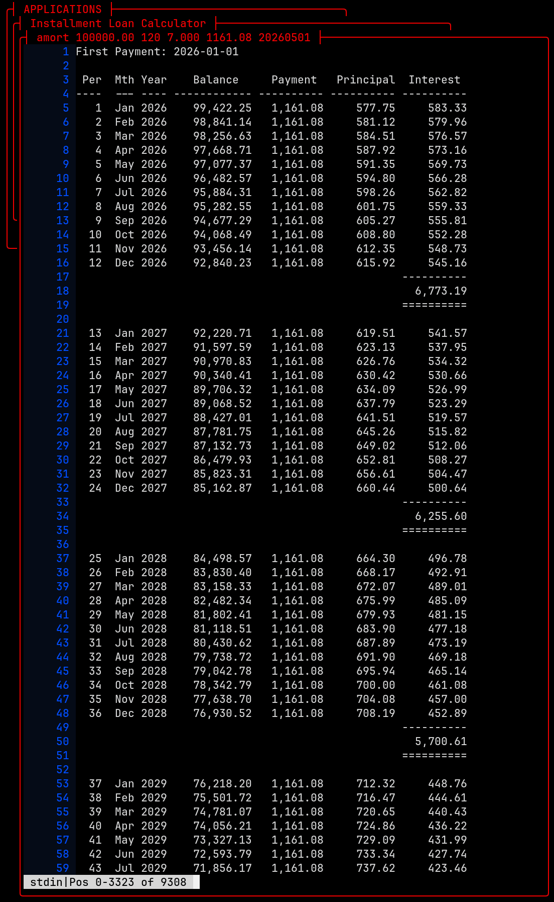

<!-- mtoc-start -->

- [Other C-Menu Documentation](#other-c-menu-documentation)
- [C-Menu Overview](#c-menu-overview)
  - [C-Menu Features](#c-menu-features)
  - [C-Menu Start-up Options](#c-menu-start-up-options)
- [C-Menu Menu](#c-menu-menu)
- [Menu Line-by-Line Breakdown](#menu-line-by-line-breakdown)
  - [Title Line](#title-line)
  - [Text Lines](#text-lines)
  - [Sub-Menus](#sub-menus)
- [C-Menu Form](#c-menu-form)
  - [Description File](#description-file)
    - [Text](#text)
    - [Fields](#fields)
    - [Directives](#directives)
  - [Examples](#examples)
    - [Installment Loan Calculations](#installment-loan-calculations)
    - [Cash Receipts](#cash-receipts)
- [C-Menu Pick](#c-menu-pick)
  - [Rustlings Source](#rustlings-source)
  - [Edit .c Files in Current Directory](#edit-c-files-in-current-directory)
  - [View C-Menu Source With Tree-Sitter](#view-c-menu-source-with-tree-sitter)
- [C-Menu View](#c-menu-view)
- [RSH - A Root Shell Alternative](#rsh---a-root-shell-alternative)
- [lf - A Regular Expression File Finder](#lf---a-regular-expression-file-finder)
- [Sneakey Optimization Techniques](#sneakey-optimization-techniques)

<!-- mtoc-end -->

## Other C-Menu Documentation

[API](docs/API.md)

[CHANGELOG](docs/CHANGELOG.md)

[USER GUIDE](docs/C-Menu-UG.md)

[AUGMENTATION](docs/extras.md)

[FREQUENTLY ASKED QUESTIONS](docs/FAQ.md)

[INSTALLATION](docs/INSTALL.md)

[PERFORMANCE](docs/Performance.md)

[VALGRIND](docs/valgrind.md)

[C-Menu HTML Documentation](https://decision-inc.com)

## C-Menu Overview

C-Menu is a toolkit of software components that can be assembled like Legos to create intuitive and responsive applications.

C-Menu's building blocks are purpose-built, optimized, and highly customizable, allowing developers to create unique and engaging interfaces with minimal investment of time and effort. C-Menu's components include Menu, Form, Pick, View, RSH, lf (lightweight find), and C-Keys (a keyboard and mouse diagnostic tool). These components can be used to create a wide range of applications, from simple command-line tools to complex workflows.

Because C-Menu is written in C and terminal-based, it is super-fast and has a minimal footprint. C-Menu requires only a Linux kernel and the standard C library, it is perfect for resource constrained environments such as embedded applications, servers, IOT, and SOC.

### C-Menu Features

- All C-Menu components provide navigation by mouse and keyboard, and in many cases by the standard h, j, k, and l keys that programmers are accustomed to.

- C-Menu's building-block approach allows you to integrate C-Menu internals, external applications, scripts, and executables in a seamless way. For example, you can use C-Menu Form to create a form-based interface for data entry and validation, and then use an external executable to process the form data and display the results in a C-Menu View window.

- C-Menu's configuration file, ~/.minitrc, allows you to set default options for all C-Menu components, such as color schemes, key bindings, and field settings. This allows you to create a consistent look and feel across all your applications and optimize the user experience.

- Auto sizing and resizing: By default, C-Menu's components, Menu, Form, Pick, and View open in pop-up windows overlaying the calling C-Menu window. If you don't specify window geometry, or if you specify window geometry that is inappropriate, C-Menu will apply an auto-sizing algorithm to determine the optimal window size and position based on the content being displayed and the current terminal size. C-Menu View responds to terminal resize events, dynamically adjusting its size and position to maximize the space available.

- The built-in F1 Help facility allows you to create context-sensitive help for
  your application, which can be ordinary text or custom highlighted text with Unicode support.

### C-Menu Start-up Options

All of C-Menu's long options, shown as, --option_name, in the following screen can be
can be set on the command line or in the C-Menu configuration file, ~/.minitrc.
The "--" prefix is omitted in the configuration file. Options commonly used on the command line also have a single-letter short option equivalent. Command line options override configuration file options, allowing you to customize the behavior of your applications on a per-instance basis.


## C-Menu Menu


The menu above is intended to demonstrate a variety of features and techniques that can be applied to your projects. It is not meant to be a practical menu for everyday use, but rather a showcase of what is possible with C-Menu. Think of yourself as an artist and C-Menu as your canvas. What will you create?

Below is an example of source defining the above menu. This is the part you design as the top-level framework for your application. C-Menu uses a building-block approach to integrate C-Menu internals, external applications, scripts, and executables, as you will see in just a moment. C-Menu includes a set of useful and powerful components you assemble like Leggos to create innovative software products. C-Menu's main components include Menu, Form, Pick, View, RSH, lf, and C-Keys, each of which will be explained in detail in the following sections.

---

This section will break down Example C-Menu Applications and explain how they work from the perspective of a developer using C-Menu to build applications. With this understanding, you will be ready to create custom software products that are intuitive, uniform, dependable, flexible, appealing, and fast with a minimal footprint.


Lets examine the Menu source above and break down how it works. The source file is a simple text file that contains a series of User Choices and Commands.

Lines beginning with ":" are the User Choices.

Lines beginning with "!" are commands to be executed by Menu when the corresponding menu item is selected. These commands can be used to invoke internal C-Menu functions execute external commands, and run shell scripts.

---

## Menu Line-by-Line Breakdown

Lines beginning with '#" are comments.

### Title Line

The first text line will be used as the Menu title to be displayed in the top
window border.

```bash
:                APPLICATIONS
```

---

### Text Lines

Subsequent lines beginning with ":" are menu choices that will be displayed in the menu.

The command line, beginning with "!" following each menu choice is executed when the corresponding menu item is selected.

We present these lines in pairs because that's how they work.

```bash
:     Full Screen (root) Shell
!exec rsh
```

---

### Sub-Menus

The following menu item specifies a menu description file,
"workstation_config.m", which will be loaded and displayed when the menu item is selected. This allows you to create nested menus and organize your application into multiple levels of menus.

```bash
:   Workstation Configuration
!menu workstation_config.m
```


---

Diagnostic Tools is another menu item that specifies a menu description file, "diag.m", which will be loaded and displayed when the menu item is selected. This demonstrates how you can create multiple menus for different purposes and link them together through menu items.

```bash
:   Diagnostic Tools
!menu diag.m
```


---

## C-Menu Form

Use C-Menu Form when you need to enter, edit, validate, process, and submit data.

The C-Menu form command specifies a description file which defines the on-screen
form.

### Description File


#### Text

Specification:

```bash
T:line:column:text
```

Example:

```bash
T:5:14:Principal Amount
```

Parameter 1 - "T" designates line type as text

Character 2 - ":" separator used to parse the remainder of the line

Parameter 2 - "5" form window line

Parameter 3 - "14" form window column

Parameter 4 - "Principal Amount" text to display in form window

---

#### Fields

Specification:

```bash
F:line:column:length:data_type
```

Example:

```bash
F:5:33:14:Currency
```

Parameter 1 - "F" designates line type as field

Character 2 - ":" separator used to parse the remainder of the line

Parameter 2 - "5" form window line

Parameter 3 - "33" form window column

Parameter 4 - "14" field length

Parameter 5 - "Currency" data type

---

#### Directives

Specification:

```bash
(C|G|Q)
```

"C" - specifies that the field is a calculated field, which means its value will be calculated by an external executable specified with the -S option in the form command line.

"G" - specifies that the field values are to be received from an external
program specified with the -S option.

"Q" - specifies that field values are to be provided by an external executable
specified with the -S option and parameterized with a key value for a query
operation.

---

### Examples

#### Installment Loan Calculations

Specification:

```bash
!form -d description_file  \
    [ -i input_file ] &| [ -S executable_provider ] &
    [ -o output_file ] &| [ -R executable_receiver ]
```

Example:

```bash
:     Installment Loan Calculations
!form iloan.f -i iloan.dat -S iloan -R "view -S \"amort %%\"" -o iloan.dat
```

The argument specified with option "-d" is the form description file. If no "-d"
option is specified, Form will attach the first non-option argument as its description file.

The form description file, "iloan.f", defines text and fields and their data types. See the Form Description File section above for details on how to define text and fields in the form description file.

The argument specified with option "-i" is the input file from which Form will
read initial field values. If no "-i" option is specified, Form will attach the second non-option argument as its input file.

-S iloan: specifies that the executable "iloan" will be run as a provider (source) of input to the form. Because iloan.f contains a line with the "G", getter directive, Form will display the form populated from the input file, "iloan.dat".

The first "-S" in the above example belongs to Form, and the second "-S" belongs
to View. The first "-S" directs Form to execute "iloan" and read form data from its standard output.

The "-R" option specifies a receiver executable, "view -S \"amort %%\""

The second "-S" belongs to View and directs it to execute "amort %%", substituting "%%" with the form data, and read the resulting data from its standard output to display in the View window.

The user can edit the form data and press F10 Accept or F9 Cancel.

If the user presses F10 Accept, Form will execute "iloan" with form data as arguments. "iloan" will process the form data and write the resulting data to standard output. Form reads the resulting data from a pipe and displays the updated form data.

If a "-o" option was specified on the form command line, and the user presses F10 Accept again, the updated data will be written to the output file specified. The user may alternatively press F5 to go back into edit mode.

After iloan calculates new values for the form, the user may press F10 a second
time and Form will dispatch View with the data fields from the form.


iloan and amort are trivial applications to demonstrate how to use external executables
with C-Menu Form. For the purpose of demonstration, we shall designate the images above as 1) upper left, 2) upper right, 3) lower left, and 4) lower right.

Notice in window 4), I have set the field brackets in the configuration
file, ~/menuapp/.minitrc. The brackets tend to look good so long as you don't over-crowd the form with 10 or 15 fields on some lines.

**_Chyron_**

Also notice the chyron, the line at the bottom of the form window. It is
used to convey state information to the user and to present the user with a set
of relevant commands. In the Form windows 2) and 3) above, the chyron highlights
the most likely next steps for the user, which are F5 Process and F5 Edit
respectively. The user can select commands with the keys indicated or by
clicking the command with the mouse. For example, if the user clicks "INS" in
the chyron or presses the insert key, the field mode changes from overwrite to
insert and the "INS" in the chyron will be highlighted to indicate the current
field mode. Press insert or click "INS" again to toggle back to overwrite mode.

Here's the workflow for the Installment Loan Calculations menu item:

- The user selects the "Installment Loan Calculations" menu item, which executes the form command with the specified description file, iloan.f. Form opens the input file, iloan.dat, reads field data, and displays screen 1) it in the Form window. The user edits the data, changing the Principal Amount to $100,000. The user tabs down to the Payment Amount field and presses enter which erases the field above and to the right of the cursor. (this behavior is controlled by the setting --erase_remainder which is generally set in ~/menuapp/.minitrc) This sets the Payment Amount to zero. When finished editing, the user presses F10 Accept.

- Form displays Screen 2). Because a C, G, or Q directive is specified in the form description file, the chyron (the text line across the bottom of the form window) presents the user with a new set of commands, one of which is F5 Process. The user presses F5 Process, which executes the iloan executable with the form data as arguments.

- If any three of the data values are present and valid, iloan will calculate any remaining value which is set to zero and write the resulting data to standard output. Form displays Screen 3) with the resulting data. If the user enters all four values, iloan will simply output the data as received from Form without performing any calculations. The user can return to edit mode by pressing F5 Edit or F10 Accept to save the data to the specified output-file, iloan.dat.

- The user can experiment with the numbers in the form, running as many
  calculation cycles as necessary. When the user gets the desired results, and presses
  the F10 key, the following screen appears in View.



Of course, these are just demonstration programs, and the real magic doesn't
start until you start building your own projects with C-Menu.

---

#### Cash Receipts

**_Cash Receipts_** also works like Installment Loan Calculations, except no external
executable is specified to process data. Obviously, this menu item is not very
useful as it stands. It is included here as a challenge in some industrious
developer who can write external executables or scripts to provide database interaction and ancillary menu items to track deposit slips and batch numbers and post to general ledger.

```bash
:     Cash Receipts
!form receipt.f -i receipt.dat -o receipt.dat
```


The left hand Form window demonstrates the use of fill characters to signify allocated, but unpopulated field space. This is a setting that can be specified on the command line or in the C-Menu configuration file, ~/.minitrc.

Usage Examples:

```bash
# .minitrc
fill_character=_
fill_character=.
```

The right hand screen above demonstrates the use of brackets to enclose the
space for entering field data. This is also a setting that can be specified on the command line or in the C-Menu configuration file, ~/.minitrc.

```bash
# .minitrc
brackets=[]
brackets={}
```

---

## C-Menu Pick

C-Menu Pick displays a list of items from which the user can select.

Specification:

```bash
!pick [ -n maximum_number_of_selections ][-m] \
    [ -i input_file ][ -S executable_provider ] \
    [ -o output_file ][ -c executable %% ]
```

-n maximum_number_of_selections. "-n n" is a convenience which directs Pick to automatically accept selections when the specified maximum number of items, "n" have been selected. For example, "-n 1" is commonly used to direct Pick to automatically accept the first item selected without requiring the user pressing to F10 Accept key. This feature is designed to optimize the user's economy of motion, making the selection process extremely fast and efficient. When "-n 1" is specified, the user can simply select an item and Pick will immediately dispatch the specified action.

-c execute command substituting "%%" with the selected item(s). Whether the
command specified with the -c option is executed once per selection or once for
all selections is determined by the presence or absence of the "-m option". Without the "-m" option, by default, if multiple items are selected, the command specified with -c will be executed once for each selection with that selection as an argument.

-m multiple_arguments flag. The -m option directs Pick to construct a command line with all selections as individual arguments. The specified command is executed once with all selections combined as individual arguments on a single command line.

An example use case for "-m" would be if you wanted to open multiple files in
C-Menu View using View's ":n" and ":p" commands to navigate between files. In that case, you would specify "-m" to have Pick execute View once with all selected files as arguments, allowing you to use View's built-in file navigation features. The same technique works with Vim, nvim, and less.

-i input_file directs Pick to read input from the specified file

-S executable_provider directs Pick to execute the specified external command
and read input from the command's standard output. The command specified with the -S option is executed when starting Pick, and its output is used as the list of items from which selections are made.

-o output_file directs Pick to write selected items to the specified file when the user presses F10 Accept.

Pick must have exactly one input method, either -i input_file or -S executable_provider_command. Combining -o and -c options is permissible, and will direct Pick to write the list of selected items to the specified file and also pass the list of selected items to the command specified by -c according to the presence or absence of the -m option. The selections are written to file before executing the specified command, so the command can read the selections from the file if needed.

### Rustlings Source

Example:

```bash
:     Rustlings Source
!pick -S rust_src -n 1 -T "Rustlings Source - Edit" -c nvim %%
```

-S specifies a script, "rust_src", located in ~/menuapp/bin, which calls lf to
create a sorted file list.

Below are the contents of "rust_src", a shell script. We use a shell script here instead of direct execution because we need to pipe the output through sort. It's still fairly quick. The "lf" command generates a list of Rust source files from the "exercises" directory, which is part of the Rustlings project.

```bash
# @name rust_src
lf rustlings -d 5 'exercises.*\.rs$' | sort
```

The "-n 1" option directs Pick to proceed with executing the command specified
by the "-c nvim %%" option after 1 file is selected. If "-n 1" were not specified, Pick would wait for the user to press F10 Accept before executing the command specified by the "-c nvim %%" option.

The -c nvim %% substitutes the "%%" with the selected file and Pick executes  
nvim. If the "-n 1" option hadn't been specified, Pick would allow the user to
select multiple files and press F10 Accept to accept those selections. In that case, nvim would be executed with multiple files as arguments, and the user could use nvim's ":n" and ":p" commands to open the files selectively. The "-n" option can also be used to specify the maximum number of selections before Pick automatically accepts and launches the specified executable.

The use of "-S rust_src"" would be equivalent to "rust_src | pick" if we were
executing pick as a stand-alone executable. In this instance, Pick launches "rust_src" and creates a pipe to receive its output".


The center window above shows Pick as it appears just after selecting Rustlings Source in the Applications Menu.

The user presses tab to activate the line editor and types "maps2", the last few
characters of the exercise name, and the Pick window on the right appears. The
"maps2" expression filtered out all but one file name. The user doesn't need to
press enter to accept the filter expression because Pick updates the Pick window in real time as the user types.

At any time, the user can press tab to jump back to the selection window, and
select the desired file with the mouse or position the cursor on the desired
file and press spacebar to select. In this case, there is only one file listed,
so the user can simply press spacebar to select the file. Because the "-n 1"
option in the Pick command line directs Pick to automatically accept when the
user has selected the specified number of files.

So, the user presses tab, the cursor jumps to the only file listed, and the user presses the spacebar to open the selected file with nvim. If there had been more than one file listed, the user could select a file with the mouse, arrow keys, or j for down, k for up, and when the desired file is highlighted, and pressing spacebar to select. When using the mouse to select, it is not necessary to press the spacebar.

When finished editing in nvim, the user can type shift "zz" to exit. nvim closes, and the user is returned to the Pick window as it was before selecting the file. The user can press tab, backspace, 3, tab, spacebar, and nvim opens hashmaps3.rs, the next source file in the Rustlings sequence. This is a very quick and almost effortless way to step through the Rustlings exercises, but it can also apply to many other situations.

---

### Edit .c Files in Current Directory

Edit .c Files in Current Directory is an example of how to use C-Menu lf and Pick to
navigate and select files from a directory. Once a file is selected, it is passed to the nvim.sh script to be opened in Neovim. This demonstrates how you can integrate C-Menu with external applications and scripts to create a seamless user experience.

```bash
: Edit .c Files in Current Directory
!pick -S project_src -T "Project Tree - Select File to Edit" -c nvim.sh %%
```

Actually, the above command line is a good example of how to write inefficient
and unnecessary code. That's 100ms wasted each time you select that menu option. (-: :-) The nvim.sh script is not necessary. The command line could be written more efficiently as follows, which eliminates the need for an external script and directly opens the selected file in Neovim.

The command line below demonstrates the preferred method of starting nvim.

```bash
: Edit .c Files in Current Directory
!pick -S project_src -T "Project Tree - Select File to Edit" -c nvim %%
```

Also, if you have a situation in which the script, "project_src" could be
replaced by a direct command line, such as "lf -d 5 '.\*\.c$'", that would be more efficient than using an external script. The command line below demonstrates how to directly use the "lf" command to generate a list of .c files in the current directory and its subdirectories, without the need for an external script.

```bash
: Edit .c Files in Current Directory
!pick -S "lf -d 5 '.*\.c$'" -T "Project Tree - Select File to Edit" -c nvim %%
```

Look Mom! No scripts! Just direct command lines. This is the most efficient way to write your menu commands, but it may not always be the most practical or maintainable way, especially if you have complex command lines that are difficult to read and understand. In those cases, using shell scripts can help simplify your command lines and make them more readable and maintainable.

---

### View C-Menu Source With Tree-Sitter

View C-Menu Source with Tree-sitter demonstrates how to use shell scripts to
simplify complex command lines. The command line below uses a shell script , "tree-sitter highlight", to apply syntax highlighting to the selected source file using Tree-Sitter.

```bash
: View CMenu Source with Tree-Sitter
!pick -S project_src -n 1 -T "Select Project Source to Highlight" -c "view -L 60 -C 85 -S \"tree-sitter highlight %%\""
```


It is not necessary to use a filter expression in Pick. You can just as easily
mouse click the particular file you want to select. However, it comes in handy
when you have several pages of files.

This image of the View window has line numbers because f_ln is set to true in
the C-Menu configuration file. If you don't have f_ln set to true in the
configuration file, you can also use "-N" on the command line to enable line numbers. If you have f_ln set to true in the configuration file, and you don't want line numbers, you can specify "-Nf" on the command line to disable line numbers for that particular view instance.

---

## C-Menu View

View has Unicode support, line numbering, regular expression searching, and a
large virtual pad for horizontal scrolling. View works great with tree-sitter,
source-highlight, pygments, bat, manual pages, and other syntax highlighters.
View doesn't alter the file you are viewing. It uses the highlighter in a
pipe, and reads the output, so the original file is never changed. And, if
you happen to have a file that has been highlighted by another application,
view can strip the ANSI codes for convenient editing. View is lightning fast,
especially with huge log files.

Throughout C-Menu, and especially View, you will find many optimizations that
contribute to it's efficiency and speed. Traditionally, large file I-O has relied on user-space buffering schemes in which chunks of data are copied from mass storage into local buffers using seek and read operations. The application must keep track of buffer contents, manage buffer lifecycles, and handle edge cases such as partial reads, end-of-file conditions, and error handling. This approach can be complex, error-prone, and inefficient, especially when dealing with large files or high-throughput applications. C-Menu's view takes a different approach to large file I-O by leveraging the operating system's virtual memory management capabilities to provide direct access to file data through memory mapping. Instead of relying on user-space buffering, C-Menu's view provides a direct-to-kernel, demand paged, memory mapped virtual address space for file access. This eliminates the overhead and complexity associated with user-space buffering, and allows for more efficient and reliable access to large files. With C-Menu's view, applications can access any part of a multi-gigabyte file instantly without the need for copying data into user-space buffers or managing buffer lifecycles. This results in unmatched reliability and performance when working with large files, making C-Menu's view ideal for applications that require high-throughput file access or need to work with large datasets.

If you work with large datasets, you will love view. No fluff, no bloat, no
nonsense, just blazing fast performance.


---

## RSH - A Root Shell Alternative

**_RSH_** - RSH provides an alternative to su and sudo for executing commands
with elevated privileges. It allows developers and system administrators to
get in and out of root shells and execute commands with root privileges
without the need for a password, for example, by authenticating with an ssh
key as you would on gethub.

In the following example, make install requires root privilege, so the user
types xx, is authenticated with an ssh key, and then types make install.
When the make install is finished, the user types x to exit the root shell
and relinquish root privilege.


- The Green prompt indicates user privilege, and Red indicates root privilege.

---

## lf - A Regular Expression File Finder

**_lf_** - is a sleek, easy-to-use, and fast alternative to the Unix find command. The name, lf, can be thought of in the imperative sense as "list files", or in the noun sense, "lightweight find."


The screenshot above is the help output of lf piped through bat and displayed in
View.

C-Menu's lf (lightweight find) is an alternative to Unix find. Although Unix find is an extremely powerful tool, and it is not slow, it can be unwieldy at times (see the 40 page manual). It does everything you could want, but with unnecessary overhead and complexity. C-Menu's lf is smaller, faster, and easier to use than Unix find, yet covers most day-to-day use cases.

One of find's most often used features is the built-in -exec option, which executes a specified command on each file found. Conspicuously, lf does not have a built-in -exec option, and that is one of the first things people notice. However, lf achieves the same result, by piping the output of lf into xargs. Intuitively, it makes sense that find with its built-in exec option would be faster than lf using an external xargs command. We compared C-Menu's lf with xargs and find with its built-in -exec option. Both methods produced identical and accurate results.

time find . -maxdepth 5 -type f -exec ls -l {} \; >find.out

time lf -d 4 -t f | xargs ls -l >lf.out

| Command | real     | user     | sys      | files found |
| ------- | -------- | -------- | -------- | ----------- |
| find    | 0m0.469s | 0m0.160s | 0m0.288s | 142         |
| lf      | 0m0.008s | 0m0.004s | 0m0.006s | 142         |

time find . -maxdepth 4 -type f -exec ls -l {} \; >find.out

time lf -d 4 -t f | xargs ls -l >lf.out

| Command | real     | user     | sys      | files found |
| ------- | -------- | -------- | -------- | ----------- |
| find    | 0m2.123s | 0m0.788s | 0m0.281s | 598         |
| lf      | 0m0.014s | 0m0.007s | 0m0.009s | 598         |

As you can see, lf with xargs is significantly faster than find with its built-in -exec option. find, with its built-in exec option executes the specified command for each file found, which can be very inefficient when dealing with a large number of files. In contrast, using xargs allows you to execute the command on multiple files at once, which can significantly reduce the overhead and improve performance.

Even if lf wasn't faster than find, it would still be a compelling alternative due to its simplicity and ease of use. With fewer options and a more intuitive syntax, lf can be easier to learn and use for common file searching tasks.

Here's an example:


The screenshot above shows how you might use the date-time options of lf to list files between two date-times (after and before) and the sample output. We believe you will find this format intuitive and easy to use.

---

## Sneakey Optimization Techniques

**_View C-Menu Command Line Options_** is an example of a smart way to improve
and optimize your C-Menu applications. Instead of writing a complicated command line to display the C-Menu help file with syntax highlighting, highlight the file in advance and save the highlighted file as menu.help. Then, simply execute the view command directly, specifying the highlighted file as an argument. This is one of many ways to improve and optimize the applications you design with C-Menu. You will most likely miss opportunities for improvement and optimization on your first pass, and that's understandable. You want to finish the project. But, great software results from developers revisiting their own code and looking for opportunities for improvement and optimization.

Don't get distracted trying to write perfect code on the first pass. Get it working, and then polish it. The key is to prioritize using cost/benefit analysis. The cost is your time and the benefit is increased demand for your product. It's up to you to quantify that relationship, but generally, try to get the most bang for the buck and favor the least expensive (time consuming) improvements and optimizations. The more time a project takes, the more likely you are to suffer interruptions, breaking your continuity of thought. Once interrupted, your highly tuned mental context begins to fade immediately, and it takes time to reestablish.

The truth is that this particular optimization is anything but sneaky. The title
is just a little tongue-in-cheek. In fact, this optimization is obvious, and
anyone should have noticed it on the first pass. I didn't, and I was frankly a little
embarrassed when it was pointed out to me. The moral is that getting a second set of eyes on your code can vastly increase your chances to spot improvement and optimization opportunities you might have missed.

Why don't all developers do this? Given time, most do, but top developers often have such intense demands on their time, they often don't have the luxury of time to carefully review and optimize their code. But you, dear reader, are an artist and you have the time to create beautiful and efficient code that will make your applications spectacular.

```bash
: View C-Menu Command Line Options
!view -Nf -L66 -C75 ~/menuapp/help/menu.help
```


---

Finally, a super simple command line that does two things, it closes the
current menu and returns to the previous menu.

```bash
!return
```

---
