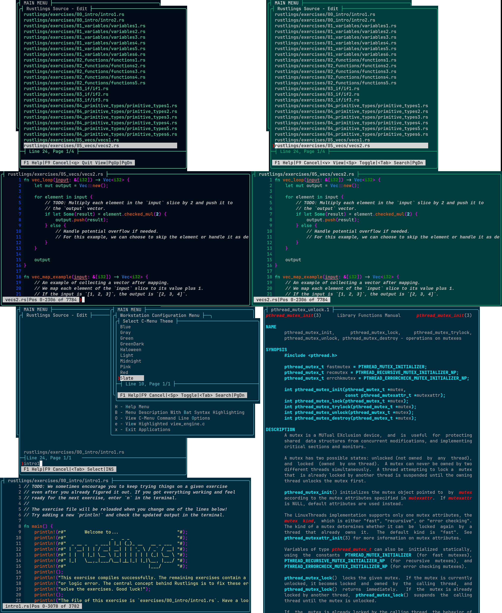

# C-Menu - How to Make Menus

<!-- mtoc-start -->

* [See Also](#see-also)
* [cmenu_chk](#cmenu_chk)
* [Starting C-Menu](#starting-c-menu)
* [C-Menu Start-up Options](#c-menu-start-up-options)
* [Menu Description File](#menu-description-file)
* [Menu Title](#menu-title)
* [Menu Selections](#menu-selections)
* [Full Screen (Root) Shell](#full-screen-root-shell)
* [Youtube (in Firefox)](#youtube-in-firefox)
* [C-Menu (in Ghostty)](#c-menu-in-ghostty)
* [HTOP (in Kitty)](#htop-in-kitty)
* [HTOP (in Ghostty)](#htop-in-ghostty)
* [Issue RSH Certificate](#issue-rsh-certificate)
* [Workstation Configuration](#workstation-configuration)
* [Diagnostic Utilities](#diagnostic-utilities)
* [Installment Loan Calculations](#installment-loan-calculations)
* [Cash Receipts](#cash-receipts)
* [Rustlings Source](#rustlings-source)
* [View Manual Pages](#view-manual-pages)
* [Edit C-Menu Description Files](#edit-c-menu-description-files)
* [View C-Menu Source with Tree-Sitter](#view-c-menu-source-with-tree-sitter)
* [View Source with Tree-sitter](#view-source-with-tree-sitter)
  * [View LSP Log](#view-lsp-log)
* [Help Menu](#help-menu)
* [Menu Description With Bat Syntax Highlighting](#menu-description-with-bat-syntax-highlighting)
* [View C-Menu Command Line Options](#view-c-menu-command-line-options)
* [View Highlighted view_engine](#view-highlighted-view_engine)
* [Exit Applications](#exit-applications)

<!-- mtoc-end -->

---




## See Also

[FAQ](docs/FAQ.md)

[Augmentation](docs/Augmentation_Guide.md)

[Overview](docs/OVERVIEW.md)

[Themes](docs/themes.md)

[Changelog](docs/CHANGELOG.md)

[Installation](docs/INSTALL.md)

[CMenu Manpage](docs/cmenu_manpage.md)

[Form Manpage](docs/form.md)

[Pick Manpage](docs/pick.md)

[View Manpage](docs/view.md)

[RSH Manpage](docs/rsh.md)

[LF Manpage](docs/lf.md)


---

## cmenu_chk

This Guide will examine the C-Menu Example Application Menu and explain how it works. By the time you finish reading this guide, you will have a good understanding of how to create your own menus using C-Menu.

Before getting started, you should run the cmenu_chk utility to check your C-Menu installation. This utility checks for the presence of required and optional dependencies for C-Menu. Before running C-Menu, you will need to correct any failures of the requirements listed. 

```bash
cmenu_chk
```

You should see output similar to the following:

```
Checking C-Menu requirements...
pass - CMENU_HOME/bin = /home/bill/menuapp/bin is a directory
pass - CMENU_HOME/bin = /home/bill/menuapp/bin is in PATH
pass - CMENU_SRC = /usr/local/src/C-Menu/src is a directory
pass - /home/bill/menuapp/bin/rsh setuid
pass - /home/bill/menuapp/bin/menu
pass - /home/bill/menuapp/bin/lf

Checking C-Menu optional dependencies...
pass - /home/bill/menuapp/bin/iloan
pass - /home/bill/menuapp/bin/amort
pass - /usr/bin/firefox
pass - /usr/bin/ghostty
pass - /usr/bin/htop
pass - /usr/bin/kitty
pass - /usr/bin/nvim
pass - /home/bill/.cargo/bin/rustup
pass - /home/bill/.cargo/bin/cargo
pass - /home/bill/.cargo/bin/rustc
pass - /home/bill/.cargo/bin/rustlings
pass - /home/bill/.cargo/bin/tree-sitter
pass - /home/bill/menuapp/bin/whence

Summary of checks:
All checks passed
```

If any of the optional dependencies fail, you can still run C-Menu, but some
menu selections may not work as expected. You can install the missing dependencies using your system's package manager or by following the installation instructions for each dependency in the C-Menu Augmentation Guide.

The only dependency that is somewhat difficult to install is the tree-sitter-cli, but it only takes a little persistence, patience, and a search engine to get it installed.
You can find the installation instructions for tree-sitter-cli in the C-Menu Augmentation Guide. It is well worth the effort.

---

## Starting C-Menu

Start the terminal emulator of your choice, and type:

```bash
menu
```

A menu similar to the following will be displayed:


The letters and characters on the left side of the menu are hotkeys that you can use to select menu items. You can use the arrow keys to move the reverse color selector bar up and down. Pressing enter will select the menu item in the reverse color bar. You can also select menu items by clicking on them with button1 on your mouse.

You may specify hotkeys by preceding the menu selection text with a hyphen followed by the character or glyph you want to use as a hotkey. If a hotkey is not specified, C-menu will assign the first character in the menu selection that has not already been reserved by assignment to another menu selection. C-Menu assigns hotkeys to menu selections in order, but letters assigned with the "-" dash are processed first, thus reserving those assignments.

The menu component of C-Menu is very easy to use and examples are the best way to learn. Get this section under your belt, and you will be ready to move on to the more advanced features of C-Menu. Form and Pick expand on the concepts introduced in this guide.

---

## C-Menu Start-up Options

All of C-Menu's long options, shown as, --option_name, in the following ../screen can be
can be set on the command line or in the C-Menu configuration file, ~/.minitrc.
The "--" prefix is omitted in the configuration file. Options commonly used on the command line also have a single-letter short option equivalent. Command line options override configuration file options, allowing you to customize the behavior of your applications on a per-instance basis.


## Menu Description File

Below is an example of source defining the above menu. This is the part you design as the top-level framework for your application.

This section will break down the Example C-Menu Applications Menu and explain how it works from the perspective of a developer using C-Menu to build applications. With this understanding, you will be ready to create custom software products with C-Menu.


Notice the red highlighted lines in the menu description file above. That is a
menu option that demonstrates how to edit the menu description files within
C-Menu. You can use C-Menu to edit the menu description files that define your application, allowing you to make changes to your application's menu structure and commands without needing to exit the application. With this feature, you can quickly iterate on your application's design and functionality.

Lets examine the Menu source above and break down how it works. The source file is a simple text file that contains a series of User Choices and Commands.


---

## Menu Title


```
:    MAIN MENU
```

Arguably, the most important component of your menu is the title, and it is super easy. Just start a line with a colon and follow it with the text you want displayed in the title. C-Menu will take care of the rest.

---

## Menu Selections

Each menu selection consists of a line of text that describes it, followed by a
command line that is executed when the menu selection is chosen. Like the title, text lines begin with a colon (:). The command line begins with an exclamation point (!). There are four types of commands in C-Menu:

1. Internal (function calls such as Menu, Form, Pick, View)
1. Direct   (external binaries with no interposing shell)
1. Detached (external binaries that run in the background as separate processes)
1. Shell    (external shell commands and scripts)

Internal function calls are, by far, the fastest and most efficient. Response
time is instantaneous. Direct commands are also very fast, but they require the command to be an executable binary. Detached commands are slower than direct commands because they require a shell to launch the command in a separate process. Shell commands are the slowest because they require a shell to interpret the command line and execute it.

Commands that begin with !ckeys, !menu, !form, !pick, and !view are internal
function calls. Commands that begin with !exec are direct commands, if they reference a binary executable. If they reference a shell or shell script, they are, of course shell commands. Commands that begin with !dexe are detached commands.

For now, do not get bogged down in these details. The important thing to remember is that the menu selection text is followed by a command line that is executed when the menu selection is chosen. You can always fine tune for performance after you get your application working. The important thing is to get it working first.

## Full Screen (Root) Shell


```
:   -RFull Screen (Root) Shell
!exec rsh
```

This is the simplest possible shell command. It launches C-Menu's rsh command as a subprocess of C-Menu. The rsh command takes over the entire terminal window and runs in full screen mode. When rsh exits, control returns to C-Menu.

- Requires: CMenu's rsh executable installed and available in the user's path. If rsh is installed with setuid root permissions, the menu selection will launch a full screen root shell.
Requirements: rsh owned by root, with setuid permissions.

```bash
chown root:root ~/menuapp/bin/rsh
chmod 4711 ~/menuapp/bin/rsh
```

```bash
export PATH=$HOME/menuapp/bin:$PATH
ls -l $HOME/menuapp/bin/rsh
.rws--s--x root root 139 KB Mon Jun 29 22:41:29 2026  /home/bill/menuapp/bin/rsh
```

- The -R option tells C-Menu to use the letter R as the hotkey to launch the command.
- !exec (execute) rsh launches the rsh command as a subprocess of C-Menu. rsh takes over the entire terminal window and runs in full screen mode. When rsh exits, control returns to C-Menu.

---

## Youtube (in Firefox)


```
:     Youtube (in Firefox)
!dexe firefox https://www.youtube.com
```

- Requires: firefox executable installed and available in the user's path. You can check with the following command.

```bash
which firefox
/usr/bin/firefox
```

This menu selection is an example of detached execution. It launches the firefox command as a detached and independent process. C-Menu does not wait for firefox to exit before returning control to C-Menu.

- !dexe (detached execution) launches the firefox command as a detached and independent process.

- Because no hotkey is specified, C-Menu uses the first letter of the menu selection
text as the hot key, which is the Y in Youtube.

---

## C-Menu (in Ghostty)


```
:     C-Menu (in Ghostty)
!dexe ghostty -e menu
```

This menu selection uses detached execution to spawn a twin.

- Requires: ghostty executable installed and available in the user's path. You
can check with the following command.

```bash
which ghostty
/usr/bin/ghostty
```

- The -e option tells ghostty to execute the menu command in a new terminal window. C-Menu does not wait for ghostty to exit before returning control to C-Menu.

You may substitute any terminal emulator for ghostty, but you will need to check the documentation for that terminal emulator to determine the correct command line options to use. See the next menu selection.

---

## HTOP (in Kitty)


```
:     HTOP (in Kitty)
!exec kitty --detach -o initial_window_width=80c -o initial_window_height=20c htop
```

- Notice that we don't use !dexe with Kitty, and it still runs as a detached executable. This is because Kitty has a built-in --detach option. C-Menu does not wait for Kitty to exit before returning control to C-Menu.

- We use the -o option to specify both initial window width and hieght in
characters (c). see [Kitty Command Line Options](https://sw.kovidgoyal.net/kitty/invocation/) 

---

## HTOP (in Ghostty)


```
:     HTOP (in Ghostty)
!dexe ghostty --window-width=80 --window-height=20 -e htop
```

There are several things to learn about this menu selection.

- The hotkey assigned by C-Menu is the left parenthesis character, "(". C-Menu assigns the first character in the menu selection text that has not been reserved by assignment to another menu selection. C-Menu assigns hotkeys to menu selections in order, but letters assigned with the "-" hyphen or dash are processed first, and once used, reserve those assignments. Because H, T, O, and P have already been assigned, the next available character is the left parenthesis. If you don't like that hotkey, you may specify a different character as the hotkey by adding it at the beginning of the line and preceding it with a dash. For example:

```
:     -HHTOP (in Ghostty)
```

- But, there is a gotcha. When you specify the letter H as the hotkey for
HTOP (in Ghostty), C-Menu assigns the left parenthesis character as the
hotkey for HTOP (in Kitty). That is because it has already been reserved by
assigning it to HTOP (in Ghostty). It might be better to use "K" for Kitty and
"G" for Ghostty, or some other combination of letters that makes sense to you.
It's your menu, and you can assign hotkeys any way you like.

- We use !dexe if we want Ghostty to run as a detached process because it does
not have a built-in --detach option like Kitty. C-Menu does not wait for Ghostty to exit before returning control to C-Menu.

- As with HTOP (in Kitty), we specify the --window_width and --window-height in
  columns, and use Ghostty's -e option to execute htop in the new terminal window.

See [Ghostty Command Line Options](https://ghostty.org/docs/config/reference)

---

## Issue RSH Certificate

:     Issue RSH Certificate
!form rshusers.f -i rshusers.dat -o rshusers.dat

- This menu selection launches C-Menu's form utility to display an example form
  for issuing RSH certificates.

- The form utility provides a structured way to collect user input. It can be
used to:

- Create new data, or Edit existing data

- Read input from an external program via command line arguments, pipe, or file.

- Submit output to external programs for processing via command line arguments, pipe, or File.

- Interact with external programs to perform tasks such as validation, calculations, or data manipulation.

- Adhering to the ethos of PAM, it is not the purview of an application such as C-Menu to implement authentication. It is the responsibility of the system administrator to configure PAM to authenticate users. C-Menu provides the functionality to interface with PAM, but it is up to the system administrator to configure PAM to authenticate users.

---

## Workstation Configuration

```
:   Workstation Configuration
!menu workstation_config.m
```

This menu item demonstrates how to create a sub-menu by specifying a menu description file, "workstation_config.m", which will be loaded and displayed when the menu item is selected. This allows you to create a hierarchical menu structure, with multiple levels of sub-menus, to organize your application and provide a more intuitive user experience.

```bash
:     Workstation Configuration
!menu workstation_config.m
```


---

## Diagnostic Utilities

Diagnostic Utilities is another menu item that specifies a menu description file, "diag.m", which will be loaded and displayed when the menu item is selected. This demonstrates how you can create multiple menus for different purposes and link them together through menu items.

```bash
:   Diagnostic Utilities
!menu diag.m
```


---

## Installment Loan Calculations

```
:     Installment Loan Calculations
!form iloan.f -i iloan.dat -S iloan -R "view -L60 -C62 -Nf -S \"amort %%\"" -o iloan.dat
```

- This menu selection launches a simple installment loan calculator that solves
for a fourth variable given the other three.

- The -S option specifies a command to run when the user commits a loan record. In this case, it runs the amort, a command that prints an amortization schedule for the selected loan.

---

## Cash Receipts

```
:     Cash Receipts
!form receipt.f -i receipt.dat -o receipt.dat
```

- This menu selection launches a simple cash receipts form that allows the user
  to enter a cash receipt transaction and save it to a file. If it were part of
a real accounting application, form would have a -c option specifying a program
or script that would process the cash receipt and post it to the general ledger.

---

## Rustlings Source

```
:     Rustlings Source
!pick -S "lf -S rustlings -d3 \".*exercises.*\.rs$\"" -v -n 1 -T "Rustlings Source - Edit" -c "nvim %%"
```

- For anyone learning Rust, the Rustlings exercises are a great way to practice
  Rust programming. This menu selection launches a file picker that allows the
user to quickly find and select a Rustlings source file to edit in the default
editor. In this example, we use nvim.

- Requires: Rustlings installed and available in the user's path. You can check with the following command.

```bash
which rustlings
/home/bill/.cargo/bin/rustlings
```

- This menu selection looks in ./rustlings/exercises for Rust source files. The rustlings directory should be in the current directory when you start C-Menu. The -S option specifies a command to run to generate a list of files to display in the Pick window. In this case, we use lf to recursively search the rustlings/exercises directory for all .rs files. The -d3 option tells lf to search up to 3 levels deep in the directory tree. The -v option tells Pick to display the selected file in View below the Pick window.

- The opening Pick window displays a list of all 94 Rustlings source files. The
user can tab to the Search field and enter a search string to filter the list of
files. The file highlighted by the Selector bar will be opened in View instantly
and displayed below the Pick window. The user can browse the file in View, or
press the space bar to edit the file in nvim. When the user exits nvim, control
returns to the Pick window, which allows the user to select another file to
edit. The Rustlings exercises are generally small and fairly simple, but very
powerful learning tools because they provide practical experience with the Rust
programming language.

- With C-Menu, using this menu selection, I easily finished more than 30
of the Rustlings exercises in an portion of an afternoon, and had a lot of fun doing it. Admittedly, I had previously completed all the exercises, so I was cheating a little bit. Nevertheless, Rustlings is a great way to learn Rust, and C-Menu Pick combined with C-Menu lf make repetitively finding and editing the rust source files super fast and easy. 

- Hats off to the Rustlings team for creating such an enjoyable and productive learning resource. I haven't had that much fun since I got The C Programming Language, 2nd Edition, by Kernighan and Ritchie back in 1989, and its predecessor about 10 years earlier.

1. Get the book: [The Rust Programming Language by Steve Klabnik](https://doc.rust-lang.org/book/)
2. Install Rustup: [Rustup](https://rustup.rs/)
3. Install Rustlings:

```
cargo install rustlings
```


---

## View Manual Pages

```
:     -PView Manual Pages
!pick -S "listman.sh" -n 1 -T \"Select Manual Page to View\" -c "readman.sh %%"
```

---

## Edit C-Menu Description Files

```
:     Edit C-Menu Description Files
!pick -S list_msrc -n1 -T "C-Menu Description Files - Select File to Edit" -c edit_msrc %%
```

- This menu selection uses lf to display a list of all C-Menu description files
in the application's msrc directory. The user can select a file to edit in the
default text editor. In this example, we use nvim.

---

## View C-Menu Source with Tree-Sitter

```
:     -SView C-Menu Source with Tree-Sitter
!pick -S project_src -n 1 -T "Select Project Source to Highlight" -c "view -L 60 -C 85 -S \"tree-sitter highlight %%\""
```

- This menu selection uses lf to display a list of .c and .h files in the C-Menu source directory. To use this option, you will need to have tree-sitter-cli installed and the tree-sitter highlight command available in your path. The user can select a source file to view with syntax highlighting provided by tree-sitter.

- You will also need to have the tree-sitter grammars for the languages you want
to highlight installed. You can find the grammars on the tree-sitter GitHub
page: [Tree-Sitter Grammars](https://github.com/tree-sitter-grammars).

---

## View Source with Tree-sitter

```
:     -TView Source with Tree-Sitter
!pick -S "lf -S -d 5 . \".*\.(rs|c|h|sh|lua|py|cpp|js|html|css)$\"" -T "Select Source File to Highlight" -c "view -L 60 -C 85 -S \"tree-sitter highlight %%\""
```

- This menu selection uses lf to display a list of source files in the current
directory and its subdirectories. The user can select a source file to view with syntax highlighting provided by tree-sitter.

- In addition to tree-sitter-cli, you will also need to have the tree-sitter grammars for the languages you want to highlight installed. You can find the grammars on the tree-sitter GitHub page: [Tree-Sitter Grammars](https://github.com/tree-sitter-grammars)
---

### View LSP Log

```
:   View LSP Log
!view -L60 -C80 /home/bill/.local/state/nvim/logs/lsp.log
```

- This menu selection uses C-Menu's view utility to display the log file for the Language Server Protocol (LSP) used by Neovim. The log file is located at $HOME/.local/state/nvim/logs/lsp.log. The -L option specifies the number of lines to display, and the -C option specifies the number of columns to display.

- The LSP log has long lines. In view set the horizontal scroll width to about half a page (50 columns if your terminal is 100 columns wide). You can also expand your View window by expanding your terminal window.

- Beware: The LSP log can be very large, and you may not be able to load in vim or nvim, and if you do it will be very slow and unwieldy. No problem for view. It eats multi-gigabyte files for breakfast. You can scroll through the log file quickly and easily, and search for specific entries using the built-in search functionality, and you can do so lickety-split. (How is that for an onomatopoeic idiom?)

---

## Help Menu

```
:     Help Menu
!menu help.m
```

- This menu selection opens a sub-menu with a list of help topics.

---

## Menu Description With Bat Syntax Highlighting

```
:     -BMenu Description With Bat Syntax Highlighting
!view -Nf -L 39 -C 85 -S "bat --theme ansi -l Crystal -f ~/menuapp/msrc/main.m"
```

- You will need to have bat installed and the bat command available in your path
  to use this menu selection. -Nf tells view not to display line numbering as
bat does its own line numbering. -L and -C specify the number of lines and
columns respectively.

- Install bat with the following command:

```
cargo install --locked bat
```

---

## View C-Menu Command Line Options

```
:     -OView C-Menu Command Line Options
!view -Nf -L66 -C75 ~/menuapp/help/menu.help
```

- This menu selection displays C-Menu's command line options. The -Nf option
suppresses line numbers in view.


---

## View Highlighted view_engine

```
:     -eView Highlighted view_engine.c
!view -N -L66 -C85 ~/menuapp/help/view_engine.c
```

- This menu option displays the C-Menu source file view_engine.c with syntax
highlighting by tree-sitter. 

---

## Exit Applications

- This selection is not needed because it is already built in to every C-Menu menu. For sub-menus, the letter q is reserved as the hotkey to exit the sub-menu and return to the parent menu. For the root menu, the hotkey q exits the application. However, we include it here to demonstrate that you can add your own exit selection to the menu if you like. 

```
:     Exit Applications
!return
```
