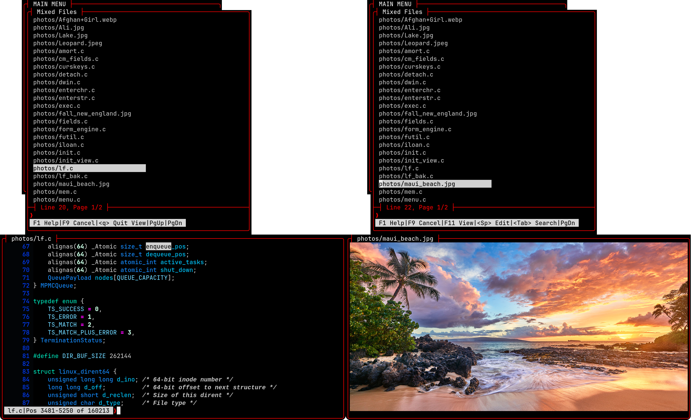
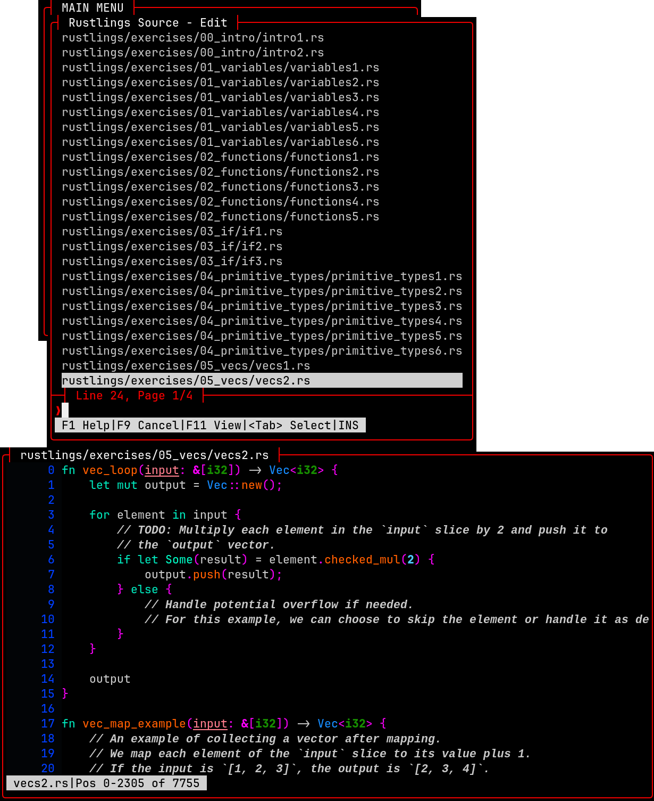
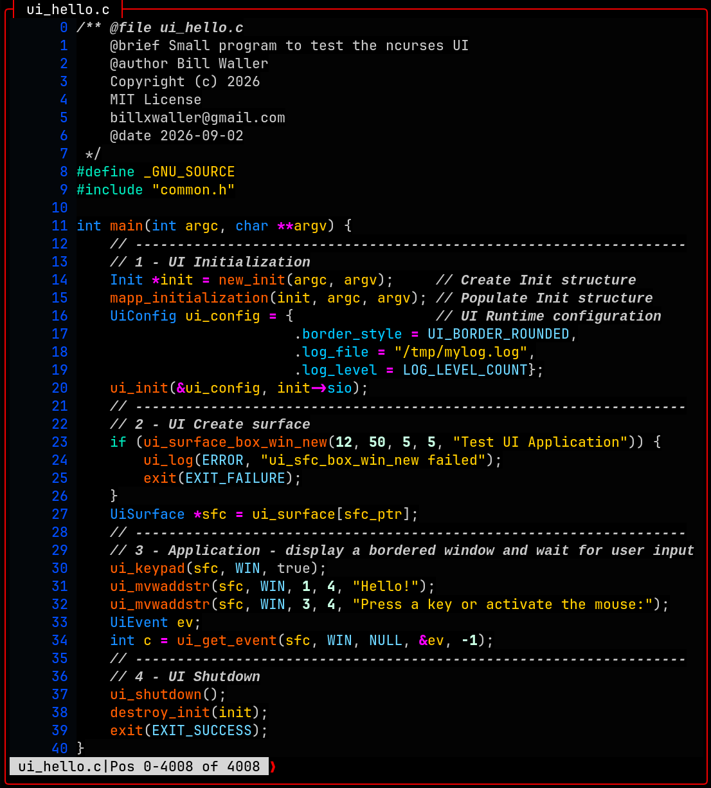
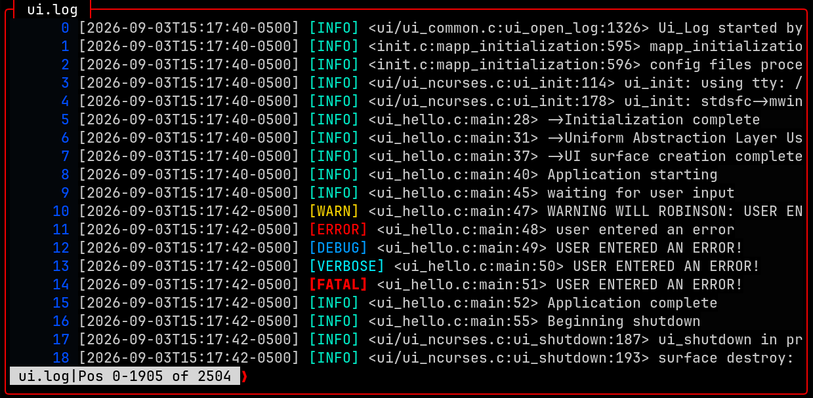

C-Menu is a fast, modular toolkit for building terminal-based user interfaces on Linux. Its components can be combined to create responsive menus, forms, pick lists, viewers, file-finding workflows, and administrative tools without the overhead of a heavyweight GUI stack.

Written in C and designed for speed, C-Menu works well for developer tools, system administration workflows, kiosk-style interfaces, and resource-constrained environments.

With C-Menu, you can leverage the raw speed and power of a terminal interface without the bloated dead weight of a full GUI framework. C-Menu is a toolkit that provides a framework for composing polished applications from small, focused components. Even previously unwieldy tools, such as awk, grep, sed, find, and shell scripts can be encapsulated in simple, menu-driven workflows that are easy to use and easy to maintain.

More sophisticated applications can be be built using the C-Menu API that is fully integrated with modern development environments like Vim and Neovim. As you type C-Menu API function names, the editor provides auto-completion and inline documentation, making it easy to learn and use. That's why C-Menu is an indispensable tool for skill levels ranging from shell script hobbyists to professional developers and system administrators.

## Uniform Abstraction Layer User Interface

C-Menu has fully integrated the new Uniform Abstraction Layer (UAL) for UI
Backends. Currently, NCurses and Notcurses are fully supported, and additional
backends can be added in the future. The UAL allows C-Menu to provide a
consistent interface across different terminal environments, while also enabling
advanced features such as mouse support, color management, and improved performance. This makes C-Menu more versatile and adaptable to a wider range of use cases.

The UAL UI is a separate library that can be used with or independently of C-Menu,
allowing developers to build their own terminal-based applications with a consistent and powerful UI framework. The UAL provides a set of APIs for creating windows, menus, forms, and other UI elements, as well as handling input events and managing the terminal display.

While Notcurses has many advanced features, and is just plain cool
[See the Notcurses III Demo](https://www.youtube.com/watch?v=dcjkezf1ARY). That
being said, NCurses, with fewer cool features, is solid as a rock, and it isn't
going anywhere. You can use the Notcurses version of C-Menu on your powerful
desktop development system, and then deploy the NCurses version of C-Menu on your production server. The UAL makes this possible, and it is a key feature of C-Menu that sets it apart from other terminal-based UI toolkits.

It's only natural to wonder if an extra layer will slow the application down.
The answer is no. The UAL is designed to be lightweight and efficient, and it does not introduce any significant overhead. In fact, the UAL can actually improve performance in some cases, by providing a more efficient way to manage the terminal display and input events. As for the forwarded function calls, the redirection is handled at compile time, so there is no runtime overhead. The UAL is designed to be fast and efficient, and it does not introduce any significant performance penalties.

The core C-Menu components are visually and functionally identical across both
NCurses and Notcurses backends, and the same code drives both backends through the UAL. This means that you can develop your application using the Notcurses backend, and then deploy it using the NCurses backend without any changes to your code. This is a powerful feature that allows you to take advantage of the advanced features of Notcurses during development, while still being able to deploy your application on systems that only support NCurses.

---

Below is a screenshot of a simple example program using the UAL. You may notice
that many function names are simply the equivalent NCurses function name, but
with a "ui_" prepended. 

That is, except for the high-level functions like ui_surface_box_win_new() for which neither NCurses nor Notcurses has an equivalent. This particular function creates a new surface surrounded by an immutable box (so you can't overwrite it with misplaced text), and up to seven sub-surfaces inside the box.

You may also notice ui_get_event(), another high-level feature not found in NCurses or Notcurses. Like getch(), this function reads keyboard and mouse input, but it goes much further. It handles interrupt signals, mouse positioning, 5 buttons, a scroll wheel, regular text, and Unicode. The data structure returned by ui_get_event() includes the surface and sub-surface on which the event occurred and switch case matching codes for a zoned chyron.

The program compiles and runs with either NCurses or Notcurses, and the UAL handles the differences in the two backends. The UAL is designed to be easy to use and understand, and it provides a consistent interface for developers to work with, regardless of the underlying backend.

---

Below is a screenshot of the UAL view feature, which allows you to view not only
text files, but multi-media files as well. We will be adding viewers for video
and audio. 



---



---

The program below displays the same image as Pick above in only 22 lines of code! That demonstrates how simple it is to use the UAL to create terminal-based applications with advanced features. The UAL provides a set of high-level functions that make it easy to create windows, menus, forms, and other UI elements, as well as handle input events and manage the terminal display.




---

Below is a screenshot of the UAL logging feature, which provides a detailed view of the internal workings of the UAL and can be used for debugging and performance analysis. The logging feature is available in both NCurses and Notcurses backends, and can be enabled or disabled at runtime.




---

---

[C-Menu Doxygen](https://decision-inc.com) | [C-Menu CHANGELOG](docs/CHANGELOG.md) | [C-Menu Installation](docs/INSTALL.md) | [Example Applications Menu Guided Tour](docs/menu.md)

## Why C-Menu?

C-Menu is built for users who want terminal applications that are:

- **Fast** - optimized C programs with a minimal footprint
- **Modular** - combine small purpose-built components into larger workflows
- **Script-friendly** - easy to integrate with shell scripts and external commands
- **Interactive** - supports keyboard and mouse driven terminal interfaces
- **Practical** - useful for both end-user tools and developer/admin utilities

Instead of treating menus, forms, selection lists, and viewers as separate one-off programs, C-Menu treats them as reusable building blocks that can be assembled into complete applications.

## Components

| Component | Purpose                                            | Typical Use                                            |
| --------- | -------------------------------------------------- | ------------------------------------------------------ |
| `menu`    | Display menus and launch actions                   | Application navigation, submenus, command dispatch     |
| `form`    | Enter, edit, validate, and process structured data | Data entry, calculations, query/update workflows       |
| `pick`    | Select one or more items from a list               | File selection, multi-select actions, command dispatch |
| `view`    | Display text and command output efficiently        | Logs, reports, source code, highlighted output         |
| `lf`      | Regular-expression-based file finder               | File discovery, filtering, pipelines                   |
| `rsh`     | Privileged shell helper                            | Controlled administrative workflows                    |
| `C-Keys`  | Keyboard and mouse diagnostic utility              | Input testing and terminal diagnostics                 |

## Quick Start

See [BUILD](docs/BUILD.md) for full build and install instructions.

A typical workflow with C-Menu looks like this:

1. Write a small menu description file
2. Launch `menu`
3. Dispatch actions to `form`, `pick`, `view`, shell commands, or other C-Menu components

Minimal example:

```text
: APPLICATIONS
:     Edit Current Project C Files
!pick -S "lf -d 5 '.*\.c$'" -T "Project Source" -c nvim %%
:     Open Root Shell
!exec rsh
```

This example shows one of C-Menu’s core ideas: the menu itself is simple, and the power comes from composing components and external commands.

## Core Concepts

C-Menu applications are usually built from plain text description files and command lines.

- **Menu** description files define choices and the commands that run when a choice is selected.
- **Form** description files define labels, input fields, and directives for processing.
- **Pick** reads items from a file or command and lets the user select one or more of them.
- **View** displays files or command output in a fast read-only interface.
- **lf** can generate file lists that feed directly into `pick`, shell pipelines, or custom scripts.

This makes C-Menu especially effective when you want to combine:

- shell commands
- external utilities
- custom scripts
- terminal UI components
- low-latency workflows

## Examples

### Menu

`menu` is the top-level dispatcher. It displays choices and runs the corresponding commands.

Example:

```bash
: APPLICATIONS
:     Full Screen Shell
!exec rsh

:     Workstation Configuration
!menu workstation_config.m

:     Diagnostic Tools
!menu diag.m
```

Use `menu` when you want:

- a text-based launcher
- a hierarchy of submenus
- a consistent front end for scripts and utilities
- a terminal-native application shell

### Form

`form` is used for entering, editing, validating, and processing structured data.

A form description file contains text lines and field definitions.

Text example:

```bash
T:5:14:Principal Amount
```

Field example:

```bash
F:5:33:14:Currency
```

Common workflow:

```bash
:     Installment Loan Calculations
!form iloan.f -i iloan.dat -S iloan -R "view -S \"amort %%\"" -o iloan.dat
```

This demonstrates a powerful pattern:

- load initial values
- process them with an external executable
- redisplay updated values
- optionally hand off results to `view`

Use `form` when you need:

- data entry
- calculations
- validation workflows
- query/update cycles
- integration with external programs

### Pick

`pick` displays a list of items and lets the user select one or more of them.

General form:

```bash
!pick [ -n maximum_number_of_selections ][ -m ] \
    [ -i input_file ][ -S executable_provider ] \
    [ -o output_file ][ -c executable %% ]
```

Example:

```bash
:     Rustlings Source
!pick -S rust_src -n 1 -T "Rustlings Source - Edit" -c nvim %%
```

You can also avoid helper scripts when a direct command is sufficient:

```bash
: Edit .c Files in Current Directory
!pick -S "lf -d 5 '.*\.c$'" -T "Project Tree - Select File to Edit" -c nvim %%
```

Use `pick` when you need:

- interactive selection from generated lists
- real-time filtering
- single- or multi-select workflows
- dispatching selected items to external commands

### View

`view` is a fast read-only viewer for files and command output.

It supports:

- Unicode
- line numbering
- regular-expression searching
- horizontal scrolling with a large virtual pad
- highlighted output from tools such as Tree-sitter, `bat`, `pygments`, and `source-highlight`

Example:

```bash
: View C-Menu Source with Tree-Sitter
!pick -S project_src -n 1 -T "Select Project Source to Highlight" -c "view -L 60 -C 85 -S \"tree-sitter highlight %%\""
```

`view` is especially useful for:

- source browsing
- log inspection
- highlighted output
- large text files
- command output that should remain read-only

### lf

`lf` is C-Menu’s regular expression file finder. The name can be read as either **list files** or **lightweight find**.

Example:

```bash
lf -d 5 -t f -a 2024-01-01 -b 2024-06-01 | xargs ls -l
```

This makes it easy to generate file sets for:

- `pick`
- shell pipelines
- batch processing
- date-based searches
- source filtering

Example integration with `pick`:

```bash
!pick -S "lf -d 5 '.*\.c$'" -T "Project Tree - Select File to Edit" -c nvim %%
```

For performance notes and additional details, see [PERFORMANCE](docs/Performance.md).

### rsh

`rsh` provides a root-shell-oriented administrative workflow intended as an alternative approach to repeatedly invoking `su` or `sudo` for certain tasks.

Example use case:

- elevate for an administrative operation
- run the required command
- exit immediately when finished

This can be useful in tightly controlled environments where short-lived privileged sessions are part of an established workflow.

## Documentation

Additional documentation is available in the `docs` directory:

- [API](docs/API.md) - developer-facing API documentation
- [CHANGELOG](docs/CHANGELOG.md) - project history and notable changes
- [USER GUIDE](docs/C-Menu-UG.md) - end-user documentation
- [AUGMENTATION](docs/extras.md) - additional examples and supporting material
- [FAQ](docs/FAQ.md) - frequently asked questions
- [INSTALLATION](docs/INSTALL.md) - build and installation instructions
- [PERFORMANCE](docs/Performance.md) - benchmarks and performance notes
- [VALGRIND](docs/valgrind.md) - memory-checking notes
- [HTML Documentation](https://decision-inc.com) - published documentation site

## Configuration

Many C-Menu options can be set either:

- on the command line, or
- in the configuration file `~/.minitrc`

Command-line options override configuration-file settings.

Examples:

```bash
# .minitrc
fill_character=_
brackets=[]
```

Configuration can be used to control display behavior and tailor the interface to your workflow.

## Platform and Requirements

C-Menu is designed for Linux and terminal-based operation.

Typical requirements:

- Linux
- a standard C library
- a terminal with the capabilities needed for the desired interface features

Optional integrations may depend on additional external tools such as:

- `nvim`
- `bat`
- Tree-sitter tools
- `source-highlight`
- `pygments`

Refer to [INSTALLATION](docs/INSTALL.md) for the exact build and runtime details.

## Security Notes

Some C-Menu components can be used in privileged or security-sensitive workflows, especially `rsh`.

Before using `rsh` or integrating C-Menu into elevated workflows, make sure you clearly define:

- who is allowed to authenticate
- how authentication is performed
- what level of privilege is granted
- what auditing or logging is required
- whether the environment is appropriate for passwordless or key-based elevation

Administrative tooling should be reviewed carefully before use in production or multi-user environments.

## Why the Design Works

C-Menu’s design is effective because it keeps the UI layer simple and composable.

Rather than forcing a single monolithic framework, it lets you connect:

- plain text configuration
- terminal-native interaction
- Unix pipelines
- external executables
- lightweight focused tools

That makes it a strong fit for:

- custom internal tools
- developer utilities
- interactive scripts
- operations workflows
- systems with limited resources

## Contributing

If you are exploring C-Menu for the first time, a good path is:

1. Read [BUILD](docs/BUILD.md)
2. Read the [USER GUIDE](docs/C-Menu-UG.md)
3. Try a small `menu` + `pick` workflow
4. Expand into `form`, `view`, and `lf` integrations

If you contribute examples, documentation improvements, or fixes, keeping examples small and practical will help new users learn the system quickly.

## See also

- [Build](docs/BUILD.md) - build instructions and requirements
- [API](docs/API.md) - developer-facing API documentation
- [CHANGELOG](docs/CHANGELOG.md) - project history and notable changes
- [User Guide](docs/C-Menu-UG.md) - end-user documentation
- [Augmentation](docs/extras.md) - additional examples and supporting material
- [FAQ](docs/FAQ.md) - frequently asked questions
- [Performance](docs/Performance.md) - benchmarks and performance notes
- [Menu](docs/menu.md) - detailed documentation for the `menu` component
- [Form](docs/form.md) - detailed documentation for the `form` component
- [Pick](docs/pick.md) - detailed documentation for the `pick` component
- [View](docs/view.md) - detailed documentation for the `view` component
- [Exercises](docs/exercises.md) - exercises to practice using C-Menu components
- [Valgrind](docs/valgrind.md) - memory-checking notes and best practices
- [Roadmap](docs/ROADMAP.md) - planned features and future directions'
- [Contributing](docs/CONTRIBUTING.md) - guidelines for contributing to the project
