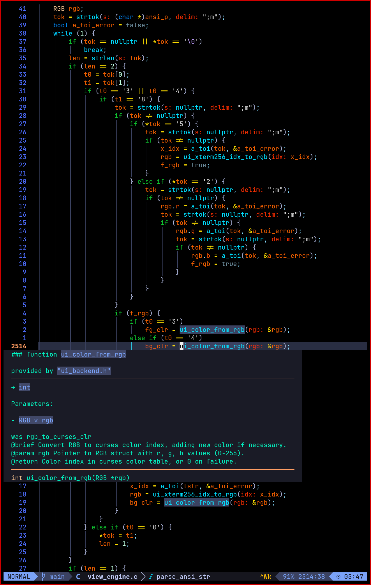
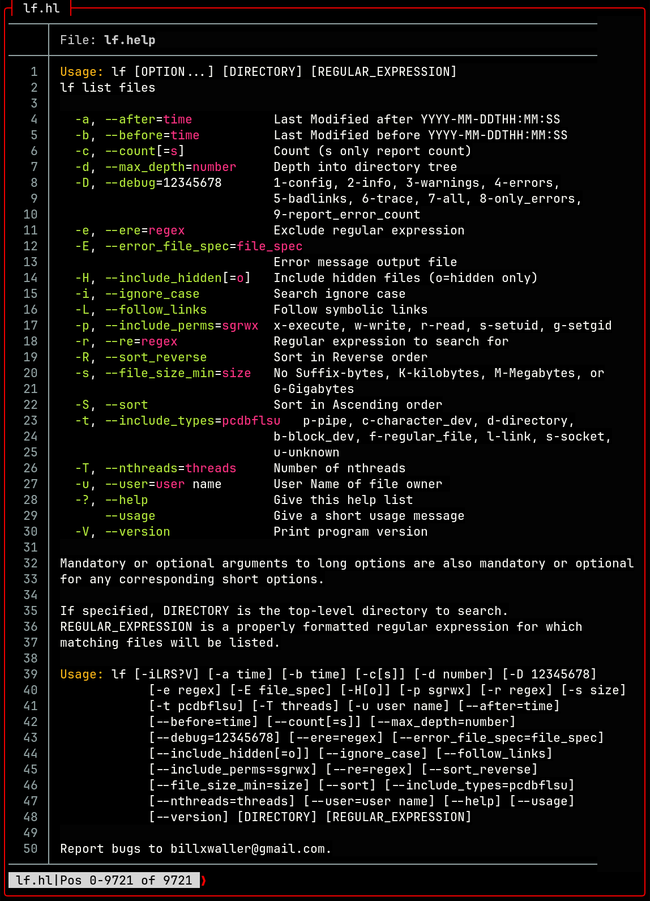
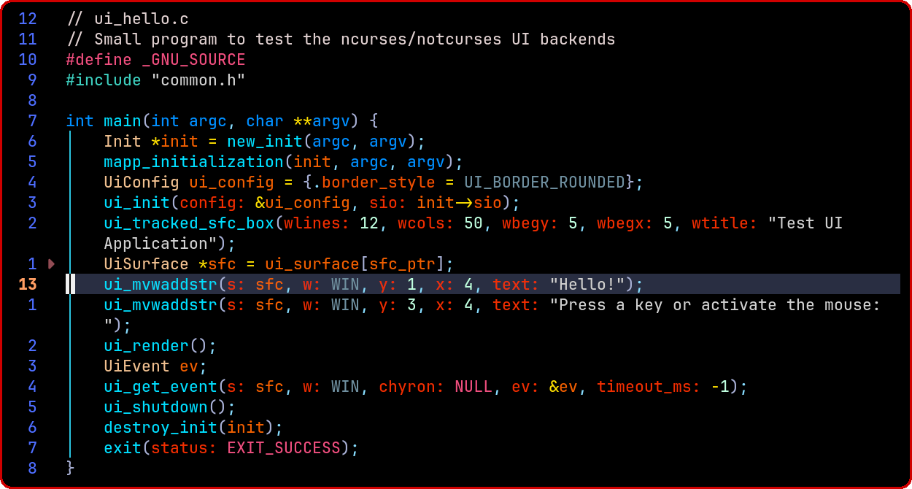
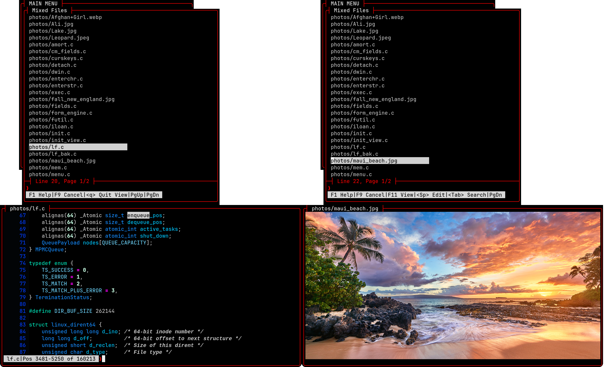
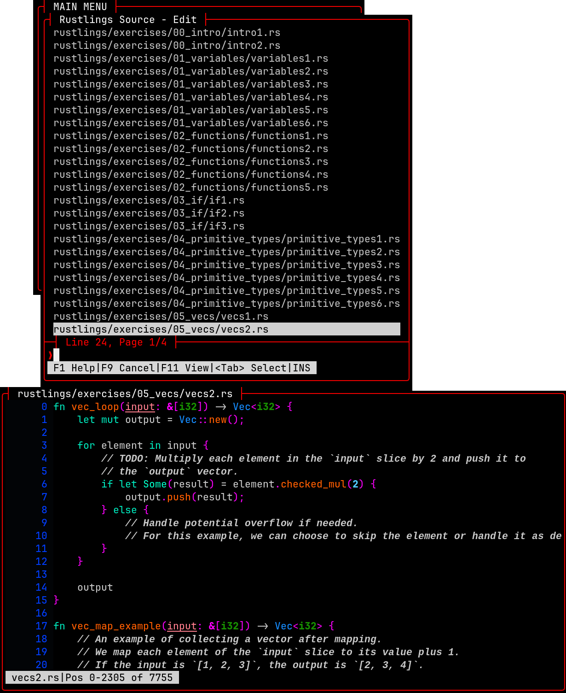
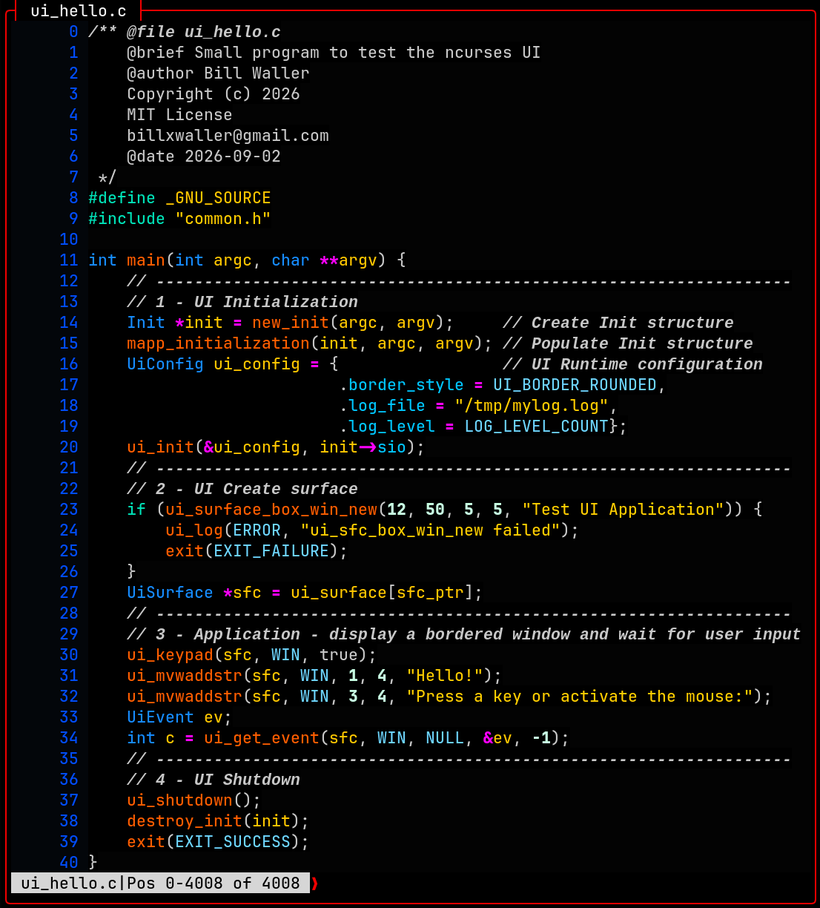
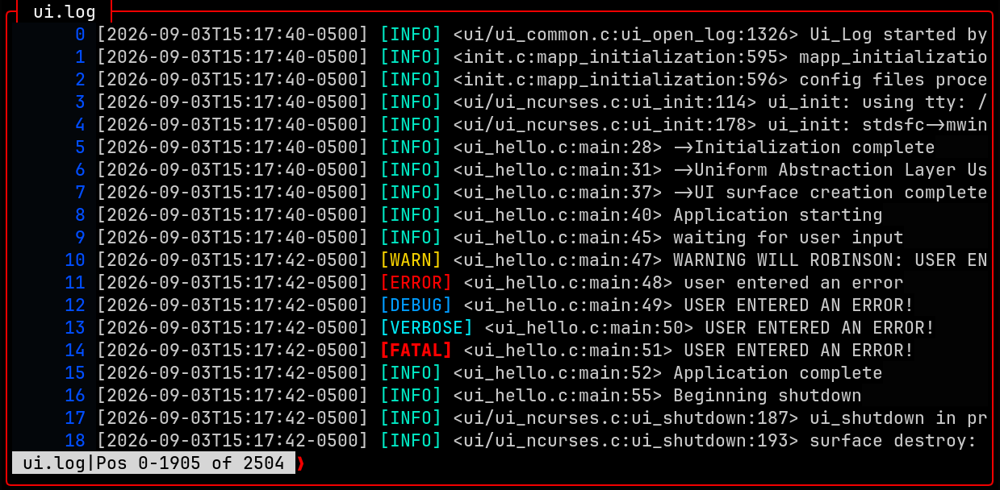

C-Menu is a fast, modular toolkit for building terminal-based user interfaces on Linux. Its components can be combined to create responsive menus, forms, pick lists, viewers, file-finding workflows, and administrative tools without the overhead of a heavyweight GUI stack.

Written in C and designed for speed, C-Menu works well for developer tools, system administration workflows, kiosk-style interfaces, and resource-constrained environments.

With C-Menu, you can leverage the raw speed and power of a terminal interface without the bloated dead weight of a full GUI framework. C-Menu is a toolkit that provides a framework for composing polished applications from small, focused components. Even previously unwieldy tools, such as awk, grep, sed, find, and shell scripts can be encapsulated in simple, menu-driven workflows that are easy to use and easy to maintain.

More sophisticated applications can be be built using the C-Menu API that is fully integrated with modern development environments like Vim and Neovim. As you type C-Menu API function names, the editor provides auto-completion and inline documentation, making it easy to learn and use. That's why C-Menu is an indispensable tool for skill levels ranging from shell script hobbyists to professional developers and system administrators.

## Uniform Abstraction Layer (UAL) API

The Uniform Abstraction Layer (UAL) API is a new feature in C-Menu that provides a
consistent interface for terminal-based applications across different UI backends. The UAL allows developers to write applications that can run on multiple terminal environments without modification, while still taking advantage of advanced features such as mouse support, color management, and improved performance.

Currently, the UAL API supports two backends: NCurses and Notcurses. The NCurses backend provides a traditional terminal interface, while the Notcurses backend provides a more modern interface with advanced features such as true color support, high-performance rendering, and multimedia capabilities.

The UAL API is fully integrated with the C-Menu components, and developer tools
such as Vim and Neovim provide auto-completion and inline documentation for the UAL functions. This makes it easy for developers to learn and use the UAL API, and to create terminal-based applications that are both powerful and user-friendly.

The image below shows a screenshot of the UAL API in action, with
auto-completion and inline documentation provided by the Neovim editor. The UAL API is a powerful tool for developers who want to create terminal-based applications that are both fast and user-friendly, and it is an important part of the C-Menu toolkit.



---

## lf

lf is a high performance file finder that can be used to generate file lists for pick, shell pipelines, or custom scripts. lf is comparable to the popular find command, but it is designed to be more user-friendly and ridiculously fast.

To say that lf is fast is understated. It is easily ten times faster than find, and, even faster than fd. lf handles huge directories with ease. It can be used to find files based on name, type, date, size, and other attributes, making it a powerful tool for file discovery and filtering. It also has an option that only reports cyclic and broken links.



Report bugs to billxwaller@gmail.com.

## find, lf, and fd Performance Comparison

### find - 0.86 elapsed - "Very Fast"

```
find /home/bill
0.38user 0.47system 0:00.86elapsed 100%CPU (0avgtext+0avgdata 33272maxresident)k
0inputs+0outputs (0major+11917minor)pagefaults 0swaps
find found 492502 files

```

### fd - 0.15 elapsed - "Extremely Fast"

```
fd . -H -I /home/bill
0.77user 0.62system 0:00.15elapsed 930%CPU (0avgtext+0avgdata 125320maxresident)k
0inputs+0outputs (0major+3814minor)pagefaults 0swaps
fd found 492501 files
```

### lf - 0.10 elapsed - "Lightning Fast"

```
./lf -H /home/bill
0.19user 0.73system 0:00.08elapsed 1075%CPU (0avgtext+0avgdata 12756maxresident)k
0inputs+0outputs (0major+1562minor)pagefaults 0swaps
lf found 492501 files
```


|command   |elapsed|CPU%|memory|pagefaults|files |
|----------|-------|----|------|----------|------|
|find      |   0.86| 100| 33272|     11917|492502|
|fd . -H -I|   0.15| 930|125320|      3814|492501|
|lf -H     |   0.08|1075| 12756|      1562|492501|


Notice that lf is the fastest, and uses the least memory. It also has the fewest page faults. fd is faster than find, but uses more memory and has more page faults. find is the slowest, and uses the most memory and has the most page faults.

NOTE: find counts the root directory as a file, while fd and lf do not. This
accounts for the one-file difference in the file counts. This is not necessarily
an error. Just subtract 1 from the find count to get an accurate result.

## Under the Hood

### Quality Controll

Valgrind output for lf:

```
==38577== 
==38577== HEAP SUMMARY:
==38577==     in use at exit: 0 bytes in 0 blocks
==38577==   total heap usage: 52 allocs, 52 frees, 4,737,309 bytes allocated
==38577== 
==38577== All heap blocks were freed -- no leaks are possible
==38577== 
==38577== ERROR SUMMARY: 0 errors from 0 contexts (suppressed: 0 from 0)
```

## Uniform Abstraction Layer User Interface

C-Menu has fully integrated the new Uniform Abstraction Layer (UAL) for UI Backends. Currently, NCurses and Notcurses are fully supported, and additional backends such as GTK and qt can be added in the future. The UAL allows C-Menu to provide a consistent interface across different terminal environments, while also enabling advanced features such as mouse support, color management, and improved performance. This makes C-Menu more versatile and adaptable to a wider range of use cases.

The core C-Menu components are visually and functionally identical across both NCurses and Notcurses backends, and the same code drives both backends through the UAL. This means that you can develop your application using the Notcurses backend, and then deploy it using the NCurses backend without any changes to your code. This is a powerful feature that allows you to take advantage of the advanced features of Notcurses during development, while still being able to deploy your application on systems that only support NCurses.

See [UAL_UI Documentation](docs/UAL_UI.md) for more information on the UAL and its features.

---

The following snippet is actually a complete program that opens a bordered
window and displays some text. It shows just how easy it is to use the UAL_UI.



---

Below is a screenshot of the UAL view feature, which allows you to view not only
text files, but multi-media files as well. We will be adding viewers for video
and audio. 

As you move the selector bar, you get a preview of the file. On the left, is the
source code for lf, the C-Menu file finder. From the selector window, you can
press F11 to move your focus to the text window. Then you can navigate with
view, search the file, and even edit it with your favorite editor. On the right,
view has detected an image file, and displays a preview. You can edit the image
by pressing the spacebar.



---



---

The program below displays the same image as Pick above in only 22 lines of code! That demonstrates how simple it is to use the UAL to create terminal-based applications with advanced features. The UAL provides a set of high-level functions that make it easy to create windows, menus, forms, and other UI elements, as well as handle input events and manage the terminal display.




---

Below is a screenshot of the UAL logging feature, which provides a detailed view of the internal workings of the UAL and can be used for debugging and performance analysis. The logging feature is available in both NCurses and Notcurses backends, and can be enabled or disabled at runtime.




---

[C-Menu Doxygen](https://decision-inc.com) | [C-Menu CHANGELOG](docs/CHANGELOG.md) | [C-Menu Installation](docs/INSTALL.md) | [Example Applications Menu Guided Tour](docs/menu.md)

---

## To Build C-Menu

Change to the source directory, C-Menu/src, and type:

```bash
./chkui
```

The script should respond with a message similar to the following:

```bash
menu linked with ncurses
CMake - NCURSES
Makefile - NCURSES
```

If these are the options you want, proceed with the build:
To switch from NCURSES to NOTCURSES or vice versa, run the chkui script again
with the "-s" option.

```bash
./chkui -s
```

The script should respond with a message similar to the following:

```bash
menu linked with ncurses
CMake - NCURSES
Makefile - NCURSES
CMake switching to NOTCURSES
Makefile switching to NOTCURSES
```
---

To build with CMake, remain in the source directory, C-Menu/src, and type:
```bash
./cmake.sh
```
This will create a build directory if it doesn't already exist. After the
cmake.sh script finishes, change to the build directory and type:

```bash
make
make install
```

---

To build with GNU Makefile, remain in the source directory, C-Menu/src, and type:
```bash
make
make install
```

---

## Why C-Menu?

C-Menu is built for users who want terminal applications that are:

- **Fast** - optimized C programs with a minimal footprint
- **Modular** - combine small purpose-built components into larger workflows
- **Script-friendly** - easy to integrate with shell scripts and external commands
- **Interactive** - supports keyboard and mouse driven terminal interfaces
- **Practical** - useful for both end-user tools and developer/admin utilities

Instead of treating menus, forms, selection lists, and viewers as separate one-off programs, C-Menu treats them as reusable building blocks that can be assembled into complete applications.

## Components

| Component | Purpose                                            | Typical Use                                            |
| --------- | -------------------------------------------------- | ------------------------------------------------------ |
| `menu`    | Display menus and launch actions                   | Application navigation, submenus, command dispatch     |
| `form`    | Enter, edit, validate, and process structured data | Data entry, calculations, query/update workflows       |
| `pick`    | Select one or more items from a list               | File selection, multi-select actions, command dispatch |
| `view`    | Display text and command output efficiently        | Logs, reports, source code, highlighted output         |
| `lf`      | Regular-expression-based file finder               | File discovery, filtering, pipelines                   |
| `rsh`     | Privileged shell helper                            | Controlled administrative workflows                    |
| `C-Keys`  | Keyboard and mouse diagnostic utility              | Input testing and terminal diagnostics                 |

## Quick Start

See [BUILD](docs/BUILD.md) for full build and install instructions.

A typical workflow with C-Menu looks like this:

1. Write a small menu description file
2. Launch `menu`
3. Dispatch actions to `form`, `pick`, `view`, shell commands, or other C-Menu components

Minimal example:

```text
: APPLICATIONS
:     Edit Current Project C Files
!pick -S "lf -d 5 '.*\.c$'" -T "Project Source" -c nvim %%
:     Open Root Shell
!exec rsh
```

This example shows one of C-Menu’s core ideas: the menu itself is simple, and the power comes from composing components and external commands.

## Core Concepts

C-Menu applications are usually built from plain text description files and command lines.

- **Menu** description files define choices and the commands that run when a choice is selected.
- **Form** description files define labels, input fields, and directives for processing.
- **Pick** reads items from a file or command and lets the user select one or more of them.
- **View** displays files or command output in a fast read-only interface.
- **lf** can generate file lists that feed directly into `pick`, shell pipelines, or custom scripts.

This makes C-Menu especially effective when you want to combine:

- shell commands
- external utilities
- custom scripts
- terminal UI components
- low-latency workflows

## Examples

### Menu

`menu` is the top-level dispatcher. It displays choices and runs the corresponding commands.

Example:

```bash
: APPLICATIONS
:     Full Screen Shell
!exec rsh

:     Workstation Configuration
!menu workstation_config.m

:     Diagnostic Tools
!menu diag.m
```

Use `menu` when you want:

- a text-based launcher
- a hierarchy of submenus
- a consistent front end for scripts and utilities
- a terminal-native application shell

### Form

`form` is used for entering, editing, validating, and processing structured data.

A form description file contains text lines and field definitions.

Text example:

```bash
T:5:14:Principal Amount
```

Field example:

```bash
F:5:33:14:Currency
```

Common workflow:

```bash
:     Installment Loan Calculations
!form iloan.f -i iloan.dat -S iloan -R "view -S \"amort %%\"" -o iloan.dat
```

This demonstrates a powerful pattern:

- load initial values
- process them with an external executable
- redisplay updated values
- optionally hand off results to `view`

Use `form` when you need:

- data entry
- calculations
- validation workflows
- query/update cycles
- integration with external programs

### Pick

`pick` displays a list of items and lets the user select one or more of them.

General form:

```bash
!pick [ -n maximum_number_of_selections ][ -m ] \
    [ -i input_file ][ -S executable_provider ] \
    [ -o output_file ][ -c executable %% ]
```

Example:

```bash
:     Rustlings Source
!pick -S rust_src -n 1 -T "Rustlings Source - Edit" -c nvim %%
```

You can also avoid helper scripts when a direct command is sufficient:

```bash
: Edit .c Files in Current Directory
!pick -S "lf -d 5 '.*\.c$'" -T "Project Tree - Select File to Edit" -c nvim %%
```

Use `pick` when you need:

- interactive selection from generated lists
- real-time filtering
- single- or multi-select workflows
- dispatching selected items to external commands

### View

`view` is a fast read-only viewer for files and command output.

It supports:

- Unicode
- line numbering
- regular-expression searching
- horizontal scrolling with a large virtual pad
- highlighted output from tools such as Tree-sitter, `bat`, `pygments`, and `source-highlight`

Example:

```bash
: View C-Menu Source with Tree-Sitter
!pick -S project_src -n 1 -T "Select Project Source to Highlight" -c "view -L 60 -C 85 -S \"tree-sitter highlight %%\""
```

`view` is especially useful for:

- source browsing
- log inspection
- highlighted output
- large text files
- command output that should remain read-only

### lf

`lf` is C-Menu’s regular expression file finder. The name can be read as either **list files** or **lightweight find**.

Example:

```bash
lf -d 5 -t f -a 2024-01-01 -b 2024-06-01 | xargs ls -l
```

This makes it easy to generate file sets for:

- `pick`
- shell pipelines
- batch processing
- date-based searches
- source filtering

Example integration with `pick`:

```bash
!pick -S "lf -d 5 '.*\.c$'" -T "Project Tree - Select File to Edit" -c nvim %%
```

For performance notes and additional details, see [PERFORMANCE](docs/Performance.md).

### rsh

`rsh` provides a root-shell-oriented administrative workflow intended as an alternative approach to repeatedly invoking `su` or `sudo` for certain tasks.

Example use case:

- elevate for an administrative operation
- run the required command
- exit immediately when finished

This can be useful in tightly controlled environments where short-lived privileged sessions are part of an established workflow.

## Documentation

Additional documentation is available in the `docs` directory:

- [API](docs/API.md) - developer-facing API documentation
- [CHANGELOG](docs/CHANGELOG.md) - project history and notable changes
- [USER GUIDE](docs/C-Menu-UG.md) - end-user documentation
- [AUGMENTATION](docs/extras.md) - additional examples and supporting material
- [FAQ](docs/FAQ.md) - frequently asked questions
- [INSTALLATION](docs/INSTALL.md) - build and installation instructions
- [PERFORMANCE](docs/Performance.md) - benchmarks and performance notes
- [VALGRIND](docs/valgrind.md) - memory-checking notes
- [HTML Documentation](https://decision-inc.com) - published documentation site

## Configuration

Many C-Menu options can be set either:

- on the command line, or
- in the configuration file `~/.minitrc`

Command-line options override configuration-file settings.

Examples:

```bash
# .minitrc
fill_character=_
brackets=[]
```

Configuration can be used to control display behavior and tailor the interface to your workflow.

## Platform and Requirements

C-Menu is designed for Linux and terminal-based operation.

Typical requirements:

- Linux
- a standard C library
- a terminal with the capabilities needed for the desired interface features

Optional integrations may depend on additional external tools such as:

- `nvim`
- `bat`
- Tree-sitter tools
- `source-highlight`
- `pygments`

Refer to [INSTALLATION](docs/INSTALL.md) for the exact build and runtime details.

## Security Notes

Some C-Menu components can be used in privileged or security-sensitive workflows, especially `rsh`.

Before using `rsh` or integrating C-Menu into elevated workflows, make sure you clearly define:

- who is allowed to authenticate
- how authentication is performed
- what level of privilege is granted
- what auditing or logging is required
- whether the environment is appropriate for passwordless or key-based elevation

Administrative tooling should be reviewed carefully before use in production or multi-user environments.

## Why the Design Works

C-Menu’s design is effective because it keeps the UI layer simple and composable.

Rather than forcing a single monolithic framework, it lets you connect:

- plain text configuration
- terminal-native interaction
- Unix pipelines
- external executables
- lightweight focused tools

That makes it a strong fit for:

- custom internal tools
- developer utilities
- interactive scripts
- operations workflows
- systems with limited resources

## Contributing

If you are exploring C-Menu for the first time, a good path is:

1. Read [BUILD](docs/BUILD.md)
2. Read the [USER GUIDE](docs/C-Menu-UG.md)
3. Try a small `menu` + `pick` workflow
4. Expand into `form`, `view`, and `lf` integrations

If you contribute examples, documentation improvements, or fixes, keeping examples small and practical will help new users learn the system quickly.

## See also

- [Build](docs/BUILD.md) - build instructions and requirements
- [API](docs/API.md) - developer-facing API documentation
- [CHANGELOG](docs/CHANGELOG.md) - project history and notable changes
- [User Guide](docs/C-Menu-UG.md) - end-user documentation
- [Augmentation](docs/extras.md) - additional examples and supporting material
- [FAQ](docs/FAQ.md) - frequently asked questions
- [Performance](docs/Performance.md) - benchmarks and performance notes
- [Menu](docs/menu.md) - detailed documentation for the `menu` component
- [Form](docs/form.md) - detailed documentation for the `form` component
- [Pick](docs/pick.md) - detailed documentation for the `pick` component
- [View](docs/view.md) - detailed documentation for the `view` component
- [Exercises](docs/exercises.md) - exercises to practice using C-Menu components
- [Valgrind](docs/valgrind.md) - memory-checking notes and best practices
- [Roadmap](docs/ROADMAP.md) - planned features and future directions'
- [Contributing](docs/CONTRIBUTING.md) - guidelines for contributing to the project
