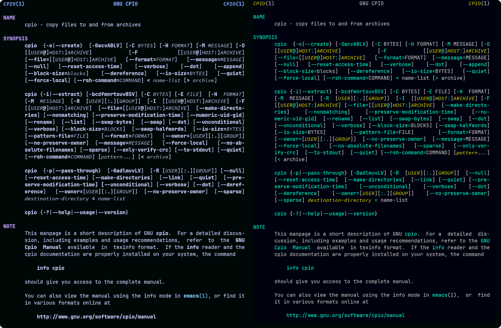
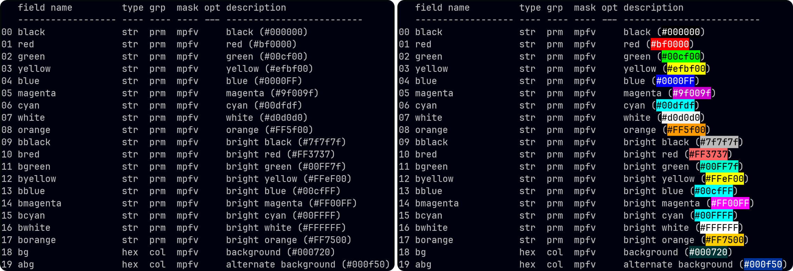

# C-Menu Utilities

## chktty - Check and fix terminal settings

chktty is a helper utility that automates diagnosis and correction of terminal settings. It compares a specified terminal against a previously created reference. If differences are found, it offers to apply the reference settings to the specified terminal.

### Use Case

Your terminal is misbehaving (e.g., incorrect character display, input issues).
Use this utility to compare its settings with a known good configuration and optionally apply the reference settings. Of course, you can always close and open a new terminal, but you may have work in the current session you don't want to lose. You may also want to know what went wrong, and this utility can help with that too.

### Create the Reference Terminal Settings File

It's a good idea to use this script to store terminal settings reference files. The reference files are named "stty.[optional_descriptor].ref" and "stty.[optional_descriptor].g". The optional descriptor can help you identify different terminal states (e.g., "normal", "raw", "sane", "shell", "ncurses", etc.). If you don't specify a desriptor, the default files "stty.ref" and "stty.g" are used. By default, these files are stored in ~/menuapp/test/tty.

First, set TTYPREFIX for your system.

On Linux systems, you might set:

```
    TTYPREFIX=/dev/pts
```

On macOS systems, you might set:

```
    TTYPREFIX=/dev/ttys
```

On FreeBSD systems, you might set:

```
    TTYPREFIX=/dev/ttyp
```

To create a reference for the shell case of terminal number 0.

To create reference settings for terminal number 0 with the descriptor "shell":

```
    $ TTYPREFIX=/dev/pts
    $ chktty 0 -r shell

    chktty will respond with:

    Creating reference stty settings in /home/bill/menuapp/test/tty/stty.shell.ref
```

This will create a reference file named "stty.shell.ref" and a "stty.shell.g" file in ~/menuapp/test/tty.

### Checking and Optionally Repairing Terminal Settings

```
    $ TTYPREFIX=/dev/pts
    $ chktty 0 shell
```

If the settings are different from the reference, you will be presented with an option to apply the reference sttings to it.

```
Comparing tty /dev/pts/0 to reference /home/bill/menuapp/test/tty/stty.shell.ref
Differences found!
stty.shell.ref     |    /dev/pts/0
-icrnl             |    icrnl
-ixon              |    ixon
-opost             |    opost
-isig              |    isig
-iexten            |    iexten
Would you like to use stty /home/bill/menuapp/test/tty/stty.shell.ref.g to fix settings?
Apply reference settings to /dev/pts/0 (y/n)?
```

If you select "y", the reference settings will be applied to the terminal.

Usage: chktty \[terminal-number\] \[-r to create reference\] \[optional_descriptor\]

## Man.sed

man.sed is a sed script that modifies ANSI SGR (Select Graphic Rendition) parameters initially produced by the man command to make them more visually distinctive. The sequences used by man are often too subtle to be easily noticed. This script makes them pop by replacing them with more noticeable color and attribute combinations.

usage:

```
ANSI SGR (Select Graphic Rendition) parameters:

    0     Reset all attributes
    1     Bold
    2     Dim
    3     Italic
    4     Underline
    5     Blink
    7     Reverse
    8     Hide
   22     Bold/Dim off
   23     Italic off
   24     Underline off
   25     Blink Off
   27     Reverse off
   28     Hide off
  30-37   Foreground
 38;5;<n> Foreground
   39     Foreground default
  40-47   Foreground
 48;5;<n> Background
   49     Background default
  90-97   Bright Foreground
 100-107  Bright Background
```

```
s/\[1m/\[33;1m/g
s/\[2m/\[34;1m/g
s/\[3m/\[35;3;1m/g
s/\[4m/\[31;1m/g
s/\[22m/\[22;0m/g
s/\[23m/\[23;0m/g
s/\[24m/\[24;0m/g
```

Here's a before (left) and after (right) comparison of man page output processed with
man.sed and C-Menu view:


Then image on the left was rendered by nvim using:

```
export MANPAGER="nvim +Man!"
```

The image on the right was rendered by nvim using:

```
 man -Tutf8 "$@" | sed -f ~/menuapp/msrc/man.sed | view
```

---

## colorize.awk - Colorize HTML Style Color Codes in Text Files

colorize.awk is an AWK script that scans text files for HTML style color codes (e.g., #RRGGBB) and applies the corresponding terminal colors to the text. This is useful for visualizing color codes directly in the terminal.

### Usage

optsp | awk -f ~/menuapp/msrc/colorizer.awk | view

Where *optsp* is a binary executable that displays C-Menu options.

### Example

Here is an example of using colorize.awk to visualize color codes in the output of the *optsp* command:

```
$ optsp | awk -f ~/menuapp/msrc/colorizer.awk | view
```

The list on the left is before and the list on the right is after processing with colorize.awk:



## lf
