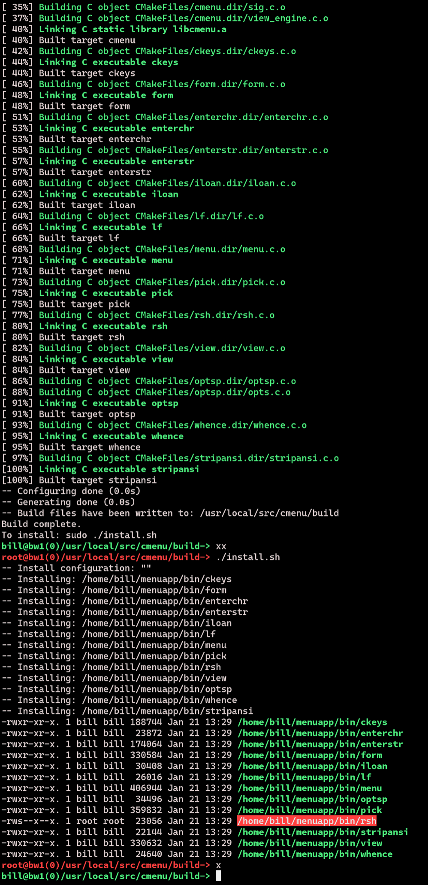
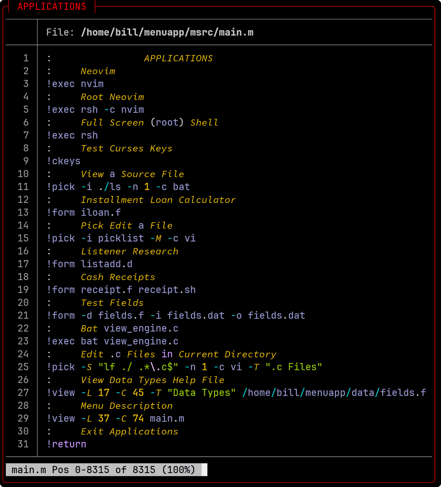
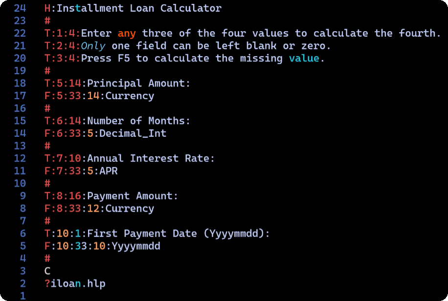

# User guide

## Get C-Menu on Github

Click the link below to access the C-Menu Documentation:

[C-Menu on Github](https://decision-inc.com)

[Download C-Menu from Github](https://github.com/BillWaller/C-Menu.git)

```bash
gh repo clone BillWaller/C-Menu
```

---

## Table of Contents

<!-- mtoc-start -->

- [Introduction](#introduction)
- [Prerequisites](#prerequisites)
  - [Not Required, But Recommended](#not-required-but-recommended)
- [Getting Started](#getting-started)
  - [C-Menu File Layout](#c-menu-file-layout)
  - [RSH Safety Features](#rsh-safety-features)
  - [Using RSH](#using-rsh)
  - [RSH - A Use Case](#rsh---a-use-case)
- [Starting C-Menu](#starting-c-menu)
- [C-Menu configuration](#c-menu-configuration)
- [Programming C-Menu Menu](#programming-c-menu-menu)
  - [Menu Example](#menu-example)
  - [Menu Description File Format](#menu-description-file-format)
- [C-Menu Form](#c-menu-form)
  - [Form Description File Example](#form-description-file-example)
    - [Form Line Type Specifiers](#form-line-type-specifiers)
    - [Form Field Delimiters](#form-field-delimiters)
    - [Form Data Types](#form-data-types)
    - [Form Line Syntax](#form-line-syntax)
    - [Form Options](#form-options)
- [C-Menu Pick](#c-menu-pick)
  - [Pick Usage](#pick-usage)
    - [Selecting Items](#selecting-items)
  - [Pick Options](#pick-options)
- [C-Menu View](#c-menu-view)
  - [View Options](#view-options)
    - [View Navigation](#view-navigation)
    - [Searching Forward](#searching-forward)
    - [Searching Backward](#searching-backward)
    - [Horizontal Scrolling](#horizontal-scrolling)
    - [Motion Keys](#motion-keys)
  - [C-Menu Options](#c-menu-options)
  - [C-Menu configuration file example](#c-menu-configuration-file-example)
  - [lf](#lf)
  - [whence](#whence)
- [Troubleshooting](#troubleshooting)
- [🐸 Enjoy using C-Menu! If you encounter any issues or have questions, feel free to open an issue on the C-Menu GitHub repository.](#-enjoy-using-c-menu-if-you-encounter-any-issues-or-have-questions-feel-free-to-open-an-issue-on-the-c-menu-github-repository)

<!-- mtoc-end -->

## Introduction

The C-Menu is a versatile and user-friendly User Interface Toolkit
suitable for a wide variety of applications. This guide provides
detailed instructions on how to use and customize the C-Menu to fit
your needs.

## Prerequisites

- A compatible operating system (e.g., Linux, macOS).
- Basic knowledge of command-line operations.

### Not Required, But Recommended

- Familiarity with a text editor and configuration files.
- Rust Cargo for installing ancillary tools.
- Tree-sitter-cli for enhanced syntax highlighting.
- Root access for certain advanced features.

## Getting Started

To begin, follow these steps:

- Install the C-Menu package

```bash
gh repo clone BillWaller/C-Menu
```

- Copy the sample menuapp to your home directory

```bash
cp -Rdup C-Menu/menuapp ~/
cp ~/menuapp/minitrc ~/.minitrc
```

- Install bashrc-cmenu

```bash
cp C-Menu/menuapp/bashrc-cmenu ~/.bashrc-cmenu
echo 'source ~/.bashrc-cmenu' >> ~/.bashrc
```

- Build C-Menu

```bash
cd C-Menu/src
make
sudo make install
```

To enable root access features, you need to install the RSH (Remote
Shell) program with setuid root permissions. This allows certain menu
items to execute commands with root privileges.

NOTE: The warnings below do not apply if you choose to install RSH without setuid and setgid permissions, or if your system is secure, behind a firewall, and not shared with other users. In that case, you can enjoy the convenience of RSH without the associated risks. However, if you are sharing a system with other users, it is crucial to understand the security implications.

WARNING: Do not install RSH unless you understand the security implications of setuid root programs. RSH allows users to execute commands with root privileges, which can pose significant security risks if not managed properly.

### C-Menu File Layout

```bash
   ** menuapp
   ** ├── bin          C-Menu executable binaries and scripts
      ├── data         Data files
      ├── doc          C-Menu documentation files
      ├── help         C-Menu Help files
      ├── include      C-Menu include files (.h)
      ├── lib64        C-Menu libraries
      │   └── cmake    cmake configuration files
      │       └── cm   cmake configuration files
    * ├── msrc         C-Menu Source Description Files
      ├── scripts      User Scripts
      ├── test         C-Menu test files
      │   └── tty      C-Menu tty test files
      ├── tmp          Temporary files
      └── user         User Files
```

You can place C-Menu files anywhere you like, so long as you configure your system accordingly. However, for a first-time install, it will be much easier to use the suggested default configuration. These instructions will assume the default and give you some pointers on how you can modify the layout to suit your objectives. These instructions will serve as an example of one way to install C-Menu.

First, edit your .bashrc or .zshrc and prepend the C-Menu binary directory onto your path:

```bash
export "$HOME/menuapp/bin:$PATH"
```

Optionally, you can set some other environment variables that will help with your C-Menu setup. CMENU_SRC will come in handy if you plan to develop C-Menu.

```bash
export CMENU_HOME="$HOME"/menuapp
export CMENU_RC="$HOME"/menuapp/.minitrc
export CMENU_SRC=/usr/local/src/cmenu/src
export TERM=xterm-256color
```

After copying the menuapp directory to your home directory, you are ready to start C-Menu. But before you do, let's take a moment to look at some of the safety features that are included with RSH, and how to install them.

If you installed C-Menu with root privileges, you will have an incredibly useful, but potentially dangerous tool, RSH, installed on your system. That's one reason I like to install it in my home directory, where I can control access to it. RSH is a setuid root program that allows users to execute commands with root privileges. If you share a system with other users, you must mitigate the risks associated with RSH. It won't do much good to close the barn door after the horse has escaped. If you aren't sure that you have the necessary precautions in place, it would be better not to install rsh at all. Here are some precautions you should take:

1. Set permissions on your menuapp directory to prevent unauthorized access. You can use the following command to set the permissions:

```bash
chmod -R 700 ~/menuapp
```

2. Only install RSH if you understand the security implications and have a specific need for it. If you do not need the root access features, it is safer to avoid installing RSH altogether or install it without setuid and setgid flags turned on. To disable setuid and setgid for rsh:

```bash
chmod u-s,g-s "$HOME"/menuapp/bin/rsh
```

Also, please read the section on RSH safety below to understand the safety features that are included with RSH and how to use them effectively.

### RSH Safety Features

1. Root privilege is required install RSH in its setuid form. This helps prevent unauthorized users from installing it.
2. The bash functions, "fn xx()" and "fn x()" make it convenient to enter and exit a root shell expeditiously.
3. Use a bright red shell prompt to provide a conspicuous indicator that you are operating with elevated privileges. Be mindful of it and don't linger any longer than necessary.
4. If the -DRSH_SSH is set in the Makefile or CMake configuration, RSH authenticates with ssh to ensure that only authorized users can execute commands with root privileges. This is not the default. It adds an additional layer of security by leveraging existing ssh authentication mechanisms, but it doesn't ask for a password and adds less than 300 milliseconds to RSH startup.
5. If the -DRSH_LOG is set in the Makefile or CMake configuration, RSH creates a system log entry every time it is executed and exited. This allows you to monitor and audit the use of RSH on your system, which can help detect any unauthorized or suspicious activity. On my Tumbleweed system, I can type:
6. If the Makefile or CMake variable, RSH_LD is set to "-static", RSH will be linked as a static executable, except if you also have the RSH_CFLAGS=-DRSH_SSH set, then a static ssh lsibrary, libssh.a, is required.

```bash
sudo journalctl -t rsh
```

The output is as follows:

Mar 24 18:45:35 bw1 rsh[219176]: rsh started by user 'bill' on terminal '/dev/pts/0'
Mar 24 18:45:39 bw1 rsh[219176]: rsh exited by user 'bill'
Mar 24 18:45:43 bw1 rsh[219399]: SSH Error:
Mar 24 18:46:27 bw1 rsh[219557]: SSH Error:
Mar 24 18:49:20 bw1 rsh[220025]: SSH Error:
Mar 24 18:49:26 bw1 rsh[220027]: rsh started by user 'bill' on terminal '/dev/pts/0'
Mar 24 18:49:26 bw1 rsh[220027]: rsh exited by user 'bill'
Mar 24 18:51:42 bw1 rsh[220255]: SSH Error:
Mar 24 18:51:57 bw1 rsh[220479]: rsh started by user 'bill' on terminal '/dev/pts/0'
Mar 24 18:51:59 bw1 rsh[220479]: rsh exited by user 'bill'

You can see when each rsh session was started and exited, and if there were any SSH errors. This can help you keep track of your use of RSH and ensure that you are using it responsibly. Personally, I only thought I was being ultra-careful until I audited my own usage.

### Using RSH

To use RSH, assuming you have it installed with setuid root permissions, you need to make sure the sshd service is running on your system and that you have an ssh key pair set up for authentication. You will need to add your public key to the ~/.ssh/authorized_keys file on the host where you want to execute commands with root privileges. This allows you to authenticate securely when using SSH.

```bash
    sudo ssh-copy-id -i "$HOME"/.ssh/id_rsa.pub 'user@host_name'
```

You can install these features in your "$HOME"/.bashrc by copying the content of "$HOME"/menuapp/bashrc_cmenu to your "$HOME"/.bashrc. I don't use zsh, so perhaps someone will want to create a zshrc_cmenu file that can be sourced from .zshrc. If you do, please share it with me and I'll include it in the next release.

Of course, you should never copy anything to your .bashrc or .zshrc without first reading it and understanding what it does. The bash functions, "fn xx()" and "fn x()" are designed to make it easy to enter and exit a root shell. Once you have RSH installed, you can "xx" to enter a root shell, and "x" to exit it. The red shell prompt will serve as a constant reminder that you are operating with elevated privileges, so be mindful of it and don't linger any longer than necessary.

I am sure you are way beyond the point of needing to be reminded about the dangers of running commands with root privileges. It probably wreaks of a guilty conscience and associated trauma, and there could be a reason for that. It's far better to learn from my mistakes than yours.

### RSH - A Use Case

Note: the following listing uses "lsd" by default, and may not look the same on your system if you do not have "lsd" installed with patched fonts. You can modify the "Makefile" to use "ls" instead.

Once RSH, "xx", and "x" are installed, subsequent make install processes will appear as follows:


Here's another example with the C-Make build. You will notice that the
compilation portion of make is executed without root privileges, while the
installation portion is executed with root privileges. This is a safer
approach, as it minimizes the amount of code that runs with elevated
privileges.



When finished, take some time to explore the ~/menuapp directory to
familiarize yourself with its features.

---

## Starting C-Menu

To start C-Menu, simply run the following command in your terminal:

```bash
menu
```

This will launch the C-Menu interface, where you can navigate through the menu items and execute commands as needed. You can also specify a menu description file to use with the -d option:

```bash
menu -d /path/to/menu_description_file
```

## C-Menu configuration

C-Menu can be configured using a configuration file located at ~/.minitrc. This file allows you to customize various aspects of C-Menu, such as the default menu description file, the default editor, and other settings. You can edit this file with any text editor to suit your preferences.

You don't necessarily need to use ~/.minitrc as your configuration file. You can
specify an alternate configuration file by setting the environment variable,
CMENURC, to the path of the desired configuration file. For example:

```bash
export CMENURC=~/menuapp/.cmenurc
```

See [Cmenu Options](#c-menu-options) for a list of available configuration options and their descriptions.

---

## Programming C-Menu Menu

C-Menu parses a menu description file, which contains text lines to
display and command lines, which are essentially operating system
commands.

### Menu Example



In this example, "Neovim" is a menu item that, when selected, will
execute the command `nvim`. The user can select it by clicking on
"Neovim" or by typing the corresponding letter assigned to it.


### Menu Description File Format

- Text lines start with a colon (:) in column 0.
- Command lines start with a bang (!).
- Each menu item consists of a text line followed by its corresponding command line.
- Blank lines and lines starting with a hash (#) are ignored.
- Lines can be continued by ending them with a backslash (\).
- Comments can be added after a hash (#) on any line.
- Leading and trailing whitespace on lines is ignored.
- Menu items can be grouped into sections by using text lines without
  corresponding command lines.

---

## C-Menu Form

Form is a companion tool for C-Menu that allows users to create and
manage forms for data entry and editing. It can be used to gather user
input before executing commands from the C-Menu.

### Form Description File Example




#### Form Line Type Specifiers

```bash
? - Help file
# - Comment line (ignored)
H - The header to be displayed at the top of the form
T - Text field (line:column:length:text)
F - Input field (line:column:length:type)
```

Form will look for a file with the same name as the form but with a .hlp
extension. It will search in the current directory and then in the
menu help directory, ~/menuapp/help.

#### Form Field Delimiters

The ":" character is used as a delimiter in the fields above, but any
character that is placed immediately after the line designator (H, T, F, ?)
can be used as a delimiter. For example, the following two lines are
equivalent:

```bash
T:2:4:Enter any three of the four values to calculate the fourth.
T|2|4|Enter any three of the four values to calculate the fourth.
```

#### Form Data Types

String: Any text
Decimal_Int: Integer number
Hex_Int: Hexadecimal integer
Float: Floating point number
Double: Double precision floating point number
Currency: Currency amount
APR: Annual Percentage Rate
Yyyymmdd: Date in YYYYMMDD format
Hhmmss: Time in HHMMSS format

Data types determine the format of displayed data. Of course, all data
is initially a text string, but Form converts numeric data to internal
numeric binary according to the datatype specified.

WARNING: For applications that require extreme accuracy, such as
banking, financial, or scientific applications, none of the data types
currently available in Form are recommended. The plan is to add 128-bit
BCD support via decNumber or rust-decimal in a future release.

The Field Format Specifiers can be any combination of upper and lower
case, and new types can be easily added by modifying the source code.

#### Form Line Syntax

```bash
H<delimiter>Header Text
T<delimiter>Line<delimiter>Column<delimiter>Length<delimiter>Text
F<delimiter>Line<delimiter>Column<delimiter>Length<delimiter>Type
?<delimiter>Help File Path
# Comment line (ignored)
```

#### Form Options

```bash
-h Display help information
-v Display version information
-d <file> Specify the form description file
-o <file> Specify the output file for form data
-i <file> Specify the input file for pre-filling form data
-S <string> Command to provide input via a STDIN pipe
-R <string> Command to receive output via a STDOUT pipe
-c <string> Command to be executed with arguments provided by form
```

The number of fields in the Form structure is currently set to a maximum of 100, and the maximum field length is set to 1024, but this can be easily modified in the source code if needed.

---

## C-Menu Pick

C-Menu Pick is a utility that allows users to create and to manage
pick lists for selection within the C-Menu system, or stand-alone.
It can be used to present a list of options for the user to choose
from.

### Pick Usage

Pick does not have a description file, but instead takes its input from
standard input (stdin) or a file. Each line of input represents a
separate pick item. The user can select an item by clicking on it or
moving the cursor to highlight it and pressing the space bar to toggle
it on or off. The number of items that can be selected is configurable
by a command-line option (-n).

The table of pick objects is currently set to a maximum of 1024 items of 80
bytes each, but this can be easily modified in the source code if needed.

```c
#include <pick.h>

#define OBJ_MAXLEN 80
#define OBJ_MAXCNT 1024
```

#### Selecting Items

To select an item, the user can either click on it with the mouse or
move the cursor to highlight it and press the space bar to toggle it on
or off. Once the desired items are selected, the user can press the Enter
key to confirm the selection and exit Pick.

If "number of selections" (-n) is set to 1, selecting an item will
automatically confirm the selection and exit Pick.

Pick can be invoked from within C-Menu or from the command line using
the following syntax:

```bash
pick [options] [input_file]

or

some_command | pick [options]

```

### Pick Options

```bash
-n <number> Set the maximum number of items that can be selected
-h Display help information
-T Title to be displayed at the top of the pick list
-S <string> Command to provide input via a STDIN pipe
-R <string> Command to receive output via a STDOUT pipe
-c <string> Command to be executed with arguments provided by pick
-v Display version information
```

## C-Menu View

C-Menu View is a utility that allows users to view text files within
the C-Menu system, or stand-alone. It provides a simple interface for
reading files without the need for an external text editor.

### View Options

```bash
-L <number> Set the number of lines for the view window
-C <number> Set the number of columns for the view window
-y <number> Set the beginning line for the view window
-x <number> Set the beginning column for the view window
-h Display help information
-T Title to be displayed at the top of the pick list
-S <string> Command to provide input via a STDIN pipe
-v Display version information
```

If -L and -C are not specified, View will attempt to use the terminal
size. If -L and -C are set, view will open in a box window.

View supports syntax highlighting via tree-sitter. To enable this
feature, ensure that tree-sitter-cli is installed and that the
appropriate grammar files are available. Alternatively, you can use
"pygmentize" or "bat", but tree-sitter is preferred for performance
and flexibility.

View uses complex-characters (cchar_t) for rendering text, which allows
it to handle a wide range of character sets and encodings including
ASCII, UTF-8, multi-byte, and wide-character (wchar_t) formats. View
does not write ANSI escape sequences to the display, but instead
converts and incorporates character attributes directly into the
character data structures.

View displays its output on a virtual pad, which can be larger than the
actual display window enabling the user to scroll horizontally and
vertically.

View supports extended regular expressions (regex) for advanced text
searching capabilities.

#### View Navigation

Arrow Keys: Move the cursor up, down, left, or right.
Alternatively, h, j, k, and l move left, down, up, and right, respectively.

Page Up/Page Down: Scroll up or down by one page.
Alternatively, Ctrl+F/Ctrl+B: Scroll up or down by one page.

Home/End: Move to the beginning or end of the line.

You can specify multiple files to view on the command line, and advance to the
next or previous file by entering "N" or "P" respectively.

"o" opens a file dialog to select a file to view.

"!" executes a shell command and displays the output in the view window.

"q" exits view

"v" opens the current file in an external editor, such as vim or nvim,
based on the value of "editor" in the configuration file (~/.minitrc)
or the environment variable, DEFAEULTEDITOR.

"w" writes the contents of the view window to a file.
The user will be prompted to enter a file name, and the contents of the view window will be saved to that file.

"/" initiates a forward search for a pattern.

"?" initiates a backward search for a pattern.

"n" repeats the last search in the same direction.

"V" display version

"H" display help

"+" sets a command that will be executed immediately after view opens a file. This can be used to set the initial search pattern, for example.

"-" is a leader key to certain settings in view

    "-i" toggles case-insensitive searching
    "-s" toggles squeeze blank lines
    "-t" set tabstops
    "-:" enter command prompt
    "-l" set long prompt
    "-n" set no prompt"

#### Searching Forward

To search forward for a pattern, press the "/" key, enter the desired
pattern, and press Enter. View will highlight the first occurrence of
the pattern after the current cursor position. To find the next
occurrence, press the "n" key.

#### Searching Backward

To search backward for a pattern, press the "?" key, enter the desired
pattern, and press Enter. View will highlight the first occurrence of
the pattern before the current cursor position. To find the next
occurrence, press the "N" key.

#### Horizontal Scrolling

To scroll horizontally, use the left and right arrow keys. You can also
use the "h" and "l" keys for left and right scrolling, respectively.

#### Motion Keys

View supports a variety of motion keys for navigating through the text:

- Arrow Keys: Move the cursor up, down, left, or right.
- Page Up/Page Down: Scroll up or down by one page.
- Home/End: Move to the beginning or end of the line.
- Ctrl+F/Ctrl+B: Scroll forward or backward by one page.
- Ctrl+D/Ctrl+U: Scroll down or up by half a page.
- G: Move to the beginning or end of the file.

---

### C-Menu Options

C-Menu Options can be provided by command line arguments or via a
configuration file, ~/.minitrc. Command line arguments take
precedence over configuration file settings.

The option field names may be specified in the configuration file,
one per line, without the leading hyphen (-).

The single letter options in column 6 may be specified on the command
line as hyphen\[letter\], such as (-a). Some of the options,
specifically those without a designated letter, may be entered from
the command line as hyphen\[option\]=\[value\], such as (-mapp_data="My
C-Menu_Data_Directory").


### C-Menu configuration file example

```bash
# ~/.minitrc
tab_stop=4
f_at_end_remove=false
f_erase_remainder=true
fill_char=_
f_strip_ansi=false
f_ignore_case=false
f_squeeze=false
f_ln=false
red_gamma=1.2
green_gamma=1.2
blue_gamma=1.2
gray_gamma=1.2
black=#00020f
bg=#000000
bg_clr_x=#000000
fg_clr_x=#c0c0c0
bo_clr_x=#d00000
ln_clr_x=#004fff
ln_bg_clr_x=#001020
black=#00020f
red=#ff0000
green=#00d07f
yellow=#ffba00
blue=#0080ff
magenta=#f000f0
cyan=#00dfff
white=#c0c0c0
bblack=#000930
bred=#ff7f00
bgreen=#00ff87
byellow=#ffff00
bblue=#00afff
bmagenta=#ff00ff
bcyan=#00ffff
bwhite=#ffffff
editor=nvim
mapp_spec=main.m
mapp_home=~/menuapp
mapp_data=~/menuapp/data
mapp_help=~/menuapp/help
mapp_msrc=~/menuapp/msrc
mapp_user=~/menuapp/user
```

---

### lf

(list files)

"lf" is a very lightweight alternative to find. It was designed to
provide input to C-Menu Pick, but can be used stand-alone as well. It
is similar to the Unix "find" command, but with a much simpler syntax
and fewer features.

```bash
Usage: lf [options] [directory] [regexp]
Options:
  -a        List hidden files
  -d        maximum depth of subdirectories to examine
  -e        exclude files matching the regular expression
  -h        show this help message
  -i        ignore case in search
  -t   [bcdplfsu]
       b          block devices
        c         character devices
         d        directories
          p       named pipes
           l      symbolic links
            f     regular files
             s    sockets
              u   unknown
                  (in any order or combination)
  -v        show version information
```

The syntax for "lf" is different from "find" in that the directory to
search is specified first, followed by the regular expression to match
file names against. If no directory is specified, the current directory
is used. If no regular expression is specified, all files are listed.

The syntax for "lf" is also different from "ls" in that it uses regular
expressions instead of shell expansion of wildcards. This allows for
more complex matching patterns.

lf does not follow symbolic links as this could result in a circular loop.

lf does not report hidden files, those begin with a dot (.) in Unix-like systems, unless the -a option is used.

Unless depth is specified with the -d option, lf defaults to a maximum depth of 3 subdirectories. This is to prevent excessive searching in large directory trees.

Examples:

List all files in the current directory and its subdirectories ending with .c or
.h.

```bash
lf /home/user '.*\.[ch]$'
```

List all regular files in the current directory and its subdirectories that contain the word "report" in their name, ignoring case.

```bash
lf . -i -t f '.*report.*'
```

List all files in the current directory and its subdirectories excluding
those that end in ".jpg", ignoring case.

```bash
lf -i -e '.*\.jpg$' -t f /home/bill
```

Exclude all files and directories that end in ".txt", ".sh", or ".md".

```bash
lf -e '.*\.(txt|sh|md)$' /home/bill
```

For a great cheat sheet on regular expressions, see

[Vitor Britto's Regular Expressions](https://gist.github.com/vitorbritto/9ff58ef998100b8f19a0)

### whence

"whence" is a simple utility that reports the location of a command in the user's PATH. It is similar to the Unix "which" command, but with a simpler syntax and fewer features. It can be used to verify that a command is accessible and to determine its location.

You may be wondering whence "whence", and why it is included in the C-Menu
package when there are already commands like "which" and "type" that provide
similar and functionality and more. I could tell you that whence was designed
to be a lightweight and efficient utility, but that's not the reason for its
inclusion in the C-Menu package. The truth is that I wrote which back in the
mid 1980's before the "which" command was widely available. I didn't invent
it, but after using a version of whence that didn't work as I expected, I
wrote my own version, and I have been using it since.

If you will permit a tangential excursion, vi wasn't my first editor. It was the
first editor to which I instantly bonded. Barely aware that my fingers were
moving, code streamed onto the screen at the speed of thought. I was wired in.
What ever happened to Jolt Cola?

Whence is a loyal and trustworthy companion that has served me for many
years, and I refuse to abandon it. Of course, if it develops a bug, I'll throw
it out like yesterday's garbage. It is just a program. Feel free to delete it
and use which if that makes you feel better.

## Troubleshooting

If you encounter issues while using C-Menu, consider the following
troubleshooting steps:

- Ensure that the menu description file is correctly formatted.
- Check for any syntax errors in command lines.
- Verify that all required dependencies are installed.
- Consult the FAQs section for common issues and solutions.
- Try running commands from a command line to isolate problems.
- Check your PATH environment variable to ensure all necessary
  executables are accessible. For example, if view doesn't seem to be
  working, verify its location.

On some systems, "/usr/bin/view" may be a link to "/usr/bin/vim" or
"/usr/bin/alts". Make sure ~/menuapp/bin is at the front of your PATH.
You can check the location of a command using:

```bash
which <command_name>
```

- If you experience issues with root access features, ensure that RSH
  is installed with the correct permissions and that you understand the
  security implications.

---

## 🐸 Enjoy using C-Menu! If you encounter any issues or have questions, feel free to open an issue on the C-Menu GitHub repository.
