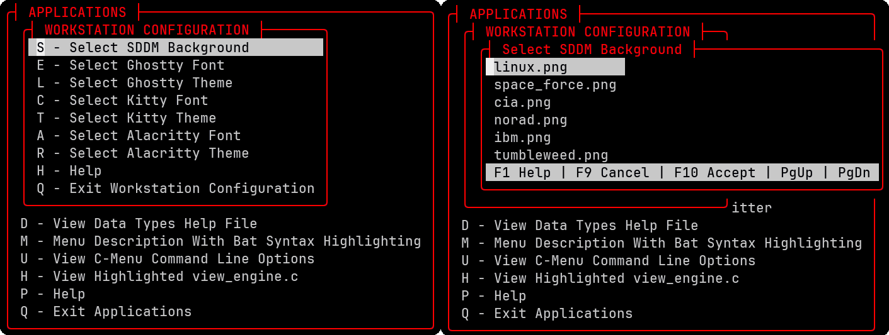
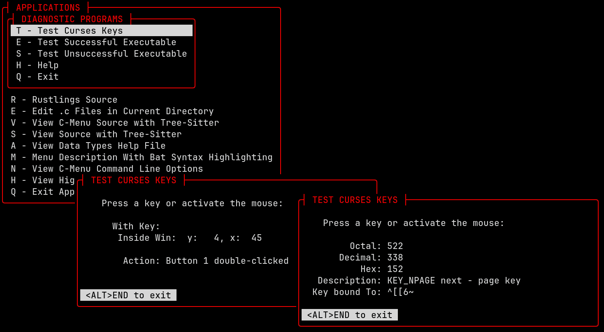
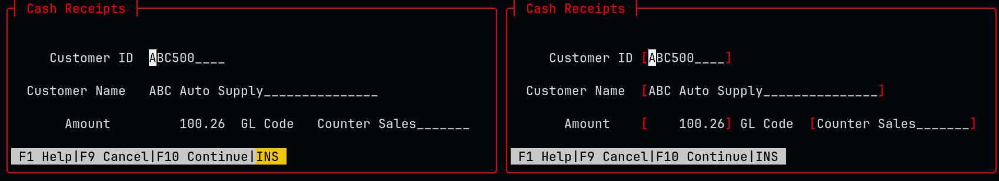
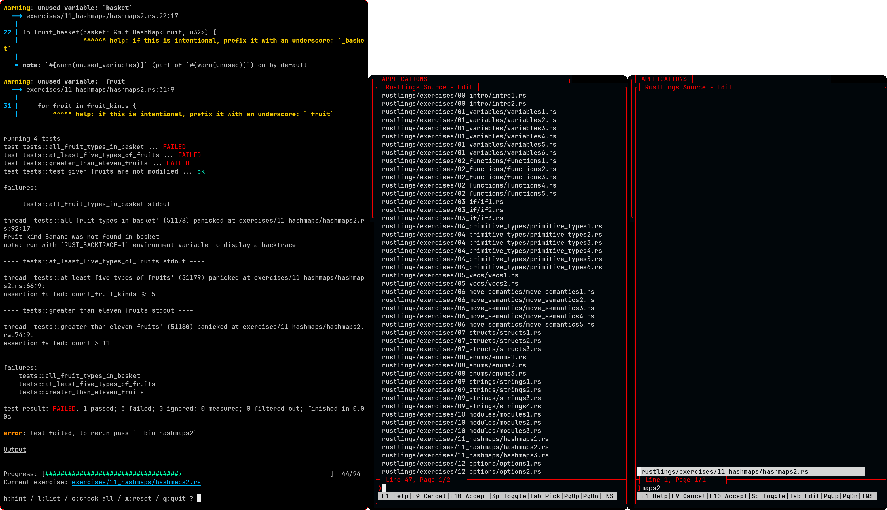
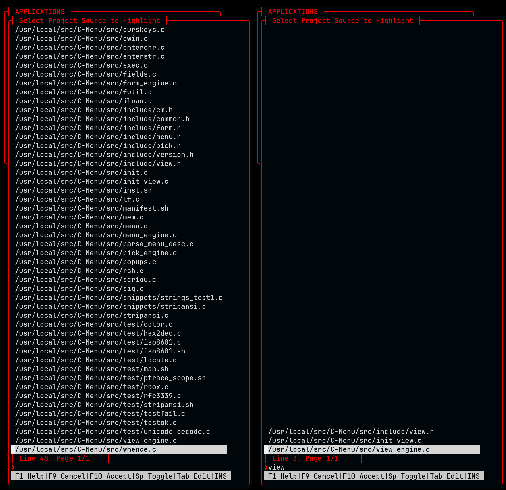
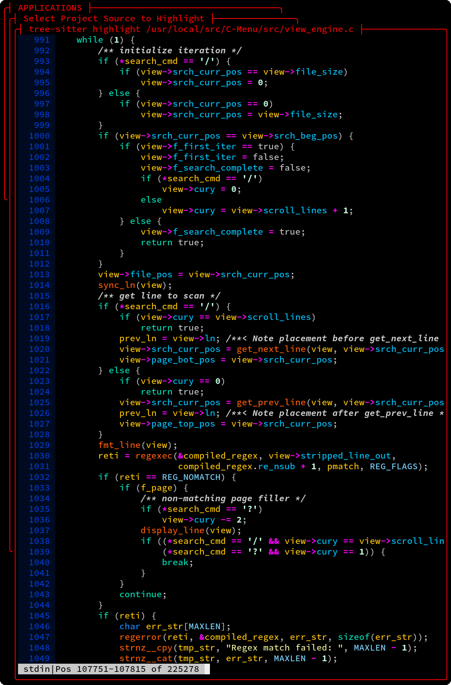

<!-- mtoc-start -->

- [C-Menu Menu](#c-menu-menu)
- [Menu Line-by-Line Breakdown](#menu-line-by-line-breakdown)
  - [Title Line](#title-line)
  - [Text Lines](#text-lines)
  - [Sub-Menus](#sub-menus)
- [C-Menu Form](#c-menu-form)
  - [Description File](#description-file)
    - [Text](#text)
    - [Fields](#fields)
    - [Directives](#directives)
  - [Form Usage](#form-usage)
  - [Example](#example)
  - [Workflow](#workflow)
    - [C-Menu Pick Usage](#c-menu-pick-usage)

<!-- mtoc-end -->

This section will break down Example C-Menu Applications and explain how they work from the perspective of a developer using C-Menu to build applications. With this understanding, you will be ready to create custom software products that are intuitive, uniform, dependable, flexible, appealing, and fast with a minimal footprint.

---

## C-Menu Menu


The menu above is intended to demonstrate a variety of features and techniques that can be applied to your projects. It is not meant to be a practical menu for everyday use, but rather a showcase of what is possible with C-Menu. Think of yourself as an artist and C-Menu as your canvas. What will you create?

Below is an example of source defining the above menu. This is the part you design as the top-level framework for your application. C-Menu uses a building-block approach to integrate C-Menu internals, external applications, scripts, and executables, as you will see in just a moment. C-Menu includes a set of useful and powerful components you assemble like Leggos to create innovative software products. C-Menu's main components include Menu, Form, Pick, View, RSH, lf, and C-Keys, each of which will be explained in detail in the following sections.


Lets examine the Menu source above and break down how it works. The source file is a simple text file that contains a series of User Choices and Commands.

Lines beginning with ":" are the User Choices.

Lines beginning with "!" are commands to be executed by Menu when the corresponding menu item is selected. These commands can be used to invoke internal C-Menu functions execute external commands, and run shell scripts.

---

## Menu Line-by-Line Breakdown

Lines beginning with '#" are comments.

### Title Line

The first text line will be used as the Menu title to be displayed in the top
window border.

```bash
:                APPLICATIONS
```

---

### Text Lines

Subsequent lines beginning with ":" are menu choices that will be displayed in the menu.

The command line, beginning with "!" following each menu choice is executed when the corresponding menu item is selected.

We present these lines in pairs because that's how they work.

```bash
:     Full Screen (root) Shell
!exec rsh
```

---

### Sub-Menus

The following menu item specifies a menu description file,
"workstation_config.m", which will be loaded and displayed when the menu item is selected. This allows you to create nested menus and organize your application into multiple levels of menus.

```bash
:   Workstation Configuration
!menu workstation_config.m
```



---

Diagnostic Tools is another menu item that specifies a menu description file, "diag.m", which will be loaded and displayed when the menu item is selected. This demonstrates how you can create multiple menus for different purposes and link them together through menu items.

```bash
:   Diagnostic Tools
!menu diag.m
```



---

## C-Menu Form

C-Menu Form provides on-screen forms for entering and editing data.

The C-Menu form command specifies a description file which defines the on-screen
form.

### Description File


#### Text

Specification:

```bash
T:line:column:text
```

Example:

```bash
T:5:14:Principal Amount
```

Parameter 1 - "T" designates line type as text

Character 2 - ":" separator used to parse the remainder of the line

Parameter 2 - "5" form window line

Parameter 3 - "14" form window column

Parameter 4 - "Principal Amount" text to display in form window

---

#### Fields

Specification:

```bash
F:line:column:length:data_type
```

Example:

```bash
F:5:33:14:Currency
```

Parameter 1 - "F" designates line type as field

Character 2 - ":" separator used to parse the remainder of the line

Parameter 2 - "5" form window line

Parameter 3 - "33" form window column

Parameter 4 - "14" field length

Parameter 5 - "Currency" data type

---

#### Directives

Specification:

```bash
(C|G|Q)
```

"C" - specifies that the field is a calculated field, which means its value will be calculated by an external executable specified with the -S option in the form command line.

"G" - specifies that the field values are to be received from an external
program specified with the -S option.

"Q" - specifies that field values are to be provided by an external executable
specified with the -S option and parameterized with a key value for a query
operation.

---

### Form Usage

Specification:

```bash
!form -d description_file  \
    [ -i input_file ] &| [ -S executable_provider ] &
    [ -o output_file ] &| [ -R executable_receiver ]
```

Example:

```bash
:     Installment Loan Calculations
!form -d iloan.f -i iloan.dat -S iloan -o iloan.dat
```

The argument specified with option "-d" is the form description file. If no "-d"
option is specified, Form will attach the first non-option argument as its description file.

The form description file, "iloan.f", defines text and fields and their data types. See the Form Description File section above for details on how to define text and fields in the form description file.

The argument specified with option "-i" is the input file from which Form will
read initial field values. If no "-i" option is specified, Form will attach the second non-option argument as its input file.

-S iloan: specifies that the executable "iloan" will be run as a provider (source) of input to the form. Because iloan.f contains a line with the "G", getter directive, Form will display the form populated from the input file, "iloan.dat".

The user can edit the form data and press F10 Accept or F9 Cancel.

If the user presses F10 Accept, Form will execute "iloan" with form data as arguments. "iloan" will process the form data and write the resulting data to standard output. Form reads the resulting data from a pipe and displays the updated form data.

If a "-o" option was specified on the form command line, and the user presses F10 Accept again, the updated data will be written to the output file specified. The user may alternatively press F5 to go back into edit mode.

---

### Example


iloan is a trivial application to demonstrate how to use external executables
with C-Menu Form. For the purpose of demonstration, we shall designate the images above as 1) upper left, 2) upper right, and 3) lower left.

### Workflow

- The user selects the "Installment Loan Calculations" menu item, which executes the form command with the specified description file, iloan.f. Form opens the input file, iloan.dat, reads field data, and displays screen 1) it in the Form window. The user edits the data, changing the Principal Amount to $100,000. The user tabs down to the Payment Amount field and presses enter which erases the field above and to the right of the cursor. (this behavior is controlled by the setting --erase_remainder which is generally set in ~/menuapp/.minitrc) This sets the Payment Amount to zero. When finished editing, the user presses F10 Accept.

- Form displays Screen 2). Because a C, G, or Q directive is specified in the form description file, the chyron (the text line across the bottom of the form window) presents the user with a new set of commands, one of which is F5 Process. The user presses F5 Process, which executes the iloan executable with the form data as arguments.

- If any three of the data values are present and valid, iloan will calculate any remaining value which is set to zero and write the resulting data to standard output. Form displays Screen 3) with the resulting data. If the user enters all four values, iloan will simply output the data as received from Form without performing any calculations. The user can return to edit mode by pressing F5 Edit or F10 Accept to save the data to the specified output-file, iloan.dat.

---

**_Cash Receipts_** also works like Installment Loan Calculations, except no external
executable is specified to process data. Obviously, this menu item is not very
useful as it stands. It is included here as a challenge in some industrious
developer who can write external executables or scripts to provide database interaction and ancillary menu items to track deposit slips and batch numbers and post to general ledger.

```bash
:     Cash Receipts
!form receipt.f -i receipt.dat -o receipt.dat
```



The top screen above demonstrates the use of brackets to enclose fields in the
Form screen. This is a setting that can be specified on the command line or in
the C-Menu configuration file, ~/.minitrc.

Usage Examples:

```bash
brackets=[]
brackets={}
```

The bottom screen above demonstrates the use of fill characters to fill the
blank space in fields. This is also a setting that can be specified on the command line or in the C-Menu configuration file, ~/.minitrc.

Usage Examples:

```bash
fill_character=_
fill_character=.
```

---

#### C-Menu Pick Usage

C-Menu Pick displays a list of items from which the user can select.

Specification:

```bash
!pick [ -n maximum_number_of_selections ][-m] \
    [ -i input_file ][ -S executable_provider ] \
    [ -o output_file ][ -c executable %% ]
```

-n maximum_number_of_selections. "-n n" is a convenience which directs Pick to automatically accept selections when the specified maximum number of items, "n" have been selected. For example, "-n 1" is commonly used to direct Pick to automatically accept the first item selected without requiring the user pressing to F10 Accept key. This feature is designed to optimize the user's economy of motion, making the selection process extremely fast and efficient. When "-n 1" is specified, the user can simply select an item and Pick will immediately dispatch the specified action.

-c execute command substituting "%%" with the selected item(s). Whether the
command specified with the -c option is executed once per selection or once for
all selections is determined by the presence or absence of the "-m option". Without the "-m" option, by default, if multiple items are selected, the command specified with -c will be executed once for each selection with that selection as an argument.

-m multiple_arguments flag. The -m option directs Pick to construct a command line with all selections as individual arguments. The specified command is executed once with all selections combined as individual arguments on a single command line.

An example use case for "-m" would be if you wanted to open multiple files in
C-Menu View using View's ":n" and ":p" commands to navigate between files. In that case, you would specify "-m" to have Pick execute View once with all selected files as arguments, allowing you to use View's built-in file navigation features. The same technique works with Vim, nvim, and less.

-i input_file directs Pick to read input from the specified file

-S executable_provider directs Pick to execute the specified external command
and read input from the command's standard output. The command specified with the -S option is executed when starting Pick, and its output is used as the list of items from which selections are made.

-o output_file directs Pick to write selected items to the specified file when the user presses F10 Accept.

Pick must have exactly one input method, either -i input_file or -S executable_provider_command. Combining -o and -c options is permissible, and will direct Pick to write the list of selected items to the specified file and also pass the list of selected items to the command specified by -c according to the presence or absence of the -m option. The selections are written to file before executing the specified command, so the command can read the selections from the file if needed.

Example:

```bash
:     Rustlings Source
!pick -S rust_src -n 1 -T "Rustlings Source - Edit" -c nvim %%
```

-S specifies a script, "rust_src", located in ~/menuapp/bin, which calls lf to
create a sorted file list.

Below are the contents of "rust_src", a shell script. We use a shell script here instead of direct execution because we need to pipe the output through sort. It's still fairly quick. The "lf" command generates a list of Rust source files from the "exercises" directory, which is part of the Rustlings project.

```bash
# @name rust_src
lf rustlings -d 5 'exercises.*\.rs$' | sort
```

The "-n 1" option directs Pick to proceed with executing the command specified
by the "-c nvim %%" option after 1 file is selected. If "-n 1" were not specified, Pick would wait for the user to press F10 Accept before executing the command specified by the "-c nvim %%" option.

The -c nvim %% substitutes the "%%" with the selected file and Pick executes  
nvim. If the "-n 1" option hadn't been specified, Pick would allow the user to
select multiple files and press F10 Accept to accept those selections. In that case, nvim would be executed with multiple files as arguments, and the user could use nvim's ":n" and ":p" commands to open the files selectively. The "-n" option can also be used to specify the maximum number of selections before Pick automatically accepts and launches the specified executable.

The use of "-S rust_src"" would be equivalent to "rust_src | pick" if we were
executing pick as a stand-alone executable. In this instance, Pick launches "rust_src" and creates a pipe to receive its output".



The center window above shows Pick as it appears just after selecting Rustlings Source in the Applications Menu.

The user presses <tab> to activate the line editor and types "maps2", the last few
characters of the exercise name, and the Pick window on the right appears. The
"maps2" expression filtered out all but one file name. So, the user presses <tab><spacebar> and the selected rust source file opens in nvim. If there had been more than one file listed, the user could select a file with the mouse, arrow keys, or j for down, k for up, and when the desired file is highlighted, press <spacebar> to select. When you use the mouse to select, it is not necessary to press the <spacebar>.

When finished editing, the user can type <shift>"zz" to exit nvim. When nvim closes, the user will be returned to the Pick window as it was before selecting the file. The user can type <tab><backspace><3><tab><spacebar> and nvim opens the next rust source file in sequence, hashmaps3.rs. This is a very quick and effortless way to step through the Rustlings exercises, but it can also apply to many other situations.

---

Edit .c Files in Current Directory is an example of how to use C-Menu lf and Pick to
navigate and select files from a directory. Once a file is selected, it is passed to the nvim.sh script to be opened in Neovim. This demonstrates how you can integrate C-Menu with external applications and scripts to create a seamless user experience.

```bash
: Edit .c Files in Current Directory
!pick -S project_src -T "Project Tree - Select File to Edit" -c nvim.sh %%
```

Actually, the above command line is a good example of how to write inefficient
and unnecessary code. That's 100ms wasted each time you select that menu option. (-: :-) The nvim.sh script is not necessary. The command line could be written more efficiently as follows, which eliminates the need for an external script and directly opens the selected file in Neovim.

The command line below demonstrates the preferred method of starting nvim.

```bash
: Edit .c Files in Current Directory
!pick -S project_src -T "Project Tree - Select File to Edit" -c nvim %%
```

Also, if you have a situation in which the script, "project_src" could be
replaced by a direct command line, such as "lf -d 5 '.\*\.c$'", that would be more efficient than using an external script. The command line below demonstrates how to directly use the "lf" command to generate a list of .c files in the current directory and its subdirectories, without the need for an external script.

```bash
: Edit .c Files in Current Directory
!pick -S "lf -d 5 '.*\.c$'" -T "Project Tree - Select File to Edit" -c nvim %%
```

Look Mom! No scripts! Just direct command lines. This is the most efficient way to write your menu commands, but it may not always be the most practical or maintainable way, especially if you have complex command lines that are difficult to read and understand. In those cases, using shell scripts can help simplify your command lines and make them more readable and maintainable.

---

**_View C-Menu Source with Tree-sitter_** demonstrates how to use shell scripts to
simplify complex command lines. The command line below uses a shell script , "tree-sitter highlight", to apply syntax highlighting to the selected source file using Tree-Sitter.

```bash
: View CMenu Source with Tree-Sitter
!pick -S project_src -n 1 -T "Select Project Source to Highlight" -c "view -L 60 -C 85 -S \"tree-sitter highlight %%\""
```




It is not necessary to use a filter expression in Pick. You can just as easily
mouse click the particular file you want to select. However, it comes in handy
when you have several pages of files.

This image of the View window has line numbers because f_ln is set to true in
the C-Menu configuration file. If you don't have f_ln set to true in the
configuration file, you can also use "-N" on the command line to enable line numbers. If you have f_ln set to true in the configuration file, and you don't want line numbers, you can specify "-Nf" on the command line to disable line numbers for that particular view instance.

---

View Source With Tree-Sitter is an example of another complex command line that uses
two shell scripts, "src" and "ts_hl.sh". The "src" script is used to navigate to the source directory and select a file, while the "ts_hl.sh" script is used to apply syntax highlighting to the selected file using Tree-Sitter. This demonstrates how you can use shell scripts to create powerful and flexible commands that can be easily reused across your application. It's up to you to balance the trade-offs between efficiency and maintainability when deciding whether to use direct command lines or shell scripts in your menu commands.

```bash
: View Source with Tree-Sitter
!pick -S src -n 1 -T "Select Source File to Highlight" -c "view -L 60 -C 85 -S \"ts_hl.
sh %%\""
```

---

View C-Menu Command Line Options is an example of a sneaky way to optimize your
menu help. Instead of writing a complicated command line to display the
C-Menu help file with syntax highlighting, we can highlight the file in advance
and save the highlighted file as menu.help. Then, we can simply execute the
view command directly, specifying the highlighted file as an argument. This
eliminates the need for an external script and allows us to display the highlighted help file with a simple and efficient command line.

```bash
: View C-Menu Command Line Options
!view -Nf -L66 -C75 ~/menuapp/help/menu.help
```

---

Finally, a super simple command line that does two things, it closes the
current menu and returns to the previous menu.

```bash
!return
```

---
