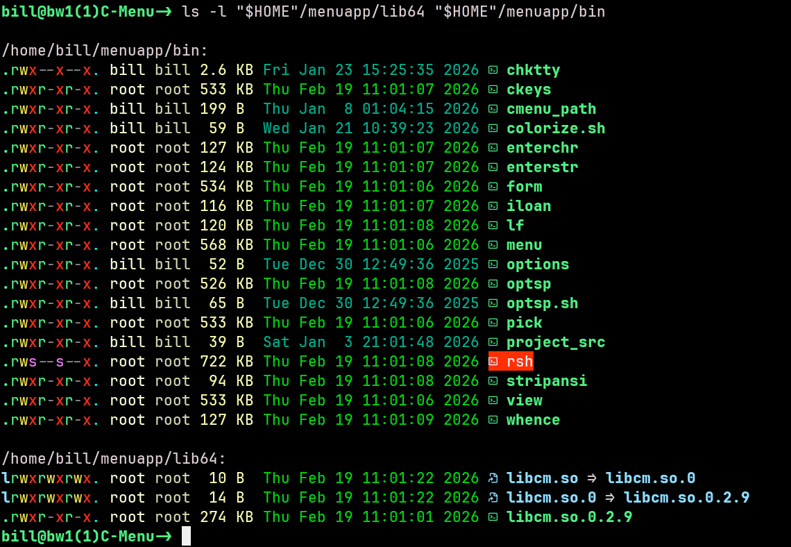
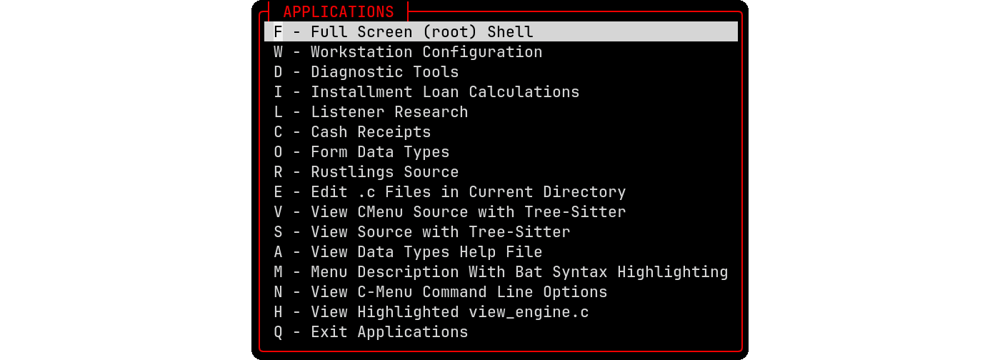

# C-Menu - A User Interface Toolkit


## C-Menu INSTALLATION

The instructions below will guide you through the process of installing C-Menu on your Linux system.

---

## Environment Configuration

- Configure your environment to use the C-Menu binaries and libraries:

Prepend the C-Menu bin directory to your PATH environment variable by adding the following line to your shell profile (e.g., ~/.bashrc or ~/.zshrc). Assuming you extracted the menuapp directory to your home directory, the line would look like this:

```bash
export PATH="$HOME"/menuapp/bin:"$PATH"
```

---

### Download and Install C-Menu Source

Currently, building from source is the recommended way to install C-Menu, as it ensures that you have the latest features and bug fixes.

```bash
gh repo clone BillWaller/C-Menu
```

- Copy the menuapp directory to your desired location:

```bash
cp -r C-Menu/src/menuapp /home/yourusername/
```

---

#### Prerequisites

- One of:
  - CMake 3.20 or higher, or
  - GNU Make 4.3 or higher
- A C compiler that supports C23 or later (e.g., GCC 13 or later, Clang 15 or later)
- GNU GLIBC development files
- GNU Math Library (libm) development files

One or both:
- NCursesw development libraries 6.5 or later
- Notcurses development libraries v3.0.17 or later

---

## To Build the C-Menu Binaries and Libraries

Change to the source directory, C-Menu/src, and type:

```bash
./chkui
```

The script should respond with a message similar to the following:

```bash
menu linked with ncurses
CMake - NCURSES
Makefile - NCURSES
```

If these are the options you want, proceed with the build:
To switch from NCURSES to NOTCURSES or vice versa, run the chkui script again
with the "-s" option.

```bash
./chkui -s
```

The script should respond with a message similar to the following:

```bash
menu linked with ncurses
CMake - NCURSES
Makefile - NCURSES
CMake switching to NOTCURSES
Makefile switching to NOTCURSES
```

---

To build with CMake, remain in the source directory, C-Menu/src, and type:
```bash
./cmake.sh
```
This will create a build directory if it doesn't already exist. After the
cmake.sh script finishes, change to the build directory and type:

```bash
make
make install
```

---

To build with GNU Makefile, remain in the source directory, C-Menu/src, and type:
```bash
make
make install
```

---

### Finish the installation

- Vrify that the C-Menu libraries and binaries have been installed to the
  correct directories (e.g., /home/yourusername/menuapp/lib64 and
  /home/yourusername/menuapp/bin) and that the permissions are set correctly.

```bash
ls -l "$HOME"/menuapp/lib64 "$HOME"/menuapp/bin
```



- Register the C-Menu libraries with the dynamic linker by running the
  following command:

```bash
sudo ldconfig -v "$HOME"/menuapp/lib64
```

- Add the C-Menu bin directory to your PATH environment variable by adding the
  following line to your shell profile (e.g., ~/.bashrc or ~/.zshrc):

```bash
export PATH="/home/yourusername/menuapp/bin:"$PATH"
```

(replace /home/yourusername with the actual path to your menuapp directory) and
save the file. 😆

- Copy the sample minitrc from the C-Menu/menuapp directory to your home directory:

```bash
cp "$HOME"/menuapp/minitrc "$HOME"/.minitrc
```

- Edit the ~/.minitrc file to customize your C-Menu configuration as needed.

```bash
vi ~/.minitrc
```

- Source your shell profile to apply the changes to your PATH:

```bash
source ~/.bashrc
```

- Start C-Menu by running the following command in your terminal:

```bash
menu
```


