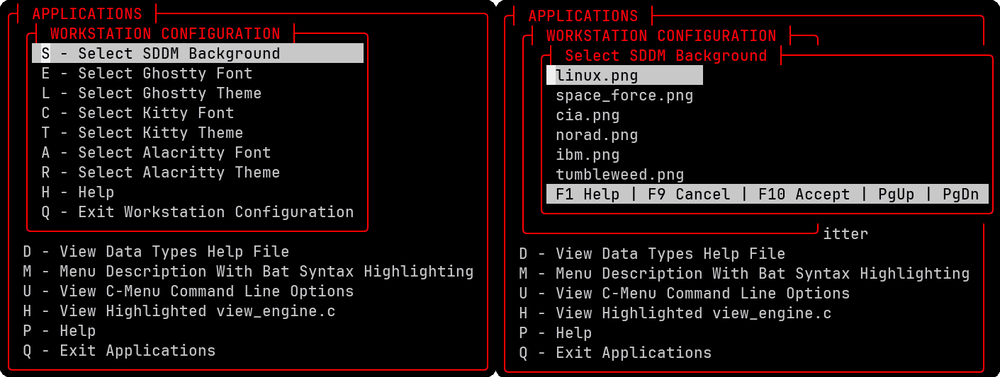
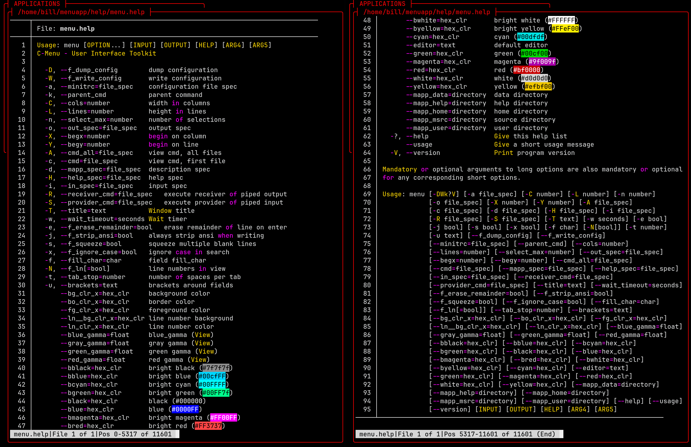
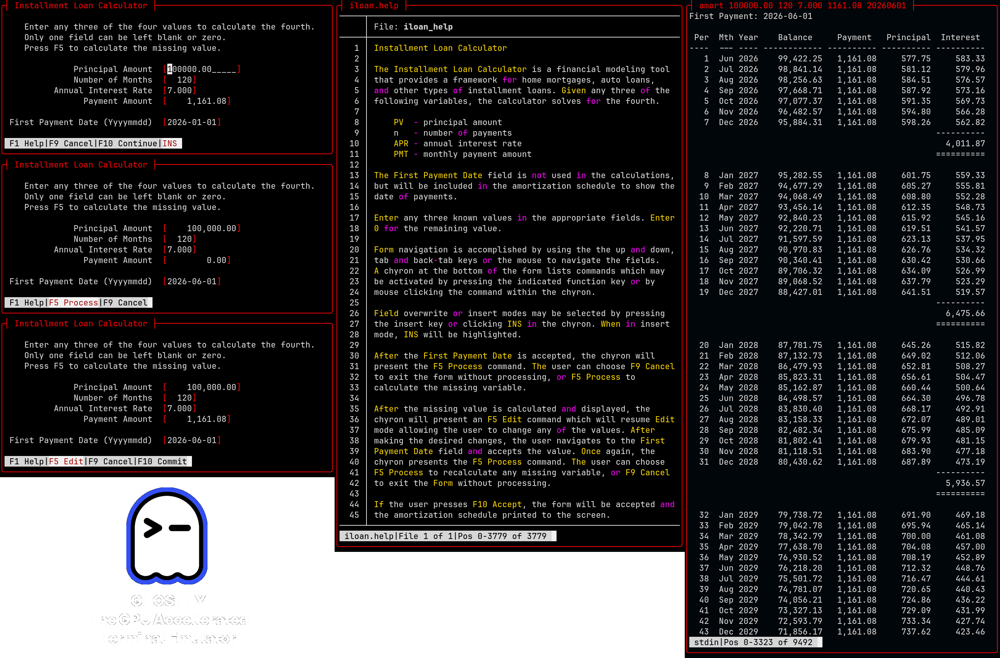
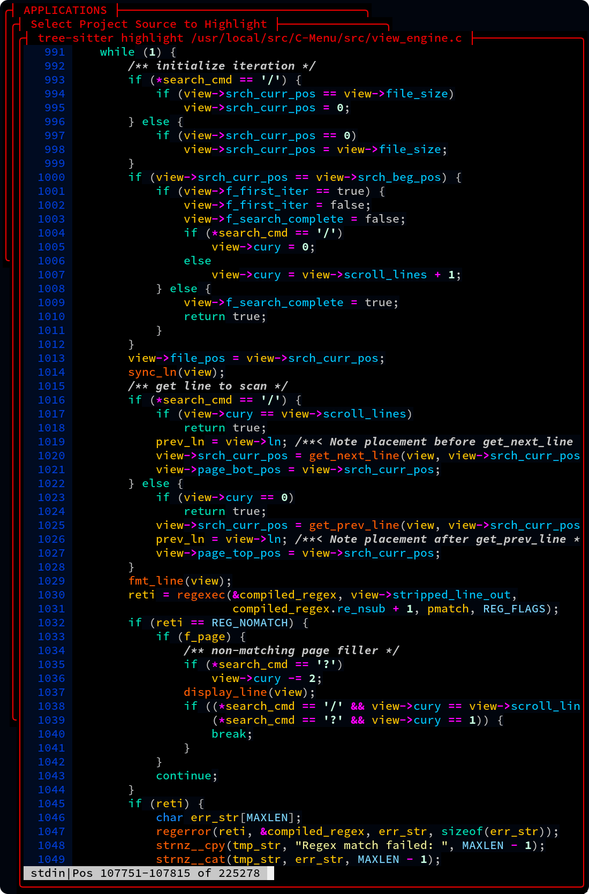
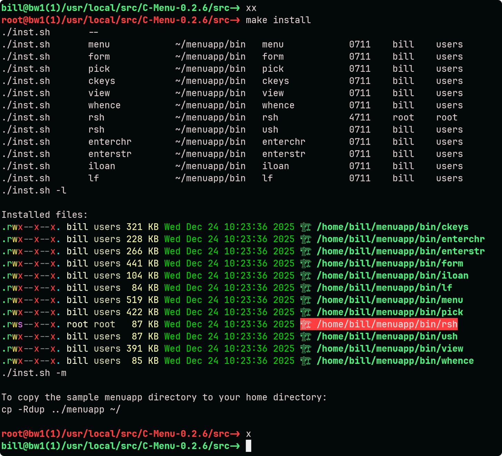
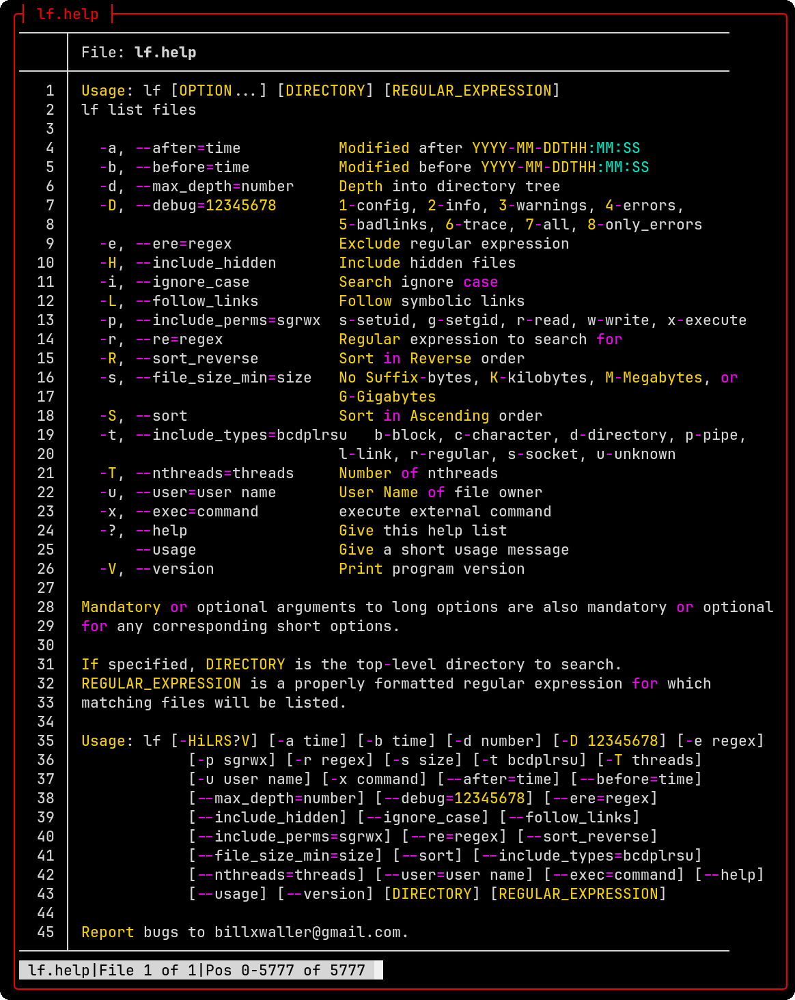
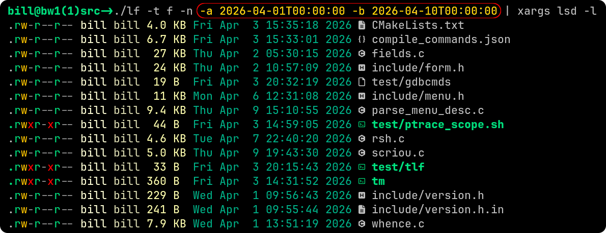
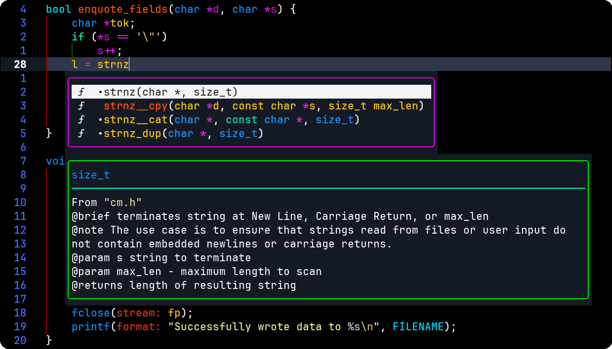
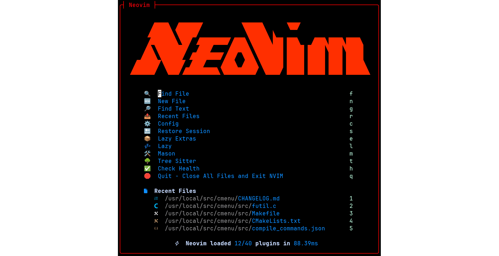

# C-Menu - A User Interface Toolkit

## Table of Contents

<!-- mtoc-start -->

* [Introduction](#introduction)
* [C-Menu Previews](#c-menu-previews)
  * [Pick and View](#pick-and-view)
  * [Menu](#menu)
  * [Form](#form)
  * [View - A pager for viewing files](#view---a-pager-for-viewing-files)
  * [RSH - A Root Shell Alternative](#rsh---a-root-shell-alternative)
  * [lf - A Regular Expression File Finder](#lf---a-regular-expression-file-finder)
* [API](#api)
  * [Completions in Neovim](#completions-in-neovim)
  * [Performance and Footprint](#performance-and-footprint)

<!-- mtoc-end -->

You may also be interested in the [C-Menu User Guide](C-Menu-UG.md)

## Introduction

C-Menu is a user interface development toolkit that gives you the ability to quickly and easily build functional, intuitive, and attractive applications with minimal effort and a tiny footprint. Because C-Menu is written in C and terminal-based, it is perfect for resource constrained environments such as embedded, server, SOC, IOT, DEVOPS, and CI/CD pipelines, or any other situations in which a GUI might be impractical or undesirable.

C-Menu is also ideal for developers who prefer to work in a terminal environment and want to create powerful applications without the overhead of a GUI framework. C-Menu provides a wide range of components and tools for building menu-driven interfaces, including hierarchical menus, on-../screen forms, object selection, file viewing, and more. With C-Menu, you can create applications that are both efficient and user-friendly, making it a great choice for a wide range of use cases.

You may also be interested in [C-Menu Comprehensive HTML Documentation](https://decision-inc.com)

---

## C-Menu Previews

This preview contains screenshots of just a few of the many features included in C-Menu.

### Pick and View

Below are screenshots of the UAL features in view, which allow you to view not only
text files, but multi-media files as well. As you move the selector bar a preview of each file is displayed on the screen. This includes text and image files. View is like a modern version of less.

### Menu

In typical use, C-Menu requires only a few lines of code to create hierarchical menus with multiple levels of sub-menus. The Applications Menu contains an eclectic set of selections designed to demonstrate the diversity of the C-Menu toolkit.

C-Menu is highly customizable, and provides a wide range of options for creating unique and engaging interfaces. The help ../screens below show some of the options available for customizing the appearance and behavior of C-Menu's components.

---

### Form

Enter, edit, validate, process, and submit data. Notice the chyron at the bottom of the ../screen, which provides helpful instructions and feedback to the user. Of course, all C-Menu components provide navigation by mouse and keyboard, and in many cases by the standard h, j, k, and l keys that programmers are accustomed to.

---

### View - A pager for viewing files

View has Unicode support, line numbering, regular expression searching, and a
large virtual pad for horizontal scrolling. View works great with tree-sitter,
source-highlight, pygments, bat, manual pages, and other syntax highlighters.
View doesn't alter the file you are viewing. It uses the highlighter in a
pipe, and reads the output, so the original file is never changed. And, if
you happen to have a file that has been highlighted by another application,
view can strip the ANSI codes for convenient editing. View is lightning fast,
especially with huge log files.

Why is View so fast? Even if an application has a super-fast buffering scheme,
it still has to wait on the kernel to provide data, and then copy data into it's
own buffers, duplicating work the Kernel has already done. Why waste the time
and memory? To be fair, we must appreciate that many applications were written
before direct accesses to the Kernel's demand paged virtual address space was
available. Whatever the reason, View takes advantage of direct-to-Kernel memory
mapped files to achieve maximum performance, reliability, and resource economy.
If you work with large datasets, you will love view. No fluff, no bloat, no
nonsense, just blazing fast performance.

View is great for viewing log files with horizontal scrolling or smart word
wrapping.

---

### RSH - A Root Shell Alternative

**_RSH_** - RSH provides an alternative to su and sudo for executing commands
with elevated privileges. It allows developers and system administrators to
get in and out of root shells and execute commands with root privileges
without the need for a password, for example, by authenticating with an ssh
key as you would on gethub.

In the following example, make install requires root privilege, so the user
types xx, is authenticated with an ssh key, and then types make install.
When the make install is finished, the user types x to exit the root shell
and relinquish root privilege.

- The Green prompt indicates user privilege, and Red indicates root privilege.

---

### lf - A Regular Expression File Finder

**_lf_** - is a sleek, easy-to-use, and fast alternative to the Unix find command. The name, lf, can be thought of in the imperative sense as "list files", or in the noun sense, "lightweight find."

The ../screenshot above is the help output of lf -? (help) piped through bat and displayed in View.

The ../screenshot above is an example of how you might use the date-time options
of lf to list files between two date-times (after and before) and the sample
output. lf is definitely intuitive and very easy to use.

There is certainly nothing wrong with find or fd. Both work great with C-Menu,
so you can use whichever you prefer. However, lf is designed to be portable, super easy to use, and fast.

---

## API

**_API_** - C-Menu provides a simple and consistent API for creating menu-driven
user interfaces in C. The API includes tools specific to C-Menu, but also many
general purpose tools that can be used in a wide range of applications. The API
documentation is available in html and integrated into Neovim's completion
engine, making it convenient for developers to learn and use the API effectively.

---

### Completions in Neovim

C-Menu's API documentation is integrated into Neovim's completion engine, providing developers with easy access to API information and examples while they code. This integration allows developers to quickly look up function signatures, parameter descriptions, and usage examples without leaving their coding environment, enhancing productivity and making it easier to learn and use the C-Menu API effectively.

Hopefully, you will not find this plug for Neovim, LazyVim, and Lazy.Nvim too gratuitous as they are not prerequisites for C-Menu. Nevertheless, they do add considerably to the development experience. The ../screen below is the LazyVim dashboard in Neovim.

---

### Performance and Footprint

All of the C-Menu binaries, including executables and libcm.so are less than
350k, a tiny footprint for such powerful tools, and no GUI is required. The
only dependencies are the GNU C Library, GNU Math Library, NCursesw, and a
terminal emulator.

Oh, and C-Menu is free, distributed under the MIT License.

Are you ready to get started? Below, you will find several options for
installing C-Menu on your Linux system. I haven't yet provided a packaged
binary distribution, but that will be coming soon in version 0.3.0.

Choose the option that best suits your needs and follow the instructions to get
C-Menu up and running on your system.

---
