# Augmenting C-Menu

## Get C-Menu on Github

Click the link below to access the C-Menu Documentation:

[C-Menu on Github](https://decision-inc.com)

[Download C-Menu from Github](https://github.com/BillWaller/C-Menu.git)

```bash
gh repo clone BillWaller/C-Menu
```

---

## Table of Contents

<!-- mtoc-start -->

- [Introduction](#introduction)
- [Installing Rust](#installing-rust)
  - [Installing Rust On Linux and macOS](#installing-rust-on-linux-and-macos)
- [About C-Menu and R-Menu](#about-c-menu-and-r-menu)
- [Installing Bat](#installing-bat)
  - [Bat On Linux](#bat-on-linux)
  - [Bat On macOS](#bat-on-macos)
  - [Bat On Windows](#bat-on-windows)
- [Installing Ripgrep](#installing-ripgrep)
  - [Ripgrep On Linux](#ripgrep-on-linux)
  - [Ripgrep On macOS](#ripgrep-on-macos)
  - [Ripgrep On Windows](#ripgrep-on-windows)
- [lsd](#lsd)
  - [lsd On Linux](#lsd-on-linux)
  - [lsd On macOS](#lsd-on-macos)
  - [lsd On Windows](#lsd-on-windows)
- [Highlighting](#highlighting)
- [Tree-Sitter](#tree-sitter)
  - [Tree-Sitter On Linux](#tree-sitter-on-linux)
  - [Tree-Sitter On macOS](#tree-sitter-on-macos)
  - [Tree-Sitter On Windows](#tree-sitter-on-windows)
- [Tree-Sitter-CLI](#tree-sitter-cli)
  - [Tree-Sitter-CLI On Linux](#tree-sitter-cli-on-linux)
  - [Tree-Sitter-CLI On macOS](#tree-sitter-cli-on-macos)
  - [Tree-Sitter-CLI On Windows](#tree-sitter-cli-on-windows)
- [Tree-Sitter Parsers](#tree-sitter-parsers)
  - [Tree-Sitter Parsers On Linux](#tree-sitter-parsers-on-linux)
  - [Tree-Sitter Parsers On macOS](#tree-sitter-parsers-on-macos)
  - [Tree-Sitter Parsers On Windows](#tree-sitter-parsers-on-windows)
  - [Testing Tree-Sitter](#testing-tree-sitter)
- [Rustlings](#rustlings)
- [Neovim](#neovim)
- [Neovim Configuration](#neovim-configuration)
  - [Custom Highlights](#custom-highlights)
  - [Norcalli Colorizer](#norcalli-colorizer)
    - [AI Overview of Developer Norcalli](#ai-overview-of-developer-norcalli)
  - [To Install Norcalli's nvim-colorizer.lua](#to-install-norcallis-nvim-colorizerlua)
- [Folke's Snacks.nvim](#folkes-snacksnvim)
  - [AI Overview of Developer Folke](#ai-overview-of-developer-folke)
    - [To Install Folke's LazyVim](#to-install-folkes-lazyvim)
    - [To Install Folke's Snacks.nvim-colorizer](#to-install-folkes-snacksnvim-colorizer)
    - [To Use the Neovim Unicode Art in Snacks.nvim](#to-use-the-neovim-unicode-art-in-snacksnvim)
- [Neovim Linkage to the C-Menu API](#neovim-linkage-to-the-c-menu-api)
- [Ghostty](#ghostty)
  - [Ghostty On Linux](#ghostty-on-linux)
  - [Ghostty On macOS](#ghostty-on-macos)
  - [Ghostty On Windows](#ghostty-on-windows)
- [Useful Configurations](#useful-configurations)
  - [Alternate Bash Executable](#alternate-bash-executable)
  - [Shell Configuration](#shell-configuration)
  - [Customize Your Terminal Emulator](#customize-your-terminal-emulator)
    - [Fonts](#fonts)
    - [Example Terminal Configurations](#example-terminal-configurations)
      - [Ghostty Configuration](#ghostty-configuration)
      - [Kitty Configuration](#kitty-configuration)
      - [Alacritty Configuration](#alacritty-configuration)
- [Additional Resources](#additional-resources)
  - [Let's Get Rusty](#lets-get-rusty)
  - [Folke](#folke)
  - [Other Resources](#other-resources)
- [Conclusion](#conclusion)

<!-- mtoc-end -->

## Introduction

C-Menu is a powerful C-based suite of programs that you can use to create
a front-end infrastructure for applications. It includes Menu, Form, Pick,
View, lf (list files), C-Keys, and RSH. Howver, the C-Menu examples
rely on software that may not be included in all OS distributions.
You may very well already have some or all of these tools installed.

Because Rust's Cargo, is generally the easiest to use, and most
dependable, the installation methods described in this document use
Cargo wherever practical. You may prefer to use another package manager,
and most Distro Package Managers are exceptional. If so, please refer to
the documentation for that package manager for installation instructions.

This guide will walk you through the installation process for Rust and
some of the most useful tools that complement C-Menu.

Not all of these applications are written in Rust. Ghostty is written in
Zig and Neovim is written in C. I havent listed the terminal emulators,
Kitty or Alacritty, but I have used both and they are excellent terminal
emulators. I have all three installed on my desktop. I use Ghostty most
because it lives up to the ethos of Rust. It's solid, fast, and reliable.

The ability to span the two worlds of C and Rust is far more valuable than
being proficient in either language, and one computer language is never
enough.

By using C-Menu now, and better yet, contributing to the C-Menu project,
you can gain first-hand knowledge of the transition to Rust, shape the
future of the tool, and add software migration expert to your skill set.

## Installing Rust

C-Menu is written in C, but there are many amazing tools written in Rust that
can augment your experience using C-Menu. Even if you never plan to write code
in rust, the Cargo package manager that comes with Rust is worth the effort to
install Rust. You will notice immediately that Cargo is the easiest and most
reliable way to install Rust-based tools and their dependencies. Below are
instructions on how to install Rust and some of my favorite Rust-based tools.

So much for the preamble. Let's jump in.

---

### Installing Rust On Linux and macOS

Run the following in your terminal, then follow the onscreen instructions.

```bash
curl --proto '=https' --tlsv1.2 -sSf https://sh.rustup.rs | sh
```

For more detailed instructions, visit

[the official Rust installation page](https://www.rust-lang.org/tools/install)

After installation, ensure that your environment is set up correctly by running:

```bash
source $HOME/.cargo/env
```

You can verify the installation by checking the Rust version:

```bash
rustc --version
```

This should display the installed Rust version, confirming that Rust is
successfully installed on your system.

You can update Rust and Cargo at any time by running:

```bash
rustup update
```

---

## About C-Menu and R-Menu

Eventually, if there is enough interest in C-Menu, it will be ported to Rust.
The plan is to thoroughly test and debug the C version, and incrementally
incorporate Rust-like coding paradigms into the C codebase. Once the C version
is stable and feature complete, we begin the porting process, we will begin
refactoring C-Menu to use more modular code structures and rust-like paradigms
that will facilitate the eventual port to Rust.

Come along with us on this exciting journey. If you already know Rust, we
could use your help. If you don't know Rust, you can learn with us.
You can contribute to R-Menu's evolution, and get involved in the Rust
community. Add Rust to your CV or Resume.

And, then you can say, you were a part of the team that created R-Menu. 😀

---

## Installing Bat

Bat is a popular Rust-based tool that serves as a cat clone with syntax
highlighting. It's easier to install and accommodates a variety of file
types not addressed by Tree-Sitter. To install Bat, use the following
commands based on your operating system:

### Bat On Linux

After installing Rust, you can install Bat using Cargo, Rust's package manager:

```bash
cargo install bat
```

### Bat On macOS

```bash
brew install bat
```

### Bat On Windows

```powershell
choco install bat
```

After installation, you can verify that Bat is installed correctly by running:

```bash
bat --version

```

This should display the installed Bat version, confirming that Bat is successfully
installed on your system.

---

## Installing Ripgrep

Ripgrep is a modernized and powerful replacement for grep. It is amazingly fast
and incorporates many features not available in grep.

To install Ripgrep, you can use the following commands depending on your
operating system

### Ripgrep On Linux

After installing Rust, you can install Ripgrep using Cargo, Rust's package manager:

```bash
cargo install ripgrep
```

### Ripgrep On macOS

```bash
brew install ripgrep
```

### Ripgrep On Windows

```powershell
choco install ripgrep
```

After installation, you can verify that Ripgrep is installed correctly by running:

```bash
rg --version
```

This should display the installed Ripgrep version, confirming that Ripgrep
is successfully installed on your system.

---

## lsd

To install lsd, a modern replacement for 'ls' with colorful output and additional
features, you can use the following commands based on your operating system:

### lsd On Linux

After installing Rust, you can install lsd using Cargo, Rust's package manager:

```bash
cargo install lsd
```

### lsd On macOS

```bash
brew install lsd
```

### lsd On Windows

```powershell
choco install lsd
```

After installation, you can verify that lsd is installed correctly by running:

```bash
lsd --version
```

This should display the installed lsd version, confirming that lsd is successfully
installed on your system.

A word of caution here, "lsd" in a different context, is an acronym for a
powerful hallucinogenic drug. Don't tell your grandmother you use lsd without
explaining that it's "ls Deluxe", a file listing utility, and not the "LSD"
she remembers from her college days at UC Berkeley. 😎

---

## Highlighting

Highlighted text is more pleasing to most, but there is more to it than mere
aesthetics. Highlighting can improve code readability and comprehension,
making it easier to identify syntax errors, keywords, and other important
elements in the code. This can lead to increased productivity and reduced
errors when working with code.

Currently, there is no shortage of software for highlighting, and most are
easy enough to install and use. Here are a few popular options:

GNU's Source Highlight is a widely used and very capable tool. It works
well with a large number of programming languages. It works better with
some than others.

Pygments, is another popular syntax highlighter written in Python. Pygments
also offers a wide variety of language support and customization options.

I have found the Rust-based tool, bat, to perform spectacularly in some
applications, but not so well in others. It's a relatively new tool, so
you will have to be patient with a few glitches in the edge cases.

Lastly, there is Tree-Sitter, which is a powerful and efficient parsing
library that can be used for syntax highlighting and code analysis. It
deserves it's own section. Keep reading.

---

## Tree-Sitter

To put it mildly, Tree-Sitter is a game-changer when it comes to parsing and
analyzing source code. It provides a robust and efficient way to build
incremental parsers for programming languages, enabling advanced features like
syntax highlighting, code folding, and more. Tree-Sitter is widely adopted in
various code editors and IDEs, making it an essential tool for developers who
work with code on a regular basis.

The syntax highlighting provided by Tree-Sitter is top-notch, offering
precise and context-aware highlighting that enhances code readability and
understanding. It can handle complex language constructs and edge cases that
traditional syntax highlighters often struggle with.

In a phrase, it'll knock your socks off! 😮


Tree-Sitter works with Neovim, C-Menu, and many other editors and pagers to
provide advanced syntax highlighting and code analysis features.

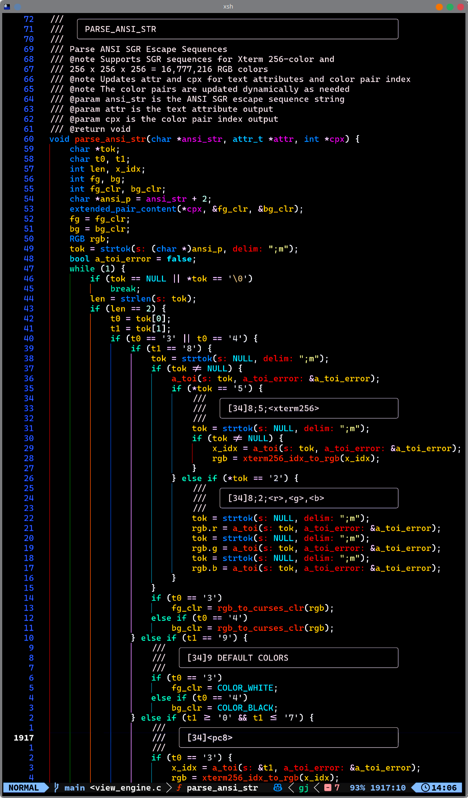

To install Tree-Sitter, you can use the following commands depending on your
operating system.

### Tree-Sitter On Linux

After installing Rust, you can install Tree-Sitter using Cargo,
Rust's package manager. Cargo install is designed for programs, and the
tree-sitter package consists of libraries, so it has to be installed as
a dependency. Insert a line in the Dependency section of any Cargo.toml
and type "cargo add tree-sitter".

```cargo
[Dependencies]
tree-sitter = "0.26.5"
```

```bash
cargo add tree-sitter
```

### Tree-Sitter On macOS

```bash
brew install tree-sitter
```

### Tree-Sitter On Windows

```powershell
choco install tree-sitter
```

After installation, you can verify that Tree-Sitter is installed correctly by running:

```bash
tree-sitter --version
```

This should display the installed Tree-Sitter version, confirming that Tree-Sitter
is successfully installed on your system.

---

## Tree-Sitter-CLI

To install Tree-Sitter-CLI, a command-line interface for Tree-Sitter, you can
use the following commands based on your operating system:

### Tree-Sitter-CLI On Linux

After installing Rust, you can install Tree-Sitter-CLI using Cargo, Rust's
package manager

```bash
cargo install tree-sitter-cli
```

### Tree-Sitter-CLI On macOS

```bash
brew install tree-sitter-cli
```

### Tree-Sitter-CLI On Windows

```powershell
choco install tree-sitter-cli
```

After installation, you can verify that Tree-Sitter-CLI is installed correctly by
running:

```bash
tree-sitter --version
```

This should display the installed Tree-Sitter-CLI version, confirming that
Tree-Sitter-CLI is successfully installed on your system.

---

## Tree-Sitter Parsers

To install Tree-Sitter parsers for various programming languages, you can use the
following commands based on your operating system:

---

### Tree-Sitter Parsers On Linux

After installing Rust, you can install Tree-Sitter parsers using Cargo, Rust's
package manager. As always, I highly recommend installing only the parsers you
need. Here are some examples:

```bash
cargo install tree-sitter-python
cargo install tree-sitter-javascript
cargo install tree-sitter-rust
cargo install tree-sitter-go
cargo install tree-sitter-cpp
```

I installed my tree-sitter parsers in the following directory structure:

```bash
~/.config/tree-sitter
  ├── config.json
  └── parsers
  ├── tree-sitter-awk
  ├── tree-sitter-bash
  ├── tree-sitter-cpp
  ├── tree-sitter-c
  ├── tree-sitter-go
  ├── tree-sitter-lua
  ├── tree-sitter-markdown
  ├── tree-sitter-rust
  └── tree-sitter-zig
```

The `config.json` file contains configuration settings for Tree-Sitter.
You will find a sample config.json file in the tree-sitter directory of thie
repository.

The `parsers` directory contains the installed Tree-Sitter parsers for
different programming languages.

To let Tree-Sitter know where to find your custom parsers, you need to
specify the parser directories in the `config.json` file. Tree-sitter will
automatically look in ~/.config/tree-sitter. Here's an example of how to
do this:

```bash
cd ~/.config/tree-sitter
vi config.json

"parser-directories": [
   /home/bill/.config/tree-sitter/parsers
]
```

Below is an example file arrangement for Tree-Sitter parsers and configuration
files. ~/.config/tree-sitter/parsers contains the installed Tree-Sitter parsers.

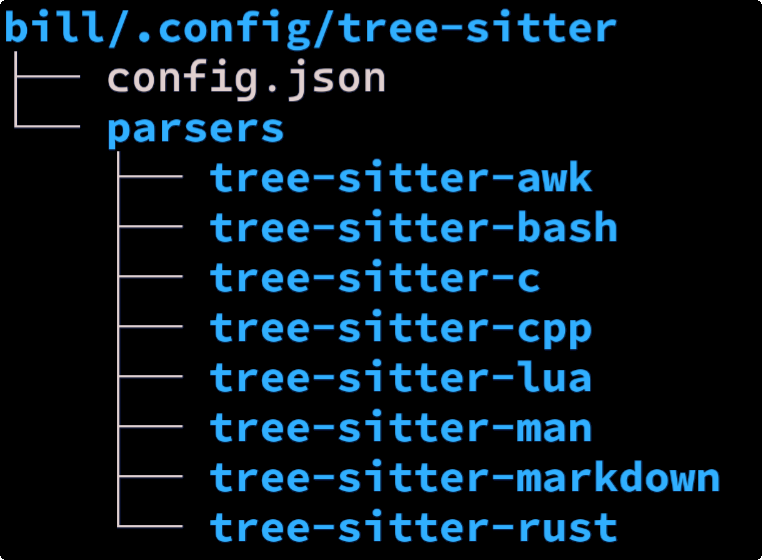

You can also configure a custom color scheme in the config.json file if you like.
Here's mine:

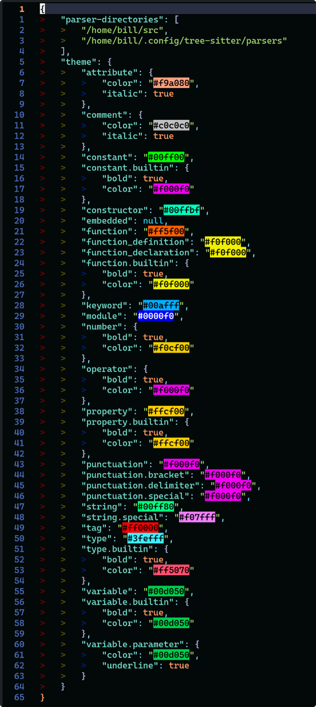

The ~/tree-sitter/config.json distributed with tree-sitter uses the 256 color
xterm palette, but you can also use HTML style six digit hex numbers as shown
above. Refer to the Tree-Sitter documentation for more details on configuring
the color scheme.

Note: I find it much easier to use the six-digit hex color codes when configuring
Tree-Sitter colors. This way, I can easily match the colors used in my terminal
emulator and other applications. The 256 color xterm palette can be limiting
and may not provide the exact colors I want for syntax highlighting. Using
hex codes gives me more flexibility and allows for a more consistent color
scheme across my development environment. They are also more intuitive to
work with since they directly represent RGB values.

```bash
cargo install tree-sitter-<language>
```

### Tree-Sitter Parsers On macOS

```bash
brew install tree-sitter-<language>
```

### Tree-Sitter Parsers On Windows

```powershell
choco install tree-sitter-<language>
```

After installation, you can verify that the Tree-Sitter parser for your chosen
language is installed correctly by running:

```bash
tree-sitter <language> --version
```

This should display the installed Tree-Sitter parser version for your chosen
language, confirming that it is successfully installed on your system.
Replace `<language>` with the specific programming language you want to install
the parser for, such as `python`, `javascript`, `rust`, etc.

To put it bluntly, nothing compares with Tree-Sitter for syntax highlighting
and code analysis. Once you start using it, you'll wonder how you ever lived
without it.

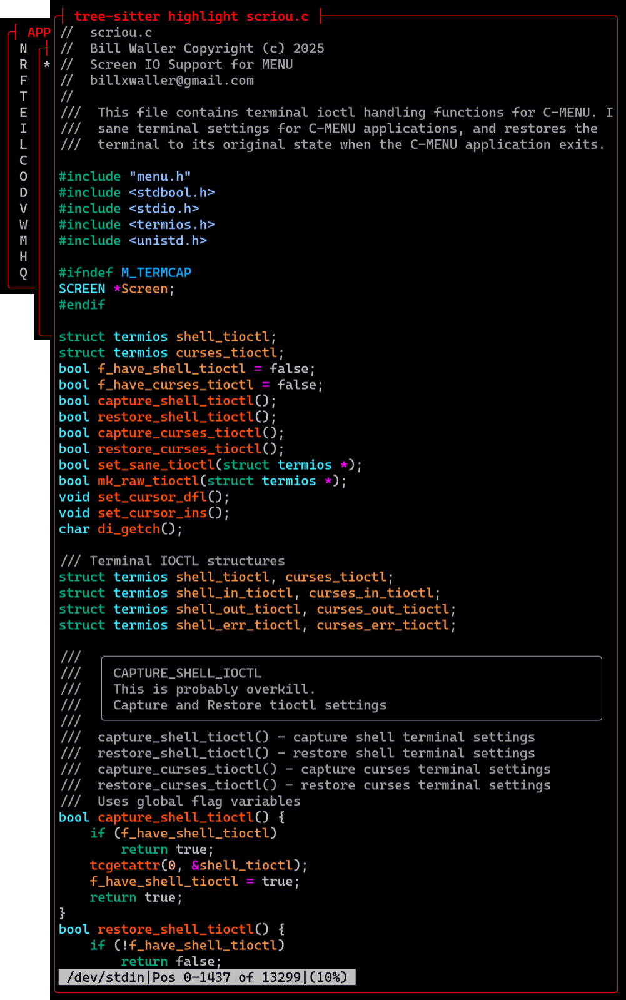

---

### Testing Tree-Sitter

To test Tree-Sitter, you can use the following command:

```bash
tree-sitter parse <source-file>
```

This command will parse the specified source file and output the syntax tree to the terminal. You can use this command to verify that Tree-Sitter is working correctly and tosee how it parses different programming languages. Replace `<source-file>` with the path to a source code file in a programming language for which you have installed a Tree-Sitter parser. For example, if you have installed the Tree-Sitter parser for Python, you can test it with a Python source file like this:

```bash
tree-sitter parse example.py
```

This will output the syntax tree for the `example.py` file, allowing you to see how Tree-Sitter parses the Python code. You can test it with source files in other programming languages as well, depending on which Tree-Sitter parsers you have installed.

To test Tree-Sitter's syntax highlighting capabilities, you can use it in conjunction with a compatible code editor or pager that supports Tree-Sitter. For example, if you are using Neovim, you can enable Tree-Sitter-based syntax highlighting by configuring Neovim to use the installed Tree-Sitter parsers. Once configured, open a source code file in Neovim, and you should see enhanced syntax highlighting based on the Tree-Sitter parsing of the code.

Or type:

```bash
tree-sitter highlight <source-file> | view
```

---

## Rustlings

Even if you are an experienced programmer, Rust is not an easy language
to learn. The ownership model and borrow checker are unique concepts that
require a different way of thinking about memory management and data lifetimes.
If you are new to programming, Rust can be even more challenging because it
requires a solid understanding of programming fundamentals.

However, with dedication and practice, anyone can learn Rust. There are many
great resources available online, including the official Rust documentation,
tutorials, and community forums. Additionally, there are many books and courses
that can help you learn Rust from scratch.

Start with the Rust Book, and concurrently do the exercises in Rustlings.
Rustlings is an invaluable companion to the Rust Book.

[The Rust Book](https://doc.rust-lang.org/book/)

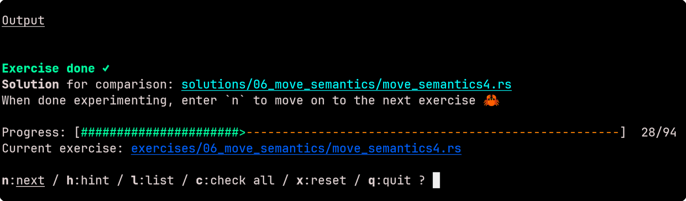

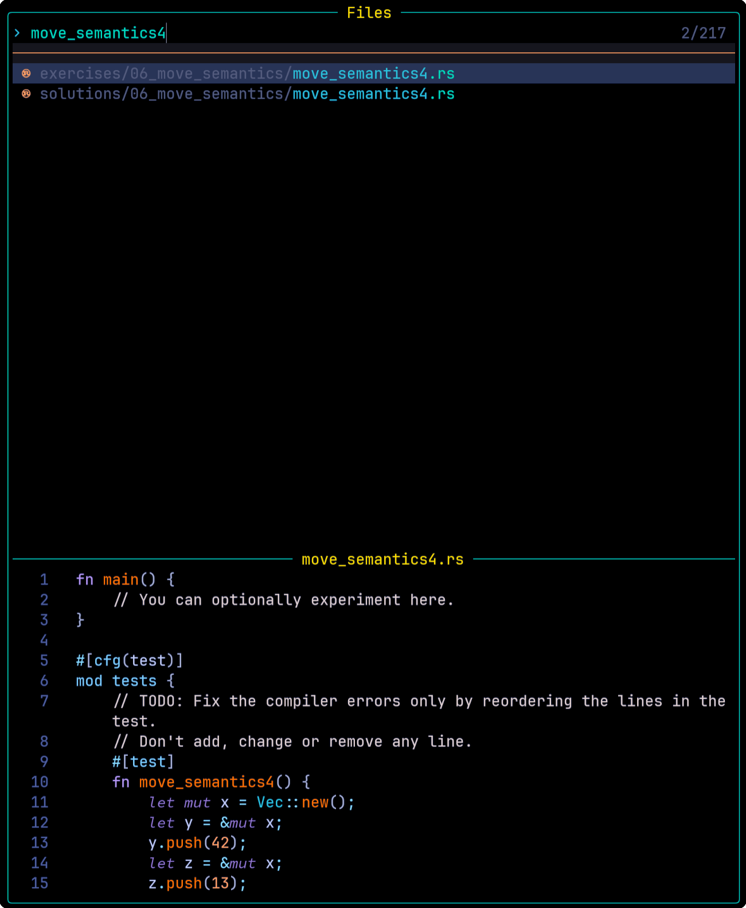

---

## Neovim

I consider Vim/Neovim not just essential, but indispensable. I loved vim and used it for many years. I can't say whether Vim or Neovim is better because both have evolved to provide competitive features. I can say, for me, Neovim plugins seem more accessible, and it has everything I want.


---

## Neovim Configuration

### Custom Highlights

To use custom_highlights.lua, you can copy it to your nvim config directory. For example, if your nvim config directory is located at ~/.config/nvim, you can run the following command:

```bash
    cp custom_highlights.lua ~/.config/nvim/lua/config
```

and add the following line to your init.lua file:

```lua
require("config.custom_highlights")
```

### Norcalli Colorizer

[Norcalli](https://github.com/norcalli)

[Norcalli nvim-colorizer Repo](https://github.com/norcalli/nvim-colorizer.lua)

#### AI Overview of Developer Norcalli

from [ChatGPT](https://chat.openai.com/)

The GitHub profile for the user "Norcalli" (Ashkan Kiani), a core developer on the Neovim project, can be found at [Norcalli](https://github.com/norcalli).

This developer has created several popular Neovim plugins in Lua, including:

[nvim-colorizer.lua]: A high-performance, dependency-free plugin that highlights color codes in your buffer.

[nvim.lua](https://github.com/norcalli/nvim.lua): A Lua module providing useful shortcut/magic methods for mappings.

[profiler.nvim](https://github.com/norcalli/profiler.nvim): A profiling tool for Neovim.

typeracer.nvim: A Neovim game to practice typing speed.

[nvim-terminal.lua](https://github.com/norcalli/nvim-terminal.lua): A high performance filetype mode for Neovim leveraging conceal and highlights.

[nvim-base16.lua](https://github.com/norcalli/nvim-base16.lua): A programmatic Lua library for setting base16 themes in Neovim.

[neovim-plugin](https://github.com/norcalli/neovim-plugin): A Lua library to help standardize the creation of Lua-based Neovim plugins.

---

### To Install Norcalli's nvim-colorizer.lua

Add colorizer.lua containing the following code to lua/plugins directory:

```lua
return {
	{
		"norcalli/nvim-colorizer.lua",
		config = function()
			require("colorizer").setup({
				"*",
			})
		end,
	},
}
```

## Folke's Snacks.nvim

[Folke](https://github.com/folke)

[Folke LazyVim Repo](https://github.com/LazyVim/LazyVim)

[Folke Snacks Repo](https://github.com/folke/snacks.nvim)

#### AI Overview of Developer Folke

from [ChatGPT](https://chat.openai.com/)

Folke Lemaitre, known as "folke" on GitHub, is a prominent developer in the Neovim community, most recognized as the author of the popular plugin manager lazy.nvim and the comprehensive Neovim configuration framework LazyVim.

He has developed a suite of widely used Neovim plugins, including:

[lazy.nvim](https://github.com/folke/lazy.nvim): A modern plugin manager known for its powerful UI, automatic caching, bytecode compilation for fast startup times, and focus on easy configuration.

[LazyVim](http://www.lazyvim.org/): A full-featured Neovim setup powered by lazy.nvim, designed to be easily customizable and extended.

[which-key.nvim](https://github.com/folke/snacks.nvim): A plugin that helps users remember keymaps by showing available keybindings in a popup as they type.

[noice.nvim](https://github.com/folke/neodev.nvim): A highly experimental plugin that completely replaces the UI for messages, the command line, and the popup menu.

[trouble.nvim](https://github.com/folke/drop.nvim) A utility for pretty display of diagnostics, references, quickfix lists, and more to help manage code issues.

[flsh.nvim](https://github.com/folke/flash.nvim): A plugin that enhances code navigation with search labels, improved character motions, and Treesitter integration.

[tokyonight.nvim](https://github.com/folke/ts-comments.nvim): A plugin that provides a distraction-free coding environment by focusing on the active window.

Folke's contributions are significant in shaping the modern Neovim experience, particularly by leveraging Lua for more powerful and efficient configurations and plugins. Many of his projects can be explored on his
[GitHub profile](https://github.com/folke) or the [Dotfyle](https://dotfyle.com/folke) community page.

---

#### To Install Folke's LazyVim

[LazyVim Installation](https://www.lazyvim.org/installation)

Lazyvim is a Neovim configuration that is designed to be fast, minimal, and easy to use. It comes with a set of pre-configured plugins and settings that enhance the Neovim experience. Lazyvim is highly customizable, allowing users to tailor their Neovim setup to their specific needs.

#### To Install Folke's Snacks.nvim-colorizer

```lua
{
  "folke/snacks.nvim",
  priority = 1000,
  lazy = false,
  opts = {
    -- your configuration comes here
    -- or leave it empty to use the default settings
    dashboard = { enabled = true },
    indent = { enabled = true },
    picker = { enabled = true },
    -- ...
  },
}
```

Snacks is a Neovim plugin that provides a collection of useful snippets and utilities for Neovim users. One of the features of Snacks is the ability to display a slick Neovim logo in the splash screen when Neovim starts up.

#### To Use the Neovim Unicode Art in Snacks.nvim

You will find a copy of this Unicode Art in the C-Menu root directory under:

configs/nvim/lua/plugins/snacks.lua

I don't know who created this particular Neovim Unicode Art, but it has been shared widely in the Neovim community and is often used as a splash screen for Neovim configurations. It is possible that the original creator of this logo is unknown or that it was created by multiple people over time. One clue is that it exclusively uses the Unicode code points listed below:

```unicode
    █  2588
      E0BA
      E0B8
      E0BE
      E0BC
```

```lua
[[
      ████ ██████           █████      ██
     ███████████             █████ 
     █████████ ███████████████████ ███   ███████████
    █████████  ███    █████████████ █████ ██████████████
   █████████ ██████████ █████████ █████ █████ ████ █████
 ███████████ ███    ███ █████████ █████ █████ ████ █████
██████  █████████████████████ ████ █████ █████ ████ ██████]],
```

- Note 1: If the above Unicode Art does not display correctly, make sure you have a font that supports the necessary Unicode characters, such as a Nerd Font or a font with good Unicode coverage. Additionally, ensure that your terminal emulator is configured to use a compatible font and that it supports the Private Use Area of Unicode where some of these characters are located.

- Note 2: Even if you have a compatible font, the Unicode Art may not appear as intended in your web browser. If it looks blocky or misaligned, try copying and pasting the Unicode Art into a terminal emulator that supports the necessary Unicode characters, such as Neovim or a modern terminal emulator with good Unicode support. It is likely that the Unicode code points will render correctly in a terminal emulator if you have a compatible font installed.

You may have noticed that all but the first code points are in the Private Use Area of Unicode, which means they are not assigned to any specific character and can be used for custom purposes. This is a common practice in ASCII Art and Unicode Art to create unique designs without relying on standard characters. If anyone knows the original creator of this logo, please let me know so I can give them proper credit.

---

Once you have Snacks.nvim installed, you can enable the Neovim logo in the splash screen by configuring the plugin settings. The logo will be displayed when you start Neovim, providing a visually appealing welcome screen.

The image below shows the Neovim logo in the splash screen of Neovim when using Snacks.nvim:

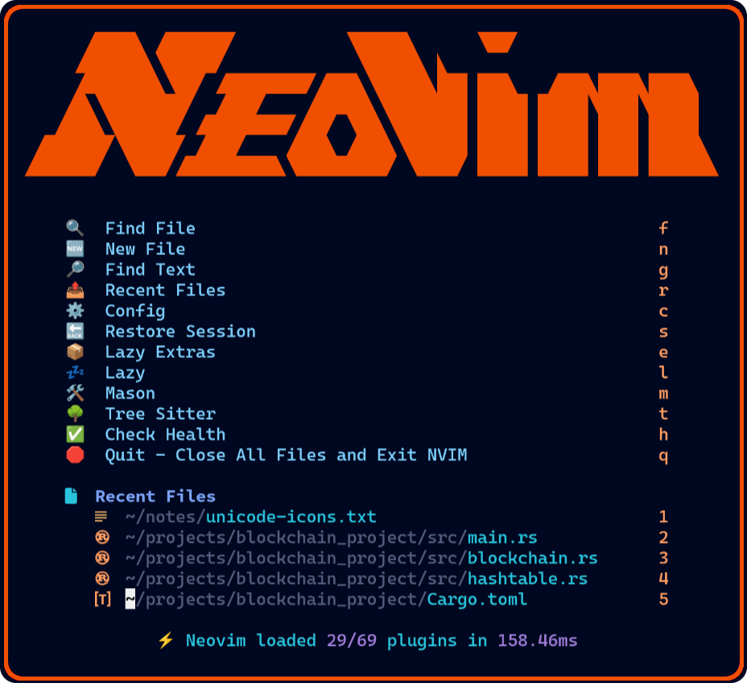

To install Neovim and Lazyvim, follow the instructions on the
[Lazyvim website](https://www.lazyvim.org/installation)

---

## Neovim Linkage to the C-Menu API

Neovim can be linked to the C-Menu API to provide an enhanced editing experience
when working with source code files in C-Menu. By configuring Neovim to use the
C-Menu API, you can take advantage of Neovim's powerful editing features while
working within the C-Menu environment.

For example, you want to use one of the C-Menu API functions, but you don't
remember the exact syntax. Just type the function name in Neovim, move the
cursor over the function name, and press Shift-K. You will get a pop-up
documenting the function parameters, data types, and signature as below:

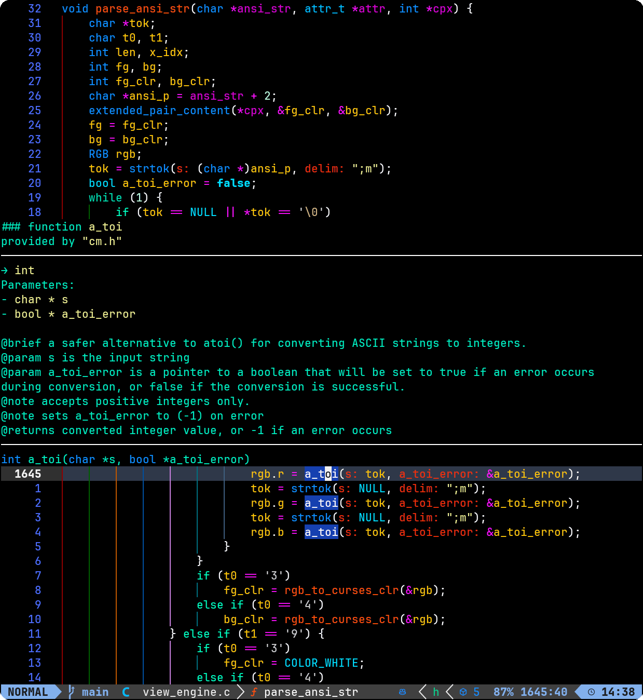

---

## Ghostty

Ghostty is a terminal emulator that is designed to be fast, lightweight, and
highly customizable. It is built with Zig and leverages modern technologies
to provide a smooth and efficient terminal experience. Ghostty supports
features such as GPU acceleration, ligatures, and a wide range of customization
options.

To install Ghostty, you can use the following commands based on your operating
system:

---

### Ghostty On Linux

After installing Rust on Linux, you can install Ghostty using Cargo, Rust's package
manager:

```bash
cargo install ghostty
```

### Ghostty On macOS

```bash
brew install ghostty
```

### Ghostty On Windows

```powershell
choco install ghostty
```

After installation, you can verify that Ghostty is installed correctly by running:

```bash
ghostty --version
```

---

What you see below may not be essential for development projects, but it
demonstrates Neovim, Ghostty, and Lazyvim working together in harmony to
provide great flexibility.

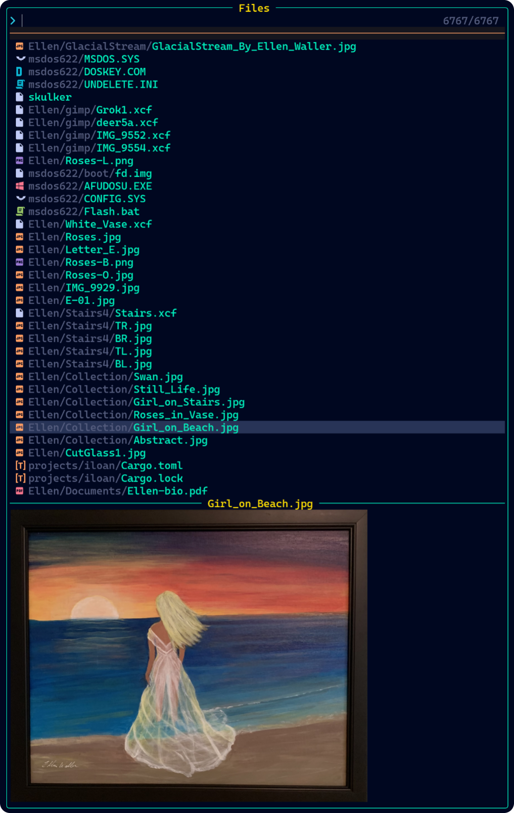

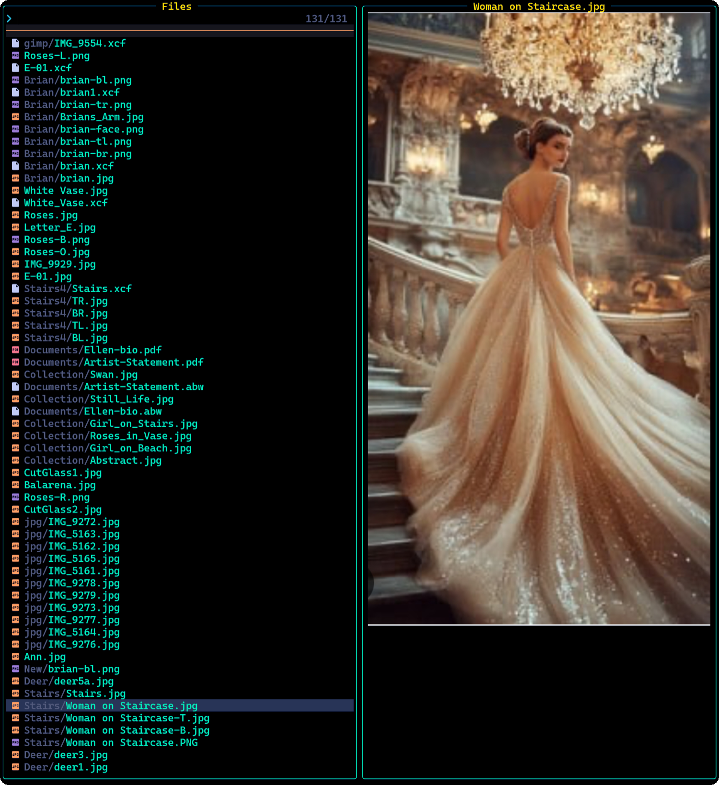

This feature is actually quite useful when searching for a particular source
file among many files in a large project. You can quickly preview files
without opening them fully in Neovim.

---

## Useful Configurations

This document describes some useful configurations for C-Menu and terminal
emulators. These configurations are optional but recommended for a better
user experience.

### Alternate Bash Executable

If you have had problems with the bash executable distributed with your OS,
you may want to download the bash source distribution and build your own
bash executable. There are many reasons why you might want to do this,
including security concerns, bugs in the bash version provided by your OS,
or the need for a specific feature that is not available in your OS's bash
version.

After building your own bash executable, you should consider renaming it to
something other than "bash". For example, you might name it "jcalc", "mmdb", or
"xmlock", something that will blend in with a ps listing. This is especially
important if you are using a system where the default bash executable is known
to have security vulnerabilities or other issues.

There are horror stories about systems that have been compromised because
the bash executable was exploited. In one instance, an OS update overwrote
the bash executable with one that would only start in restricted mode. It
wouldn't even allow running executables from /bin and /sbin. By using a
custom-named bash executable, you can reduce the risk of such exploits
and mistakes. You can leave the original bash executable intact as a backup.

---

### Shell Configuration

The following shell commands are sourced by xsh, bash, and sh.

This snippet, stolen from bashfaq #24 prepends directories to PATH if the
directories exist and aren't already in PATH. It also defines two convenience
functions, xx and mm, to start a root shell and the menuapp, respectively. It
sets the default shell to xsh if available, otherwise bash.

It sets a shorter
delay for curses escape sequences

and configures a colorful prompt with red for root and green for normal users.

- prepend_path makes it easy to prepend directories to PATH without producing
  duplicate entries. Use it to prepend ~/menuapp/bin or other directories to PATH.

```bash
pp() {
    case ":${PATH}:" in
    *:"$1":*) ;;
    *)
        PATH="$1:$PATH"
        ;;
    esac
}
PATH=/usr/bin:/bin:/usr/sbin:/sbin
for P in /usr/local/sbin \
    /usr/local/bin \
    /usr/lib64/qt6/bin \
    /usr/lib/qt6/bin \
    "$HOME"/.local/bin \
    "$HOME"/.cargo/bin \
    /usr/local/bin/zig-0.15.2 \
    "$HOME"/menuapp/bin; do
    [ -d "$P" ] && pp "$P"
done
export PATH

```

- from a shell prompt, type xx to start a root shell

```bash
which rsh >/dev/null 2>&1 && xx() { rsh; }

```

- from a shell prompt, type mm to start menuapp

```bash
which menu >/dev/null 2>&1 && mm() { menu; }

```

- Prefer xsh over bash

```bash

export SHELL=bash
which xsh >/dev/null 2>&1 && export SHELL=xsh

```

- set a shorter delay for curses escape sequences

```bash
export ESCDELAY=50

```

- set colorful prompt, red for root, green for normal user

```bash
export XUSER="$(id -un)"
export PS1="\[\e[1;32m\]\u@\h:\w>\[\e[0m\] "
[ "$XUSER" = "root" ] && export PS1="\[\e[1;31m\]\u@\h:\w>\[\e[0m\] "
echo PS1="$PS1"
```

---

### Customize Your Terminal Emulator

The configurations herein are not required to run the C-Menu system, but
provided as an example of how to customize the terminal emulator to your
liking. You may want to modify the font, font size, window dimensions,
colors, and other settings to suit your preferences.

#### Fonts

If you don't already have a patched font, you may want to install
JetBrains Mono. It is a free, open-source, monospaced font designed
for developers. It includes a large number of programming ligatures and
is optimized for readability on screens of all sizes.

The JetBrains Mono font is available from:

[JetBrains](https://www.jetbrains.com/lp/mono/)

Also check out Nerd Fonts for other patched fonts that include programming
ligatures and icons.

[NerdFonts](https://www.nerdfonts.com/)

#### Example Terminal Configurations

The standard color palette is rather drab, so you may want to include a more
colorful palette such as the high contrast palette below.

This configuration was designed for a dark terminal background and a
resolution of 3840x2160 (4k). You may want to adjust the font size and window
dimensions for your own display. The window dimensions are specified in
character cells. For example, a window-width of 95 means 95 character cells
wide. The actual pixel width of the window will depend on the font size and the
font used.

You can find the following configurations in C-Menu/configs, or:

[Snippets](snippets.md)

##### Ghostty Configuration

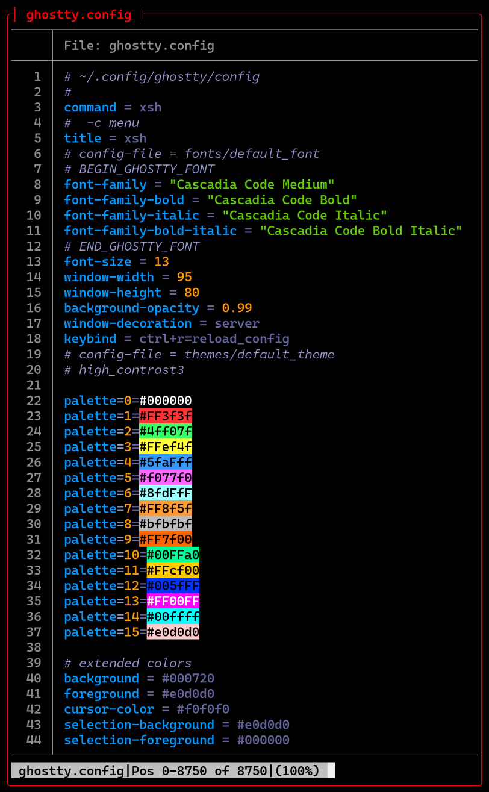

Note: You can see that Colorize.awk failed to highlight the six-digit
hex color codes on the last five lines above. That's because
Colorize.awk was designed to highlight six hex digits immediately following
the '#' symbol. In this case, "bat", for some reason inserted ansi codes
after the '#' symbol, and before the six hex digits, so Colorize.awk
didn't recognize them as hex color codes. This is an edge case that I
haven't yet addressed in Colorize.awk, but there is a solution.

I opened ghostty.config with neovim and it highlighted the six-digit hex
color code correctly. It's always good to have multiple tools in your
toolbox. 😀

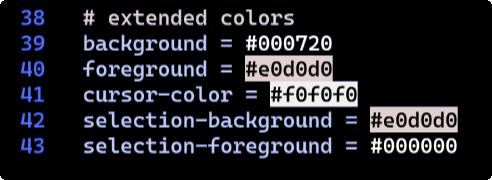

##### Kitty Configuration

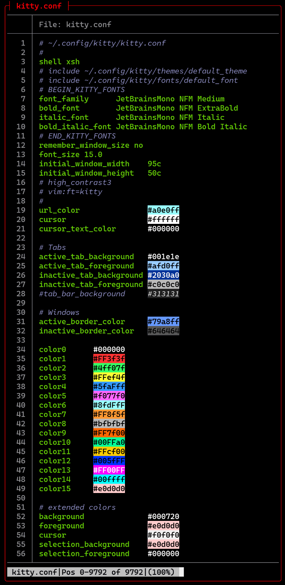

##### Alacritty Configuration

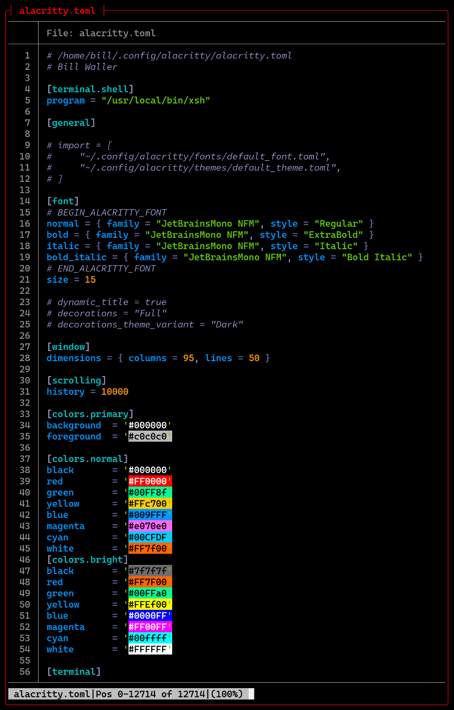

---

## Additional Resources

For more information on Rust and its tools, you can visit the following resources:

### Let's Get Rusty

If you are interested in learning Rust, I highly recommend the Let's Get Rusty YouTube channel. It offers a wide range of tutorials and videos on Rust programming, covering topics from beginner to advanced levels. The channel is well-known for its clear explanations and practical examples, making it an excellent resource for anyone looking to learn Rust.

[Let's Get Rusty](https://www.letsgetrusty.com/)

[Let's Get Rusty YouTube Channel](https://www.youtube.com/c/LetsGetRusty)

### Folke

Folke is a prominent developer in the Neovim community, known for creating popular plugins such as lazy.nvim and LazyVim. His contributions have significantly shaped the modern Neovim experience, particularly by leveraging Lua for more powerful and efficient configurations and plugins. Many of his projects can be explored on his [GitHub profile](https://github.com/folke) or the [Dotfyle](https://dotfyle.com/folke) community page.

[Lazyvim](https://www.lazyvim.org/)

### Other Resources

[The Rust Programming Language Book](https://doc.rust-lang.org/book/)

[Rustlings Exercises](https://rustlings.rust-lang.org/)

[Cargo Documentation](https://doc.rust-lang.org/cargo/)

[Bat GitHub Repository](https://github.com/sharkdp/bat)

[Bat Official Website](https://bat.dev/)

[Ripgrep GitHub Repository](https://github.com/BurntSushi/ripgrep)

[Tree-Sitter GitHub Repository](tree-sitter.github.io/tree-sitter)

[Neovim Official Website](https://neovim.io/)

## Conclusion

By following the above instructions, you can easily install Rust and various
Rust-based tools to enhance your C-Menu experience. Enjoy coding with these
powerful tools!
