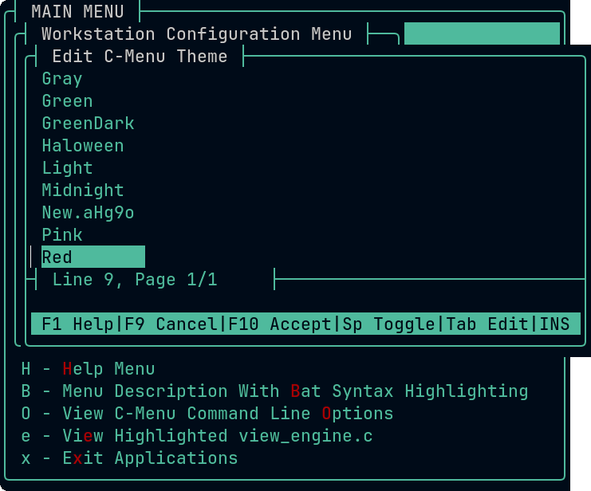

# C-Menu How-To Themes

C-Menu supports themes, which allow you to customize the appearance of the menu. You can create your own themes or use one of the built-in themes.

## Selecting Themes

To select a theme, go to the C-Menu Workstation Configuration Menu and select
the "Select C-Menu Theme" option. This will display a list of available themes. Select the theme you want by clicking on it, or use the arrow keys to position the cursor on the theme and press "t" or " " (spacebar) to select it.")



That's it. The windows will instantly render with the theme you selected.

## Creating New Themes

To create a new theme, select "Create C-Menu Theme" from the C-Menu Workstation
Configuration Menu. C-Menu Pick will open a screen similar to the one used for
selecting themes, but the title will be "Choose Theme Template". Select a theme
template to use as a starting point for you new theme.

When you select a theme template, C-Menu Pick will make a copy of the file you
selected as a template and o pen it in your default text editor. Below, you can
see how the file looks when opened in Neovim with the Colorizer plugin enabled. The Colorizer plugin will display the colors and update them as you edit the file, making it easier to see the changes you are making to the theme.

[Neovim Colorizer on github](https://github.com/norcalli/nvim-colorizer.lua)

The C-Menu theme files are extensions of the C-Menu configuration file. Any key value pair recognized by the C-Menu configuration file parser may be placed in either the C-Menu main configuration, (generally ~/menuapp/.minitrc) or a theme file. See C-Menu Configuration Files below for more information on the C-Menu configuration file format and parsing rules.


## C-Menu Configuration Files

C-Menu configuration files are text files that contain key value pairs that configure the appearance and behavior of C-Menu. The main C-Menu configuration file is normally located at ~/menuapp/.minitrc, but you can include additional configuration files with include statements such as the following:

```cmenu
include = ~/menuapp/themes/default
```

The same information that can be included in the main configuration file can also be included in theme files and vice versa. The difference is that theme files are kept in ~/menuapp/themes as a convenience. The main C-Menu Configuration file normally includes all of the entries needed for a complete theme, so it is not necessary to include theme files in the main configuration file. The Theme file is just a supplementary configuration file, the key values of which override those in the main configuration file positioned before the include statement. C-Menu uses only the last occurrence of a key and its value.

## Theme Files

Theme files are just supplemental configuration files that configure the appearance of C-Menu. Theme files are kept separately to facilitate coherent organization of theme
components and to make it easier to create and manage themes. Theme files are included in the C-Menu configuration file with include statements such as the following:

```cmenu
include = ~/menuapp/themes/default
```

## Key Value Pairs

Key value pairs consist of a key, text from the beginning of a line delimited by
an '=' character, and a value after the '=' character delimited by whitespace or
including syntactically valid hex color codes. Values may be enclosed in single or double quotes to preserve leading and trailing whitespace, which will otherwise be stripped.

### Colors

Colors are standard six-digit html-style hex color codes in the format '#RRGGBB', where RR, GG, and BB are two-digit hexadecimal numbers representing the red, green, and blue components of the color, respectively. For example, '#FF0000' represents pure red, '#00FF00' represents pure green, and '#0000FF' represents pure blue.

The hex color codes must begin with a '#" character, followed by exactly six hexadecimal digits.

### Comments

A '#' character that is not part of a value is treated as a comment character,
and the rest of the line is ignored. This allows you to add comments documenting
your entries in the theme file.

## Saving the Theme File

When you are finished editing the theme file, save it and close the text editor. You may use the name assigned, which will be in the form, "New.XXXXX", where "XXXXX" is a random string of characters, or you can rename the file to something more descriptive.
There is no restriction on the names of theme files except that "default" is
reserved for the default theme. The new theme will be available for selection in the "Select C-Menu Theme" menu.

## Configuration Line Processing Order

C-Menu processes key value pairs in reading order from its main configuraiton file, ~/ menuapp /.minitrc, and any supplemental configuration files sourced with include statements such as the following:

```cmenu
include = ~/menuapp/themes/default
```

Assuming your configuration file is in ~/menuapp/themes/Red, you could create a symbolic link named default that points to Red, and then include default in your main configuration file. (Actually ~/menuapp/.minitrc already includes default, so you would only need to create the theme file and the symbolic link.

```bash
ln -s Red default
```

Key value pairs included from configuration files (including theme files) are processed in reading order as they are included.

This is significant in the event that a key is included more than once in the configuration file and / or included files. Only the last value read for a key will be used by C-Menu.

If you want to override key values in the C-Menu configuration file, you can do so by including a supplemental configuration file that contains the desired key value pairs. The key value pairs in the included file will be processed in reading order after the key value pairs in the main configuration file, so they will override any duplicate key values in the main configuration file. Conversely, if you want to use a supplemental configuration as the default, include it first.

### Parsing Rules

Parsing: Lines beginning with # are comments and are ignored. Lines containing key=value pairs are parsed and the key and value are extracted. Lines without an '=' are ignored. Values are stripped of leading and trailing whitespace and quotes. Values can be enclosed in single or double quotes to preserve leading and trailing whitespace. Values can also be specified as hex color codes such as #ff0000 for red. If a value is specified as a hex color code, it is parsed and stored as a hex color code in the configuration. An unquoted '#' that is not part of a six digit hex color code and after key values have been extracted is the beginning of a comment.
