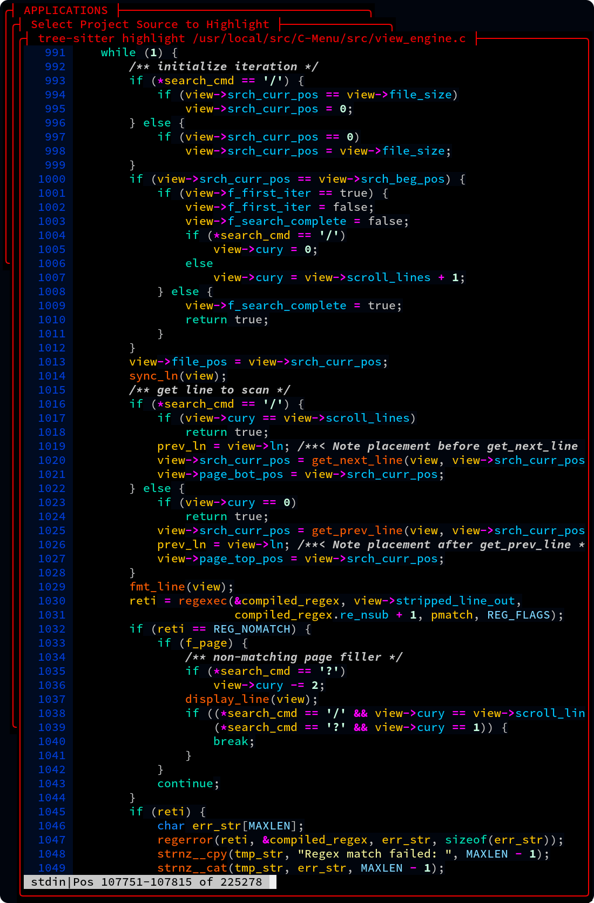
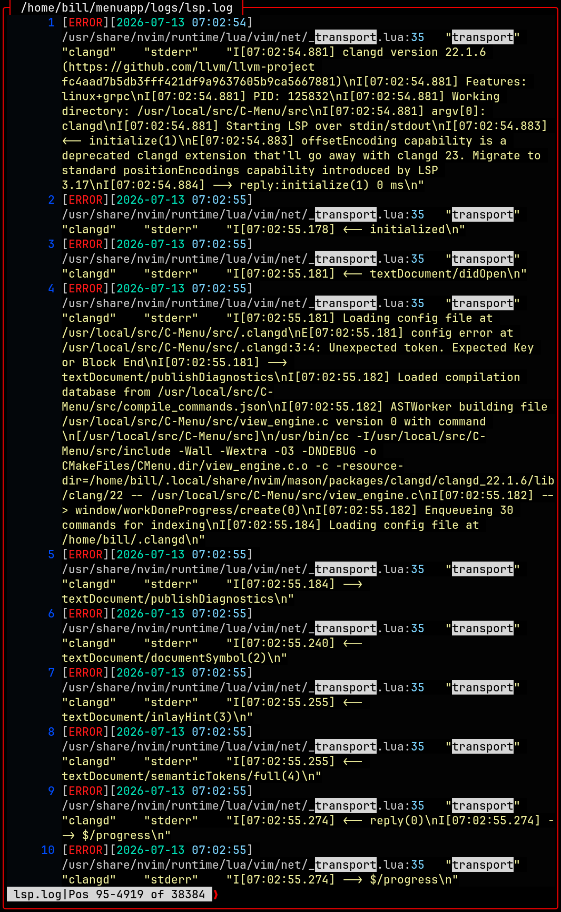

# NAME

view - file viewer/pager

# SYNOPSIS

view [-Wk?V] [-a file_spec] [-C number] [-L number] [-T text]
[-X number] [-Y number] [-A file_spec] [-c file_spec]
[-d file_spec] [-g file_spec] [-H file_spec] [-i file_spec]
[-l text] [-o file_spec] [-R file_spec] [-S file_spec] [-Z text]
[-b text] [-e[bool]] [-f char] [-j[bool]] [-M[bool]] [-n number]
[-N[bool]] [-r[bool]] [-s[bool]] [-t number] [-u text] [-v[bool]]
[-w[bool]] [-x[bool]] [-z number] [--f_write_config]
[--minitrc=file_spec] [--parent_cmd] [--cols=number]
[--lines=number] [--title=text] [--begx=number] [--begy=number]
[--cmd_all=file_spec] [--cmd=file_spec] [--mapp_spec=file_spec]
[--log_file_spec=file_spec] [--help_spec=file_spec]
[--in_spec=file_spec] [--log_level=text] [--out_spec=file_spec]
[--receiver_cmd=file_spec] [--provider_cmd=file_spec]
[--timeout_secs=text] [--border=text] [--editor=text]
[--f_erase_remainder[=bool]] [--fill_char=char]
[--f_strip_ansi[=bool]] [--f_multiple_cmd_args[=bool]]
[--select_max=number] [--f_ln[=bool]] [--f_read_theme[=bool]]
[--f_squeeze[=bool]] [--tab_stop=number] [--brackets=text]
[--p_view_files[=bool]] [--wrap[=bool]] [--f_ignore_case[=bool]]
[--h_shift=number] [--bg=hex_clr] [--box_bg=hex_clr]
[--box_fg=hex_clr] [--brackets_bg=hex_clr] [--brackets_fg=hex_clr]
[--cmdln_bg=hex_clr] [--cmdln_fg=hex_clr] [--fg=hex_clr]
[--fill_char_bg=hex_clr] [--fill_char_fg=hex_clr]
[--ind_bg=hex_clr] [--ind_fg=hex_clr] [--ln_bg=hex_clr]
[--ln_fg=hex_clr] [--nt_bg=hex_clr] [--nt_fg=hex_clr]
[--nt_hl_bg=hex_clr] [--nt_hl_fg=hex_clr] [--nt_hl_rev_bg=hex_clr]
[--nt_hl_rev_fg=hex_clr] [--nt_rev_bg=hex_clr]
[--nt_rev_fg=hex_clr] [--ran_bg=hex_clr] [--ran_fg=hex_clr]
[--title_bg=hex_clr] [--title_fg=hex_clr] [--blue_gamma=float]
[--gray_gamma=float] [--green_gamma=float] [--red_gamma=float]
[--bblack=hex_clr] [--bblue=hex_clr] [--bcyan=hex_clr]
[--bgreen=hex_clr] [--black=hex_clr] [--blue=hex_clr]
[--bmagenta=hex_clr] [--bred=hex_clr] [--bwhite=hex_clr]
[--byellow=hex_clr] [--cyan=hex_clr] [--green=hex_clr]
[--magenta=hex_clr] [--red=hex_clr] [--white=hex_clr]
[--yellow=hex_clr] [--mapp_data=directory] [--mapp_help=directory]
[--mapp_home=directory] [--mapp_msrc=directory]
[--mapp_theme=file] [--mapp_user=directory] [--help] [--usage]
[--version] [INPUT] [OUTPUT] [HELP] [ARG4] [ARG5]

# DESCRIPTION

View is the modern, high-performance file viewer/pager designed to handle large files with ease and blinding speed.

# OPTIONS

C-Menu Menu, Form, Pick, and View read configuration data from $CMENU_HOME/.minitrc
Many options, colors for instance, are more suited for .minitrc than for the command line.

# GEOMETRY

By default, C-Menu determines the size and position of various windows based on content and terminal size. The following options allow you to specify the location and size of Windows, but C-Menu may override if the specified geometry is too large for the terminal.

If lines and columns are specified View will start in a bordered window. Otherwise,
View will use all of the space available in the console or terminal emulator.

-Y, --begy=number

    The terminal line on which the top of the Window is placed.

-X, --begx=number

    The terminal column on which the left side of the Window is placed.

-C, --cols=number

    Window width in columns.

-L, --lines=number

    Window height in lines.

-T, --title=text

    Window title displayed on the top line of the window.

    Title is only used when View is displayed in a bordered window.

-H, --help_spec=file_spec

    Help files provide text that is displayed in the help window. In the
    example C-Menu application, these files are stored in
    $CMENU_HOME/menuapp/help. Any file names may be used, but it may prove
    convenient to append .help to help files. Conventionally, source help
    files are designated with the extension _help.

# COMMANDS

-A, --cmd_all=file_spec

    This command will be provided to view's command processor for immediate
    execution on startup. It may be used to set View options or execute any other and recognized by the view command processor. For example, "/pattern"
    would search for pattern on startup.

-c, --cmd=file_spec

    This command may be executed at arbitrary points during various events.
    For example, Form may use a -c command to execute an SQL query to
    provide information related to the current form. The presence of these
    command hooks will be doumented with each feature for which it is used.

-S, --provider_cmd=file_spec

    A provider is the inverse of a receiver, that sends output to the
    calling program. The calling program receives input from the piped
    output of the provider program. This is not a named pipe or a
    network connection, but a direct connection between the calling
    program and the provider.

-w, --wait_timeout=seconds

    Determines how long to wait for IO before timing out. This feature is
    useful when using receiver and provider commands, but it may also be used for
    file IO. If the timeout is reached, the pick engine will display a countdown
    window indicating that it is waiting for IO, and the user may choose to cancel the process or continue waiting in timeout intervals.

# GENERAL

-s, --f_squeeze=bool

    View: When writing output, replace multiple blank lines with a single blank line.

-x, --f_ignore_case=bool

    View: Ignore case when searching withing view.

-N, --f_ln[=bool]

    View: Display line numbers in the left margin of the view. The default setting
    for f_ln s normally false, but f_ln may be set to true in the C-Menu
    configuration file ($HOME/menuapp/.minitrc), which will cause View to display
    line numbers by default. If you want to override the configuration file
    setting, you may use -Nt to turn line numbers on or -Nf to turn line numbers
    off.

# COLOR

-t, --tab_stop=number

    View: When writing output, replace tab characters with the appropriate number
    of spaces. The default setting for tab_stop is 4, but it may be set to a
    different value in the C-Menu configuration file ($HOME/menuapp/.minitrc). If
    you want to override the configuration file setting, you may use -t1 to set
    the number of spaces per tab.

--red_gamma=1.0        red gamma (View)

--green_gamma=1.0      green gamma (View)

--blue_gamma=1.0       blue_gamma (View)

--gray_gamma=1.0       gray gamma (View)

    While C-Menu's gamma settings apply to all C-Menu applications, they are especially useful in View. Often, highlighted or color text files are too bright, too dark, have too much or too little contrast, or are otherwise difficult to read. C-Menu View gives you a way to deal with that by providing four channel gamma correction. Gray is broken out separately and applies to colors for which red, green, and blue are equal. The default setting for all four channels is 1.0, which means that no gamma correction is applied. If you want to override the configuration file setting, you may use --red_gamma=0.8 to set red gamma to 0.8, for example. 

--bblack=hex_clr       bright black (#7f7f7f)

--bblue=hex_clr        bright blue (#00cfFF)

--bcyan=hex_clr        bright cyan (#00FFFF)

--bgreen=hex_clr       bright green (#00FF7f)

--black=hex_clr        black (#000000)

--blue=hex_clr         blue (#0000FF)

--bmagenta=hex_clr     bright magenta (#FF00FF)

--bred=hex_clr         bright red (#FF3737)

--bwhite=hex_clr       bright white (#FFFFFF)

--byellow=hex_clr      bright yellow (#FFeF00)

--cyan=hex_clr         cyan (#00dfdf)

--editor=text          default editor

--green=hex_clr        green (#00cf00)

--magenta=hex_clr      magenta (#9f009f)

--red=hex_clr          red (#bf0000)

--white=hex_clr        white (#d0d0d0)

--yellow=hex_clr       yellow (#efbf00)

    It is also possible to redefine the standard colors used by the C-Menu application.

    NOTE: Redefining standard colors does not change the colors used by the
    terminal emulators or by various highlighters that use 24-bit RGB. The gamma
    setting will affect all colors in view.

# MISCELLANEOUS

-V, --version Print program version

-?, --help Give this help list

--usage Give a short usage message

-V, --version Print program version

A space after short options is optional. For example, -s10M and -s 10M are both valid.

Option arguments may be ganged. For example, to list all files, directories, and
links, you can use -t f -t d -t l or -tfdl.

Mandatory or optional arguments to long options are also mandatory or optional
for any corresponding short options.

# Overview of View

View has a rich feature set, including Unicode support, line numbering toggle, regular expression searching, a large virtual pad for horizontal scrolling, smart word wrap toggle, windowing, window resizing, and regular expression searching. It supports tree-sitter, source-highlight, pygments, bat, manual pages, and other syntax highlighters. You can safely view critical system files without the risk of accidentally modifying them, as View is a read-only viewer. If you need to edit a file, just type the letter v on the view command line, to open the file in your favorite editor. View is also highly customizable with a wide range of options and setting including color schemes and even user selectable four-channel gamma correction.

View is designed to be fast and efficient, even when working with very large files, making it an ideal tool for developers, system administrators, and anyone who needs to quickly and easily view large files. It is especially convenient when used with C-Menu's file finder, lf, and C-Menu's Pick, which in combination allow you to quickly display a list of files and automatically open each one as you move the highlighted selector bar. With the Notcurses interface selected, jpeg, png, gif, and other image types are also displayed in the view window.

While view gladly displays files highlighted with ANSI SGR sequences, your
favorite editor may not, so C-Menu comes with a handy utility to strip ANSI
SGR sequences.

Throughout C-Menu, and especially View, you will find many optimizations that contribute to efficiency and speed. Traditionally, large file I-O has relied on user-space buffering schemes in which chunks of data are copied from mass storage into local buffers using seek and read operations. C-Menu doesn't use this approach. It is redundant to copy massive amounts of data from kernel space into user memory, and then try to manage a one-off, home-spun, and complicated buffer pool that is at best error-prone, and inefficient, especially when dealing with large files or high-throughput applications. C-Menu's view leverages modern capabilities of the Linux kernel to provide Zero-Copy, direct virtual memory access to file data. This eliminates the overhead and complexity associated with user-space buffering, and allows for more efficient and reliable access to large files. With C-Menu's view, applications can access any part of a multi-gigabyte file instantly without the need for copying data into user-space buffers or managing buffer lifecycles. You get unmatched reliability and performance when working with large files.

If you work with large datasets, you will love view. No fluff, no bloat, no
nonsense, just blazing fast performance.

Below: LSP Log in view window with line numbers, smart word-wrap, syntax highlighting,
and regular expression search for "transport". View also provides full-screen
windowing and horizontal scrolling.

