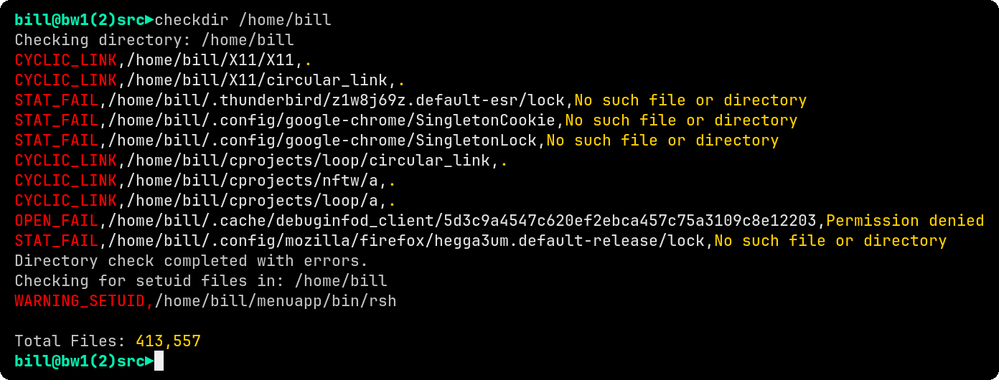

# lf

```bash
#!/bin/bash
# @name chkdir
# @brief Check directories for common problems
cat <<EOF >>/dev/null

lf options explained:

      -L follow symbolic links
      -H include hidden files
      -T7 use 7 threads
      -D458 Set debug flags 4, 5, and 8
           equivalent to (-D4 -D5 -D8) or (-D 4 -D 5 -D 8)
           include the following debug information in the output:
                  4 errors
                  5 badlinks
                  8 only display errors, suppressing normal output
      -ps only display setuid files

      2>&1 redirect stderr to stdout to capture errors in the output
      The above command will check the directory for errors and bad links, and only
      display errors in the output. The output will be captured and can be used for
      further processing or logging.

EOF

usage() {
    echo "Usage: $0 <dirname>"
    exit 1
}

# Check if exactly one argument is provided
if [ "$#" -ne 1 ]; then
    usage
fi

# Check if the file exists and is a directory
if [[ ! -d "$1" ]]; then
    echo "Error: File '$1' not found or is not a directory."
    exit 1
fi

dir="$1"

echo "Checking directory: $dir"

lf -L -H -T7 -D458 "$dir" 2>&1 | awk -F, 'BEGIN {
red=""
wht=""
yel=""
grn=""
sgr0=""
}
{printf("%s%s%s,%s,%s%s%s\n", red, $1, wht, $2, yel, $3, sgr0);
}'
rc=${PIPESTATUS[0]}
if [ "$rc" = "0" ]; then
    echo "Directory check completed successfully."
else
    echo "Directory check completed with errors."
fi
echo "Checking for setuid files in: $dir"
for line in $(lf -L -H -T7 -ps "$dir"); do
    echo "WARNING_SETUID,$line" | sed 's/^[A-Z_]*,/&/'
done
TIMEFORMAT=%E
files=$(lf -L -H -T7 /home/bill | wc -l)
echo
yel=$(printf "")
sgr0=$(printf "")
printf "Total Files: %s%'d%s\n" $yel $files $sgr0
```



lf -L -H -D458 "$dir" checked 413,557 files in about one third of a second, and
the checks are not trivial. As lf descends the directory tree, it keeps track
of every device and inode and reports any duplicates as bad links. It also checks for errors such as permission issues, inaccessible files, and other filesystem anomalies. The debug flags 4 and 5 ensure that both errors and bad links are included in the output, while flag 8 suppresses normal output, allowing us to focus solely on the issues found. The use of 7 threads significantly speeds up the process, making it efficient even for large directories. The final output is color-coded for better readability, with errors highlighted in red, bad links in yellow, and normal output in white. The total number of files checked is also displayed at the end, providing a clear summary of the directory's contents. Additionally, the script checks for setuid files and highlights them in red to draw attention to potential security concerns. Overall, this command provides a comprehensive overview of the directory's health and security status.
