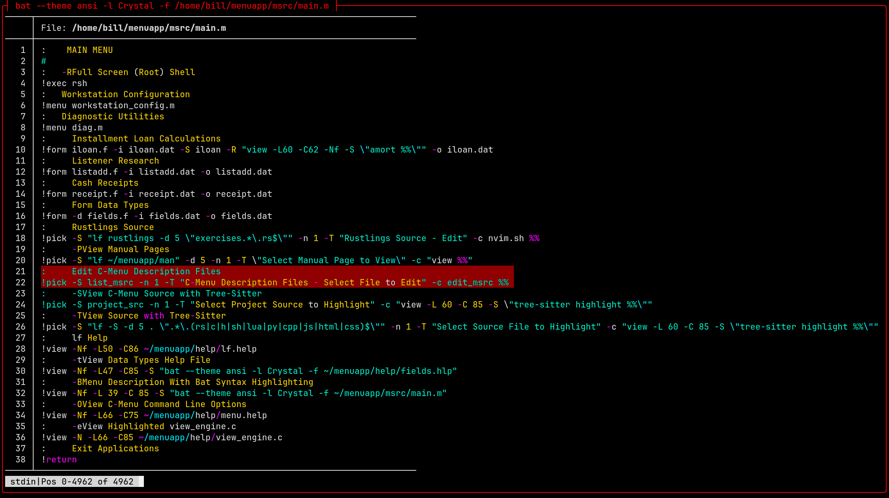

# C-Menu Decomposition

This section will break down Example C-Menu Applications and explain how they work from the perspective of a developer using C-Menu to build applications. With this understanding, you will be ready to create custom software products that are intuitive, uniform, dependable, flexible, appealing, and fast with a minimal footprint.

## Example Application Menu


The menu above is intended to demonstrate a variety of features and techniques that can be applied to your projects. It is not meant to be a practical menu for everyday use, but rather a showcase of what is possible with C-Menu. Think of yourself as an artist and C-Menu as your canvas. What will you create?

Below is an example of source defining the above menu. This is the part you design as the top-level framework for your application. C-Menu uses a building-block approach to integrate C-Menu internals, external applications, scripts, and executables, as you will see in just a moment. C-Menu includes a set of useful and powerful components you assemble like Leggos to create innovative software products. C-Menu's main components include Menu, Form, Pick, View, RSH, lf, and C-Keys, each of which will be explained in detail in the following sections.


Lets examine the Menu source above and break down how it works. The source file is a simple text file that contains a series of User Choices and Commands.

Lines beginning with ":" are the User Choices.

Lines beginning with "!" are commands to be executed by Menu when the corresponding menu item is selected. These commands can be used to invoke internal C-Menu functions execute external commands, and run shell scripts.

## C-Menu Design Philosophy and Optimizations

Before diving into the line-by-line breakdown of the menu source, let's discuss some of the design philosophy and optimizations that C-Menu incorporates to achieve its performance and responsiveness. This will make writing command-lines for C-Menu much more intuitive, help you understand how to leverage C-Menu's features, and enable you to create highly responsive applications.

When you use C-Menu's Example Application Menu, notice that most menu selections respond virtually instantaneously with no perceptible delay. It just snaps. That level of optimization is achieved in part by avoiding the overhead and unpredictability of using a shell to execute command lines. Instead, C-Menu executes command lines directly, which results in start-up times an order of magnitude faster than traditional shell-based menu systems. Shell startup typically takes tens to hundreds of milliseconds, while C-Menu's direct execution can be as fast as a few milliseconds.

C-Menu also takes performance to the next level by providing internal functions
that can be called directly from the command line without the need for an external executable. For example, in the Example Applications Menu, all except the first command line are internal function calls, which execute in nanoseconds compared to the milliseconds it takes to launch an external executable.

Relative performance:

| Performance level | Description             | Elapsed Time |
| ----------------- | ----------------------- | ------------ |
| Somewhat Slugish  | Shell based execution   | 10-100 ms    |
| Fast              | Direct execution        | 1-10 ms      |
| Instantaneous     | Internal function calls | 0.001 ms     |

At 200 ms response, a user will perceive an application as sluggish. At 20 ms, the user will perceive a smooth and responsive experience. At 1 ms, the user will perceive an instantaneous response. Admittedly, no one really cares whether a program loads in 0.001 ms or 1,000 times slower at 1 ms, but in practical applications iterative processes often take thousands of cycles to complete. That's why C-Menu strives for sub-millisecond response wherever and whenever possible.

Many applications can be executed directly without the need for a shell, which is what C-Menu does by default when it encounters a command line starting with "!". Nevertheless, you can explicitly invoke a shell by including "sh -c" or a shell script on the command line.

Because C-Menu was designed to execute external programs directly, it provides conveniences such as tilde expansion and file location based on the environment.

Instead of using I/O redirection on the command line with pipe symbols, C-Menu provides more controllable features such as "-S" for specifying a command to execute as a provider (source) of input to a form, pick, or view, "-R" for specifying a command to receive standard output from a form, pick, or view, and "-c" for specifying a command to execute with the selected item as an argument. These features allow you to create powerful and flexible menu items that can interact with other applications and scripts in a more controlled and efficient manner.

Another optimization is that C-Menu does not necessarily launch a new process for each command line. Instead, it uses internal function calls. In the Example Applications Menu, all except the first command line are internal function calls. Calling an internal function takes nanoseconds, while an external executable is 1,000-100,000 times slower. C-Menu provides a rich set of internal functions that can be used to create complex and interactive menu items, often without the need for external applications or scripts. This allows you to create a seamless and responsive user experience while still providing powerful functionality.

## C-Menu Lightweight Find (lf)

C-Menu's launcher is only one aspect of its performance. C-Menu's lf (lightweight find) is an alternative to Unix find. Unix find is an extremely powerful tool, and it is not slow, but it can be unwieldy at times (see the 40 page manual). It does everything you could want, but with unnecessary overhead. C-Menu's lf is smaller, faster, and easier to use than Unix find, yet covers most of the day-to-day use cases.

One of find's most often used features is the built-in exec option, which executes a specified command on each file found. lf does not have a built-in -exec option. lf achieves the same result, by piping the output of lf into xargs. How does that stack up against find with -exec? Lets see.

We compared C-Menu's lf with xargs and find with its built-in -exec option. Both methods produced identical results, but take a look at the performance difference.

time find . -maxdepth 5 -type f -exec ls -l {} \; >find.out

time lf -d 4 -t f | xargs ls -l >lf.out

| Command | real     | user     | sys      | files found |
| ------- | -------- | -------- | -------- | ----------- |
| find    | 0m0.469s | 0m0.160s | 0m0.288s | 142         |
| lf      | 0m0.008s | 0m0.004s | 0m0.006s | 142         |

time find . -maxdepth 4 -type f -exec ls -l {} \; >find.out

time lf -d 4 -t f | xargs ls -l >lf.out

| Command | real     | user     | sys      | files found |
| ------- | -------- | -------- | -------- | ----------- |
| find    | 0m2.123s | 0m0.788s | 0m0.281s | 598         |
| lf      | 0m0.014s | 0m0.007s | 0m0.009s | 598         |

Intuitively, it makes sense that find with its built-in exec option would be
faster than using an external xargs command, but in practice, the opposite is true. The built-in exec option of find is significantly slower than using xargs with lf. This is because find's built-in exec option executes the specified command for each file found, which can be very inefficient when dealing with a large number of files. In contrast, using xargs allows you to execute the command on multiple files at once, which can significantly reduce the overhead and improve performance. You can improve the performance of find dramatically by piping its output into xargs instead of using its built-in -exec option.

# C-Menu View

Throughout C-Menu, and especially View, you will find many optimizations that
contribute to it's efficiency and speed. Traditionally, large file I-O has relied on user-space buffering schemes in which chunks of data are copied from mass storage into local buffers using seek and read operations. The application must keep track of buffer contents, manage buffer lifecycles, and handle edge cases such as partial reads, end-of-file conditions, and error handling. This approach can be complex, error-prone, and inefficient, especially when dealing with large files or high-throughput applications. C-Menu's view takes a different approach to large file I-O by leveraging the operating system's virtual memory management capabilities to provide direct access to file data through memory mapping. Instead of relying on user-space buffering, C-Menu's view provides a direct-to-kernel, demand paged, memory mapped virtual address space for file access. This eliminates the overhead and complexity associated with user-space buffering, and allows for more efficient and reliable access to large files. With C-Menu's view, applications can access any part of a multi-gigabyte file instantly without the need for copying data into user-space buffers or managing buffer lifecycles. This results in unmatched reliability and performance when working with large files, making C-Menu's view an ideal choice for applications that require high-throughput file access or need to work with large datasets.

---

## Menu Line-by-Line Breakdown

Lines beginning with '#" are comments.

The first text line will be used as the Menu title to be displayed in the top
window border.

```bash
:                APPLICATIONS
```

---

Subsequent lines beginning with ":" are menu choices that will be displayed in the menu.

The command line, beginning with "!" following each menu choice is executed when the corresponding menu item is selected.

We present these lines in pairs because that's how they work.

```bash
:     Full Screen (root) Shell
!exec rsh
```

---

The following menu item specifies a menu description file,
"workstation_config.m", which will be loaded and displayed when the menu item is selected. This allows you to create nested menus and organize your application into multiple levels of menus.

```bash
:   Workstation Configuration
!menu workstation_config.m
```

---

Diagnostic Tools is another menu item that specifies a menu description file, "diag.m", which will be loaded and displayed when the menu item is selected. This demonstrates how you can create multiple menus for different purposes and link them together through menu items.

```bash
:   Diagnostic Tools
!menu diag.m
```

---

Installment Loan Calculations calls the Form popup to display an on-screen form
for entering and editing loan parameters.

iloan.f: form description file containing the source which specifies field descriptions, positions, lengths, and data types.

-i iloan.dat: data file containing the initial values for the form fields, which will be loaded into the form when it is displayed.

-S iloan: specifies that the executable "iloan" will be run as a provider (source) of input to the form. After editing the form, the user accepts the form and submits it to "iloan" to calculate the missing field. "iloan" provides its output via a pipe to Form, which displays the calculated value in the form field. This allows you to create interactive forms that can perform calculations or retrieve data from external sources in real-time as the user interacts with the form.

-o iloan.dat After editing, the updated values will be saved back to this same file also used as input.

```bash
:     Installment Loan Calculations
!form iloan.f -i iloan.dat -S iloan -o iloan.dat
```

---

Listener Research works much like Installment Loan Calculations, except no
external executable is specified to process data.

```bash
:     Listener Research
!form listadd.f -i listadd.dat -o listadd.dat
```

---

Cash Receipts also works like Installment Loan Calculations, except no external
executable is specified to process data. Obviously, this menu item command line
should have a -S option to execute a database transaction. One of the data items
supplied to the -S executable would be C for Create, R for Read, U for Update, and D for Delete.

```bash
:     Cash Receipts
!form receipt.f -i receipt.dat -o receipt.dat
```

---

Form Data Types simply displays several values of different data types.

```bash
:     Form Data Types
!form -d fields.f -i fields.dat -o fields.dat
```

---

Rustlings Source is a particularly useful demonstration of how C-Menu Pick can
be used to navigate and select files from a large directory structure. This
demonstration is so useful, it has it's own section in the C-Menu User Guide.

```bash
:     Rustlings Source
!pick -S rust_src -n 1 -T "Rustlings Source - Edit" -c nvim.sh %%
```

: Edit .c Files in Current Directory
!pick -S project_src -T "Project Tree - Select File to Edit" -c nvim.sh %%
: View CMenu Source with Tree-Sitter
!pick -S project_src -n 1 -T "Select Project Source to Highlight" -c "view -L 60 -C 85 -S \"tree-sitter highlight %%\""
: View Source with Tree-Sitter
!pick -S src -n 1 -T "Select Source File to Highlight" -c "view -L 60 -C 85 -S \"ts_hl.sh %%\""
: View Data Types Help File
!view -Nf -L47 -C85 -S "bat --theme ansi -l Crystal -f ~/menuapp/help/fields.hlp"
: Menu Description With Bat Syntax Highlighting
!view -Nf -L39 -C85 -S "bat --theme ansi -l Crystal -f ~/menuapp/msrc/main.m"
: View C-Menu Command Line Options
!view -Nf -L66 -C75 ~/menuapp/help/menu.help
: View Highlighted view_engine.c
!view -N -L66 -C85 ~/menuapp/help/view_engine.c
: Exit Applications
!return

```

```
