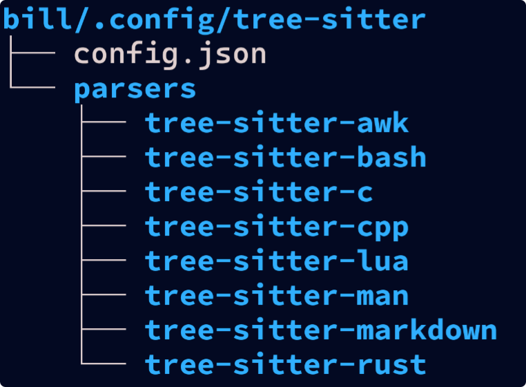

# 

## Table of Contents

<!-- mtoc-start -->

- [C-Menu bashrc Configuration](#c-menu-bashrc-configuration)
  - [Shell Logging](#shell-logging)
  - [Prepend Path](#prepend-path)
  - [Helpful C-Menu Environment Variables](#helpful-c-menu-environment-variables)
  - [Security Through Obscurity](#security-through-obscurity)
  - [RSH Helpers](#rsh-helpers)
  - [Privilege Indicator Shell Prompts](#privilege-indicator-shell-prompts)
  - [Terminal and Editor Settings](#terminal-and-editor-settings)
  - [GDB Debugging Setup](#gdb-debugging-setup)
  - [If You Can't Stop Typing "vi"](#if-you-cant-stop-typing-vi)
  - [C-Menu Startup with "mm"](#c-menu-startup-with-mm)
  - [Curses Escape Delay](#curses-escape-delay)
  - [Use lsd instead of ls](#use-lsd-instead-of-ls)
  - [Locale Settings](#locale-settings)
  - [System Specific Environment Variables](#system-specific-environment-variables)
- [C-Menu Configuration](#c-menu-configuration)
- [Terminal Configurations](#terminal-configurations)
  - [Ghostty](#ghostty)
  - [Kitty](#kitty)
  - [Alacritty](#alacritty)
- [Tree-Sitter](#tree-sitter)
  - [Tree-Sitter config.json](#tree-sitter-configjson)

<!-- mtoc-end -->

## C-Menu bashrc Configuration

This sample bashrc almost certainly contains settings that are not
appropriate for your system. It is provided as a reference only.
You should carefully review and modify this file to suit your
specific needs and environment.

Do NOT blindly copy this file to your $HOME/.bashrc

It is recommended to back up your existing .bashrc before replacing
it with any of the contents in the following snippets.

Use at your own risk.

```bash
#!/bin/bash
.bashrc
shellcheck disable=SC2155
shellcheck source=/dev/null
```

The lines beginning with shellcheck are to prevent false positives from
the shellcheck linter.

```bash
IFS="
"
```

The line above sets the Internal Field Separator (IFS) to only a newline character.
This prevents word splitting on spaces and tabs, which can lead to
unexpected behavior in scripts and commands.

### Shell Logging

To activate shell startup logging, create a file named .shelllog in your
home directory. Each time a shell starts, it will append a log entry to
/var/log/shell.log

```bash
export BASHRC=1
unset BASHLOG
if [ -f "$HOME"/.shelllog ]; then
    export BASHLOG="1"
fi
this_file="$HOME"/.bashrc
ShellLog() {
    if [ "$BASHLOG = "1" ] && [ -w /var/log/shell.log ]; then
        echo "$(rfc3339)" "$this_file" "$1" else >>/var/log/shell.log;
    else
        return 1;
    fi
}
```

### Prepend Path

This technique for managing the PATH environment variable is from bashfaq #24.
It's elegant and efficient. Usage: prepend_path /some/directory It checks if
the directory is already in PATH. If not, it prepends it to PATH.

```bash
pp() {
case ":${PATH}:" in
    *:"$1":*) ;;
    *)
        PATH="$1:$PATH"
        ;;
esac
}
PATH=/usr/bin:/bin:/usr/sbin:/sbin
for P in /usr/local/sbin \
/usr/local/bin \
/usr/lib64/qt6/bin \
/usr/lib/qt6/bin \
"$HOME"/.local/bin \
"$HOME"/.cargo/bin \
/usr/local/bin/zig-0.15.2 \
"$HOME"/menuapp/bin; do
    [ -d "$P" ] && pp "$P"
done
export PATH
```

@WARNING: /usr/bin/view is generally a link to vim, which will
obscure C-Menu View if /usr/bin preceedes $HOME/menuapp/bin
in your PATH environment variable.

If you use the prepend path function above and have $HOME/menuapp/bin
early in your PATH, you should be fine. In the abovew example, it is
first in the PATH because it was prepended last.

If you have issues starting C-Menu View by typing "view" at
the shell prompt, examine your PATH environment variable.

### Helpful C-Menu Environment Variables

```bash
export CMENU_SRC=/usr/local/src/cmenu/src
export CMENU_HOME="$HOME"/menuapp
```

### Security Through Obscurity

Having a shell with an obscure name can be beneficial. Using xsh, or some other
alias reduces visibility and vulnerability to some automated attacks and
even well-meaning, but misguided distributors who, in an unknown set of
circumstancs, might turn on shell restrictions for common shells like bash.

```bash
export SHELL=bash
which xsh >/dev/null 2>&1 && export SHELL=xsh
```

### RSH Helpers

xx and x are convenience functions for starting and exiting a root shell
using rsh.

```bash
xx() {
    if file "$HOME"/menuapp/bin/rsh | grep setuid >/dev/null 2>&1; then
        "$HOME"/menuapp/bin/rsh
    else
        if file /usr/local/bin/rsh | grep setuid >/dev/null 2>&1; then
            /usr/local/bin/rsh
        fi
    fi
}
```

Exit functions that suppress output.

```bash
x() { exit >/dev/null 2>&1; }
q() { exit >/dev/null 2>&1; }
```

### Privilege Indicator Shell Prompts

A green prompt for normal users, red for root. You can customize this prompt
or use whatever prompt you like, but an obvious indicator of privilege level
is highly recommended.

```bash
export PS1="\[\e[1;32m\]\u@\h(\l)\w->\[\e[0m\] "
export XUSER="$(id -un)"
[ "$XUSER" = "root" ] && export PS1="\[\e[1;31m\]\u@\h(\l)\w->\[\e[0m\] "
```

### Terminal and Editor Settings

```bash
export TERM=xterm-256color
export TTYPATH="$(dirname "$(tty)")"
export EDITOR=nvim
clear() {
    tput clear
}
stty ixany
set -o vi
export MANPAGER="nvim +Man!"
export MANWIDTH=80
which less >/dev/null 2>&1 && export PAGER=less
## -----------
VIEW_FAKE=false
FILE=$(which view)
if [ -L "$FILE" ] && [ -e "$FILE" ]; then
    LINKTO=$(readlink "$FILE")
    if [ "$LINKTO" = "vi" ] || [ "$LINKTO" = "vim" ]; then
        ShellLog "$FILE is a symbolic link to vim"
        VIEW_FAKE=true
    fi
fi
if [ "$VIEW_FAKE" = "false" ]; then
    which view >/dev/null 2>&1 && export PAGER=view
    export PAGER=$(which view 2>/dev/null)
fi
```

### GDB Debugging Setup

This is useful when debugging programs that require user input

```bash
which sleep >/dev/null 2>&1 && s() {
    TTY=$(tty)
    /bin/grep -v "inferior-tty" "$HOME"/.gdbinit >/tmp/.gdbinit.$$ 2>&1
    echo "set inferior-tty $TTY" >>/tmp/.gdbinit.$$
    mv /tmp/.gdbinit.$$ "$HOME"/.gdbinit
    echo "sleeping"
    sleep 50000
}
which gdb >/dev/null 2>&1 && gdb() { /usr/bin/gdb --silent "$@"; }
```

### If You Can't Stop Typing "vi"

```bash
which nvim >/dev/null 2>&1 && vi() { nvim "$@"; }
```

### C-Menu Startup with "mm"

You must prepend $HOME/menuapp/bin to your PATH before (meaning earlier in the
.bashrc script) defining the following function.

```bash
. "$HOME"/menuapp/bin/cmenu_path
which menu >/dev/null 2>&1 && mm() {
    menu "$@"
}
. "$HOME"/.nvim_appname
kk() { cd /usr/local/src/cmenu/src || return; }
```

### Curses Escape Delay

I use a local computer, so 50ms works fine for me. If you have a slow connection
you may need to set this to 300 or 500. The default is 1000.

```bash
export ESCDELAY=200
export ESCDELAY=50
```

### Use lsd instead of ls

```bash

PREFER_LSD=1
if [ "$PREFER_LSD" = "1" ]; then
    which lsd >/dev/null 2>&1 && ls() { /usr/bin/lsd "$@"; }
else
    which ls >/dev/null 2>&1 && ls() { /bin/ls --color=auto "$@"; }
fi
```

### Locale Settings

If you are in the US, you probably want to set this locale.

```bash
export LC_ALL="en_US.UTF-8"
```

### System Specific Environment Variables

Customize these settings for your system.

```bash
export JAVA_HOME=/usr/lib64/jvm/java-21-openjdk-21
export NODE_PATH="$HOME"/node_modules
export PKG_CONFIG_PATH=/usr/lib64/pkgconfig:/usr/lib/pkgconfig:/usr/share/pkgconfig:/usr/local/lib/pkgconfig:/usr/local/lib64/pkgconfig
export python3_host_prog=/usr/bin/python3
export XDG_CONFIG_HOME="$HOME"/.config
export XDG_DATA_HOME="$HOME"/.local/share
export CARGO_HOME="$HOME"/.cargo
export RUSTUP_HOME="$HOME"/.rustup
export LLVM_LIB_DIR=/usr/lib64
export MASON="$HOME/.local/share/lazyvim/mason"
```

## C-Menu Configuration

```ini
# ~/.minitrc
cols=0
lines=0
begx=0
begy=0
begy=0
help=false
black=#00020f
red=#ff0000
green=#00d07f
yellow=#ffba00
blue=#0080ff
magenta=#f000f0
cyan=#00dfff
white=#c0c0c0
bblack=#000930
bred=#ff7f00
bgreen=#00ff87
byellow=#ffff00
bblue=#00afff
bmagenta=#ff00ff
bcyan=#00ffff
bwhite=#ffffff
bg_color=black
fg_color=white
bo_color=red
red_gamma=2.20
green_gamma=2.20
blue_gamma=2.20
gray_gamma=2.20
brackets=
cd_mapp_home=false
f_at_end_clear=true
f_at_end_remove=false
f_erase_remainder=true
fill_char=_
f_ignore_case=false
f_squeeze=false
f_stop_on_error=true
tab_stop=4
prompt_type=long
prompt_str=
cmd=
cmd_all=
provider_cmd=
receiver_cmd=
title=
select_max=0
black=#00020f
bg=#000000
abg=
mapp_spec=main.m
help_spec=
in_spec=
out_spec=
mapp_data=~/menuapp/data
mapp_help=~/menuapp/help
mapp_home=~/menuapp
mapp_msrc=~/menuapp/msrc
mapp_user=~/menuapp/user
```

## Terminal Configurations

Please adjust these terminal configurations for your system. In particular,
you should pay attention to the screen dimensions, which I have set to 95
columns and up to 80 lines. Make sure you have the specified fonts installed
on your system, or change the font settings to match fonts you do have.

### Ghostty

```conf
# ~/.config/ghostty/config
#
command = xsh
#  -c menu
title = xsh
# config-file = fonts/default_font
# BEGIN_GHOSTTY_FONT
font-family = "Cascadia Code Medium"
font-family-bold = "Cascadia Code Bold"
font-family-italic = "Cascadia Code Italic"
font-family-bold-italic = "Cascadia Code Bold Italic"
# END_GHOSTTY_FONT
font-size = 13
window-width = 95
window-height = 80
background-opacity = 0.99
window-decoration = server
keybind = ctrl+r=reload_config
# config-file = themes/default_theme
# high_contrast3

palette=0=#000000
palette=1=#FF3f3f
palette=2=#4ff07f
palette=3=#FFef4f
palette=4=#5faFff
palette=5=#f077f0
palette=6=#8fdFfF
palette=7=#FF8f5f
palette=8=#bfbfbf
palette=9=#FF7f00
palette=10=#00FFa0
palette=11=#FFcf00
palette=12=#005fFF
palette=13=#FF00FF
palette=14=#00ffff
palette=15=#e0d0d0

# extended colors
background = #000720
foreground = #e0d0d0
cursor-color = #f0f0f0
selection-background = #e0d0d0
selection-foreground = #000000
```

### Kitty

```conf
# ~/.config/kitty/kitty.conf
#
shell xsh
# include ~/.config/kitty/fonts/default_font
# BEGIN_KITTY_FONTS
font_family      JetBrainsMono NFM Medium
bold_font        JetBrainsMono NFM ExtraBold
italic_font      JetBrainsMono NFM Italic
bold_italic_font JetBrainsMono NFM Bold Italic
# END_KITTY_FONTS
remember_window_size no
font_size 15.0
initial_window_width    95c
initial_window_height   50c
# include ~/.config/kitty/themes/default_theme
# high_contrast3
#
url_color               #a0e0ff
cursor                  #ffffff
cursor_text_color       #000000

# Tabs
active_tab_background   #001e1e
active_tab_foreground   #afd0ff
inactive_tab_background #2030a0
inactive_tab_foreground #c0c0c0
#tab_bar_background     #313131

# Windows
active_border_color     #79a8ff
inactive_border_color   #646464

color0    #000000
color1    #FF3f3f
color2    #4ff07f
color3    #FFef4f
color4    #5faFff
color5    #f077f0
color6    #8fdFfF
color7    #FF8f5f
color8    #bfbfbf
color9    #FF7f00
color10    #00FFa0
color11    #FFcf00
color12    #005fFF
color13    #FF00FF
color14    #00ffff
color15    #e0d0d0

# extended colors
background              #000720
foreground              #e0d0d0
cursor                  #f0f0f0
selection_background    #e0d0d0
selection_foreground    #000000
```

### Alacritty

```toml
# /home/bill/.config/alacritty/alacritty.toml
# Bill Waller

[terminal.shell]
program = "/usr/local/bin/xsh"

[general]

# import = [
#     "~/.config/alacritty/fonts/default_font.toml",
#     "~/.config/alacritty/themes/default_theme.toml",
# ]

[font]
# BEGIN_ALACRITTY_FONT
normal = { family = "JetBrainsMono NFM", style = "Regular" }
bold = { family = "JetBrainsMono NFM", style = "ExtraBold" }
italic = { family = "JetBrainsMono NFM", style = "Italic" }
bold_italic = { family = "JetBrainsMono NFM", style = "Bold Italic" }
# END_ALACRITTY_FONT
size = 15

# dynamic_title = true
# decorations = "Full"
# decorations_theme_variant = "Dark"

[window]
dimensions = { columns = 95, lines = 50 }

[scrolling]
history = 10000

[colors.primary]
background  = '#000000'
foreground  = '#c0c0c0'

[colors.normal]
black       = '#000000'
red         = '#FF0000'
green       = '#00FF8f'
yellow      = '#FFc700'
blue        = '#009FFF'
magenta     = '#e070e0'
cyan        = '#00CFDF'
white       = '#FF7f00'
[colors.bright]
black       = '#7f7f7f'
red         = '#FF7F00'
green       = '#00FFa0'
yellow      = '#FFEf00'
blue        = '#0000FF'
magenta     = '#FF00FF'
cyan        = '#00ffff'
white       = '#FFFFFF'
```

## Tree-Sitter

Before you can use Tree-Sitter-CLI, you will need to install the parsers
for your file types. Below an example layout for parser installation.



### Tree-Sitter config.json

```json
{
  "parser-directories": [
    "/home/bill/src",
    "/home/bill/.config/tree-sitter/parsers"
  ],
  "theme": {
    "attribute": {
      "color": "#f9a080",
      "italic": true
    },
    "comment": {
      "color": "#a0a0a0",
      "italic": true
    },
    "constant": "#00b0ff",
    "constant.builtin": {
      "bold": true,
      "color": "#f000f0"
    },
    "constructor": "#00ffbf",
    "embedded": null,
    "function": "#ff4f00",
    "function_definition": "#f07070",
    "function_declaration": "#70b0f0",
    "function.builtin": {
      "bold": true,
      "color": "#d070ff"
    },
    "keyword": "#00b07f",
    "module": "#0000f0",
    "number": {
      "bold": true,
      "color": "#ffaf90"
    },
    "operator": {
      "bold": true,
      "color": "#ff00ff"
    },
    "property": "#00b0ff",
    "property.builtin": {
      "bold": true,
      "color": "#ff4f00"
    },
    "punctuation": "#f000f0",
    "punctuation.bracket": "#f000f0",
    "punctuation.delimiter": "#f000f0",
    "punctuation.special": "#f000f0",
    "string": "#90c0ff",
    "string.special": "#f07fff",
    "tag": "#ff0000",
    "type": "#3fefff",
    "type.builtin": {
      "bold": true,
      "color": "#ff5070"
    },
    "variable": "#f09040",
    "variable.builtin": {
      "bold": true,
      "color": "#00d050"
    },
    "variable.parameter": {
      "color": "#00d050",
      "underline": true
    }
  }
}
```
